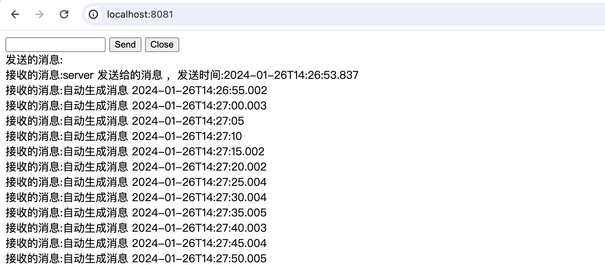
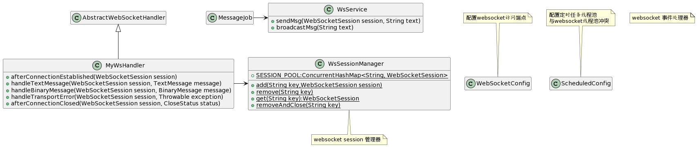

# websocket--3.2.springboot集成--接口方式

## 示例一：

代码：zs-websocket-tomcat-01





```xml
<dependency>
    <groupId>org.springframework.boot</groupId>
    <artifactId>spring-boot-starter-web</artifactId>
</dependency>
<dependency>
    <groupId>org.springframework.boot</groupId>
    <artifactId>spring-boot-starter-websocket</artifactId>
</dependency>
<dependency>
    <groupId>org.projectlombok</groupId>
    <artifactId>lombok</artifactId>
    <optional>true</optional>
</dependency>
```


```java
package com.zs.websocket.demo01;

import lombok.extern.slf4j.Slf4j;
import org.springframework.web.socket.WebSocketSession;

import java.io.IOException;
import java.util.concurrent.ConcurrentHashMap;

@Slf4j
public class WsSessionManager {
    /**
     * 保存连接 session 的地方
     */
    public  static ConcurrentHashMap<String, WebSocketSession> SESSION_POOL = new ConcurrentHashMap<>();

    /**
     * 添加 session
     *
     * @param key
     */
    public static void add(String key, WebSocketSession session) {
        // 添加 session
        SESSION_POOL.put(key, session);
    }

    /**
     * 删除 session,会返回删除的 session
     *
     * @param key
     * @return
     */
    public static WebSocketSession remove(String key) {
        // 删除 session
        return SESSION_POOL.remove(key);
    }

    /**
     * 删除并同步关闭连接
     *
     * @param key
     */
    public static void removeAndClose(String key) {
        WebSocketSession session = remove(key);
        if (session != null) {
            try {
                // 关闭连接
                session.close();
            } catch (IOException e) {
                // todo: 关闭出现异常处理
                e.printStackTrace();
            }
        }
    }

    /**
     * 获得 session
     *
     * @param key
     * @return
     */
    public static WebSocketSession get(String key) {
        // 获得 session
        return SESSION_POOL.get(key);
    }
}
```


```java
package com.zs.websocket.demo01;

import lombok.extern.slf4j.Slf4j;
import org.springframework.stereotype.Service;
import org.springframework.web.socket.TextMessage;
import org.springframework.web.socket.WebSocketSession;

import java.io.IOException;

/**
 * ws操作相关服务
 */
@Service
@Slf4j
public class WsService {

    /**
     * 发送消息
     * @param session
     * @param text
     * @return
     * @throws IOException
     */
    public void sendMsg(WebSocketSession session, String text) throws IOException {
        session.sendMessage(new TextMessage(text));
    }

    /**
     * 广播消息
     * @param text
     * @return
     * @throws IOException
     */
    public void broadcastMsg(String text) throws IOException {
        for (WebSocketSession session: WsSessionManager.SESSION_POOL.values()) {
            session.sendMessage(new TextMessage(text));
        }
    }

}
```


```java
package com.zs.websocket.demo01;

import lombok.extern.slf4j.Slf4j;
import org.springframework.stereotype.Component;
import org.springframework.web.socket.BinaryMessage;
import org.springframework.web.socket.CloseStatus;
import org.springframework.web.socket.TextMessage;
import org.springframework.web.socket.WebSocketSession;
import org.springframework.web.socket.handler.AbstractWebSocketHandler;

import java.time.LocalDateTime;

/**
 * ws消息处理类
 */
@Component
@Slf4j
public class MyWsHandler extends AbstractWebSocketHandler {

    @Override
    public void afterConnectionEstablished(WebSocketSession session) throws Exception {
        log.info("建立ws连接");
        WsSessionManager.add(session.getId(),session);
    }

    @Override
    protected void handleTextMessage(WebSocketSession session, TextMessage message) throws Exception {
        log.info("发送文本消息");
        // 获得客户端传来的消息
        String payload = message.getPayload();
        log.info("server 接收到消息 " + payload);
        session.sendMessage(new TextMessage("server 发送给的消息 " + payload + "，发送时间:" + LocalDateTime.now().toString()));
    }

    @Override
    protected void handleBinaryMessage(WebSocketSession session, BinaryMessage message) throws Exception {
        log.info("发送二进制消息");
    }

    @Override
    public void handleTransportError(WebSocketSession session, Throwable exception) throws Exception {
        log.error("异常处理");
        WsSessionManager.removeAndClose(session.getId());
    }

    @Override
    public void afterConnectionClosed(WebSocketSession session, CloseStatus status) throws Exception {
        log.info("关闭ws连接");
        WsSessionManager.removeAndClose(session.getId());
    }
}

```

```java
package com.zs.websocket.demo01;

import org.springframework.beans.factory.annotation.Autowired;
import org.springframework.context.annotation.Configuration;
import org.springframework.web.socket.config.annotation.EnableWebSocket;
import org.springframework.web.socket.config.annotation.WebSocketConfigurer;
import org.springframework.web.socket.config.annotation.WebSocketHandlerRegistry;

@Configuration
@EnableWebSocket
public class WebSocketConfig implements WebSocketConfigurer {

    @Autowired
    private MyWsHandler myWsHandler;

    @Override
    public void registerWebSocketHandlers(WebSocketHandlerRegistry registry) {
        registry
                .addHandler(myWsHandler, "myWs")
                //允许跨域
                .setAllowedOrigins("*");
    }
}
```

## 报错

### 定时任务+WebSocket

根据项目需求要使用定时任务+WebSocket不断的往前台推送数据。当项目同时集成WebSocket+定时任务时会报错：Bean named 'defaultSockJsTaskScheduler' is expected to be of type···，报错信息如下

```
org.springframework.beans.factory.BeanNotOfRequiredTypeException: Bean named 'defaultSockJsTaskScheduler' is expected to be of type 'org.springframework.scheduling.TaskScheduler' but was actually of type 'org.springframework.beans.factory.support.NullBean'
	at org.springframework.beans.factory.support.AbstractBeanFactory.doGetBean(AbstractBeanFactory.java:395) ~[spring-beans-5.2.7.RELEASE.jar:5.2.7.RELEASE]
	at org.springframework.beans.factory.support.AbstractBeanFactory.getBean(AbstractBeanFactory.java:227) ~[spring-beans-5.2.7.RELEASE.jar:5.2.7.RELEASE]
	at org.springframework.beans.factory.support.DefaultListableBeanFactory.resolveNamedBean(DefaultListableBeanFactory.java:1172) ~[spring-beans-5.2.7.RELEASE.jar:5.2.7.RELEASE]
	at org.springframework.beans.factory.support.DefaultListableBeanFactory.resolveNamedBean(DefaultListableBeanFactory.java:1139) ~[spring-beans-5.2.7.RELEASE.jar:5.2.7.RELEASE]
	at org.springframework.scheduling.annotation.ScheduledAnnotationBeanPostProcessor.resolveSchedulerBean(ScheduledAnnotationBeanPostProcessor.java:315) ~[spring-context-5.2.7.RELEASE.jar:5.2.7.RELEASE]
	at org.springframework.scheduling.annotation.ScheduledAnnotationBeanPostProcessor.finishRegistration(ScheduledAnnotationBeanPostProcessor.java:256) ~[spring-context-5.2.7.RELEASE.jar:5.2.7.RELEASE]
	at org.springframework.scheduling.annotation.ScheduledAnnotationBeanPostProcessor.onApplicationEvent(ScheduledAnnotationBeanPostProcessor.java:233) ~[spring-context-5.2.7.RELEASE.jar:5.2.7.RELEASE]
	at org.springframework.scheduling.annotation.ScheduledAnnotationBeanPostProcessor.onApplicationEvent(ScheduledAnnotationBeanPostProcessor.java:105) ~[spring-context-5.2.7.RELEASE.jar:5.2.7.RELEASE]
	at org.springframework.context.event.SimpleApplicationEventMulticaster.doInvokeListener(SimpleApplicationEventMulticaster.java:172) ~[spring-context-5.2.7.RELEASE.jar:5.2.7.RELEASE]
	at org.springframework.context.event.SimpleApplicationEventMulticaster.invokeListener(SimpleApplicationEventMulticaster.java:165) ~[spring-context-5.2.7.RELEASE.jar:5.2.7.RELEASE]
	at org.springframework.context.event.SimpleApplicationEventMulticaster.multicastEvent(SimpleApplicationEventMulticaster.java:139) ~[spring-context-5.2.7.RELEASE.jar:5.2.7.RELEASE]
	at org.springframework.context.support.AbstractApplicationContext.publishEvent(AbstractApplicationContext.java:404) ~[spring-context-5.2.7.RELEASE.jar:5.2.7.RELEASE]
	at org.springframework.context.support.AbstractApplicationContext.publishEvent(AbstractApplicationContext.java:361) ~[spring-context-5.2.7.RELEASE.jar:5.2.7.RELEASE]
	at org.springframework.context.support.AbstractApplicationContext.finishRefresh(AbstractApplicationContext.java:898) ~[spring-context-5.2.7.RELEASE.jar:5.2.7.RELEASE]
	at org.springframework.context.support.AbstractApplicationContext.refresh(AbstractApplicationContext.java:554) ~[spring-context-5.2.7.RELEASE.jar:5.2.7.RELEASE]
	at org.springframework.boot.web.servlet.context.ServletWebServerApplicationContext.refresh(ServletWebServerApplicationContext.java:143) ~[spring-boot-2.3.1.RELEASE.jar:2.3.1.RELEASE]
	at org.springframework.boot.SpringApplication.refresh(SpringApplication.java:758) [spring-boot-2.3.1.RELEASE.jar:2.3.1.RELEASE]
	at org.springframework.boot.SpringApplication.refresh(SpringApplication.java:750) [spring-boot-2.3.1.RELEASE.jar:2.3.1.RELEASE]
	at org.springframework.boot.SpringApplication.refreshContext(SpringApplication.java:397) [spring-boot-2.3.1.RELEASE.jar:2.3.1.RELEASE]
	at org.springframework.boot.SpringApplication.run(SpringApplication.java:315) [spring-boot-2.3.1.RELEASE.jar:2.3.1.RELEASE]
	at org.springframework.boot.SpringApplication.run(SpringApplication.java:1237) [spring-boot-2.3.1.RELEASE.jar:2.3.1.RELEASE]
	at org.springframework.boot.SpringApplication.run(SpringApplication.java:1226) [spring-boot-2.3.1.RELEASE.jar:2.3.1.RELEASE]
	at com.niutrans.localdeploymentserver.LocalDeploymentServerApplication.main(LocalDeploymentServerApplication.java:19) [classes/:na]
```

 定时任务选择的是Spring自带的定时任务，先在项目中集成了WebSocket，编译，运行，测试后，功能好用。但是再加上定时任务后就报错了。

#### 解决方案

手动添加一个定时任务的配置类来创建一个ThreadPoolTaskScheduler对象。

```java
@Configuration
public class ScheduledConfig {
 
	@Bean
	public TaskScheduler taskScheduler() {
		ThreadPoolTaskScheduler scheduling = new ThreadPoolTaskScheduler();
		scheduling.setPoolSize(10);
        scheduling.setThreadNamePrefix("scheduled-task-");
        scheduler.setDaemon(true);
		scheduling.initialize();
		return scheduling;
	}
}
```

```
@Bean
public ThreadPoolTaskScheduler taskScheduler(TaskSchedulerBuilder builder) {
    return builder.build();
}
```


## 示例二

```java
import cn.coder4j.study.example.websocket.config.WsSessionManager;
import org.springframework.stereotype.Component;
import org.springframework.web.socket.CloseStatus;
import org.springframework.web.socket.TextMessage;
import org.springframework.web.socket.WebSocketSession;
import org.springframework.web.socket.handler.TextWebSocketHandler;

import java.time.LocalDateTime;


@Component
public class HttpAuthHandler extends TextWebSocketHandler {

    /**
     * socket 建立成功事件
     *
     * @param session
     * @throws Exception
     */
    @Override
    public void afterConnectionEstablished(WebSocketSession session) throws Exception {
        Object token = session.getAttributes().get("token");
        if (token != null) {
            // 用户连接成功，放入在线用户缓存
            WsSessionManager.add(token.toString(), session);
        } else {
            throw new RuntimeException("用户登录已经失效!");
        }
    }

    /**
     * 接收消息事件
     *
     * @param session
     * @param message
     * @throws Exception
     */
    @Override
    protected void handleTextMessage(WebSocketSession session, TextMessage message) throws Exception {
        // 获得客户端传来的消息
        String payload = message.getPayload();
        Object token = session.getAttributes().get("token");
        System.out.println("server 接收到 " + token + " 发送的 " + payload);
        session.sendMessage(new TextMessage("server 发送给 " + token + " 消息 " + payload + " " + LocalDateTime.now().toString()));
    }

    /**
     * socket 断开连接时
     *
     * @param session
     * @param status
     * @throws Exception
     */
    @Override
    public void afterConnectionClosed(WebSocketSession session, CloseStatus status) throws Exception {
        Object token = session.getAttributes().get("token");
        if (token != null) {
            // 用户退出，移除缓存
            WsSessionManager.remove(token.toString());
        }
    }
}
```

通过继承 **TextWebSocketHandler** 类并覆盖相应方法，可以对 websocket 的事件进行处理，这里可以同原生注解的那几个注解连起来看

1. **afterConnectionEstablished** 方法是在 socket 连接成功后被触发，同原生注解里的 @OnOpen 功能
2. **afterConnectionClosed** 方法是在 socket 连接关闭后被触发，同原生注解里的 @OnClose 功能
3. **handleTextMessage** 方法是在客户端发送信息时触发，同原生注解里的 @OnMessage 功能


```java

import lombok.extern.slf4j.Slf4j;
import org.springframework.web.socket.WebSocketSession;

import java.io.IOException;
import java.util.concurrent.ConcurrentHashMap;


@Slf4j
public class WsSessionManager {
    /**
     * 保存连接 session 的地方
     */
    private static ConcurrentHashMap<String, WebSocketSession> SESSION_POOL = new ConcurrentHashMap<>();

    /**
     * 添加 session
     *
     * @param key
     */
    public static void add(String key, WebSocketSession session) {
        // 添加 session
        SESSION_POOL.put(key, session);
    }

    /**
     * 删除 session,会返回删除的 session
     *
     * @param key
     * @return
     */
    public static WebSocketSession remove(String key) {
        // 删除 session
        return SESSION_POOL.remove(key);
    }

    /**
     * 删除并同步关闭连接
     *
     * @param key
     */
    public static void removeAndClose(String key) {
        WebSocketSession session = remove(key);
        if (session != null) {
            try {
                // 关闭连接
                session.close();
            } catch (IOException e) {
                // todo: 关闭出现异常处理
                e.printStackTrace();
            }
        }
    }

    /**
     * 获得 session
     *
     * @param key
     * @return
     */
    public static WebSocketSession get(String key) {
        // 获得 session
        return SESSION_POOL.get(key);
    }
}
```

这里简单通过 **ConcurrentHashMap** 来实现了一个 session 池，用来保存已经登录的 web socket 的 session。前文提过，服务端发送消息给客户端必须要通过这个 session。

```java
import cn.hutool.core.util.StrUtil;
import cn.hutool.http.HttpUtil;
import org.springframework.http.server.ServerHttpRequest;
import org.springframework.http.server.ServerHttpResponse;
import org.springframework.stereotype.Component;
import org.springframework.web.socket.WebSocketHandler;
import org.springframework.web.socket.server.HandshakeInterceptor;

import java.util.HashMap;
import java.util.Map;


@Component
public class MyInterceptor implements HandshakeInterceptor {

    /**
     * 握手前
     *
     * @param request
     * @param response
     * @param wsHandler
     * @param attributes
     * @return
     * @throws Exception
     */
    @Override
    public boolean beforeHandshake(ServerHttpRequest request, ServerHttpResponse response, WebSocketHandler wsHandler, Map<String, Object> attributes) throws Exception {
        System.out.println("握手开始");
        // 获得请求参数
        HashMap<String, String> paramMap = HttpUtil.decodeParamMap(request.getURI().getQuery(), "utf-8");
        String uid = paramMap.get("token");
        if (StrUtil.isNotBlank(uid)) {
            // 放入属性域
            attributes.put("token", uid);
            System.out.println("用户 token " + uid + " 握手成功！");
            return true;
        }
        System.out.println("用户登录已失效");
        return false;
    }

    /**
     * 握手后
     *
     * @param request
     * @param response
     * @param wsHandler
     * @param exception
     */
    @Override
    public void afterHandshake(ServerHttpRequest request, ServerHttpResponse response, WebSocketHandler wsHandler, Exception exception) {
        System.out.println("握手完成");
    }
}
```

通过实现 **HandshakeInterceptor** 接口来定义握手拦截器，注意这里与上面 **Handler** 的事件是不同的，这里是建立握手时的事件，分为握手前与握手后，而 **Handler** 的事件是在握手成功后的基础上建立 socket 的连接。所以在如果把认证放在这个步骤相对来说最节省服务器资源。它主要有两个方法 **beforeHandshake** 与 **afterHandshake** ，顾名思义一个在握手前触发，一个在握手后触发。

```java
import cn.coder4j.study.example.websocket.handler.HttpAuthHandler;
import cn.coder4j.study.example.websocket.interceptor.MyInterceptor;
import org.springframework.beans.factory.annotation.Autowired;
import org.springframework.context.annotation.Configuration;
import org.springframework.web.socket.config.annotation.EnableWebSocket;
import org.springframework.web.socket.config.annotation.WebSocketConfigurer;
import org.springframework.web.socket.config.annotation.WebSocketHandlerRegistry;


@Configuration
@EnableWebSocket
public class WebSocketConfig implements WebSocketConfigurer {

    @Autowired
    private HttpAuthHandler httpAuthHandler;
    @Autowired
    private MyInterceptor myInterceptor;

    @Override
    public void registerWebSocketHandlers(WebSocketHandlerRegistry registry) {
        registry
                .addHandler(httpAuthHandler, "myWS")
                .addInterceptors(myInterceptor)
                .setAllowedOrigins("*");
    }
}
```

通过实现 **WebSocketConfigurer** 类并覆盖相应的方法进行 **websocket** 的配置。我们主要覆盖 **registerWebSocketHandlers** 这个方法。通过向 **WebSocketHandlerRegistry** 设置不同参数来进行配置。其中 **addHandler** 方法添加我们上面的写的 ws 的 handler 处理类，第二个参数是你暴露出的 ws 路径。**addInterceptors** 添加我们写的握手过滤器。**setAllowedOrigins("\*")** 这个是关闭跨域校验，方便本地调试，线上推荐打开。

