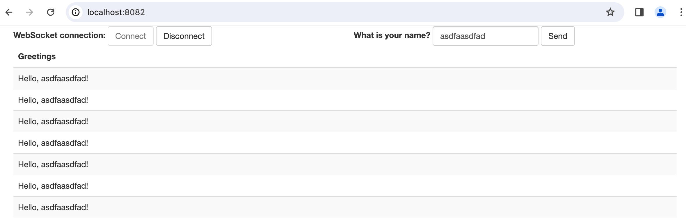

# websocket--3.3.stomp方式-spring官方案例

https://spring.io/guides/gs/messaging-stomp-websocket/




## 前端

```html
<!DOCTYPE html>
<html>
<head>
    <title>Hello WebSocket</title>
    <link rel="stylesheet" href="https://maxcdn.bootstrapcdn.com/bootstrap/3.3.7/css/bootstrap.min.css" integrity="sha384-BVYiiSIFeK1dGmJRAkycuHAHRg32OmUcww7on3RYdg4Va+PmSTsz/K68vbdEjh4u" crossorigin="anonymous">
    <link href="/main.css" rel="stylesheet">
    <script src="https://code.jquery.com/jquery-3.1.1.min.js"></script>
    <script src="https://cdn.jsdelivr.net/npm/@stomp/stompjs@7.0.0/bundles/stomp.umd.min.js"></script>
    <script src="/app.js"></script>
</head>
<body>
<noscript><h2 style="color: #ff0000">Seems your browser doesn't support Javascript! Websocket relies on Javascript being
    enabled. Please enable
    Javascript and reload this page!</h2></noscript>
<div id="main-content" class="container">
    <div class="row">
        <div class="col-md-6">
            <form class="form-inline">
                <div class="form-group">
                    <label for="connect">WebSocket connection:</label>
                    <button id="connect" class="btn btn-default" type="submit">Connect</button>
                    <button id="disconnect" class="btn btn-default" type="submit" disabled="disabled">Disconnect
                    </button>
                </div>
            </form>
        </div>
        <div class="col-md-6">
            <form class="form-inline">
                <div class="form-group">
                    <label for="name">What is your name?</label>
                    <input type="text" id="name" class="form-control" placeholder="Your name here...">
                </div>
                <button id="send" class="btn btn-default" type="submit">Send</button>
            </form>
        </div>
    </div>
    <div class="row">
        <div class="col-md-12">
            <table id="conversation" class="table table-striped">
                <thead>
                <tr>
                    <th>Greetings</th>
                </tr>
                </thead>
                <tbody id="greetings">
                </tbody>
            </table>
        </div>
    </div>
</div>
</body>
</html>
```

```js
const stompClient = new StompJs.Client({
    brokerURL: 'ws://localhost:8082/gs-guide-websocket'
});

stompClient.onConnect = (frame) => {
    setConnected(true);
    console.log('Connected: ' + frame);
    stompClient.subscribe('/topic/greetings', (greeting) => {
        showGreeting(JSON.parse(greeting.body).content);
    });
};

stompClient.onWebSocketError = (error) => {
    console.error('Error with websocket', error);
};

stompClient.onStompError = (frame) => {
    console.error('Broker reported error: ' + frame.headers['message']);
    console.error('Additional details: ' + frame.body);
};

function setConnected(connected) {
    $("#connect").prop("disabled", connected);
    $("#disconnect").prop("disabled", !connected);
    if (connected) {
        $("#conversation").show();
    }
    else {
        $("#conversation").hide();
    }
    $("#greetings").html("");
}

function connect() {
    stompClient.activate();
}

function disconnect() {
    stompClient.deactivate();
    setConnected(false);
    console.log("Disconnected");
}

function sendName() {
    stompClient.publish({
        destination: "/app/hello",
        body: JSON.stringify({'name': $("#name").val()})
    });
}

function showGreeting(message) {
    $("#greetings").append("<tr><td>" + message + "</td></tr>");
}

$(function () {
    $("form").on('submit', (e) => e.preventDefault());
    $( "#connect" ).click(() => connect());
    $( "#disconnect" ).click(() => disconnect());
    $( "#send" ).click(() => sendName());
});

```

该 JavaScript 文件需要理解的主要部分是`stompClient.onConnect`和`sendName`函数。

`stompClient`通过`brokerURL`引用 path进行初始化`/gs-guide-websocket`，这是我们的 websockets 服务器等待连接的地方。连接成功后，客户端订阅目的地`/topic/greetings`，服务器将在该目的地发布问候消息。当在该目的地收到问候语时，它将向 DOM 附加一个段落元素以显示问候语消息。

该`sendName()`函数检索用户输入的名称，并使用 STOMP 客户端将其发送到目的地`/app/hello`（`GreetingController.greeting()`接收位置）。

## 后端

```java
@SpringBootApplication
public class MyApplication {
    public static void main(String[] args) {
        SpringApplication.run(MyApplication.class,args);
    }
}
```

```java
package com.zs.websocket.demo02;

public class Greeting {

  private String content;

  public Greeting() {
  }

  public Greeting(String content) {
    this.content = content;
  }

  public String getContent() {
    return content;
  }

}
```

```java
package com.zs.websocket.demo02;

public class HelloMessage {

  private String name;

  public HelloMessage() {
  }

  public HelloMessage(String name) {
    this.name = name;
  }

  public String getName() {
    return name;
  }

  public void setName(String name) {
    this.name = name;
  }
}

```


```java
package com.zs.websocket.demo02;

import org.springframework.context.annotation.Configuration;
import org.springframework.messaging.simp.config.MessageBrokerRegistry;
import org.springframework.web.socket.config.annotation.EnableWebSocketMessageBroker;
import org.springframework.web.socket.config.annotation.StompEndpointRegistry;
import org.springframework.web.socket.config.annotation.WebSocketMessageBrokerConfigurer;

@Configuration
@EnableWebSocketMessageBroker
public class WebSocketConfig implements WebSocketMessageBrokerConfigurer {

  @Override
  public void configureMessageBroker(MessageBrokerRegistry config) {
    config.enableSimpleBroker("/topic");
    config.setApplicationDestinationPrefixes("/app");
  }

  @Override
  public void registerStompEndpoints(StompEndpointRegistry registry) {
    registry.addEndpoint("/gs-guide-websocket");
  }

}

```

`WebSocketConfig`注释为 ，`@Configuration`表明它是一个 Spring 配置类。它还带有注释[`@EnableWebSocketMessageBroker`](https://docs.spring.io/spring/docs/current/javadoc-api/org/springframework/messaging/simp/config/EnableWebSocketMessageBroker.html)。顾名思义，它`@EnableWebSocketMessageBroker`支持由消息代理支持的 WebSocket 消息处理。

该方法实现了配置消息代理的`configureMessageBroker()`默认方法。`WebSocketMessageBrokerConfigurer`它首先调用以`enableSimpleBroker()`启用一个简单的基于内存的消息代理，将问候消息传送回前缀为 的目的地上的客户端`/topic`。它还指定绑定`/app`到用 注释的方法的消息的前缀`@MessageMapping`。该前缀将用于定义所有消息映射。例如，是方法映射到句柄的`/app/hello`端点。`GreetingController.greeting()`

该`registerStompEndpoints()`方法注册`/gs-guide-websocket`websocket 连接的端点。