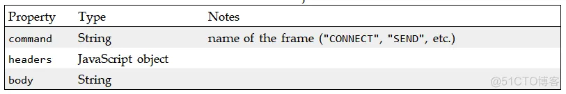
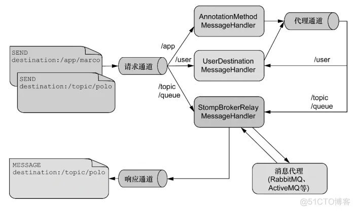
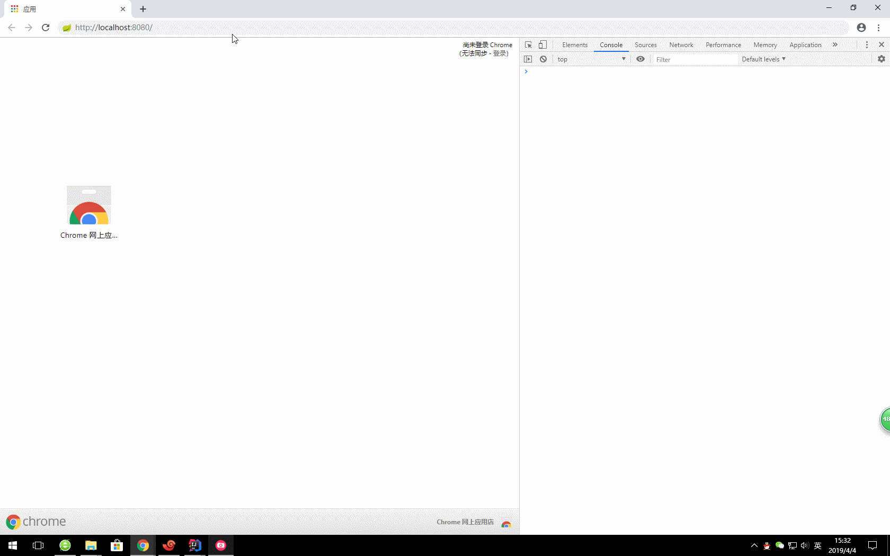
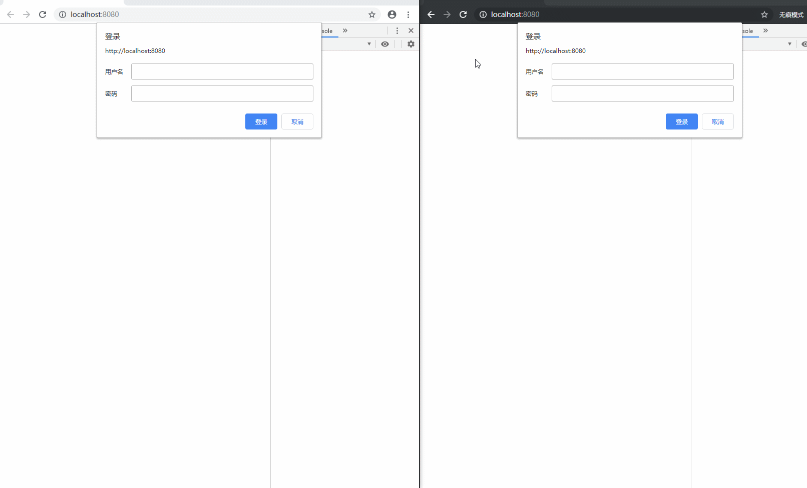

# websocket--3.4.stomp方式02

STOMP即Simple (or Streaming) Text Orientated Messaging Protocol，简单(流)文本定向消息协议，它提供了一个可互操作的连接格式，允许STOMP客户端与任意STOMP消息代理（Broker）进行交互。STOMP协议由于设计简单，易于开发客户端，因此在多种语言和多种平台上得到广泛地应用。

首先，我们先理解一下为什么需要STOMP。

1）常规的websocket连接和普通的TCP基本上没有什么差别的。

2）那我们如果像http一样加入一些响应和请求层。

3）所以STOMP在websocket上提供了一中基于帧线路格式（frame-based wire format）。

4）简单一点，就是在我们的websocket（TCP）上面加了一层协议，使双方遵循这种协议来发送消息。

## STOMP

### Frame



```
CONNECTED
heart-beat:0,0
version:1.2
content-length:0
```

### command类别

```
CONNECT
SEND
SUBSCRIBE
UNSUBSCRIBE
BEGIN
COMMIT
ABORT
ACK
NACK
DISCONNECT
```

### 客户端常用连接方式

ws　

```
var url = "ws://localhost:8080/websocket";
var client = Stomp.client(url);
```

sockJs

```js
<script src="http://cdn.sockjs.org/sockjs-0.3.min.js"></script>
<script>
    // use SockJS implementation instead of the browser's native implementation
    var ws = new SockJS(url);
var client = Stomp.over(ws);
[...]
 </script>
```

说明：使用ws协议需要浏览器的支持，但是一些老版本的浏览器不一定支持。**Stomp.over(ws)**的凡是就是用来定义服务websocket的协议。

### 服务端的实现过程



a、服务端：/app，这里访问服务端，前缀通过设定的方式访问。

b、用户：/user,这里针对的是用户消息的传递，针对于当前用户进行传递。

c、其他消息：/topic、/queue，这两种方式。都是定义出来用于订阅。并且消息只能从这里通过并处理





https://blog.51cto.com/u_16213578/7742286


## 案例

```java

import org.springframework.context.annotation.Configuration;
import org.springframework.messaging.simp.config.MessageBrokerRegistry;
import org.springframework.web.socket.config.annotation.EnableWebSocketMessageBroker;
import org.springframework.web.socket.config.annotation.StompEndpointRegistry;
import org.springframework.web.socket.config.annotation.WebSocketMessageBrokerConfigurer;


@Configuration
@EnableWebSocketMessageBroker
public class WebSocketConfig implements WebSocketMessageBrokerConfigurer {

    @Override
    public void registerStompEndpoints(StompEndpointRegistry registry) {
        // 配置客户端尝试连接地址
        registry.addEndpoint("/ws").setAllowedOrigins("*").withSockJS();
    }

    @Override
    public void configureMessageBroker(MessageBrokerRegistry registry) {
        // 设置广播节点
        registry.enableSimpleBroker("/topic", "/user");
        // 客户端向服务端发送消息需有/app 前缀
        registry.setApplicationDestinationPrefixes("/app");
        // 指定用户发送（一对一）的前缀 /user/
        registry.setUserDestinationPrefix("/user/");
    }
}
```

通过实现 **WebSocketMessageBrokerConfigurer** 接口和加上**@EnableWebSocketMessageBroker**来进行 stomp 的配置与注解扫描。

其中覆盖 **registerStompEndpoints** 方法来设置暴露的 stomp 的路径，其它一些跨域、客户端之类的设置。

覆盖 **configureMessageBroker** 方法来进行节点的配置。

1. 其中 **enableSimpleBroker** 配置的广播节点，也就是服务端发送消息，客户端订阅就能接收消息的节点。
2. 覆盖**setApplicationDestinationPrefixes** 方法，设置客户端向服务端发送消息的节点。
3. 覆盖 **setUserDestinationPrefix** 方法，设置一对一通信的节点。

```java

import cn.coder4j.study.example.websocket.model.RequestMessage;
import cn.coder4j.study.example.websocket.model.ResponseMessage;
import org.springframework.beans.factory.annotation.Autowired;
import org.springframework.messaging.handler.annotation.MessageMapping;
import org.springframework.messaging.handler.annotation.SendTo;
import org.springframework.messaging.simp.SimpMessagingTemplate;
import org.springframework.stereotype.Controller;
import org.springframework.web.bind.annotation.GetMapping;
import org.springframework.web.bind.annotation.ResponseBody;


@Controller
public class WSController {

    @Autowired
    private SimpMessagingTemplate simpMessagingTemplate;

    @MessageMapping("/hello")
    @SendTo("/topic/hello")
    public ResponseMessage hello(RequestMessage requestMessage) {
        System.out.println("接收消息：" + requestMessage);
        return new ResponseMessage("服务端接收到你发的：" + requestMessage);
    }

    @GetMapping("/sendMsgByUser")
    public @ResponseBody
    Object sendMsgByUser(String token, String msg) {
        simpMessagingTemplate.convertAndSendToUser(token, "/msg", msg);
        return "success";
    }

    @GetMapping("/sendMsgByAll")
    public @ResponseBody
    Object sendMsgByAll(String msg) {
        simpMessagingTemplate.convertAndSend("/topic", msg);
        return "success";
    }

    @GetMapping("/test")
    public String test() {
        return "test-stomp.html";
    }
}
```

通过 **@MessageMapping** 来暴露节点路径，有点类似 **@RequestMapping**。注意这里虽然写的是 hello ，但是我们客户端调用的真正地址是 **/app/hello**。 因为我们在上面的 config 里配置了**registry.setApplicationDestinationPrefixes("/app")**。

**@SendTo**这个注解会把返回值的内容发送给订阅了 **/topic/hello** 的客户端，与之类似的还有一个**@SendToUser** 只不过他是发送给用户端一对一通信的。这两个注解一般是应答时响应的，如果服务端主动发送消息可以通过 **simpMessagingTemplate**类的**convertAndSend**方法。注意 **simpMessagingTemplate.convertAndSendToUser(token, "/msg", msg)** ，联系到我们上文配置的 **registry.setUserDestinationPrefix("/user/"),**这里客户端订阅的是**/user/{token}/msg**,千万不要搞错。


stomp与rabbitmq整合

https://blog.csdn.net/qq_32447301/article/details/104017643

https://blog.csdn.net/qq_35387940/article/details/108276136?csdn_share_tail=%7B%22type%22%3A%22blog%22%2C%22rType%22%3A%22article%22%2C%22rId%22%3A%22108276136%22%2C%22source%22%3A%22weixin_44235759%22%7D&fromshare=blogdetail

https://blog.csdn.net/u014203449/article/details/102902078