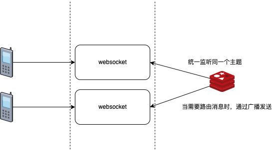

# websocket--3.6.redis发布订阅广播集群




## redis发布订阅

```java
package com.zs.websocket.redis.config;

import com.fasterxml.jackson.annotation.JsonAutoDetect;
import com.fasterxml.jackson.annotation.PropertyAccessor;
import com.fasterxml.jackson.databind.ObjectMapper;

import com.zs.websocket.redis.listen.CatListener;
import com.zs.websocket.redis.listen.ChatListener;
import com.zs.websocket.redis.listen.FishListener;
import org.springframework.cache.CacheManager;
import org.springframework.cache.annotation.CachingConfigurerSupport;
import org.springframework.cache.annotation.EnableCaching;
import org.springframework.context.annotation.Bean;
import org.springframework.context.annotation.Configuration;
import org.springframework.data.redis.cache.RedisCacheManager;
import org.springframework.data.redis.connection.RedisConnectionFactory;
import org.springframework.data.redis.core.RedisTemplate;
import org.springframework.data.redis.core.StringRedisTemplate;
import org.springframework.data.redis.listener.PatternTopic;
import org.springframework.data.redis.listener.RedisMessageListenerContainer;
import org.springframework.data.redis.listener.adapter.MessageListenerAdapter;
import org.springframework.data.redis.serializer.Jackson2JsonRedisSerializer;

import java.util.Arrays;

@SuppressWarnings({"all"})
@Configuration
@EnableCaching
public class CacheConfig extends CachingConfigurerSupport {


    /**
     * redis消息监听器容器
     * 可以添加多个监听不同话题的redis监听器，只需要把消息监听器和相应的消息订阅处理器绑定，该消息监听器
     * 通过反射技术调用消息订阅处理器的相关方法进行一些业务处理
     * @param connectionFactory
     * @param listenerAdapter
     * @return
     */
    @Bean
    //相当于xml中的bean
    RedisMessageListenerContainer container(RedisConnectionFactory connectionFactory,
                                            MessageListenerAdapter ChatAdapter) {
        RedisMessageListenerContainer container = new RedisMessageListenerContainer();
        container.setConnectionFactory(connectionFactory);
        //订阅了一个叫chat 的通道
        container.addMessageListener(ChatAdapter, new PatternTopic("chat"));
        //这个container 可以添加多个 messageListener
        return container;
    }

    /**
     * 消息监听器适配器，绑定消息处理器
     *
     * @param receiver
     * @return
     */
    @Bean
    MessageListenerAdapter ChatAdapter() {
        return new MessageListenerAdapter(new ChatListener());
    }


    /**
     * redis 读取内容的template
     */
    @Bean
    StringRedisTemplate stringRedisTemplate(RedisConnectionFactory connectionFactory) {
        return new StringRedisTemplate(connectionFactory);
    }

    @Bean
    public RedisTemplate<String, String> redisTemplate(RedisConnectionFactory factory) {
        StringRedisTemplate template = new StringRedisTemplate(factory);

        //定义value的序列化方式
        Jackson2JsonRedisSerializer jackson2JsonRedisSerializer = new Jackson2JsonRedisSerializer(Object.class);
        ObjectMapper om = new ObjectMapper();
        om.setVisibility(PropertyAccessor.ALL, JsonAutoDetect.Visibility.ANY);
        om.enableDefaultTyping(ObjectMapper.DefaultTyping.NON_FINAL);
        jackson2JsonRedisSerializer.setObjectMapper(om);


        template.setValueSerializer(jackson2JsonRedisSerializer);
        template.setHashKeySerializer(jackson2JsonRedisSerializer);
        template.afterPropertiesSet();
        return template;
    }
}
```

```java
package com.zs.websocket.redis.listen;

import cn.hutool.json.JSONObject;
import cn.hutool.json.JSONUtil;
import com.zs.websocket.netty.handler.NettyUtil;
import com.zs.websocket.netty.handler.NioWebSocketHandler;
import io.netty.channel.Channel;
import io.netty.handler.codec.http.websocketx.TextWebSocketFrame;
import io.netty.util.AttributeKey;
import org.springframework.data.redis.connection.Message;
import org.springframework.data.redis.connection.MessageListener;

import java.util.Enumeration;
import java.util.concurrent.ConcurrentHashMap;


public class ChatListener implements MessageListener {

    @Override
    public void onMessage(Message message, byte[] bytes) {
        ConcurrentHashMap<Channel, String> onlineWsMap = NioWebSocketHandler.ONLINE_WS_MAP;
        JSONObject entries = JSONUtil.parseObj(message.toString());
        //使用迭代器循环onlineWsMap
        onlineWsMap.forEach((k,v) ->{
            String id = entries.getStr("id");
            if (id.equals(NettyUtil.getAttr(k, AttributeKey.valueOf("id")))) {
                k.writeAndFlush(new TextWebSocketFrame(message.toString()));
            }
        });
        //System.out.println("chat 监听器：" + message.toString());
    }
}
```

```java
package com.zs.websocket.redis.service;

import org.springframework.beans.factory.annotation.Autowired;
import org.springframework.data.redis.core.StringRedisTemplate;
import org.springframework.scheduling.annotation.EnableScheduling;
import org.springframework.scheduling.annotation.Scheduled;
import org.springframework.stereotype.Component;

import javax.annotation.Resource;


@EnableScheduling //开启定时器功能
@Component
public class MessageSender {

    @Autowired
    @Resource(name = "stringRedisTemplate")
    private StringRedisTemplate stringRedisTemplate;

    @Scheduled(fixedRate = 2000) //间隔2s 通过StringRedisTemplate对象向redis消息队列cat频道发布消息
    public void sendCatMessage(){
        stringRedisTemplate.convertAndSend("chat","{\"id\":\"1\",\"data\":\"我是发送到客户端1的消息\"}");
    }


    @Scheduled(fixedRate = 1000) //间隔1s 通过StringRedisTemplate对象向redis消息队列fish频道发布消息
    public void sendFishMessage(){
        stringRedisTemplate.convertAndSend("chat","{\"id\":\"2\",\"data\":\"我是发送到客户端2的消息\"}");
    }

}
```