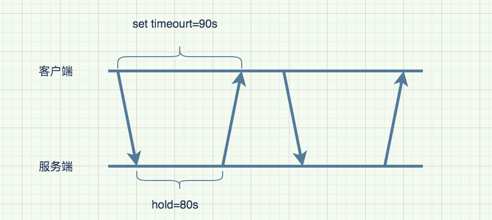

# 长轮询--2.1.入门案例01

## 长轮询的应用

 


## 念会经

**轮询**：说白了就是客户端定时去请求服务端，  是客户端主动请求来促使数据更新；

**长轮询**：说白了也是客户端请求服务端，但是服务端并不是即时返回，**而是当有内容更新的时候才返回内容给客户端**，从流程上讲，可以理解为服务器向客户端推送内容；

 


这里大家可能会有两个疑问：

1. 为什么达到时间就返回，既然 是长轮询，为什么不一直hold住请求，直到数据发生变更再返回呢？
2. 服务端hold住难道不消耗线程吗，不是线程一直阻塞在那里吗？

Servlet3.0提供的AsyncContext 机制。

asyncContext是为了把主线程返回给tomcat线程池，不影响服务对其他客户端请求。会有线程专门处理这个长轮询，但并不是说每一个长轮询的http请求都要用一个线程阻塞在那。而是把长轮询的request的引用在一个集合中存起来，用一个或几个线程专门处理一批客户端的长轮询请求，这样就不需要为每一个长轮询单独分配线程阻塞在那了，从而大大降低了资源的消耗，


## 案例摘抄

### 案例描述


微信扫码登陆，且需要同时关注公众号，需要用到公众号接收事件推送
用户使用手机微信app扫码后微信服务器向后端服务器回调扫码事件，由于前端无法感知到用户手机扫码的行为，所以停留在扫码登陆页面时需要持续轮询后端服务器用户是否已扫码登录，造成服务器的较大压力，于是利用Servlet3.0的异步特性，实现长轮询的方式来通信。

前端扫码登录页面请求后端微信二维码，后端返回微信二维码给前端时附带随机生成的scene_id，前端显示二维码供用户手机微信扫码，前端持续轮询后端用户是否已扫码（上一次轮询未成功登陆为开启下一次轮询的条件），但需带上scene_id以区分扫码用户，此时后端不同步返回前端请求结果，而是以异步响应式的方式等待微信服务器回调后，或是超过指定时间例如30秒后再返回（可能用户打开登陆页面后停留但未成功扫码），大大减少了前端访问后端的次数。

具体方式是，request对象通过startAsync()方法获得异步域对象AsyncContext，此时请求被挂起，并释放Servlet线程。请求异步域对象AsyncContext放入ConcurrentHashMap实现的请求池中，以scene_id为key。

微信服务器回调服务端时会带上扫码事件（登陆为scan，关注为subscribe）以及scene_id、openid，将回调数据包装为响应事件放入响应事件队列中。

使用一个守护线程监听该队列，以阻塞的方式获取队列中的响应事件对象，并调用自定义线程池，根据scene_id从请求池中找到还未响应返回的AsyncContext对象，并从中获得response对象，根据JSON对象中的openId查询到用户信息，然后返回给前端。

如果30s超时后仍未接收到微信服务器的回调，则超时返回响应前端。

相比普通定时轮询，由于采用响应式设计，可以大幅降低前端请求频率和服务器负载，并在事件发生后第一时间通知前端，没有轮询周期空挡导致的延迟，相比[websocket](https://so.csdn.net/so/search?q=websocket&spm=1001.2101.3001.7020)则可以并避免浏览器版本过低、网关对长连接的兼容性等问题，实现上也更加简单。


## NO比比，show me the code

### 方式一：使用map缓存asyncContext对象


### 后端代码

```java
package com.zs.longpolling.demo03;

import com.google.common.collect.HashMultimap;
import com.google.common.collect.Multimap;
import com.google.common.collect.Multimaps;
import com.google.common.util.concurrent.ThreadFactoryBuilder;
import lombok.Data;
import org.springframework.web.bind.annotation.RequestMapping;
import org.springframework.web.bind.annotation.RestController;

import javax.servlet.AsyncContext;
import javax.servlet.http.HttpServletRequest;
import javax.servlet.http.HttpServletResponse;
import java.io.IOException;
import java.util.Collection;
import java.util.concurrent.ScheduledExecutorService;
import java.util.concurrent.ScheduledThreadPoolExecutor;
import java.util.concurrent.ThreadFactory;
import java.util.concurrent.TimeUnit;

@RestController
public class ConfigServer {
    @Data
    private static class AsyncTask {
        // 长轮询请求的上下文，包含请求和响应体
        private AsyncContext asyncContext;
        // 超时标记
        private boolean timeout;

        public AsyncTask(AsyncContext asyncContext, boolean timeout) {
            this.asyncContext = asyncContext;
            this.timeout = timeout;
        }
    }

    // guava 提供的多值 Map，一个 key 可以对应多个 value，这个就是我们上节说的全局集合，不会随着请求的结束而销毁
    private volatile Multimap<String, AsyncTask> dataIdContext = Multimaps.synchronizedSetMultimap(HashMultimap
            .create());

    private ThreadFactory threadFactory = new ThreadFactoryBuilder().setNameFormat("longPolling-timeout-checker-%d")
            .build();

    // 创建一个延时任务，这个相当于单独的一个守护线程，所有长轮询的任务的超时检查都由这个线程处理
    private ScheduledExecutorService timeoutChecker = new ScheduledThreadPoolExecutor(1, threadFactory);


    //  客户端通过请求这个接口用于感知到配置是否有变更
    @RequestMapping("/longPolling/demo03/listener")
    public void addListener(HttpServletRequest request, HttpServletResponse response) {
        //获取请求参数，dataId是配置的ID
        String dataId = request.getParameter("dataId");

        // 开启异步，这里是将客户端请求的request和response包装成AsyncContext对象，AsyncContext对象又被asyncTask包装
        AsyncContext asyncContext = request.startAsync(request, response);
        AsyncTask asyncTask = new AsyncTask(asyncContext, true);

        // 把asyncTask放入到dataIdContext中，这样即使走下面的异步任务，当前主线程的任务结束，当前请求也会被hold住
        dataIdContext.put(dataId, asyncTask);
        // 启动定时器，30s 后写入 304 响应，
        timeoutChecker.schedule(() -> {
            if (asyncTask.isTimeout()) {
                dataIdContext.remove(dataId, asyncTask);
                response.setStatus(HttpServletResponse.SC_NOT_MODIFIED);
                asyncContext.complete();
            }
        }, 30000, TimeUnit.MILLISECONDS);
    }

    //  配置发布接入点，这里是修改配置的入口，
    @RequestMapping("/longPolling/demo03/publishConfig")
    public String publishConfig(String dataId, String configInfo) throws IOException {

        // 对应的配置从dataIdContext中取出
        Collection<AsyncTask> asyncTasks = dataIdContext.removeAll(dataId);

        for (AsyncTask asyncTask : asyncTasks) {
            asyncTask.setTimeout(false);
            // 设置response并返回客户端
            HttpServletResponse response = (HttpServletResponse)asyncTask.getAsyncContext().getResponse();
            response.setStatus(HttpServletResponse.SC_OK);
            response.getWriter().println(configInfo);
            asyncTask.getAsyncContext().complete();
        }
        return "success";
    }
}

```


### 方式二：使用map缓存，使用队列处理


```java
//发送长轮询请求示例
@GetMapping("/poll/{requestId}")
public void poll(HttpServletRequest request, @PathVariable String requestId) {
    //启动长轮询，设置
    AsyncTaskUtil.longPolling(request ,requestId, 30);
}

//触发长轮询立即回复事件
@GetMapping("/call/{requestId}/{content}")
public void call(@PathVariable String requestId,@PathVariable String content) {
    AsyncTaskUtil.addLongPollingRespEvent(requestId, content,(t) -> {
        return R.ok("处理后结果："+t);
    });
}
```


```java
//=============================队列处理====================================
/**
	 * 长轮询事件触发后的处理守护线程，监听长轮询立即回复事件队列
	 */
static {
    Thread thread = new Thread(() -> {
        while (true) {
            try {
                LongPollingEvent pollingEvent = LONG_POLLING_EVENT_QUEUE.take();
                runAsync(() -> {
                    try {
                        R<?> resp = pollingEvent.getTask().execute(pollingEvent.getContent());
                        writePollingResponse(pollingEvent.getRequestId(), resp);
                    } catch (Exception e) {
                        log.error(e.getMessage(), e);
                    }
                });
            } catch (InterruptedException e) {
                log.error(e.getMessage(), e);
            }
        }
    });
    thread.setDaemon(true);
    thread.start();
}
/**
	 * @Description 获得指定名字的线程池，不存在则创建，线程安全
	 * @param requestId
	 * @param resp
	 * @return
	 */
private static void writePollingResponse(String requestId, R<?> resp) throws IOException {
    if (ASYNC_CONTEXT_MAP.get(requestId) != null) {
        synchronized (requestId.intern()){
            AsyncContext asyncContext = ASYNC_CONTEXT_MAP.get(requestId);
            if (asyncContext != null) {
                log.info("事件触发长轮询回复----,requestId={},resp={}",requestId,resp);
                ServletResponse response = asyncContext.getResponse();
                response.setContentType("application/json;charset=utf-8");
                response.setCharacterEncoding("utf-8");
                response.getWriter().append(JSON.toJSONString(resp));
                asyncContext.complete();
                ASYNC_CONTEXT_MAP.remove(requestId);
            }else {
                log.info("长轮询已回复，超时回复终止----,requestId={},resp={}",requestId,resp);
            }
        }
    }else {
        log.info("长轮询已回复，超时回复终止----,requestId={},resp={}",requestId,resp);
    }
}


/**
	 * 长轮询触发响应事件类
	 * @param <T>
	 */
@Data
@AllArgsConstructor
@NoArgsConstructor
static class LongPollingEvent<T> {
    // AsyncContext对象id
    private String requestId;
    // 待处理内容
    private T content;
    // 待处理内容的处理任务
    private LongPollingTask<T> task;
}

/**
	 * 添加长轮询立即响应触发事件
	 * @param <T>
	 * @param requestId
	 * @param content
	 * @return
	 */
public static <T> boolean addLongPollingRespEvent(String requestId, T content, LongPollingTask<T> task) {
    return LONG_POLLING_EVENT_QUEUE.add(new LongPollingEvent<T>(requestId, content, task));
}

//==============================asyncContext对象存储===========================================

/**
	 * @Description 长轮询
	 * @param request
	 * @param requestId
	 * @param timeOutSeconds
	 */
public static void longPolling(HttpServletRequest request, String requestId, long timeOutSeconds) {
    //请求异步域对象
    AsyncContext asyncContext = request.startAsync();
    //关闭长轮询自动超时处理
    asyncContext.setTimeout(0);
    //消息等待map添加异步域对象
    ASYNC_CONTEXT_MAP.put(requestId, asyncContext);
    //注册长轮询超时未响应兜底任务
    TIME_OUT_CHECKER.schedule(() -> {
        try {
            writePollingResponse(requestId, R.error(ExceptionEnum.POLLING_TIME_OUT));
        } catch (IOException e) {
            log.error(e.getMessage(), e);
        }
    }, timeOutSeconds,TimeUnit.SECONDS);
}

```


http://t.csdnimg.cn/Vt1wK

http://t.csdnimg.cn/wrAI1

http://t.csdnimg.cn/w1MU3


http://www.mark-to-win.com/tutorial/226059.html
