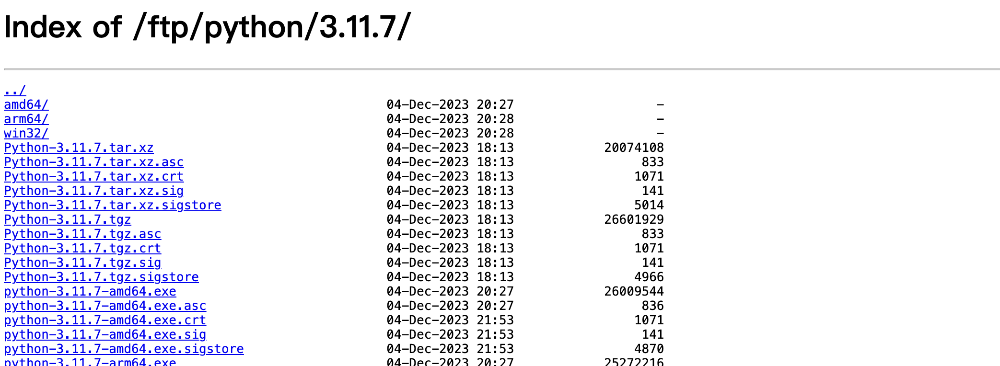
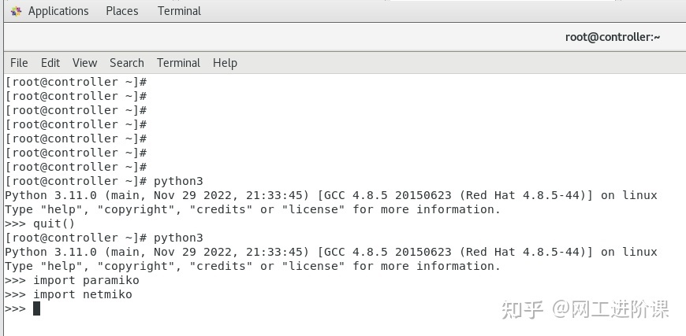

# python3安装

> 参考博客
>
> https://phoenixnap.com/kb/how-to-install-python-3-centos-7
>
> https://zomro.com/blog/faq/294-kak-ustanovit-python-310-na-centos-7
>
> https://www.cnblogs.com/blogabc/p/17188812.html
>
> https://blog.csdn.net/xiqng17111342931/article/details/131656962

## 源码安装

> 源码包下载

https://www.python.org/ftp/python/3.11.7/




> 安装依赖

```shell
yum groupinstall "Development Tools" -y

yum install gcc open-ssl-devel bzip2-devel libffi-devel -y
```

> 解压安装

```shell
tar xzf Python-3.9.6.tgz
cd Python 3.9.6

./configure --enable-optimizations

make && make altinstall
```


[centos7安装python3.11完整教程(完整有效)](https://www.cnblogs.com/blogabc/p/17188812.html)

1.安装python3:

```shell
cd /root
#只是将python3.11的安装包下载到 /root目录下
wget https://www.python.org/ftp/python/3.11.0/Python-3.11.0.tgz
#下载最新的软件安装包
tar -xzf Python-3.11.0.tgz
#解压缩安装包
yum -y install gcc zlib zlib-devel libffi libffi-devel
#安装源码编译需要的编译环境
yum install readline-devel
#可以解决后期出现的方向键、删除键乱码问题, 这里提前避免.
yum install openssl-devel openssl11 openssl11-devel
#安装openssl11, 后期的pip3安装网络相关模块需要用到ssl模块.
export CFLAGS=$(pkg-config --cflags openssl11)
export LDFLAGS=$(pkg-config --libs openssl11)
#设置编译FLAG, 以便使用最新的openssl库
cd /root/Python-3.11.0
#进入刚解压缩的目录
./configure --prefix=/usr/python --with-ssl
#指定python3的安装目录为 /usr/python 并使用ssl模块, 指定目录好处是
#后期删除此文件夹就可以完全删除软件了.
make
make install
#就是源码编译并安装了, 时间会持续几分钟.
ln -s /usr/python/bin/python3 /usr/bin/python3
ln -s /usr/python/bin/pip3 /usr/bin/pip3
#指定链接, 此后我们系统的任何地方输入python3就是我们安装的
#这个最新版python3了

```

安装到这里我们就可以正确使用python3了, 实例如下:


2.安装常用到的网工配置模块paramiko、netmiko

```shell
pip3 install netmiko -i https://pypi.tuna.tsinghua.edu.cn/simple/ --trusted-host pypi.tuna.tsinghua.edu.cn
pip3 install paramiko -i https://pypi.tuna.tsinghua.edu.cn/simple/ --trusted-host pypi.tuna.tsinghua.edu.cn
#使用的清华大学的安装源, 个别其他的安装源会没有相应的安装包
怎么证明安装好了呢, 我们在python3中引入相应模块没有没问就好了.
```



这里我们import paramiko引入模块没有报错就可以了.

截止到这里我们就安装完成了一个适合网工使用的python3环境了, 下面就可以发挥你的能量通宵工作了~


可能安装过程中遇到的问题

1.报错出现‘No package openssl11 available’:
解决方法:

多数是你没有安装EPEL (即企业版linux扩展包) , 使用以下方法即可:

```shell
yum install epel-release
```

2.make编译的时候出现报错, 此报错在make执行完的最后面会提示:
‘Could not build the ssl module!

Python requires a Openssl 1.1.1 or newer’'

```shell
yum install openssl-devel openssl11 openssl11-devel
export CFLAGS=$(pkg-config --cflags openssl11)
export LDFLAGS=$(pkg-config --libs openssl11)
cd /root/Python-3.11.0
./configure --prefix=/usr/python --with-ssl
```

主要上面这几个过程不要出现错误, 就不会报错.是因为较新版本的python3开始使用openssl11进行支持了.

3.想删除python3这个软件, 从新安装怎么办？

```shell
rm -rf /usr/python
#删除刚刚的文件夹就可以了.后面从新安装, 在按照上面的步骤从新编译就可以了.
```


