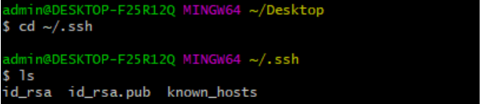
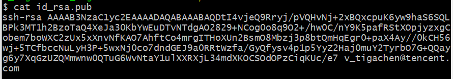
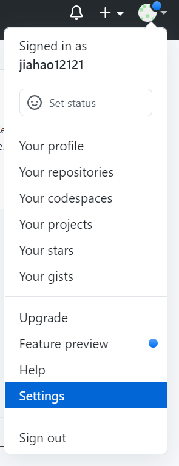
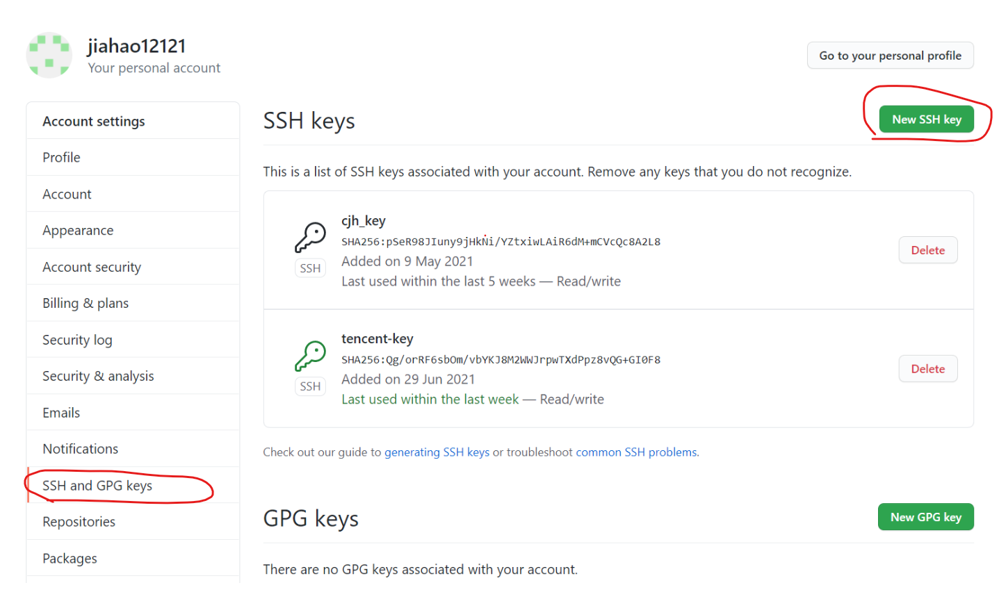
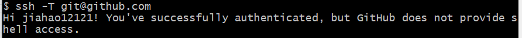
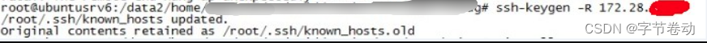

## SSH

官方文档：[https://docs.github.com/zh/authentication/connecting-to-github-with-ssh](https://docs.github.com/zh/authentication/connecting-to-github-with-ssh)


### 配置SSH

git使用SSH配置， 初始需要以下三个步骤

1. 使用秘钥生成工具生成rsa秘钥和公钥
2. 将rsa公钥添加到代码托管平台
3. 将rsa秘钥添加到ssh-agent中，为ssh client指定使用的秘钥文件

具体操作如下：

##### 第一步：检查本地主机是否已经存在ssh key

```bash
cd ~/.ssh
ls
//看是否存在 id_rsa 和 id_rsa.pub文件，如果存在，说明已经有SSH Key
```

如下图所示，则表明已经存在

如果存在，直接跳到第三步


##### 第二步：生成ssh key

如果不存在ssh key，使用如下命令生成

```bash
ssh-keygen -t rsa -C "xxx@xxx.com"
//执行后一直回车即可
```

生成完以后再用第二步命令，查看ssh key


##### 第三步：获取ssh key公钥内容（id_rsa.pub）

```bash
cd ~/.ssh
cat id_rsa.pub
```

如下图所示，复制该内容


##### 第四步：Github账号上添加公钥

进入Settings设置


添加ssh key，把刚才复制的内容粘贴上去保存即可


##### 第五步：验证是否设置成功

```bash
ssh -T git@github.com
```

显示如下信息表明设置成功

设置成功后，即可不需要账号密码clone和push代码

**注意之后在clone仓库的时候要使用ssh的url，而不是https！**

### 验证原理

SSH登录安全性由非对称加密保证，产生密钥时，一次产生两个密钥，一个公钥，一个私钥，在git中一般命名为id_rsa.pub, id_rsa。

那么如何使用生成的一个私钥一个公钥进行验证呢？

- 本地生成一个密钥对，其中公钥放到远程主机，私钥保存在本地
- 当本地主机需要登录远程主机时，本地主机向远程主机发送一个登录请求，远程收到消息后，随机生成一个字符串并用公钥加密，发回给本地。本地拿到该字符串，用存放在本地的私钥进行解密，再次发送到远程，远程比对该解密后的字符串与源字符串是否等同，如果等同则认证成功。

### 通俗解释！！

重点来了：**一定要知道ssh key的配置是针对每台主机的！**，比如我在某台主机上操作git和我的远程仓库，想要push时不输入账号密码，走ssh协议，就需要配置ssh key，放上去的key是**当前主机的ssh公钥**。那么如果我换了一台其他主机，想要实现无密登录，也就需要重新配置。

下面解释开头提出的问题：
（1）为什么要配？
配了才能实现push代码的时候不需要反复输入自己的github账号密码，更方便
（2）每使用一台主机都要配？
是的，每使用一台新主机进行git远程操作，想要实现无密，都需要配置。并不是说每个账号配一次就够了，而是每一台主机都需要配。
（3）配了为啥就不用密码了？
因为配置的时候是把当前主机的公钥放到了你的github账号下，相当于当前主机和你的账号做了一个关联，你在这台主机上已经登录了你的账号，此时此刻github认为是该账号主人在操作这台主机，在配置ssh后就信任该主机了。所以下次在使用git的时候即使没有登录github，也能直接从本地push代码到远程了。当然这里不要混淆了，你不能随意push你的代码到任何仓库，你只能push到你自己的仓库或者其他你有权限的仓库！


## FAQ

### GitHub 更新了 RSA SSH host key


今天在 push 自己 GitHub 仓库代码的时候遇到了报错，后来发现是 GitHub 已经将 RSA SSH host key 进行了更新。依据[官方博客](https://github.blog/2023-03-23-we-updated-our-rsa-ssh-host-key/)，GitHub 于 3月24日 05:00 UTC 时间 由于安全原因将 RSA SSH host key 进行了更新。主要是为了避免 GitHub 用户的 git 操作被任何不法分子监听。这个变更仅影响基于 RSA 的 SSH 协议使用 GitHub 进行 git 操作的用户。变更也只影响 RSA 算法，不影响 ECDSA 或者 Ed25519 用户。

```
@@@@@@@@@@@@@@@@@@@@@@@@@@@@@@@@@@@@@@@@@@@@@@@@@@@@@@@@@@@
@ WARNING: REMOTE HOST IDENTIFICATION HAS CHANGED! @
@@@@@@@@@@@@@@@@@@@@@@@@@@@@@@@@@@@@@@@@@@@@@@@@@@@@@@@@@@@
IT IS POSSIBLE THAT SOMEONE IS DOING SOMETHING NASTY!
Someone could be eavesdropping on you right now (man-in-the-middle attack)!
It is also possible that a host key has just been changed.
The fingerprint for the RSA key sent by the remote host is
SHA256:uNiVztksCsDhcc0u9e8BujQXVUpKZIDTMczCvj3tD2s.
Please contact your system administrator.
Add correct host key in ~/.ssh/known_hosts to get rid of this message.
Host key for github.com has changed and you have requested strict checking.
Host key verification failed.
```


可以通过下述命令移除老的 key，也可以在 `~/.ssh/known_hosts` 文件里面手动删除去更新。

```powershell
ssh-keygen -R github.com
```

你也可在 `~/.ssh/known_hosts` 文件中手动添加新的 RSA SSH 公钥。

```
github.com ssh-rsa AAAAB3NzaC1yc2EAAAADAQABAAABgQCj7ndNxQowgcQnjshcLrqPEiiphnt+VTTvDP6mHBL9j1aNUkY4Ue1gvwnGLVlOhGeYrnZaMgRK6+PKCUXaDbC7qtbW8gIkhL7aGCsOr/C56SJMy/BCZfxd1nWzAOxSDPgVsmerOBYfNqltV9/hWCqBywINIR+5dIg6JTJ72pcEpEjcYgXkE2YEFXV1JHnsKgbLWNlhScqb2UmyRkQyytRLtL+38TGxkxCflmO+5Z8CSSNY7GidjMIZ7Q4zMjA2n1nGrlTDkzwDCsw+wqFPGQA179cnfGWOWRVruj16z6XyvxvjJwbz0wQZ75XK5tKSb7FNyeIEs4TT4jk+S4dhPeAUC5y+bDYirYgM4GC7uEnztnZyaVWQ7B381AK4Qdrwt51ZqExKbQpTUNn+EjqoTwvqNj4kqx5QUCI0ThS/YkOxJCXmPUWZbhjpCg56i+2aB6CmK2JGhn57K5mj0MNdBXA4/WnwH6XoPWJzK5Nyu2zB3nAZp+S5hpQs+p1vN1/wsjk=
```

或者通过命令进行自动更新。

```
ssh-keygen -R github.com
$ curl -L https://api.github.com/meta | jq -r '.ssh_keys | .[]' | sed -e 's/^/github.com /' >> ~/.ssh/known_hosts
```

Github Action 用户如果使用带有 `ssh-key` 选项的 `actions/checkout` 用户也可能会看到工作流的失败日志。目前 GitHub 已经对对应的 `actions/checkout` 进行了更新。


Reference

- https://github.blog/2023-03-23-we-updated-our-rsa-ssh-host-key/


### GitLab 更新了 RSA SSH host key

```
root@ubuntusrv6:/data2/home/XXX/apps/Debug# git pull
@@@@@@@@@@@@@@@@@@@@@@@@@@@@@@@@@@@@@@@@@@@@@@@@@@@@@@@@@@@
@    WARNING: REMOTE HOST IDENTIFICATION HAS CHANGED!     @
@@@@@@@@@@@@@@@@@@@@@@@@@@@@@@@@@@@@@@@@@@@@@@@@@@@@@@@@@@@
IT IS POSSIBLE THAT SOMEONE IS DOING SOMETHING NASTY!
Someone could be eavesdropping on you right now (man-in-the-middle attack)!
It is also possible that a host key has just been changed.
The fingerprint for the ECDSA key sent by the remote host is
85:82:b1:XXXX:d2.
Please contact your system administrator.
Add correct host key in /root/.ssh/known_hosts to get rid of this message.
Offending ECDSA key in /root/.ssh/known_hosts:2
  remove with: ssh-keygen -f "/root/.ssh/known_hosts" -R xxx.xxx.xxx.xxx (服务器ip地址)
ECDSA host key for xxx.xxx.xxx.xxx (服务器ip地址) has changed and you have requested strict checking.
Host key verification failed.
fatal: The remote end hung up unexpectedly

```

#### 问题原因

用OpenSSH的人都知ssh会把你每个你访问过计算机的公钥(public key)都记录在~/.ssh/known_hosts。当下次访问相同计算机时，OpenSSH会核对公钥。如果公钥不同，OpenSSH会发出警告。

原因是我的GitLab服务器重装了系统（清除了与我本地SSH连接协议相关信息），本地的SSH协议信息便失效了。SSH连接相同的ip地址时因有连接记录直接使用失效的协议信息去验证该ip服务器，所以会报错，使用上述命令便可以清除known_hosts里旧缓存文件。


####  解决方法

删除xxx.xxx.xxx.xxx (服务器ip地址)的相关rsa的信息即可

在本地机输入一下命令行：

```
ssh-keygen -R xxx.xxx.xxx.xxx (服务器ip地址)
```

> 目的是清除你当前机器里关于你的远程服务器的缓存和公钥信息，注意是大写的字母“R”。

操作截图



```
root@ubuntusrv6:/data2/home/XXX/apps/Debug# ssh-keygen -R xxx.xxx.xxx.xxx (服务器ip地址)

/root/.ssh/known_hosts updated.
Original contents retained as /root/.ssh/known_hosts.old
```


```
root@ubuntusrv6:/data2/home/XXX/apps/Debug# ssh-keygen -R xxx.xxx.xxx.xxx
/root/.ssh/known_hosts updated.
Original contents retained as /root/.ssh/known_hosts.old
root@ubuntusrv6:/data2/home/XXX/apps/Debug# git pull
The authenticity of host 'xxx.xxx.xxx.xxx (xxx.xxx.xxx.xxx)' can't be established.
ECDSA key fingerprint is 85:82:b1:XXXX:d2.
Are you sure you want to continue connecting (yes/no)? yes
Warning: Permanently added 'xxx.xxx.xxx.xxx' (ECDSA) to the list of known hosts.
remote: Counting objects: 213, done.
remote: Compressing objects: 100% (126/126), done.
remote: Total 213 (delta 118), reused 156 (delta 62)
Receiving objects: 100% (213/213), 4.51 MiB | 9 KiB/s, done.
Resolving deltas: 100% (118/118), completed with 60 local objects.
```

