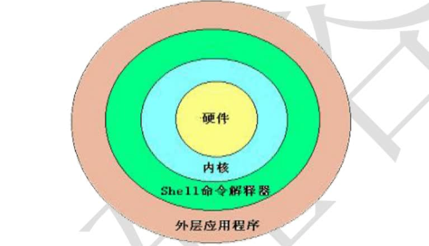
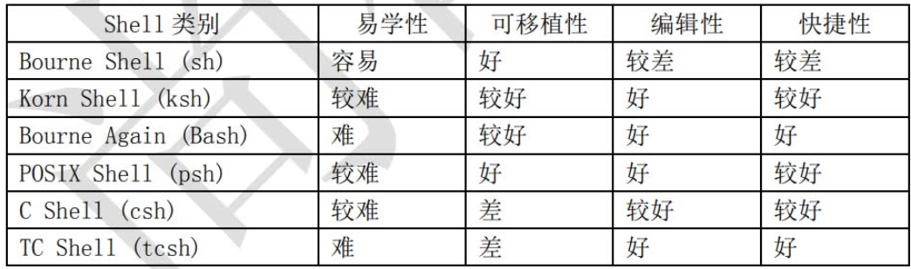

# hello world

## Shell概述

1、什么是Shell



2、shell的分类

> linux的标志shell是bash



Shell的两种主要语法类型有Bourne和C，这两种语法彼此不兼容。Bourne家族主要包括sh、ksh、Bash、psh、zsh；C家族主要包括：csh、tcsh（Bash和zsh在不同程度上支持csh的语法）。

我们可以通过/etc/shells文件来查询Linux支持的Shell。命令如下：

```
[root@xiaoshaozi ~]#  cat /etc/shells
/bin/sh
/bin/bash
/usr/bin/sh
/usr/bin/bash
```

## HelloWorld

```powershell
[root@xiaoshaozi ~]# vim hello.sh

#!/bin/bash
echo -e "1111111111111111! "
```

> 说明：
>
> `#!/bin/bash`不是注释，是bash bang，不能省略

运行方式：

- 赋予执行权限，直接运行

  ```powershell
  赋予执行权限
  [root@xiaoshaozi ~]# chmod 755 hello.sh
  
  因为我们已经在/root/sh目录当中，所以也可以使用相对路径运行
  [root@xiaoshaozi ~]# ./hello.sh 
  1111111111111111! 
  
  使用绝对路径运行
  [root@xiaoshaozi ~]# /root/hello.sh 
  1111111111111111! 
  ```

- 通过Bash调用执行脚本

  ```powershell
  [root@xiaoshaozi ~]# bash hello.sh 
  1111111111111111! 
  ```

  

