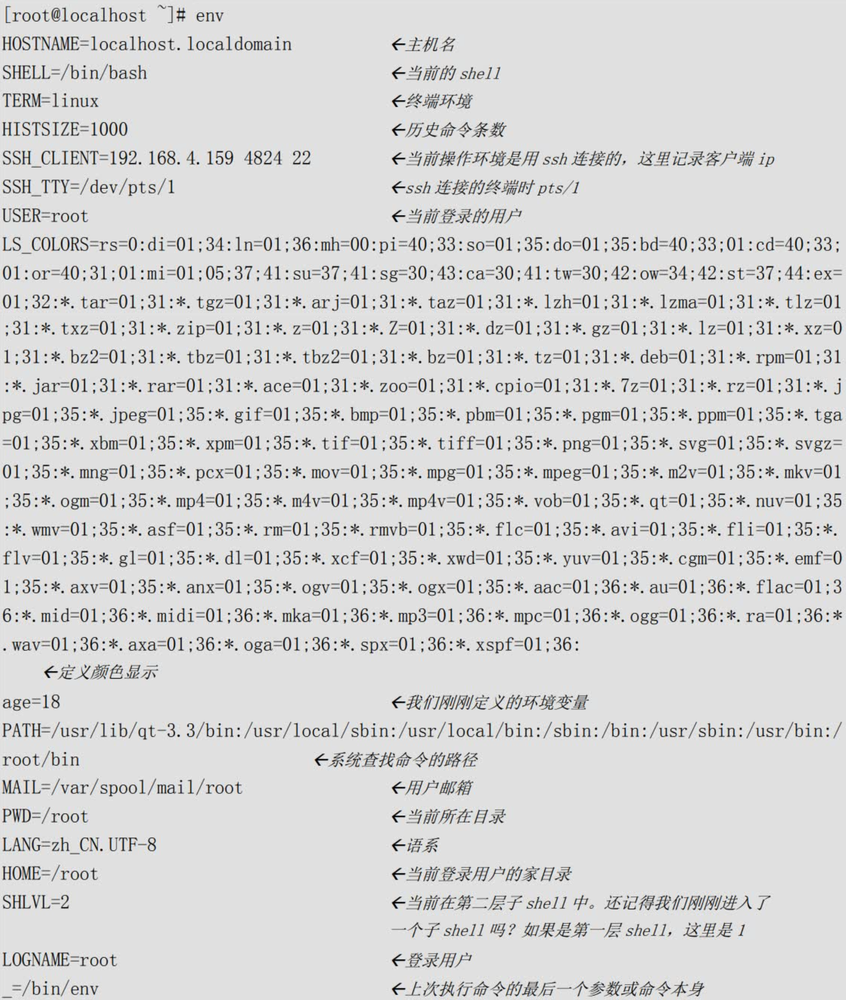
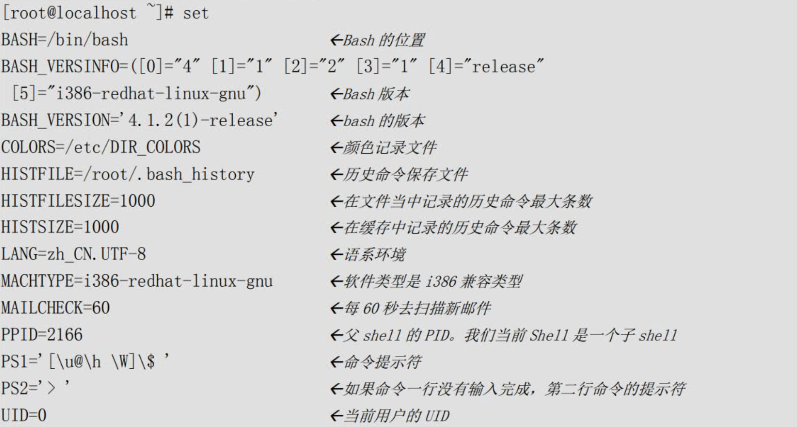
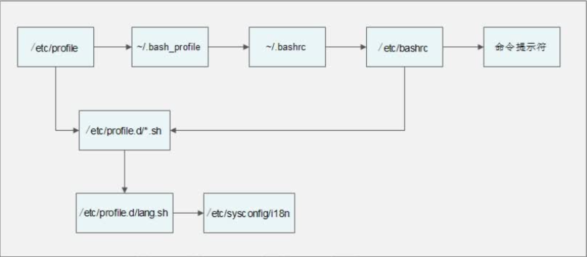

# 3、变量和运算符

## 变量定义

在Bash中，在定义变量时，有一些规则需要遵守：

- 变量名称可以由<font color=red>字母、数字、下划线</font>组成，但是<font color=red>不能以数字开头</font>。

- 变量的默认类型都是字符串型，如果要进行数值运算，则必修指定变量类型为数值型。

- 变量用等号连接值，<font color=red>**等号左右两侧不能有空格**</font>。

- 变量的值如果有空格，需要使用单引号或双引号包括。
  如：`test="hello world!"`
  其中双引号括起来的内容“$”、“\”和反引号都拥有特殊含义，而单引号括起来的内容都是普通字符。

- 在变量的值中，可以使用“\”转义符。

- 如果需要增加变量的值，那么可以进行变量值的叠加。不过变量需要用双引号包含"`$变量名`"或用`${变量名}`包含变量名。

  ```powershell
  [root@xiaoshaozi ~]# test=123
  [root@xiaoshaozi ~]# test="$test"456
  [root@xiaoshaozi ~]# echo $test
  123456
  #叠加变量test，变量值变成了123456
  [root@xiaoshaozi ~]# test=${test}789
  [root@xiaoshaozi ~]# echo $test
  123456789
  #再叠加变量test，变量值编程了123456789
  ```

  变量值的叠加可以使用两种格式：“`$变量名`”或`${变量名}`

- 如果是把命令的结果作为变量值赋予变量，则需要使用`反引号`或`$()`包含命令。例如：

  ```powershell
  [root@xiaoshaozi ~]# test=$(date)
  [root@xiaoshaozi ~]# echo $test
  2023年 12月 21日 星期四 15:43:49 CST
  ```

- 环境变量名建议大写，便于区分。

## 变量的分类

- **用户自定义变量**：这种变量是最常见的变量，由用户自由定义变量名和变量的值。
- **环境变量**：这种变量中主要保存的是和系统操作环境相关的数据，比如当前登录用户，用户的家目录，命令的提示符等。
                    环境变量的变量名可以自由定义，但是一般对系统起作用的环境变量的变量名是系统预先设定好的。

- **位置参数变量**：这种变量主要是用来向脚本当中传递参数或数据的，变量名不能自定义，变量作用是固定的。
- **预定义变量**：是Bash中已经定义好的变量，变量名不能自定义，变量作用也是固定的。

```
				名称			作用			内容
用户自定义变量	   自定义		   自定义		 自定义	
环境变量
	用户定义	 自定义		 自定义	   自定义
	系统自带	 确定		 	 确定	  	 	自定义
位置参数变量		确定			确定		   自定义
预定义变量		确定			 确定			自定义
```


## 1、用户自定义变量

1）、变量定义

```powershell
#变量名不能用数字开头
#等号左右两侧不能有空格
#变量的值如果有空格，必须用引号包含
[root@xiaoshaozi ~]# name=zs
```

2）、变量调用

```powershell
[root@localhost ~]# echo $变量名
```

3）、变量查看

```powershell
[root@xiaoshaozi ~]# set [选项]
选项：
	-u:	如果设定此选项，调用未声明变量时会报错（默认无任何提示）
	-x:	如果设定此选项，在命令执行之前，会吧命令先输出一次

set -u 更为常用

临时设置，如果需要永久设置，需要修改环境变量配置文件

[root@xiaoshaozi ~]# echo $age

[root@xiaoshaozi ~]# age=""
[root@xiaoshaozi ~]# echo $age

[root@xiaoshaozi ~]# unset age
[root@xiaoshaozi ~]# echo $age

[root@xiaoshaozi ~]# set -u
[root@xiaoshaozi ~]# echo $age
-bash: age: 为绑定变量
```

查询环境变量

```powershell
[root@xiaoshaozi ~]# set
#直接使用set命令，会查询系统中所有的变量，包含用户自定义变量和环境变量

[root@xiaoshaozi ~]# env
# env看不到用户自定义变量，可以看到另一部分环境变量
```


4）、变量删除

```powershell
[root@xiaoshaozi ~]# unset 变量名
```

## 2、环境变量

> 环境变量可以在子shell中使用

1）、环境变量设置

```powershell
#使用export声明的变量即是环境变量
方式一：
export 变量名=变量值
[root@xiaoshaozi ~]# export ZS_AGE="18"
方式二：
[root@xiaoshaozi ~]# ZS_AGE="18"
[root@xiaoshaozi ~]# export ZS_AGE
```

2）、环境变量查询和删除

env命令和set命令的区别是，set命令可以查看所有变量，而env命令只能查看环境变量。

```powershell
[root@xiaoshaozi ~]# env | grep ZS_AGE
ZS_AGE=18
```


3）、系统默认环境变量



​		env命令可以查询到所有的环境变量，可是还有一些变量虽然不是环境变量，却是和Bash操作接口相关的变量，这些变量也对我们的Bash操作终端起到了重要的作用。

这些变量就只能用set命令来查看了，我只列出重要的内容吧：



### PATH变量：<font color=red>系统查找命令的路径</font>

先查询下PATH环境变量的值：

```powershell
[root@xiaoshaozi ~]# echo $PATH
/usr/local/sbin:/usr/local/bin:/usr/sbin:/usr/bin:/root/bin
```

​		PATH变量的值是用“`:`”分割的路径，这些路径就是系统查找命令的路径。也就是说当我们输入了一个程序名，如果没有写入路径，系统就会到PATH变量定义的路径中去寻找，是否有可以执行的程序。如果找到则执行，否则会报“命令没有发现”的错误。

​		那么是不是我们把自己的脚本拷贝到PATH变量定义的路径中，我们自己写的脚本也可以不输入路径而直接运行呢？

```powershell
[root@localhost ~]# cp /root/sh/hello.sh /bin/
#拷贝hello.sh到/bin目录
[root@localhost ~]# hello.sh
#hello.sh可以直接执行了
```

那么我们是不是可以修改PATH变量的值，而不是把程序脚本复制到`/bin/`目录中。当然是可以的，我们通过变量的叠加就可以实现了：

```powershell
[root@xiaoshaozi ~]# PATH="$PATH":/root/sh
[root@xiaoshaozi ~]# echo $PATH
```


当然我们这样定义的PATH变量只是临时生效，一旦重启或注销就会消失，如果想要永久生效，需要写入环境变量配置文件，我们在“环境变量配置文件”小节中再详细介绍。


### PS1变量：<font color=red>命令提示符设置</font>

PS1是一个很有意思的变量（这可不是SONY的游戏机哦），是用来定义命令行的提示符的，可以按照我们自己的需求来定义自己喜欢的提示符。

PS1可以支持以下这些选项：

- `\d`：显示日期，格式为`星期 月 日`
- `\H`：显示完整的主机名。如默认主机名`localhost.localdomain`
- `\h`：显示简写主机名。如默认主机名`localhost`
- `\t`：显示24小时制时间，格式为`HH:MM:SS`
- `\T`：显示12小时制时间，格式为`HH:MM:SS`
- `\A`：显示24小时制时间，格式为`HH:MM`
- `\@`：显示12小时制时间，格式为`HH:MM am/pm`
- `\u`：显示当前用户名
- `\v`：显示Bash的版本信息
- `\w`：显示当前所在目录的完整名称
- `\W`：显示当前所在目录的最后一个目录
- `\#`：执行的第几个命令
- `\$`：提示符。如果是root用户会显示提示符为`#`，如果是普通用户会显示提示符为`$`

```powershell
[root@xiaoshaozi /]# echo $PS1
[\u@\h \W]\$
[root@xiaoshaozi /]# PS1='[\u@\H:\A \W]\$ '
[root@xiaoshaozi:17:09 /]# 
```

这里要小心，PS1变量的值要用单引号包含，否则设置不生效。

对应永久环境变量配置文件: `/etc/bashrc`


### LANG语系变量

LANG变量定义了Linux系统的主语系环境，这个变量的默认值是：

```powershell
[root@xiaoshaozi ~]# echo $LANG
zh_CN.UTF-8
```

这是因为我们Linux安装时，选择的是中文安装，所以默认的主语系变量是“zh_CN.UTF-8”。

那么Linux中到底支持多少语系呢？我们可以使用以下命令查询：

```powershell
[root@xiaoshaozi ~]# locale -a | wc -l
791
[root@xiaoshaozi ~]# locale -a | more
```

## 3、位置参数变量

| 位置参数变量 | 作用                                                         |
| ------------ | ------------------------------------------------------------ |
| `$n`         | n为数字，`$0`代表命令本身，`$1-$9`代表第一到第九个参数，十以上的参数需要用大括号包含，如`${10}.` |
| `$*`         | 这个变量代表命令行中所有的参数，`$*`把所有的参数看成一个整体 |
| `$@`         | 这个变量也代表命令行中所有的参数，不过`$@`把每个参数区分对待 |
| `$#`         | 这个变量代表命令行中所有参数的个数                           |

```shell
#!/bin/bash

# 给a变量赋值 第1个参数
a=$1
# 给a变量赋值 第2个参数
b=$2
# sum=a+b
# shell中的变量默认是字符串类型，再后续运算符中详细介绍
sum=$(( $a + $b ))
# 打印sum变量值
echo $sum
# 打印脚本本身
echo $0
```

那么还有几个位置参数变量是干嘛的呢？我们在写个脚本来说明下：

```shell
[root@xiaoshaozi ~]# ./parameter.sh 
$*: 
$@:
$#: 0
[root@xiaoshaozi ~]# ./parameter.sh 11 22 33 44
$*: 11 22 33 44
$@: 11 22 33 44
$#: 4
[root@xiaoshaozi ~]# cat parameter.sh 
#!/bin/bash

echo '$*': "$*"
echo '$@': "$@"
echo '$#': "$#"
```

那么“`$*`”和“`$@`”有区别吗？还是有区别的，`$*`会把接收的所有参数当成一个整体对待，而`$@`则会区分对待接收到的所有参数。


```shell
[root@xiaoshaozi ~]# cat ./parameter2.sh 
#!/bin/bash

for i in 1 2 3
        do
                echo "$i"
        done


echo '==================='

#定义for循环，in后面有几个值，for会循环多少次，注意“$*”要用双引号括起来
#每次循环会把in后面的值赋予变量j
#Shell把$*中的所有参数看成是一个整体，所以这个for循环只会循环一次
for j in "$*"
        do
        		#打印变量$i的值
                echo "$j"
        done

echo '==================='

for k in "$@"
        do
                echo "$k"
        done

echo '==================='


[root@xiaoshaozi ~]# ./parameter2.sh a b c 1 2 3
1
2
3
===================
a b c 1 2 3
===================
a
b
c
1
2
3
===================
```

## 4、预定义变量

| 预定义变量 | 作用                                                         |
| ---------- | ------------------------------------------------------------ |
| `$?`       | 最后一次执行的命令的返回状态。<br />如果这个变量的值为0，证明上一个命令正确执行；<br />如果这个变量的值为非0（具体是哪个数，由命令自己来决定），则证明上一个命令执行不正确了。 |
| `$$`       | 当前进程的进程号（PID）                                      |
| `$!`       | 后台运行的最后一个进程的进程号（PID）                        |

我们先来看看“`$?`”这个变量，看起来不好理解，我们还是举个例子：

```powershell
[root@xiaoshaozi ~]# ls
count.sh  file1  file2  file3  parameter2.sh  parameter.sh  sh  zs.sh
[root@xiaoshaozi ~]# echo $?
0
#预定义变量“$?”的值是0，证明上一个命令执行正确

[root@xiaoshaozi ~]# ls aaa
ls: 无法访问aaa: 没有那个文件或目录
[root@xiaoshaozi ~]# echo $?
2
#当前目录中没有aaa文件，所以ls命令报错了
```

接下来我们来说明下“`$$`”和“`$!`”这两个预定义变量，我们写个脚本吧：

```shell
[root@xiaoshaozi ~]# vim variable.sh
#!/bin/bash
echo "The current process is $$"
# 输出当前进程的PID
# 这个PID就是variable.sh这个脚本执行时，生成的进程的PID

find /root -name hello.sh &
# 使用find命令在root目录下查找hello.sh文件
# 符号&的意思是吧命令放入后台执行，工作管理我们系统管理章节介绍
echo "The last one Daemon process is $!"
# 输出这个后台执行命令的进程的PID，也就是输出find命令的PID号
```


## 接收键盘输入

```shell
[root@localhost ~]# read [选项] [变量名]
选项：
	-p	“提示信息”：	  在等待read输入时，输出提示信息
	-t	秒数：		 read命令会一直等待用户输入，使用此选项可以指定等待时间
	-n	字符数：	read命令只接受指定的字符数，就会执行
	-s：			  隐藏输入的数据，适用于机密信息的输入
	
变量名：
	- 变量名可以自定义，如果不指定变量名，会把输入保存入默认变量REPLY
	- 如果只提供了一个变量名，则整个输入行赋予该变量
	- 如果提供了一个以上的变量名，则输入行分为若干字，一个接一个地赋予各个变量，
	  而命令行上如果提供了一个以上的变量名，则输入行分为若干字，一个接一个地赋予各个变量，而命令行上
```

还是写个例子来解释下read命令：

```shell
[root@xiaoshaozi ~]# cat read.sh 
#!/bin/bash
read -n 5 -s -t 5 -p "Please input your name: " name age
echo "$name ===== $age"

[root@xiaoshaozi ~]# bash read.sh

```


## Shell的运算符

### 1）数值运算的方法

那如果我需要进行数值运算，可以采用以下三种方法中的任意一种：

- 使用declare声明变量类型

  既然所有变量的默认类型是字符串型，那么只要我们把变量声明为整数型不就可以运算了吗？使用declare命令就可以实现声明变量的类型。命令如下：

  ```shell
  [root@localhost ~]# declare [+/-][选项] 变量名
  选项:
      -：给变量设定类型属性
      +：取消变量的类型属性
      -a：将变量声明为数组型
      -i：将变量声明为整数型（integer）
      -r：讲变量声明为只读变量。
      	注意，一旦设置为只读变量，既不能修改变量的值，也不能删除变量，甚至不能通过+r取消只读属性
      -x：将变量声明为环境变量
      -p：显示指定变量的被声明的类型
  ```

  例子1：数值运算

  那我们只要把变量声明为整数型不就可以运算了吗？试试吧：

  ```shell
  [root@xiaoshaozi ~]# a=1
  [root@xiaoshaozi ~]# b=2
  [root@xiaoshaozi ~]# c=$a+$b
  [root@xiaoshaozi ~]# echo $c
  1+2
  [root@xiaoshaozi ~]# declare -i c=$a+$b
  [root@xiaoshaozi ~]# echo $c
  3
  ```

  这样运算好麻烦啊，没有办法啊，Shell在数值运算这里确实是比较麻烦，习惯就好了-_-!。

  

  例子2：数组变量类型

  还是举个例子吧：

  ```shell
  [root@xiaoshaozi ~]# declare -a name[0]="shen chao"
  
  由于太特殊，可以省略 declare -a
  [root@xiaoshaozi ~]# name[0]="shen chao"
  [root@xiaoshaozi ~]# name[1]="li ming"
  [root@xiaoshaozi ~]# name[2]="tong gang"
  [root@xiaoshaozi ~]# echo ${name}
  shen chao
  [root@xiaoshaozi ~]# echo ${name[*]}
  shen chao li ming tong gang
  
  ```

  例子3：环境变量

  我们其实也可以使用`declare`命令把变量声明为环境变量，和`export`命令的作用是一样的：

  ```shell
  [root@xiaoshaozi ~]# declare -x test=123
  ```

  例子4：只读属性

  注意一旦给变量设定了只读属性，那么这个变量既不能修改变量的值，也不能删除变量，甚至不能使用“+r”选项取消只读属性。命令如下：

  ```shell
  [root@xiaoshaozi ~]# declare -r test
  [root@localhost ~]# test=456
  -bash: test: readonly variable
  #test变量的值就不能修改了
  [root@localhost ~]# declare +r test
  -bash: declare: test: readonly variable
  #也不能取消只读属性
  [root@localhost ~]# unset test
  -bash: unset: test: cannot unset: readonly variable
  #也不能删除变量
  ```

  不过还好这个变量只是命令行声明的，所以只要重新登录或重启，这个变量就会消失了。

  例子5：查询变量属性和取消变量属性

  变量属性的查询使用“-p”选项，变量属性的取消使用“+”选项。命令如下：

  ```shell
  [root@localhost ~]# declare -p cc
  declare -i cc="33"
  #cc变量是int型
  [root@localhost ~]# declare -p name
  declare -a name='([0]="shen chao" [1]="li ming" [2]="tong gang")'
  #name变量是数组型
  [root@localhost ~]# declare -p test
  declare -rx test="123"
  #test变量是环境变量和只读变量
  
  [root@localhost ~]# declare +x test
  #取消test变量的环境变量属性
  [root@localhost ~]# declare -p test
  declare -r test="123"
  #注意，只读变量属性是不能取消的
  ```


- 使用`expr`或`let`数值运算工具

  要想进行数值运算的第二种方法是使用expr命令，这种命令就没有declare命令复杂了。命令如下：

  ```shell
  [root@localhost ~]# aa=11
  [root@localhost ~]# bb=22
  #给变量aa和变量bb赋值
  [root@localhost ~]# dd=$(expr $aa + $bb)
  #dd的值是aa和bb的和。注意“+”号左右两侧必须有空格
  [root@localhost ~]# echo $dd
  33
  ```

  使用expr命令进行运算时，要注意“+”号左右两侧必须有空格，否则运算不执行。

  至于let命令和expr命令基本类似，都是Linux中的运算命令，命令格式如下：

  ```shell
  [root@localhost ~]# aa=11
  [root@localhost ~]# bb=22
  #给变量aa和变量bb赋值
  [root@localhost ~]# let ee=$aa+$bb
  [root@localhost ~]# echo $ee
  33
  #变量ee的值是aa和bb的和
  
  [root@localhost ~]# n=20
  #定义变量n
  [root@localhost ~]# let n+=1
  #变量n的值等于变量本身再加1
  [root@localhost ~]# echo $n
  21
  ```

  expr命令和let命令大家可以按照习惯使用，不过let命令对格式要求要比expr命令宽松，所以推荐使用let命令进行数值运算。


- 使用“`$((运算式))`”或“`$[运算式]`”方式运算

  其实这是一种方式“`$(())`”和“`$[]`”这两种括号按照个人习惯使用即可。命令如下：

  ```shell
  [root@localhost ~]# aa=11
  [root@localhost ~]# bb=22
  [root@localhost ~]# ff=$(( $aa+$bb ))
  [root@localhost ~]# echo $ff
  33
  #变量ff的值是aa和bb的和
  
  [root@localhost ~]# gg=$[ $aa+$bb ]
  [root@localhost ~]# echo $gg
  33
  #变量gg的值是aa和bb的和
  ```

  这三种数值运算方式，大家可以按照自己的习惯来进行使用。不过我们推荐使用“`$((运算式))`”的方式


### 2）、Shell常用运算符

| 优先级 | 运算符                              | 说明                               |
| ------ | ----------------------------------- | ---------------------------------- |
| 13     | -,+                                 | 单目负、单目正                     |
| 12     | !,~                                 | 逻辑非、按位取反或补码             |
| 11     | \* ,/ ,%                            | 乘、除、取模                       |
| 10     | +,-                                 | 加、减                             |
| 9      | << ,>>                              | 按位左移、按位右移                 |
| 8      | < =,> =,< ,>                        | 小于或等于、大于或等于、小于、大于 |
| 7      | == ,!=                              | 等于、不等于                       |
| 6      | &                                   | 按位与                             |
| 5      | ^                                   | 按位异或                           |
| 4      | \|                                  | 按位或                             |
| 3      | &&                                  | 逻辑与                             |
| 2      | \|\|                                | 逻辑或                             |
| 1      | =,+=,-=,*=,/=,%=,&=,^=,\|=,<<=, >>= | 赋值、运算且赋值                   |


运算符优先级表明在每个表达式或子表达式中哪一个运算对象首先被求值，数值越大优先级越高，具有较高优先级级别的运算符先于较低级别的运算符进行求值运算。

例子1：加减乘除

```shell
[root@localhost ~]# aa=$(( (11+3)*3/2 ))
[root@localhost ~]# echo $aa
21
```

例子2：取模运算

```shell
[root@localhost ~]# bb=$(( 14%3 ))
[root@localhost ~]# echo $bb
2
```

例子3：逻辑与

```shell
[root@localhost ~]# cc=$(( 1 && 0 ))
[root@localhost ~]# echo $cc
0
```


### 变量的测试与内容置换

| 变量置换方式   | 变量y没有设置                            | 变量y为空值                  | 变量y设置值           |
| -------------- | ---------------------------------------- | ---------------------------- | --------------------- |
| `x=${y-新值}`  | `x=新值`                                 | `x为空`                      | `x=$y`                |
| `x=${y:-新值}` | `x=新值`                                 | `x=新值`                     | `x=$y`                |
| `x=${y+新值}`  | `x为空`                                  | `x=新值`                     | `x=新值`              |
| `x=${y:+新值}` | `x为空`                                  | `x为空`                      | `x=新值`              |
| `x=${y=新值}`  | `x=新值`<br />`y=新值`                   | `x=为空`<br />`y=值不变`     | `x=$y`<br />`y值不变` |
| `x=${y:=新值}` | `x=新值`<br />`y=新值`                   | `x=新值`<br />`y=新值`       | `x=$y`<br />`y值不变` |
| `x=${y?新值}`  | 新值输出到<br />标准错误输出（就是屏幕） | `x为空`                      | `x=$y`                |
| `x=${y:?新值}` | 新值输出到<br />标准错误输出             | 新值输出到<br />标准错误输出 | `x=$y`                |

通过`set -u`可以让未定义变量报错

如果大括号内没有“：”，则变量y是为空，还是没有设置，处理方法是不同的；如果大括号内有“：”，则变量y不论是为空，还是没有没有设置，处理方法是一样的。

如果大括号内是“-”或“+”，则在改变变量x值的时候，变量y是不改变的；如果大括号内是“=”，则在改变变量x值的同时，变量y的值也会改变。

如果大括号内是“？”，则当变量y不存在或为空时，会把“新值”当成报错输出到屏幕上。

看的头都晕了吧，举几个例子说明下吧：

```shell
[root@localhost ~]# unset y
[root@localhost ~]# x=${y-new}
[root@localhost ~]# echo $x
new
[root@localhost ~]# echo $y

```

## 环境变量配置文件

### source命令

```shell
[root@localhost ~]# source 配置文件
或 
[root@localhost ~]# . 配置文件
```


### 环境变量配置文件

1）、登录时生效的环境变量配置文件

在Linux系统登录时主要生效的环境变量配置文件有以下五个：

- `/etc/profile`
- `/etc/profile.d/*.sh`
- `~/.bash_profile`
- `~/.bashrc`
- `/etc/bashrc`

环境变量配置文件调用过程



在用户登录过程先调用`/etc/profile`文件

在这个环境变量配置文件中会定义这些默认环境变量：

- `USER`变量：根据登录的用户，给这个变量赋值（就是让USER变量的值是当前用户）。

- `LOGNAME`变量：根据USER变量的值，给这个变量赋值。

- `MAIL`变量：根据登录的用户，定义用户的邮箱为`/var/spool/mail/`用户名。
- `PATH`变量：根据登录用户的UID是否为0，判断`PATH`变量是否包含`/sbin`、`/usr/sbin`和`/usr/local/sbin`这三个系统命令目录。
- `HOSTNAME`变量：更加主机名，给这个变量赋值。
- `HISTSIZE`变量：定义历史命令的保存条数。
- `umask`：定义umask默认权限。注意`/etc/profile`文件中的`umask`权限是在“有用户登录过程（也就是输入了用户名和密码）”时才会生效。
- 调用`/etc/profile.d/*.sh`文件，也就是调用`/etc/profile.d/`目录下所有以`.sh`结尾的文件。
- 由`/etc/profile`文件调用`/etc/profile.d/*.sh`文件

这个目录中所有以`.sh`结尾的文件都会被`/etc/profile`文件调用，这里最常用的就是`lang.sh`文件，而这个文件又会调用`/etc/sysconfig/i18n`文件。`/etc/sysconfig/i18n`这个文件眼熟吗？就是我们前面讲过的默认语系配置文件啊。

- 由`/etc/profile`文件调用`~/.bash_profile`文件
  `~/.bash_profile`文件就没有那么复杂了，这个文件主要实现了两个功能：

  - 调用了`~/.bashrc`文件。	

  - 在`PATH`变量后面加入了“`:$HOME/bin`”这个目录。那也就是说，如果我们在自己的家目录中建立`bin`目录，然后把自己的脚本放入“`~/bin`”目录，就可以直接执行脚本，而不用通过目录执行了。

- 由`~/.bash_profile`文件调用`~/.bashrc`文件
  在`~/.bashrc`文件中主要实现了：
  - 定义默认别名，所以超哥把自己定义的别名也放入了这个文件。
  - 调用`/etc/bashrc`

- 由`~/.bashrc`调用了`/etc/bashrc`文件
  在/etc/bashrc文件中主要定义了这些内容：
  - PS1变量：也就是用户的提示符，如果我们想要永久修改提示符，就要在这个文件中修改
  - umask：定义umask默认权限。这个文件中定义的umask是针对“没有登录过程（也就是不需要输入用户名和密码时，比如从一个终端切换到另一个终端，或进入子Shell）”时生效的。如果是“有用户登录过程”，则是/etc/profile文件中的umask生效。
  - PATH变量：会给PATH变量追加值，当然也是在“没有登录过程”时才生效。
  - 调用`/etc/profile.d/*.sh`文件，这也是在“没有用户登录过程”是才调用。在“有用户登录过程”时，`/etc/profile.d/*.sh`文件已经被`/etc/profile`文件调用过了。

这样这五个环境变量配置文件会被依次调用，那么如果是我们自己定义的环境变量应该放入哪个文件呢？如果你的修改是打算对所有用户生效的，那么可以放入`/etc/profile`环境变量配置文件；如果你的修改只是给自己使用的，那么可以放入`~/.bash_profile`或`~/.bashrc`这两个配置文件中的任一个。

可是如果我们误删除了这些环境变量，比如删除了`/etc/bashrc`文件，或删除了`~/.bashrc`文件，那么这些文件中配置就会失效（`~/.bashrc`文件会调用`/etc/bashrc`文件）。那么我们的提示符就会变成：

```shell
-bash-4.1#
```

2）、注销时生效的环境变量配置文件

在用户退出登录时，只会调用一个环境变量配置文件，就是`~/.bash_logout`。这个文件默认没有写入任何内容，可是如果我们希望再退出登录时执行一些操作，比如清除历史命令，备份某些数据，就可以把命令写入这个文件。

3）、其他配置文件

还有一些环节变量配置文件，最常见的就是`~/bash_history`文件，也就是历史命令保存文件。这个文件已经讲过了，这里我们只是把它归入环境变量配置文件小节而已。


### Shell登录信息

1)、`/etc/issue`

我们在登录tty1-tty6这六个本地终端时，会有几行的欢迎界面。这些欢迎信息是保存在哪里的？可以修改吗？当然可以修改，这些欢迎信息是保存在/etc/issue文件中，我们查看下这个文件：

```shell
[root@localhost ~]# cat /etc/issue
CentOS release 6.8 (Final)
Kernel \r on an \m
```

可以支持的转义符我们可以通过man agetty命令查询，在表中我们列出常见的转义符作用：

| 转义符 | 作用                             |
| ------ | -------------------------------- |
| \d     | 显示当前系统日期                 |
| \s     | 显示操作系统名称                 |
| \l     | 显示登录的终端号，这个比较常用。 |
| \m     | 显示硬件体系结构，如i386、i686等 |
| \n     | 显示主机名                       |
| \o     | 显示域名                         |
| \r     | 显示内核版本                     |
| \t     | 显示当前系统时间                 |
| \u     | 显示当前登录用户的序列号         |

2)、`/etc/issue.net`

`/etc/issue`是在本地终端登录是显示欢迎信息的，如果是远程登录（如ssh远程登录，或telnet远程登录）需要显示欢迎信息，则需要配置`/etc/issue.net`这个文件了。使用这个文件时由两点需要注意：

- 首先，在`/etc/issue`文件中支持的转义符，在`/etc/issue.net`文件中不能使用。
- 其次，ssh远程登录是否显示`/etc/issue.net`件中的欢迎信息，是由ssh的配置文件决定的。

如果我们需要ssh远程登录可以查看`/etc/issue.net`的欢迎信息，那么首先需要修改ssh的配置文件`/etc/ssh/sshd_config`，加入如下内容：

```shell
[root@localhost ~]# cat /etc/ssh/sshd_config
…省略部分输出…
# no default banner path
#Banner none
Banner /etc/issue.net
…省略部分输出…
```

这样在ssh远程登录时，也可以显示欢迎信息，只是不再可以识别“\d”和“\l”等信息了

3)、/etc/motd

/etc/motd文件中也是显示欢迎信息的，这个文件和/etc/issue及/etc/issue.net文件的区别是：/etc/issue及/etc/issue.net是在用户登录之前显示欢迎信息，而/etc/motd是在用户输入用户名和密码，正确登录之后显示欢迎信息。在/etc/motd文件中的欢迎信息，不论是本地登录，还是远程登录都可以显示。


### 定义Bash快捷键

```shell
[root@localhost ~]# stty -a
# 查询所有的快捷键
```

那么这些快捷键可以更改吗？可以啊，只要执行：

```powershell
[root@localhost ~]# stty 关键字 快捷键

例如：
[root@localhost ~]# stty intr ^p
# 定义ctrl+p快捷键为强制终止，“^”字符只要手工输入即可

[root@localhost ~]# stty -a
speed 38400 baud; rows 21; columns 104; line = 0;
intr = ^P; quit = ^\; erase = ^?; kill = ^U; eof = ^D; eol = <undef>; eol2 = <undef>; swtch = <undef>;
start = ^Q; stop = ^S; susp = ^Z; rprnt = ^R; werase = ^W; lnext = ^V; flush = ^O; min =1;time = 0;

# 强制终止变成了ctrl+p快捷键
```

