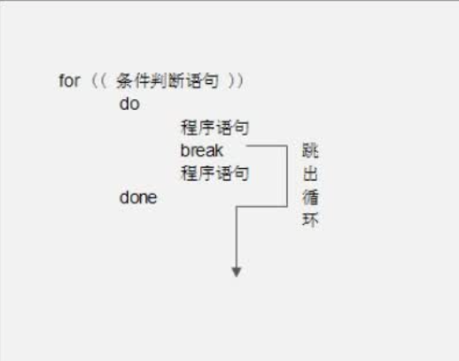
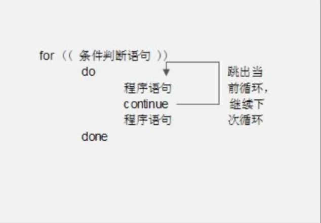

# 5、流程控制

## if条件判断

### 1)、单分支if条件语句

单分支条件语句最为简单，就是只有一个判断条件，如果符合条件则执行某个程序，否则什么事情都不做。

语法如下：

```shell
if [ 条件判断式 ];then
	程序
fi
```

单分支条件语句需要注意几个点：

- if语句使用fi结尾，和一般语言使用大括号结尾不同

- `[ 条件判断式 ]`就是使用`test`命令判断，所以中括号和条件判断式之间<font color=red>必须有空格</font>

- then后面跟符合条件之后执行的程序，可以放在`[]`之后，用“`;`”分割。
  也可以换行写入，就不需要“`;`”了，比如单分支if语句还可以这样写：

  ```shell
  if [ 条件判断式 ]
  	then
  		程序
  fi
  ```

#### 判断根分区使用率

```shell
[root@xiaoshaozi ~]# df -h
文件系统                 容量  已用  可用 已用% 挂载点
/dev/vda1                 59G  4.2G   53G    8% /
devtmpfs                 858M     0  858M    0% /dev
tmpfs                    868M     0  868M    0% /dev/shm
tmpfs                    868M  572K  867M    1% /run
tmpfs                    868M     0  868M    0% /sys/fs/cgroup
tmpfs                    174M     0  174M    0% /run/user/1001
106.14.41.60:/zsnfsdata   59G  4.2G   53G    8% /home/jysp/share
tmpfs                    174M     0  174M    0% /run/user/0


[root@xiaoshaozi ~]# vim if1.sh
#!/bin/bash
# 统计根分区使用率

rate=$(df -h | grep /dev/vda1 | awk '{print $5}'| cut -d "%" -f 1)

if [ $rate -ge 80 ]
        then
                echo "warning! /dev/vda1 is full!!"
fi
```


### 2）、双分支if条件语句

```shell
if [ 条件判断式 ]
	then
		条件成立时，执行的程序
	else
		条件不成立时，执行的另一个程序
fi
```

#### 例子1：备份mysql

我们写一个数据备份的例子，来看看双分支if条件语句。

```shell
例子1：备份mysql数据库
[root@xiaoshaozi sh]# vim bakmysql.sh 

# 吧当前系统时间安装"年月日"格式给date变量
date=$(date +%y%m%d)


# 统计mysql数据库的大小，并把大小赋予size变量
size=$(du -sh /var/lib/mysql)

# 判断备份目录是否存在，是否为目录
if [ -d /tmp/dbbak ]
  # 如果判断为真，执行以下脚本
  then
    # 把当前日期写入临时文件
    echo "Date: $date!" > /tmp/dbbak/dbinfo.txt
    # 吧数据库大小写入临时文件
    echo "Data size: $size" >> /tmp/dbbak/dbinfo.txt
    # 进入备份目录
    cd /tmp/dbbak
    # 打包压缩数据库与临时文件，把所有输出丢入垃圾桶
    tar -zcvf mysql-lib-$date.tar.gz /var/lib/mysql dbinfo.txt &>/dev/null
    # 删除临时文件
    rm -rf /tmp/dbbak/dbinfo.txt

  else
    mkdir /tmp/dbbak
    echo "Date: $date!" > /tmp/dbbak/dbinfo.txt
    echo "Data size: $size" >> /tmp/dbbak/dbinfo.txt
    cd /tmp/dbbak
    tar -zcvf mysql-lib-$date.tar.gz /var/lib/mysql dbinfo.txt &>/dev/null
    rm -rf /tmp/dbbak/dbinfo.txt
fi

```

#### 例子2：判断apache是否启动

再举个例子，在工作当中，服务器上的服务经常会宕机。

如果我们对服务器监控不好，就会造成服务器中服务宕机了，而管理员却不知道的情况，这时我们可以写一个脚本来监听本机的服务，如果服务停止或宕机了，可以自动重启这些服务。

我们拿apache服务来举例：

例子2：判断apache是否启动，如果没有启动则自动启动

```shell
[root@localhost ~]# vi sh/autostart.sh
#!/bin/bash
#判断apache是否启动，如果没有启动则自动启动


#使用nmap命令扫描服务器，并截取apache服务的状态，赋予变量port
# port=$(nmap -sT 192.168.1.101 | grep 80/tcp | grep http | awk '{print $2}')
#如果变量port的值是“open”
if [ "$port" == "open" ]
	then
		#则证明apache正常启动，在正常日志中写入一句话即可
		echo "$(date) httpd is ok!">> /tmp/autostart-acc.log
	else
		#否则证明apache没有启动，自动启动apache
		/etc/rc.d/init.d/httpd start &>/dev/null
		#并在错误日志中记录自动启动apche的时间
		echo "$(date) restart httpd !!" >> /tmp/autostart-err.log
fi


# 使用netstat查找端口
port_on=$( netstat -tuln | awk '{print $4}' | grep ":80$" )
if [ "$port_on" == "" ] 
	then 
		echo "httpd"
fi

```

以我们使用nmap端口扫描命令，nmap命令格式如下：

```powershell
[root@localhost ~]#nmap -sT 域名或IP
选项：
    -s	扫描
    -T	扫描所有开启的TCP端口
```

这条命令的执行结果如下：

```powershell
[root@xiaoshaozi ~]# nmap -sT 106.14.41.60

Starting Nmap 6.40 ( http://nmap.org ) at 2023-12-22 14:41 CST
Nmap scan report for 106.14.41.60
Host is up (0.0033s latency).
Not shown: 990 closed ports
PORT      STATE    SERVICE
22/tcp    open     ssh
25/tcp    filtered smtp
80/tcp    open     http
111/tcp   open     rpcbind
443/tcp   open     https
2049/tcp  open     nfs
3690/tcp  open     svn
8086/tcp  open     d-s-n
9898/tcp  open     monkeycom
10012/tcp open     unknown

```


### 3）、多分支if条件语句

```shell
if [ 条件判断式1 ]
	then
		条件成立时，执行的程序
elif [ 条件判断式2 ]	
	then
		条件成立时，执行的程序

...省略更多条件...

else
		条件不成立时，执行的另一个程序
fi
```

#### 判断是否是目录

那我们再写一个例子，用if多分支条件语句来判断一下用户输入的是一个文件，还是一个目录：

```shell
例子：判断用户输入的是什么文件
[root@localhost ~]# vim sh/if-elif.sh

#!/bin/bash
# 判断用户输入的是什么文件

#接收键盘的输入，并赋予变量file
read -p "Please input a filename: " file

#判断file变量是否为空
if [ -z "$file" ]
	then
		#如果为空，执行程序1，也就是输出报错信息
		echo "Error,please input a filename"
		#退出程序，并返回值为1（把返回值赋予变量$?）
		exit 1
		
#判断file的值是否存在
elif [ ! -e "$file" ]
	then
		#如果不存在，则执行程序2
		echo "Your input is not a file!"
		#退出程序，把并定义返回值为2
		exit 2

#判断file的值是否为普通文件
elif [ -f "$file" ]
	then
		#如果是普通文件，则执行程序3
		echo "$file is a regulare file!"
		
#判断file的值是否为目录文件
elif [ -d "$file" ]
	then
		#如果是目录文件，则执行程序4
		echo "$file is a directory!"
		
else
	#如果以上判断都不是，则执行程序5
	echo "$file is an other file!"
fi
```

#### 四则运算shell if-else版

```shell
#!/bin/bash
# 字符界面加减乘除计算器

read -t 30 -p "请输入数字1" num1
read -t 30 -p "请输入数字2" num2

read -t 30 -p "请输入一个操作符" ope

# -n 字符串是否为空（非空true）
if [ -n "$num1" -a -n "$num2" -a -n "$ope" ]
	then
	# 定义变量，将数字替换，替换后如果不为空，则证明不是纯数字
	test1=$(echo $num1 | sed 's/[0-9]//g')
	test2=$(echo $num2 | sed 's/[0-9]//g')
	
	# 判断 test1,test2为空这证明是数字
	if [ -z "$test1" -a -z "$test2" ]
		then
		# 如果是数字
			if [ "$ope" == '+' ]
				then
				value=$(( $num1 + $num2 ))
			elif [ "$ope" == '-' ]
            	then
            	value=$(( $num1 + $num2 ))
            elif [ "$ope" == '*' ]
            	then
            	value=$(( $num1 * $num2 ))
            elif [ "$ope" == '/' ]
            	then
            	value=$(( $num1 / $num2 ))
            else
            	echo "请输入有效运算符"
			fi
		# 如果test1和test2不为空，说明num1和num2不是数字	
		else
			# 则提示输入有效的数值
			echo "请输入有效数字"
			# 并退出程序，返回错误代码11
			exit 11
	fi
else 
	echo "请输入正确内容"	
	exit 12
fi

echo " $num1 $ope $num2 : $value "
```


## 多分支case条件语句

case语句和`if…elif…else`语句一样都是多分支条件语句，不过和if多分支条件语句不同的是，case语句只能判断一种条件关系，而if语句可以判断多种条件关系。

case语句语法如下：


```shell
case $变量名 in
	"值1")
		如果变量的值等于值1，则执行程序1
		;;
	"值1")
		如果变量的值等于值2，则执行程序2
		;;

	…省略其他分支…

	*)
		如果变量的值都不是以上的值，则执行此程序
		;;
esac
```

这个语句需要注意以下内容：

- case语句，会取出变量中的值，然后与语句体中的值逐一比较。
  如果数值符合，则执行对应的程序，如果数值不符，则依次比较下一个值。
  如果所有的值都不符合，则执行“`*）`”（“`*`”代表所有其他值）中的程序。

- case语句以“`case`”开头，以“`esac`”结尾。

每一个分支程序之后要通过“`;;`”双分号结尾，代表该程序段结束（千万不要忘记）。

我们写一个判断是“yes/no”的例子：

```shell
[root@localhost ~]# vim sh/case.sh

#!/bin/bash
# 判断用户输入

read -t 30 -p "请选择yes/no" cho

# 判断变量cho的值
case $cho in
	"yes")
		echo "你的选择是yes"
		;;
	"no")
		echo "你的选择是no!"
		;;
		
	*)
		echo "error!"
		;;
esac
```


## for循环

for循环是固定循环，也就是在循环时已经知道需要进行几次的循环，有时也把for循环称为计数循环。

for的语法有如下两种：

```shell
语法一：

for 变量 in 值1 值2 值3 ...
	do 
		程序
	done
```

这种语法中for循环的次数，取决于in后面值的个数（空格分隔），有几个值就循环几次，并且每次循环都把值赋予变量。

也就是说，假设in后面有三个值，for会循环三次，第一次循环会把值1赋予变量，第二次循环会把值2赋予变量，以此类推。

```shell
语法二：
for (( 初始值;循环控制条件;变量变化 ))
	do
		程序
	done
```

语法二中需要注意：

- 初始值：在循环开始时，需要给某个变量赋予初始值，如i=1；

- 循环控制条件：用于指定变量循环的次数，如i<=100，则只要i的值小于等于100，循环就会继续；

- 变量变化：每次循环之后，变量该如何变化，如i=i+1。代表每次循环之后，变量i的值都加1。


1)、语法一举例：

我们先看看语法一是什么样子的：

```shell
例子1：打印时间


[root@localhost ~]# vim sh/for.sh

#!/bin/bash
# 打印时间

for time in morning noon afternoon evening
	do
		echo "This time is $time!"
	done
```

批量解压缩脚本就应该这样写：

```shell
例子2：批量解压缩


[root@localhost ~]# vim sh/auto-tar.sh

#!/bin/bash
# 批量解压缩脚本

# 进入压缩目录
cd /lamp
ls *.tar.gz > ls.log
# 把所有.tar.gz结尾的文件的文件覆盖到ls.log临时文件中
for i in $(cat ls.log)
	do
		tar -zxf $i &>/dev/null
	done
rm -rf /lamp/ls.log


[root@localhost ~]# vim sh/auto-tar.sh

#!/bin/bash
# 批量解压缩脚本

# 进入压缩目录
cd /lamp
# 利用文件作为数组
ls *.tar.gz > ls.log

# 统计行数
count=$( cat ls.log|wc -l )

# 循环行数
for(( i=1;i<="$count";i=i+1 ))
do
	# 使用awk的NR变量，取出文件名，类似获取数组指定index值
	tarname=$( cat ls.log|awk 'NR=='$i' {print $1}' )
	# 指定解压路径解压
	tar -zxvf $tarname -C /lamp
done
```

ip校验

```shell

#!/bin/bash

# 先通过正则，把明显不符合规则的ip过滤，把结果保存在ip_test1.txt临时文件中
grep "^[0-9]\{1,3\}\.[0-9]\.\{1,3\}\.[0-9]\.\{1,3\}.[0-9]\.\{1,3\}$" /root/sh/ip.txt > /root/sh/ip_test1.txt


# cat ip.txt | wc -l
# 统计test1中有几行IP
line=$(wc -l /root/sh/ip_test1.txt | awk '{print $1}') 

# 清空最终数据文件
echo "" > /root/sh/ip_test.txt

for(( i=1;i<=$line;i=i+1 ))
do
	# 第几次循环，就把第几行读入 ip_test2.txt文件（此文件只有一行ip）
	cat /root/sh/ip_test1.txt|awk 'NR=='$i'{print}' > /root/sh/ip_test2.txt
	# 
	a=$(cat /root/sh/ip_test2.txt|cut -d'.' -f 1)
	b=$(cat /root/sh/ip_test2.txt|cut -d'.' -f 2)
	c=$(cat /root/sh/ip_test2.txt|cut -d'.' -f 3)
	d=$(cat /root/sh/ip_test2.txt|cut -d'.' -f 4)
	
	# 如果 1<a 或 a>255 
	if[ "$a" -lt 1 -o "$a" -gt 255]
		then
			continue	
	fi
	if[ "$b" -lt 0 -o "$b" -gt 255]
		then
			continue	
	fi
	if[ "$c" -lt 0 -o "$c" -gt 255]
		then
			continue	
	fi
	if[ "$d" -lt 0 -o "$d" -gt 255]
		then
			continue	
	fi
	# 合法ip
	cat /root/sh/ip_test2.txt >> /root/sh/ip_test.txt
done

rm -rf /root/sh/ip_test1.txt
rm -rf /root/sh/ip_test2.txt

```

```shell
#!/bin/bash

# 先通过正则，把明显不符合规则的ip过滤，把结果保存在ip_test1.txt临时文件中
grep "^[0-9]\{1,3\}\.[0-9]\.\{1,3\}\.[0-9]\.\{1,3\}.[0-9]\.\{1,3\}$" /root/sh/ip.txt > /root/sh/ip_test1.txt

# 清空最终文件
echo "" > /root/sh/ip_valid.txt

for i in $(cat /root/sh/ip_test1.txt)
do 
	a=$(echo "$i"|cut -d "." -f 1)
	b=$(echo "$i"|cut -d "." -f 2)
	c=$(echo "$i"|cut -d "." -f 3)
	d=$(echo "$i"|cut -d "." -f 4)
	
	# 如果 1<a 或 a>255 
	if[ "$a" -lt 1 -o "$a" -gt 255]
		then
			continue	
	fi
	if[ "$b" -lt 0 -o "$b" -gt 255]
		then
			continue	
	fi
	if[ "$c" -lt 0 -o "$c" -gt 255]
		then
			continue	
	fi
	if[ "$d" -lt 0 -o "$d" -gt 255]
		then
			continue	
	fi
	echo "$i" >> /root/sh/ip_valid.txt
done
rm -rf /root/sh/ip_test1.txt
```


2)、语法二举例

那语法二就和其他语言中的for循环更加类似了，也就是事先决定循环次数的固定循环了。

先举个简单的例子：

```shell
例子1：从1加到100

[root@localhost ~]# vim sh/auto-tar.sh

#!/bin/bash
#从1加到100
s=0
for (( i=1;i<=100;i=i+1 ))
	do
		s=$(( $s+$i ))
	done

#输出1加到100的和	
echo "The sum of 1+2+...+100 is : $s"
```

```shell
例子2：批量添加指定数量的用户

[root@localhost ~]# vim sh/useradd.sh


#!/bin/bash
#批量添加指定数量的用户

read -p "Please input user name:" -t 30 name
read -p "Please input the number of users: " -t 30 num
read -p "Please input the password of users: " -t 30 pass

# 判断三个变量不为空
if [ ! -z "$name" -a ! -z "$num" -a ! -z "$pass" ]
	then
		#定义变量的值为后续命令的结果
		#后续命令作用是，把变量num的值替换为空。如果能替换为空，证明num的值为数字
		#如果不能替换为空，证明num的值为非数字。我们使用这种方法判断变量num的值为数字
		y=$(echo $num | sed 's/[0-9]//g')
		#如果变量y的值为空，证明num变量是数字
		if [ -z "$y" ]
			then
				#循环num变量指定的次数
				for(( i=1;i<=$num;i=i+1 ))
					do
						#添加用户，用户名为变量name的值加变量i的数字
						/usr/sbin/useradd $name$i &>/dev/null
						#给用户设定初始密码为变量pass的值
						echo $pass | /usr/bin/passwd --stdin $name$i &>/dev/null
						# 强制用户登录后修改密码
						chage -d 0 $name$i &>/dev/null
					done
		fi
fi	
```


```shell
例子3：批量删除用户

[root@localhost ~]# vim sh/userdel.sh

#!/bin/bash
#批量删除用户

#读取用户信息文件，提取可以登录用户，取消root用户，截取第一列用户名
user=$(cat /etc/passwd | grep "/bin/bash"|grep -v "root"|cut -d ":" -f 1)

#循环，有多少个普通用户，循环多少次
for i in $user
	do
		#每次循环，删除指定普通用户
		userdel -r $i
	done
```


## while循环

```shell
while [ 条件判断式 ]
    do
        程序
    done
```

对while循环来讲，只要条件判断式成立，循环就会一直继续，直到条件判断式不成立，循环才会停止。

好吧，我们还是写个1加到100的例子吧，这种例子虽然对系统管理帮助不大，但是对理解循环非常有帮助：

```shell
例子：1加到100

#!/bin/bash
#从1加到100
#给变量i和变量s赋值
i=1
s=0
#如果变量i的值小于等于100，则执行循环
while [ $i -le 100 ]
	do
        s=$(( $s+$i ))
        i=$(( $i+1 ))
	done
echo "The sum is: $s"
```


## until循环

再来看看until循环，和while循环相反，until循环时只要条件判断式不成立则进行循环，并执行循环程序。

一旦循环条件成立，则终止循环。

语法如下：

```shell
until [ 条件判断式 ]
	do
		程序
	done
```

还是写从1加到100这个例子，注意和while循环的区别：

```shell
[root@localhost ~]# vi sh/until.sh
#!/bin/bash
#从1加到100

#给变量i和变量s赋值
i=1
s=0

#循环直到变量i的值大于100，就停止循环
until [ $i -gt 100 ]
	
	do
		s=$(( $s+$i ))
		i=$(( $i+1 ))
	done
echo "The sum is: $s"
```

## 函数

```shell
function 函数名 () {
	程序
}
```

那我们写一个函数吧，还记得从1加到100这个循环吗？这次我们用函数来实现它，不过不再是

从1加到100了，我们让用户自己来决定加到多少吧：

```shell
例子：
[root@localhost ~]# vi sh/function.sh
#!/bin/bash
#接收用户输入的数字，然后从1加到这个数字

#定义函数sum
function sum () {
	s=0
	#循环直到i大于$1为止。$1是函数sum的第一个参数
	#在函数中也可以使用位置参数变量，不过这里的$1指的是函数的第一个参数
	for (( i=0;i<=$1;i=i+1 ))
		do
			s=$(( $i+$s ))
		done
	#输出1加到$1的和
	echo "The sum of 1+2+3...+$1 is :$s"
}

#接收用户输入的数字，并把值赋予变量num
read -p "Please input a number: " -t 30 num
#把变量num的值替换为空，并赋予变量y
y=$(echo $num | sed 's/[0-9]//g')

#判断变量y是否为空，以确定变量num中是否为数字
if [ -z "$y" ]
	then
		#调用sum函数，并把变量num的值作为第一个参数传递给sum函数
		sum $num
	else
		#如果变量num的值不是数字，则输出报错信息
		echo "Error!!Please input a number!"
fi
```

## 特殊流程控制语句

### 1、exit语句

系统是有exit命令的，用于退出当前用户的登录状态。可是在Shell脚本中，exit语句是用来退出当前脚本的。也就是说，在Shell脚本中，只要碰到了exit语句，后续的程序就不再执行，而直接退出脚本。exit的语法如下：

```shell
exit [返回值]
```

如果exit命令之后定义了返回值，那么这个脚本执行之后的返回值就是我们自己定义的返回值。可以通过查询$?这个变量，来查看返回值。如果exit之后没有定义返回值，脚本执行之后的返回值是执行exit语句之前，最后执行的一条命令的返回值。写一个exit的例子：

```shell
[root@localhost ~]# vi sh/exit.sh

#!/bin/bash
#演示exit的作用
read -p "Please input a number: " -t 30 num

#如果变量num的值是数字，则把num的值替换为空，否则不替换
#把替换之后的值赋予变量y
y=$(echo $num | sed 's/[0-9]//g')

#判断变量y的值如果不为空，输出报错信息，退出脚本，退出返回值为18
[ -n "$y" ] && echo "Error! Please input a number!" && exit 18

#如果没有退出，则打印变量num中的数字
echo "The number is: $num"
```


### 2、break语句

再来看看特殊流程控制语句break的作用，当程序执行到break语句时，会结束整个当前循环。而continue语句也是结束循环的语句，不过continue语句单次当前循环，而下次循环会继续。

有点晕菜吧，画个示意图解释下break语句，如图12-1所示：




举个例子：

```shell
[root@localhost ~]# vi sh/break.sh
#!/bin/bash
#演示break跳出循环

#循环十次
for (( i=1;i<=10;i=i+1 ))
do 
	if [ "$i" -eq 4 ]
    	then
    	break
    fi
    echo $i
done
```


### 3、continue语句

再来看看continue语句，continue也是结束流程控制的语句。如果在循环中，continue语句只会结束单次当前循环，也画个示意图来说明下continue语句，如图



还是用刚刚的脚本，不过退出语句换成continue语句，看看会发生什么情况：

```shell
[root@localhost ~]# vi sh/continue.sh

#!/bin/bash
#接收用户输入的数字，然后从1加到这个数字

for (( i=1;i<=10;i=i+1 ))
	do
		if [ "$i" -eq 4 ]
			then
			# 退出语句换成continue
			continue
		fi
        echo $i
	done
```

运行下这个脚本：

```shell
[root@localhost ~]# chmod 755 sh/continue.sh
[root@localhost ~]# sh/continue.sh
1
2
3
5      <-少了4这个输出
6
7
8
9
10
```

continue只会退出单次循环，所以并不影响后续的循环，所以只会少4的输出。这个例子和break的例子做个比较，应该可以更清楚的说明break和continue的区别。


