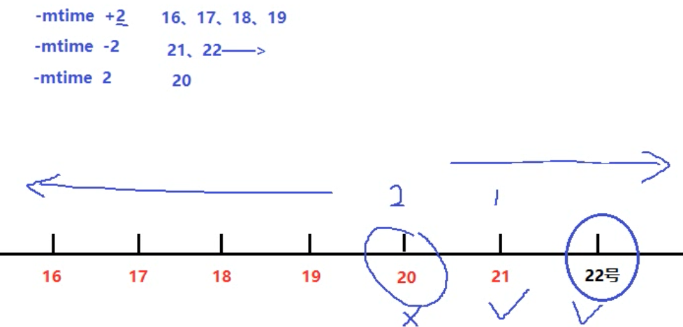
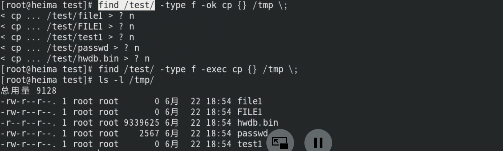

# 命令--查找命令

## whereis命令

`which 命令` ：找出命令的绝对路径

`whereis 命令` ：找出命令的路径以及文档手册信息


​		whereis是搜索系统命令的命令（像绕口令一样），也就是说，whereis命令不能搜索普通文件，而只能搜索系统命令。whereis命令的基本信息如下。

- 命令名称：whereis。
- 功能描述：查找二进制命令、源文件和帮助文档的命令。

```powershell
[root@heima ~]# whereis mkdir
mkdir: /usr/bin/mkdir /usr/share/man/man1/mkdir.1.gz /usr/share/man/man1p/mkdir.1p.gz
/usr/share/man/man2/mkdir.2.gz /usr/share/man/man3p/mkdir.3p.gz
```

## which命令

`which 命令` ：找出命令的绝对路径

`whereis 命令` ：找出命令的路径以及文档手册信息

which也是搜索系统命令的命令。

- 命令名称：which。
- 功能描述：列出命令的所在路径。

和whereis命令的区别在于：

- whereis命令可以在查找到二进制命令的同时，查找到帮助文档的位置；
- 而which命令在查找到二进制命令的同时，如果这个命令有别名，则还可以找到别名命令。

```powershell
[root@heima ~]# which mkdir
/usr/bin/mkdir
```


## locate命令

### 基本用法

locate命令才是可以按照文件名搜索普通文件的命令。

- 优点：按照数据库搜索，搜索速度快，消耗资源小。数据库位置`/var/lib/mlocate/mlocate.db`，
  			可以使用`updatedb`命令强制更新数据库。
- 缺点：只能按照文件名来搜索文件，而不能执行更复杂的搜索，比如按照权限、大小、修改时间等搜索文件。

locate命令的基本信息如下。

- 所在路径：/usr/bin/locate。
- 执行权限：所有用户。
- 功能描述：按照文件名搜索文件。


```powershell
[root@xiaoshaozi ~]# locate hello.sh 
locate: 无法执行 stat () `/var/lib/mlocate/mlocate.db': 没有那个文件或目录

[root@xiaoshaozi ~]# updatedb
[root@xiaoshaozi ~]# locate hello.sh
/root/hello.sh
```

### 配置文件

> `/etc/updatedb.conf`

```powershell
[jysp@jysp media]$ vim /etc/updatedb.conf
# 开启搜索限制，也就是让这个配置文件生效
PRUNE_BIND_MOUNTS = "yes"
# 在locate执行搜索时，禁止搜索这些文件系统类型
PRUNEFS = "9p afs anon_inodefs auto autofs bdev binfmt_misc cgroup cifs coda configfs cpuset debugfs devpts ecryptfs exofs fuse fuse.sshfs fusectl gfs gfs2 gpfs hugetlbfs inotifyfs iso9660 jffs2 lustre mqueue ncpfs nfs nfs4 nfsd pipefs proc ramfs rootfs rpc_pipefs securityfs selinuxfs sfs sockfs sysfs tmpfs ubifs udf usbfs fuse.glusterfs ceph fuse.ceph"
# 在locate执行搜索时，禁止搜索带有这些扩展名的文件
PRUNENAMES = ".git .hg .svn"
# 在locate执行搜索时，禁止搜索这些系统目录
PRUNEPATHS = "/afs /media /mnt /net /sfs /tmp /udev /var/cache/ccache /var/lib/yum/yumdb /var/spool/cups /var/spool/squid /var/tmp /var/lib/ceph"
```


## find命令

> 在目录中搜索文件。
>
> `find 命令`：**精确**查找，磁盘搜索，IO读写，cpu开销大


**根据需求**查找出来直接输出到屏幕

find 查找路径 选项 关键字

| 常见选项                      | 含义                     | 备注                            |
| ----------------------------- | ------------------------ | ------------------------------- |
| <font color=red>-name</font>  | 按照文件名查找文件       |                                 |
| <font color=red>-iname</font> | 按照文件名忽略大小写查找 |                                 |
| <font color=red>-size</font>  | 按照文件大小来查找       | +1M 大于1M -1M 小于1M 1M 等于1M |
| <font color=red>-type</font>  | 按照文件类型来查找       |                                 |
| <font color=red>-mtime</font> | 按文件修改时间来查找文件 | -n指n天以内，+n指n天以前        |
| -atime                        | 按文件访问时间来查       |                                 |
| -ctime                        | 按文件创建时间来查找文件 |                                 |
| -perm                         | 按照文件权限来查找文件   |                                 |
|                               |                          |                                 |

### 按照文件名搜索

```powershell
[root@localhost ~]# find 搜索路径 [选项] 搜索内容
选项：
	-name：	按照文件名搜索
	-iname：	按照文件名搜索，不区分文件名大小写
	-inum：	按照inode号搜索
```

> 文件名搜索示例

```powershell
[root@heima ~]# find /test -name "file1"
[root@heima ~]# find /test -iname "file1"
[root@heima ~]# find /etc -name "*.conf"
```


### 按照文件大小搜索

```powershell
[root@localhost ~]# find 搜索路径 [选项] 搜索内容

选项：
	-size [+|-]大小：按照指定大小搜索文件

注意：-size -1M 当文件中没有小于1M的文件的时候，会变成查找-size -1k
```

这里的“+”的意思是搜索比指定大小还要大的文件，“-”的意思是搜索比指定大小还要小的文件。

find命令的单位：

```powershell
[root@localhost ~]# man find

-size n[cwbkMG]
              File uses n units of space.  The following suffixes can be used:
			  #这是默认单位，如果单位为b或不写单位，则按照512Byte搜索
              `b'    for 512-byte blocks (this is the default if no suffix is used)
			  #搜索单位是c，按照字节搜索
              `c'    for bytes
			  #搜索单位是w，按照双字节（中文）搜索
              `w'    for two-byte words
			  #按照KB单位搜索，必须是小写的k
              `k'    for Kilobytes (units of 1024 bytes)
			  #按照MB单位搜索，必须是大写的M
              `M'    for Megabytes (units of 1048576 bytes)
			  #按照GB单位搜索，必须是大写的G
              `G'    for Gigabytes (units of 1073741824 bytes)

              The  size  does  not count indirect blocks, but it does count blocks in sparse files that are not actually allocated.  Bear in mind that the `%k' and
              `%b' format specifiers of -printf handle sparse files differently.  The `b' suffix always denotes 512-byte blocks and never 1 Kilobyte blocks,  which
              is different to the behaviour of -ls.

```

> 文件大小示例

```powershell
[root@heima test]# find . -type f -size +1M
[root@heima test]# find . -type f -size -1M
[root@heima test]# find . -type f -size -1024k
[root@heima test]# find . -type f -size 9M
```


### 按照修改时间搜索

Linux中的文件有访问时间（atime）、数据修改时间（mtime）、状态修改时间（ctime）这三个时间，我们也可以按照时间来搜索文件。

```powershell
[root@localhost ~]# find 搜索路径 [选项] 搜索内容
选项：
-atime [+|-]时间：按照文件访问时间搜索
-mtime [+|-]时间：按照文件数据修改时间搜索
-ctime [+|-]时间：按照文件状态修改时间搜索
```

这三个时间的区别我们在stat命令中已经解释过了，这里用mtime数据修改时间来举例，重点说说“[+-]”时间的含义。

- -5：代表5天内修改的文件。
- 5：代表前5～6天那一天修改的文件。
- +5：代表6天前修改的文件。

我们画一个时间轴，来解释一下，如图




```powershell
[root@heima test]# find ./ -type f -mtime +2
[root@heima test]# find ./ -type f -mtime -2
[root@heima test]# find ./ -type f -mtime 2
注意：这里的天数需要满24小时为一天的
find ./ -type f -daystart -mtime +2
```


### 按照权限搜索

命令格式。

```powershell
[root@localhost ~]# find 搜索路径 [选项] 搜索内容
选项：
    -perm  权限模式：查找文件权限刚好等于“权限模式”的文件
    -perm -权限模式：查找文件权限全部包含“权限模式”的文件
    -perm +权限模式：查找文件权限包含“权限模式”的任意一个权限的文件
```


### 按照所有者和所属组搜索

```powershell
[root@localhost ~]# find 搜索路径 [选项] 搜索内容
选项：
-uid 用户ID：	按照用户ID查找所有者是指定ID的文件
-gid 组ID：	 按照用户组ID查找所属组是指定ID的文件
-user 用户名：	按照用户名查找所有者是指定用户的文件
-group 组名：	按照组名查找所属组是指定用户组的文件
-nouser：	 查找没有所有者的文件
```

按照所有者和所属组搜索时，“-nouser”选项比较常用，主要用于查找垃圾文件。

只有一种情况例外，那就是外来文件。比如光盘和U盘中的文件如果是由Windows复制的，在Linux中查看就是没有所有者的文件；再比如手工源码包安装的文件，也有可能没有所有者

```powershell
[root@heima test]# find . -user heima -group heima -type f
一般省略 -a: find . -user heima -a -group heima -a -type f 代表同时满足
[root@heima test]# find . -type f -perm 644
```


### 按照文件类型搜索

```powershell
[root@localhost ~]# find 搜索路径 [选项] 搜索内容
选项：
	-type d：查找目录
	-type f：查找普通文件
	-type l：查找软链接文件
```

> 文件类型示例

```powershell
[root@heima ~]# find /usr/bin/ -type l		查找连接
[root@heima ~]# find /dev -type b			查找块设备
[root@heima ~]# cd /test
[root@heima test]# find . -type d			查找目录
[root@heima test]# find . -type f			查找文件
```


### 逻辑运算符

```powershell
[root@localhost ~]# find 搜索路径 [选项] 搜索内容
选项：
	-a：		and逻辑与
	-o：		or逻辑或
	-not：	not逻辑非
```

1）-a：and逻辑与

find命令也支持逻辑运算符选项，其中-a代表逻辑与运算，也就是-a的两个条件都成立，find搜索的结果才成立。举个例子：

```powershell
#在当前目录下搜索大于2KB，并且文件类型是普通文件的文件
[root@xiaoshaozi ~]# find . -size +2k -a -type f

[root@heima test]# find . -user heima -group heima -type f
一般省略 -a: find . -user heima -a -group heima -a -type f 代表同时满足
[root@heima test]# find . -type f -perm 644
```


2）-o：or逻辑或

-o选项代表逻辑或运算，也就是-o的两个条件只要其中一个成立，find命令就可以找到结果。例如：

```powershell
#在当前目录下搜索文件名要么是cangls的文件，要么是bols的文件
[root@xiaoshaozi ~]# find . -name cangels -o -name bols
```


3）-not：not逻辑非

-not是逻辑非，也就是取反的意思。举个例子：	

```powershell
#在当前目录下搜索文件名不是cangls的文件
[root@xiaoshaozi ~]# find . -not -name cangls
```


### 其他选项

**根据需求**查找出来后<font color=red>执行某个动作(命令)</font>

`find 路径 选项 关键字 动作`

| 常见动作 | 说明                                                         |
| -------- | ------------------------------------------------------------ |
| -exec    | 对查找到的文件<font color=red>直接</font>执行该参数后的shell命令 |
| -ok      | 对查找到的文件<font color=red>询问式</font>执行该参数后的shell命令 |
| -delete  | 删除查找到的文件                                             |
| -ls      | 列出查找到的文件,详细信息                                    |
| -print   | 打印出查找到的文件（默认选项）                               |
|          |                                                              |

1）-exec选项

这里我们主要讲解两个选项“-exec”和“-ok”，这两个选项的基本作用非常相似。我们先来看看“-exec”选项的格式。

```powershell
[root@localhost ~]# find 搜索路径 [选项] 搜索内容 -exec 命令2 {} \;
```

其次，这个选项的作用其实是把find命令的结果交给由“-exec”调用的命令2来处理。“{}”就代表find命令的查找结果。

2）-ok选项

“-ok”选项和“-exec”选项的作用基本一致，区别在于：“-exec”的命令2会直接处理，而不询问；“-ok”的命令2在处理前会先询问用户是否这样处理，在得到确认命令后，才会执行。

**举例说明：**

`-delete`


`-exec | -ok`

```powershell
语法结构：
注意：
1. -exec或者-ok后面写完命令必须以空格反斜杠\;结尾（ \;）
2. {}表示find命令所找出来的内容

find /test/ -type f -ok cp {} /tmp \;
```



