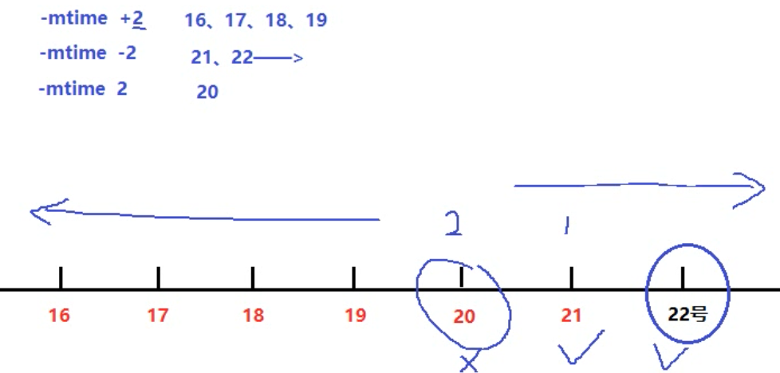
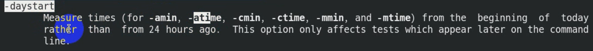
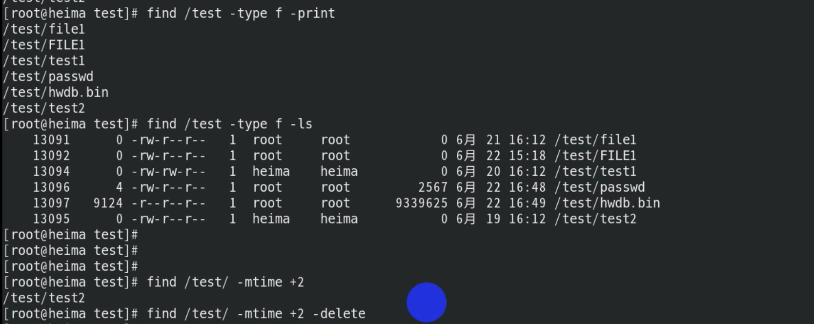
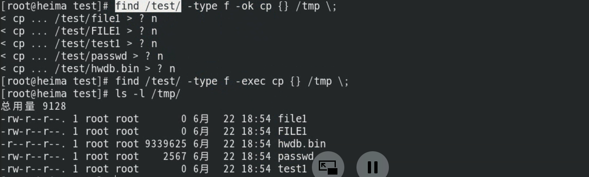

## 查找命令

### 1、 命令查找

Linux下一切皆文件！

`which 命令` ：找出命令的绝对路径

`whereis 命令` ：找出命令的路径以及文档手册信息

```powershell
[root@heima ~]# which mkdir
/usr/bin/mkdir

[root@heima ~]# whereis mkdir
mkdir: /usr/bin/mkdir /usr/share/man/man1/mkdir.1.gz /usr/share/man/man1p/mkdir.1p.gz
/usr/share/man/man2/mkdir.2.gz /usr/share/man/man3p/mkdir.3p.gz
```


### 2、文件查找(==find==)

`find 命令`：**精确**查找，磁盘搜索，IO读写，cpu开销大

#### 用法1：找出来输出到屏幕

**==根据需求==**查找出来直接输出到屏幕

find 查找路径 选项 关键字

| 常见选项   | 含义                     | 备注                            |
| ---------- | ------------------------ | ------------------------------- |
| ==-name==  | 按照文件名查找文件       |                                 |
| ==-iname== | 按照文件名忽略大小写查找 |                                 |
| ==-size==  | 按照文件大小来查找       | +1M 大于1M -1M 小于1M 1M 等于1M |
| ==-type==  | 按照文件类型来查找       |                                 |
| ==-mtime== | 按文件修改时间来查找文件 | -n指n天以内，+n指n天以前        |
| -atime     | 按文件访问时间来查       |                                 |
| -ctime     | 按文件创建时间来查找文件 |                                 |
| -perm      | 按照文件权限来查找文件   |                                 |
|            |                          |                                 |

```powershell
举例说明：

0）环境准备
# mkdir /test
# touch /test/file1
# touch /test/FILE1
# cp -a /home/heima/* /test/


1）根据文件名查找
[root@heima ~]# find /test -name "file1"
[root@heima ~]# find /test -iname "file1"
[root@heima ~]# find /etc -name "*.conf"


2）根据文件类型查找
[root@heima ~]# find /usr/bin/ -type l		查找连接
[root@heima ~]# find /dev -type b			查找块设备
[root@heima ~]# cd /test
[root@heima test]# find . -type d			查找目录
[root@heima test]# find . -type f			查找文件


3）根据文件大小查找
[root@heima test]# find . -type f -size +1M
[root@heima test]# find . -type f -size -1M
[root@heima test]# find . -type f -size -1024k
[root@heima test]# find . -type f -size 9M
注意：-size -1M 当文件中没有小于1M的文件的时候，会变成查找-size -1k


4）根据文件属性（权限，创建者和所属组）
[root@heima test]# find . -user heima -group heima -type f
一般省略 -a: find . -user heima -a -group heima -a -type f 代表同时满足
[root@heima test]# find . -type f -perm 644
```

==-mtime选项举例：==

按文件修改时间来查找文件





```powershell
[root@heima test]# find ./ -type f -mtime +2
[root@heima test]# find ./ -type f -mtime -2
[root@heima test]# find ./ -type f -mtime 2
注意：这里的天数需要满24小时为一天的
find ./ -type f -daystart -mtime +2
```


#### 用法2：找出来执行命令

**根据需求**查找出来后==执行某个动作(命令)==

`find 路径 选项 关键字 动作`

| 常见动作 | 说明                                            |
| -------- | ----------------------------------------------- |
| -exec    | 对查找到的文件==直接==执行该参数后的shell命令   |
| -ok      | 对查找到的文件==询问式==执行该参数后的shell命令 |
| -delete  | 删除查找到的文件                                |
| -ls      | 列出查找到的文件,详细信息                       |
| -print   | 打印出查找到的文件（默认选项）                  |
|          |                                                 |

**举例说明：**



```powershell
语法结构：
注意：
1. -exec或者-ok后面写完命令必须以空格反斜杠\;结尾（ \;）
2. {}表示find命令所找出来的内容

find /test/ -type f -ok cp {} /tmp \;
```



## 