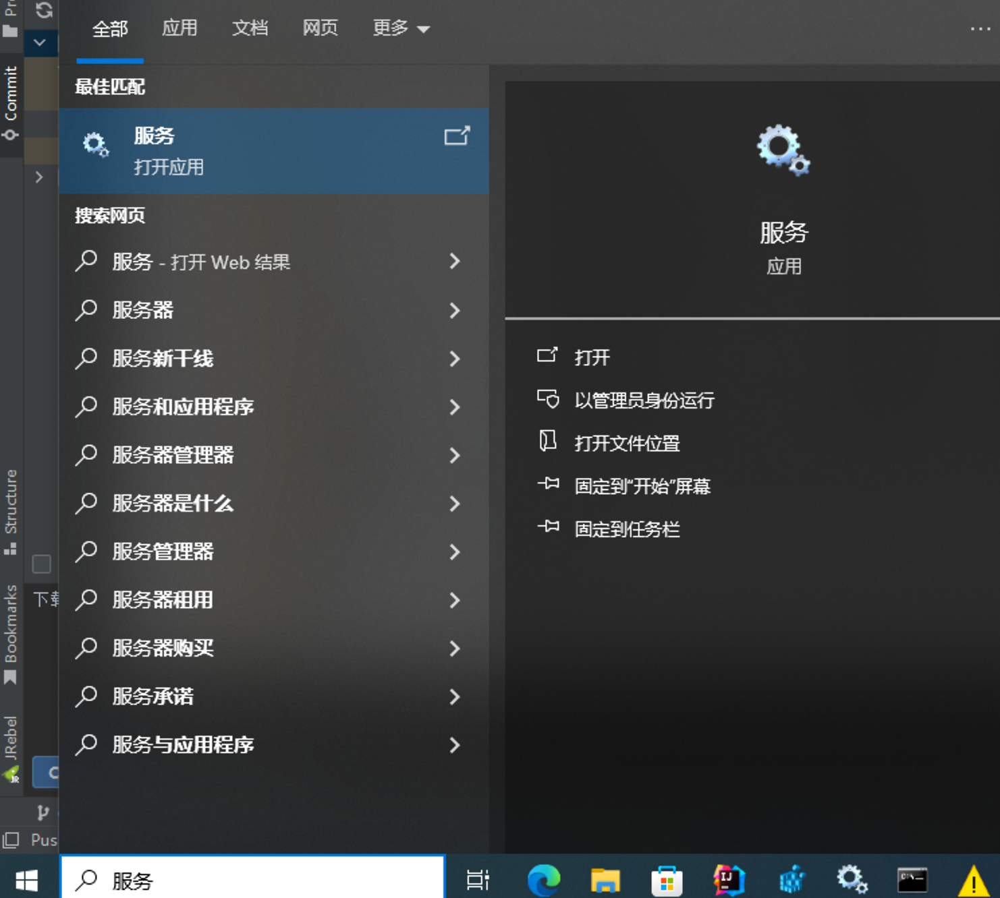
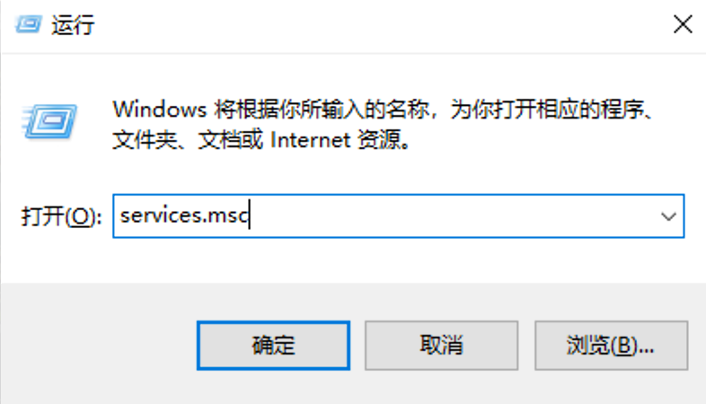
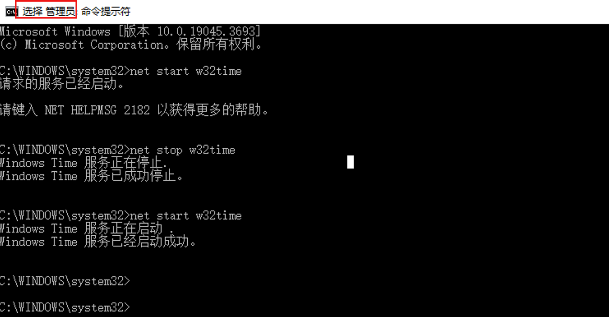
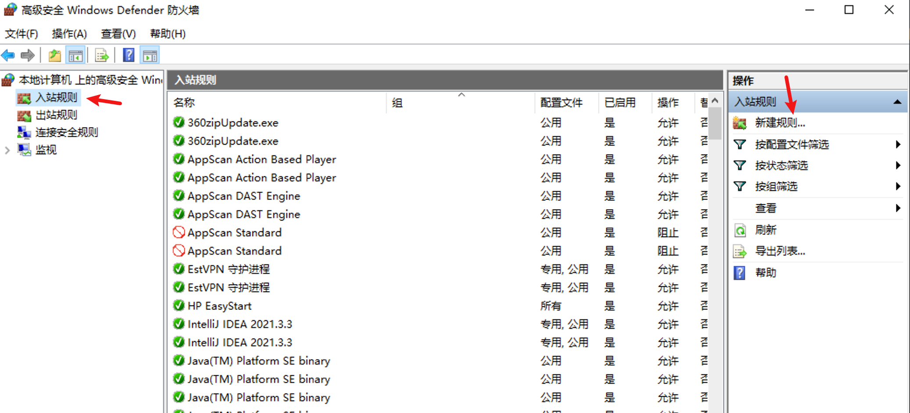
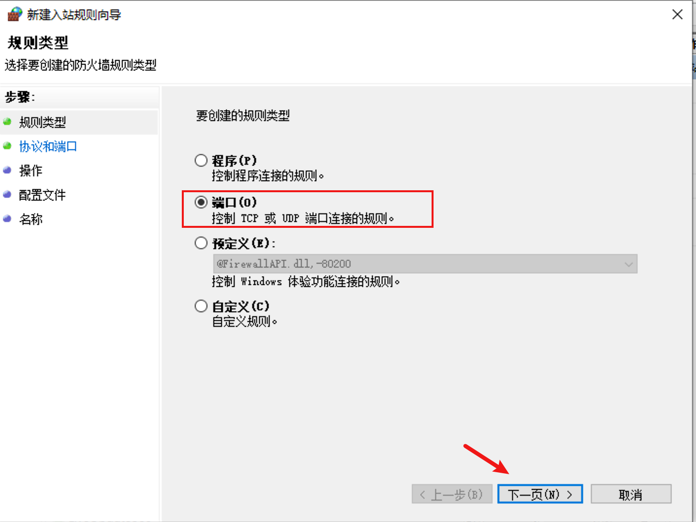
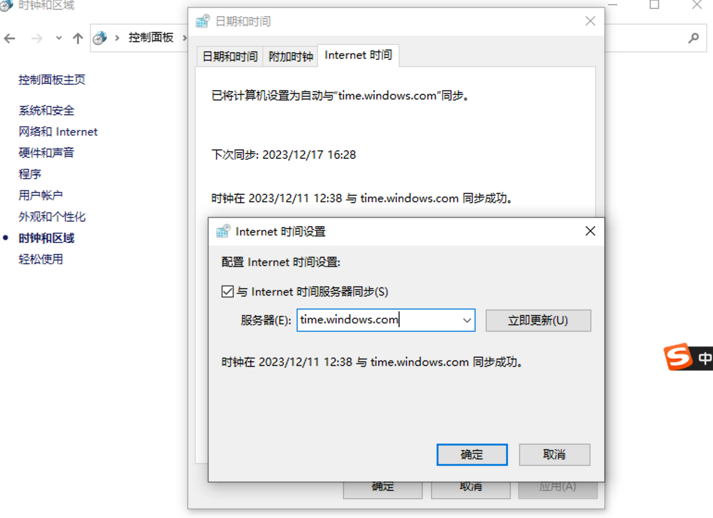
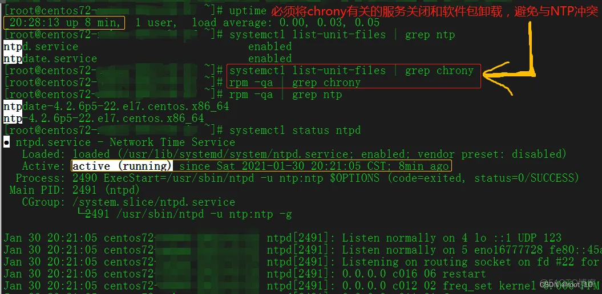
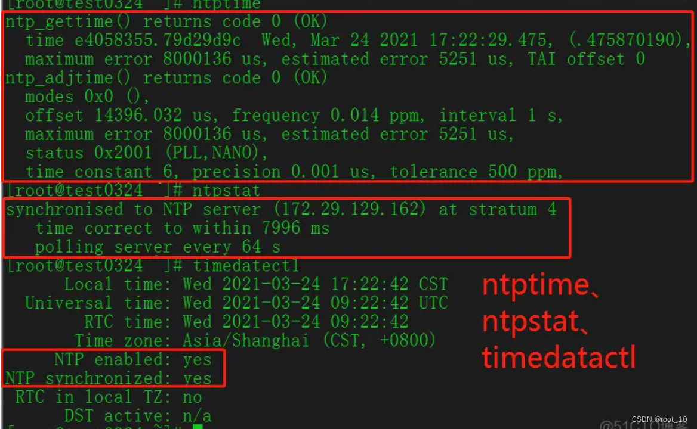
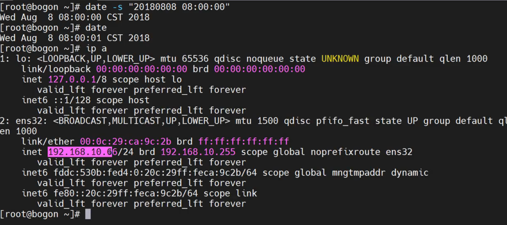

# 命令--时间日期

## 时区设置

在[Linux](https://so.csdn.net/so/search?q=Linux&spm=1001.2101.3001.7020)系统中，默认使用的是UTC时间。

即使在安装系统的时候，选择的时区是亚洲上海，Linux默认的BIOS时间（也称：硬件时间）也是[UTC时间](https://so.csdn.net/so/search?q=UTC时间&spm=1001.2101.3001.7020)。
在重启之后，系统时间会和硬件时间同步，如果两者不一致，会以硬件时间为标准进行时间的校准。所以，之前设置的时区和时间就失效了
北京时间比UTC时间早8小时，以2023年1月1日0000UTC为例，UTC时间是零点，北京时间为2023年1月1日早上8点整。

```powershell
# 查看当前系统时间
date

# 查看当前硬件时间
hwclock或clock

#查看当前系统时区
date -R


[root@jysp jysp]# date 
2023年 12月 15日 星期五 09:14:28 CST

[root@jysp jysp]# hwclock
2023年12月15日 星期五 09时12分57秒  -0.179492 秒

[jysp@jysp ~]$ date -R
Fri, 15 Dec 2023 09:12:23 +0800

```

### 图形化设置

CentOS7如何图形化设置时区？

这与图形化设置网络、设置主机名、设置新用户等，基本相同。过程简单，对于初学者比较友好。

#### 1.进入设置

点击【应用程序】->【系统工具】->【设置】选项


#### 2.找到时区

点击【详细信息】->【日期和时间】


#### 3.操作认证

点击【解锁】并输入密码进行【认证】

Centos7不需要认证，而Centos8和ubuntu 修改时区时需要认证。按要求认证即可。


#### 4.自动设置

开启【自动设置日期和时间】、【自动设置时区】选项

根据情况，可决定是否开启自动设置。


### tzselect

用tzselect设置时区采用人机交互的形式，十分方便。

命令中第一个字母t是时间time的简写;
命令中第二个字母z是区域zone的简写。

使用tzselect 设置时区，按照提示，一步步进行，没有难度。
按照提示一路选择: 5) asia —-> 9) china ——> 1) beijing
但成功设置后，会提示把时区变量作为全局变量添加到profile中


1.可以采用命令追加形式

    echo “export TZ='Asia/Shanghai'”  >>/etc/profile

2.可以采用vim 打开文件，在最后一行添加内容

    export  TZ='Asia/Shanghai'

保存，退出
完成对文件的修改后，并不能马上更改时区，仍然需要执行命令 source /etc/profile
当执行source命令时，系统会退出当前bash，并重新登录。
再重新查看时间与时区，已更新。


### timedatectl

timedatectl是一个命令行工具，它允许你查看或者修改系统的时间和日期。它在所有现代的基于 system 的 linux 系统中都可以使用。
timedatectl 打印当前时区信息
如果不带参数直接运行，会正常打印出时间信息。

timedatectl 查看可以设置的时区

    timedatectl list-timezones

带上list-timezones参数运行下，看到如下的结果：

上面的结果展示不全， 往下翻找可以看到 Asia/Shanghai 这一行。

不想全部看完，可按q退出查看。

timedatectl 设置时区

    timedatectl set-timezone Asia/Shanghai


### cp文件设置时区

cp文件设置时区

        cp /usr/share/zoneinfo/Asia/Shanghai /etc/localtime

这种方式也可以设置时间，但是还是建议使用timedatectl工具。 因为timedatectl工具屏蔽了各个linux的差异性。vim修改时区文件


### vim修改时区文件

我们如何确定自己的时区是正确的？
时区文件默认的是：/etc/localtime
下面命令会把我们系统的时间还有时区显示出来


原文链接：https://blog.csdn.net/qq_36142959/article/details/132719285

## 时间命令

### 1、date命令（重点）

`date` :**打印**或者**设置**当前系统日期和时间

`date --help` 自己先求帮助

```powershell
用法：date [选项]... [+格式]
　或：date [-u|--utc|--universal] [MMDDhhmm[[CC]YY][.ss]]
Display the current time in the given FORMAT, or set the system date.
 
Mandatory arguments to long options are mandatory for short options too.
  -d, --date=STRING         display time described by STRING, not 'now'
  -f, --file=DATEFILE       like --date once for each line of DATEFILE
  -I[TIMESPEC], --iso-8601[=TIMESPEC]  output date/time in ISO 8601 format.
                            TIMESPEC='date' for date only (the default),
                            'hours', 'minutes', 'seconds', or 'ns' for date
                            and time to the indicated precision.
  -r, --reference=文件          显示文件指定文件的最后修改时间
  -R, --rfc-2822                以RFC 2822格式输出日期和时间
                                例如：2006年8月7日，星期一 12:34:56 -0600
      --rfc-3339=TIMESPEC   output date and time in RFC 3339 format.
                            TIMESPEC='date', 'seconds', or 'ns' for
                            date and time to the indicated precision.
                            Date and time components are separated by
                            a single space: 2006-08-07 12:34:56-06:00
  -s, --set=STRING          set time described by STRING
  -u, --utc, --universal    print or set Coordinated Universal Time (UTC)
      --help            显示此帮助信息并退出
      --version         显示版本信息并退出

给定的格式FORMAT 控制着输出，解释序列如下：

  %%    一个文字的 %
  %a    当前locale 的星期名缩写(例如： 日，代表星期日)
  %A    当前locale 的星期名全称 (如：星期日)
  %b    当前locale 的月名缩写 (如：一，代表一月)
  %B    当前locale 的月名全称 (如：一月)
  %c    当前locale 的日期和时间 (如：2005年3月3日 星期四 23:05:25)
  %C    世纪；比如 %Y，通常为省略当前年份的后两位数字(例如：20)
  %d    按月计的日期(例如：01)
  %D    按月计的日期；等于%m/%d/%y
  %e    按月计的日期，添加空格，等于%_d
  %F    完整日期格式，等价于 %Y-%m-%d
  %g    ISO-8601 格式年份的最后两位 (参见%G)
  %G    ISO-8601 格式年份 (参见%V)，一般只和 %V 结合使用
  %h    等于%b
  %H    小时(00-23)
  %I    小时(00-12)
  %j    按年计的日期(001-366)
  %k   hour, space padded ( 0..23); same as %_H
  %l   hour, space padded ( 1..12); same as %_I
  %m   month (01..12)
  %M   minute (00..59)
  %n    换行
  %N    纳秒(000000000-999999999)
  %p    当前locale 下的"上午"或者"下午"，未知时输出为空
  %P    与%p 类似，但是输出小写字母
  %r    当前locale 下的 12 小时时钟时间 (如：11:11:04 下午)
  %R    24 小时时间的时和分，等价于 %H:%M
  %s    自UTC 时间 1970-01-01 00:00:00 以来所经过的秒数
  %S    秒(00-60)
  %t    输出制表符 Tab
  %T    时间，等于%H:%M:%S
  %u    星期，1 代表星期一
  %U    一年中的第几周，以周日为每星期第一天(00-53)
  %V    ISO-8601 格式规范下的一年中第几周，以周一为每星期第一天(01-53)
  %w    一星期中的第几日(0-6)，0 代表周一
  %W    一年中的第几周，以周一为每星期第一天(00-53)
  %x    当前locale 下的日期描述 (如：12/31/99)
  %X    当前locale 下的时间描述 (如：23:13:48)
  %y    年份最后两位数位 (00-99)
  %Y    年份
  %z +hhmm              数字时区(例如，-0400)
  %:z +hh:mm            数字时区(例如，-04:00)
  %::z +hh:mm:ss        数字时区(例如，-04:00:00)
  %:::z                 数字时区带有必要的精度 (例如，-04，+05:30)
  %Z                    按字母表排序的时区缩写 (例如，EDT)

默认情况下，日期的数字区域以0 填充。
The following optional flags may follow '%':

  -  (hyphen) do not pad the field
  _  (underscore) pad with spaces
  0  (zero) pad with zeros
  ^  use upper case if possible
  #  use opposite case if possible

在任何标记之后还允许一个可选的域宽度指定，它是一个十进制数字。
作为一个可选的修饰声明，它可以是E，在可能的情况下使用本地环境关联的
表示方式；或者是O，在可能的情况下使用本地环境关联的数字符号。

Examples:
Convert seconds since the epoch (1970-01-01 UTC) to a date
  $ date --date='@2147483647'

Show the time on the west coast of the US (use tzselect(1) to find TZ)
  $ TZ='America/Los_Angeles' date

Show the local time for 9AM next Friday on the west coast of the US
  $ date --date='TZ="America/Los_Angeles" 09:00 next Fri'

GNU coreutils online help: <http://www.gnu.org/software/coreutils/>
请向<http://translationproject.org/team/zh_CN.html> 报告date 的翻译错误
要获取完整文档，请运行：info coreutils 'date invocation'
```


#### ① 打印日期或时间

```powershell
常用格式：
    获取系统当前时间
    yyyy-mm-dd
	    date +%F
    	date +%Y-%m-%d

    yyyy-mm-dd HH:mm:ss
	    date +'%F %T'
    	date +'%Y-%m-%d %H:%M:%S'

	获取非当前时间 days,months,years
	yyyy-mm-dd
		date -d '+3days' +'%F %T'
		date --date='3days' +'%F %T'
		
		date -d '-3days' +'%F %T'
		date -d '3days ago' +'%F %T'
		date --date='-3days' +'%F %T'


打印系统当前日期或时间
[root@heima ~]# date
[root@heima ~]# date +%D
[root@heima ~]# date +%F
[root@heima ~]# date +%Y-%m-%d
[root@heima ~]# date +%T
[root@heima ~]# date +%X
[root@heima ~]# date +'%F %X'
[root@heima ~]# date +%c
打印系统非当前日期或时间
[root@heima ~]# date -d '+3days' +%F
[root@heima ~]# date -d '-3days' +%F
[root@heima ~]# date -d '3days' +%F
[root@heima ~]# date -d '3days ago' +%F
[root@heima ~]# date --date='30days' +%F


[jysp@jysp ~]$ date +'%Y %m %d'
2023 11 01
[jysp@jysp ~]$ date +%T
10:32:06
[jysp@jysp ~]$ date +%X
10时32分14秒
[jysp@jysp ~]$ date +%F %X
date: 额外的操作数 "%X"
Try 'date --help' for more information.
[jysp@jysp ~]$ date +'%F %X'
2023-11-01 10时32分30秒
[jysp@jysp ~]$ date +%c
2023年11月01日 星期三 10时33分10秒
[jysp@jysp ~]$ date -d
date：选项需要一个参数 -- d
Try 'date --help' for more information.
[jysp@jysp ~]$ date -d '+3days' +%F
2023-11-04
[jysp@jysp ~]$ date -d '+3days' +%c
2023年11月04日 星期六 10时34分06秒
[jysp@jysp ~]$ date -d '-3days' +%F
2023-10-29
[jysp@jysp ~]$ date -d '3days ago' +%F
2023-10-29
[jysp@jysp ~]$ date -d '3days' +%F
2023-11-04
[jysp@jysp ~]$ date --date='30days' +%F
2023-12-01
[jysp@jysp ~]$ 
```


#### ② 设置系统日期或时间

```powershell
选项：-s 设置当前系统时间，只有root权限才能设置，其他只能查看。
date -s 20200523 设置成20100523，这样会把具体时间设置成空00:00:00
date -s "01:01:01 2020-05-2" 这样可以设置全部时间
date -s "01:01:01 20200523" 这样可以设置全部时间
date -s "2020-05-23 01:01:01" 这样可以设置全部时间
date -s "20200523 01:01:01" 这样可以设置全部时间

注意：
红帽8，设置为过去的时间，过段时间会被重置为当前时间
```


### 2、hwclock命令

#### ③ 系统时间同步硬件时间

`hwclock` :查看并且设置硬件时间

```powershell
选项：
# 设置系统时间：从硬件时间同步到系统时间
-s, --hctosys set the system time from the RTC
# 设置硬件时间：从系统时间同步到硬件时间
-w, --systohc set the RTC from the system time
# 查看硬件时间
-l, --localtime the RTC timescale is Local


举例说明：
[root@heima ~]# hwclock --hctosys
[root@heima ~]# hwclock
2019-06-23 18:44:10.377920+08:00

[root@heima ~]# date
2019年 06月 23日 星期日 18:44:21 CST
[root@heima ~]# date -s "20221010 12:12:12"
2022年 10月 10日 星期一 12:12:12 CST
[root@heima ~]# date
2022年 10月 10日 星期一 12:12:14 CST
[root@heima ~]# hwclock
2019-06-23 18:45:01.368135+08:00
[root@heima ~]# hwclock --systohc
[root@heima ~]# hwclock
2022-10-10 12:12:43.179274+08:00
```

### 3、timedatectl命令

`timedatectl`

查看当前时间、时区、NTP服务状态
设置系统时间、硬件时间、时区

> ntp服务

```powershell
# 从7开始就有
timedatectl -h 设置和查看系统的时间和日期（设置时区以及开启或关闭ntp服务）

# 查看当前时间
[jysp@jysp ~]$ timedatectl status
      Local time: 三 2023-11-01 10:47:08 CST
  Universal time: 三 2023-11-01 02:47:08 UTC
        RTC time: 三 2023-11-01 02:47:42
       Time zone: Asia/Shanghai (CST, +0800)
     NTP enabled: yes
NTP synchronized: no
 RTC in local TZ: no
      DST active: n/a


# 关闭NTP同步
timedatectl set-ntp no


# 设置时间:系统时间、硬件时间
timedatectl set-time 2020-10-10
timedatectl set-time 11:11:11
timedatectl list-timezones
timedatectl set-timezone xxx


# 同步当前时间
# 6版本中
ntpdate

# 8版本中
timedatectl set-ntp yes
timedatectl status
chronyc makestep
```

 

### 4、cal命令（了解）

`cal` :查看日历

```powershell
用法：
 cal [选项] [[[日] 月] 年]

选项：
 -1, --one        只显示当前月份(默认)
 -3, --three      显示上个月、当月和下个月
 -s, --sunday     周日作为一周第一天
 -m, --monday     周一用为一周第一天
 -j, --julian     输出儒略日
 -y, --year       输出整年
 -V, --version    显示版本信息并退出
 -h, --help       显示此帮助并退出

```

```powershell
cal 或者 cal -1 		表示直接输出当前月份的日历
cal -3 				 表示输出上一个月+本月+下个月的日历
cal -y 年份 			表示输出某一个年份的日历
```


### 5、tzselector（了解）

用tzselect设置时区采用人机交互的形式，十分方便。

命令中第一个字母t是时间time的简写;
命令中第二个字母z是区域zone的简写。

使用tzselect 设置时区，按照提示，一步步进行，没有难度。
按照提示一路选择: 5) asia —-> 9) china ——> 1) beijing

### 综合应用

#### ④ 应用案例

> 有时候我们需要用到当前的系统时间，如何调用？比如以当前系统日期命名创建目录或文件

```powershell
2020-10-10.log.tar.gz
2020-10-11.log.tar.gz
$()：括号里面的命令优先执行 	date +%F 		2019-06-23
`` ：引号里面的命令优先执行，不允许嵌套

创建目录和文件，以当前系统日期命名
[root@heima ~]# mkdir $(date +%F)
[root@heima ~]# touch $(date -d '+3days' +%Y%m%d).log
```


## 时间同步NTP

### 1、了解时间同步的重要性

由于IT系统中，准确的计时非常重要，有很多种原因需要准确计时，如

在网络传输中，数据包和日志需要准确的时间戳

各种应用程序中，如订单信息，交易信息等都需要准确的时间戳

在Linux系统中， Network Time Protocol (NTP)，NTP协议由在用户空间中运行的守护程序实现，即ntp和chrony。

> 红帽6以前使用ntp，红帽7ntp和chrony，红帽8 chrony


### 2、了解时间同步服务器


**查看可以提供时间同步的服务器：**

http://www.ntp.org.cn/pool


### 3、chrony如何同步自己系统时间

> 需要联网

（1）方式一：自动同步

```powershell
# 手动设置时间
date -s "2020-10-10 10:10:10"

# 查看chrony安装包
yum list|grep chrony

# 查看软件包，配置文件位置
rpm -qc chrony
```


```powershell
# 重启服务
systemctl restart chronyd.service
systemctl status chronyd.service

# 修改时间，测试自动同步
date -s "2020-10-10 10:10:10"
```

（2）方式二：手动临时同步

临时指定ntp服务器同步

```powershell
systemctl status chronyd.service
systemctl stop chronyd.service

chronyd -q "server cn.ntp.org.cn iburst"
```

### 4、chrony搭建时间同步服务

#### ㈠ 了解RHEL7和RHEL8区别

- 在RHEL7中，用户可以在**ntp**和**chrony**之间进行选择，以确保准确的计时。

- 在RHEL8中，不再支持**ntp**,使用**chronyd**守护进程来实现NTP,默认已启用,从chrony软件包获得。

- chrony和ntp之间的差异

  - ntpd服务器在控制客户端访问方式上默认响应来自任何地址的请求，相对不安全chronyd默认不允许访问，要想提供时间同步服务端需要在allow中指定

  - ntpd 和 chronyd 在系统时钟校正方面的默认行为也不同。

  - 客户端同步方式有差异

- 还有很多不同可以参考官方网站：https://chrony.tuxfamily.org/comparison.html

**总结：**

**chrony**在各种条件下表现良好，包括间歇性网络连接，高度拥挤的网络，温度变化（普通计算机时钟对温度敏感），以及不能连续运行或在虚拟机上运行的系统。

#### ㈡ RHEL8配置时间同步服务

1. 关闭防火墙和selinux（实验）

2. 配置软件仓库

3. 软件三部曲

   - 安装软件

   - 确认软件是否成功安装

   - 查看软件的文件列表（配置文件、程序本身、man手册）

4. 了解配置文件（man 5 xxx.conf）

5. 根据需求通过修改配置文件来完成服务搭建

6. 启动服务，开机自启动

7. 测试验证

- 时间同步服务器端

  ```powershell
  # 防火墙
  systemctl status firewalld.service
  # selinux
  getenforce
  # 软件仓库
  dnf repolist
  # 查看软件包
  rpm -q chrony
  # 查看配置文件
  rpm -ql chrony
  
  
  
  # vim /etc/chrony.conf
  #自己本身向谁来同步时间
  pool cn.ntp.org.cn iburst
  #允许哪些客户端来同步,192.168.159网段的ip/子网掩码24位
  allow 192.168.159.0/24
  
  重启服务
  systemctl restart chronyd.service
  
  查看服务状态
  systemctl status chronyd.service
  
  查看udp端口状态
  netstat -nlup|grep chronyd
  ```

- 客户端

  修改配置文件

  

  

  ```powershell
  重启服务
  systemctl restart chronyd.service
  
  查看当前客户端使用的源
  chronyc sources
  chronyc sourcestats
  
  [root@client ~]# chronyc sources
  210 Number of sources = 1
  MS Name/IP address Stratum Poll Reach LastRx Last sample
  ===============================================================================
  ^? 192.168.159.100 3 6 37 5 +10766h[+10766h] +/- 3872us
  
  手动同步时间，官方不建议使用
  [root@client ~]# chronyc makestep
  200 OK
  ```


> *代办当前在使用的源


### 5、windows开启ntp服务功能

（1）打开搜索`注册表`或`win+R 输入regedit`


 （2）设定授权时间服务器

注册表路径： HKEY_LOCAL_MACHINE\SYSTEM\CurrentControlSet\Services\W32Time\Config

修改 AnnounceFlags 数a改为 5


HKEY_LOCAL_MACHINE\SYSTEM\CurrentControlSet\Services\W32Time\TimeProviders\NtpServer

修改 Enabled 数值0修改为 1


（3）搜索`服务`或 `win+R 输入services.msc `打开服务面板






（4）启动服务


服务的启停，需要使用管理员运行

- net start w32time

- net stop w32time

```
Microsoft Windows [版本 10.0.19045.3693]
(c) Microsoft Corporation。保留所有权利。

C:\WINDOWS\system32>net start w32time
请求的服务已经启动。

请键入 NET HELPMSG 2182 以获得更多的帮助。


C:\WINDOWS\system32>net stop w32time
Windows Time 服务正在停止.
Windows Time 服务已成功停止。


C:\WINDOWS\system32>net start w32time
Windows Time 服务正在启动 .
Windows Time 服务已经启动成功。
```




本机测试

```
C:\Users\miyufeng>w32tm /stripchart /computer:127.0.0.1
正在跟踪 127.0.0.1 [127.0.0.1:123]。
当前时间是 2023/12/17 15:23:45。
15:23:45, d:+00.0013197s o:+00.0004149s  [                           *                           ]
15:23:47, d:+00.0006835s o:+00.0002398s  [                           *                           ]
15:23:49, d:+00.0004796s o:+00.0000808s  [                           *                           ]
```


（5）防火墙配置








（6）局域网内设备时间同步测试




### 6、ntp工具

#### ntp客户端

1、安装ntp和[ntpdate](https://so.csdn.net/so/search?q=ntpdate&spm=1001.2101.3001.7020)两个rpm包。

使用yum install ntp、yum install ntpdate命令执行安装操作（本次省略）

2、配置ntp客户端文件【/etc/ntp.conf】中的server项, 只保留server的有效行（默认有3-4行server有效行去向公网同步时间，需注释掉）。如

```shell
server 172.29.12.120  perfer      #提供ntp-server的主机地址
server  172.29.120.12 perfer  (iburst）    #提供ntp-server的主机地址
```

\#restrict default kod nomodify notrap nopeer noquery 注释此行内容  作为ntp服务器可注释掉（取消默认不行其他主机连接同步时间）

server x.x.x.x iburst  同步时间服务ip  客户端只是配这个就可以

3、启动ntpd服务、并添加至开机启动项。如

启动服务

```shell
systemctl  start  ntpd        #启动ntpd服务
systemctl  start  ntpdate
systemctl enable  ntpd        #将ntpd添加到开机启动项
systemctl enable  ntpdate
systemctl is-enabled ntpd        #查看是否在开机启动项
systemctl is-enabled ntpdate
systemctl list-unit-files | grep ntp     #查看是否在开机启动项
systemctl status ntpd                     #查看ntpd服务的状态
```

4、验证

```shell
 ntpq -p           #查看该主机使用的ntp-server情况和同步延时等信息；
 timedatectl      #查看ntpd服务或chronyd服务是否生效。
                  #只有centos7、redhat7、ubuntu14等以上（含）才有该命令；
```

5、其他配置（或添加时间同步的计划任务）
使用ntpdate命令也可以执行[ntp时间同步](https://so.csdn.net/so/search?q=ntp时间同步&spm=1001.2101.3001.7020)，不需要ntp客户的ntpd服务。如

```shell
ntpdate 172.29.120.12     #向172.29.120.12的ntpserver主机同步本地系统时间。
ntpdate -u 172.29.120.12  ##同上，-u参数是可以在客户端ntpd服务启动时同时执行的命令。
```

计划任务中的时间同步，同样的效果。也可以和客户端的ntpd服务同时存在。

```shell
crontab -l
0 0 * * 0 /usr/sbin/ntpdate -u 172.29.120.12 || /usr/sbin/ntpdate -u 172.29.12.120
```


查看服务状态 ntpstat ntptime timedatectl 三个命令看状态


CentOS7下使用NTP遇到的问题
问题1、在CentOS7下使用NTP时，客户端ntpd服务添加到开机启动项中了，但主机系统启动后ntpd服务还是停止状态（dead），无法正常启动。
解决以上现象有两种方法 ，本人常用方法一的操作：
方法一：
1.通过命令 systemctl enable ntpd 设置NTP服务开机自启动。
2.重启虚拟机后查看 服务运行状态 systemctl status ntpd ，发现服务并没有成功启动。
3.查看chrony是否被设置为开机自启动。通过指令 systemctl is-enabled chronyd
或systemctl list-unit-files | grep chrony 查看，发现这个服务已经被设置为开机自启动所以导致NTP服务的自启动失败。
4.所以要把 chrony 的自启动去掉。执行指令 systemctl disable chronyd 。
5.重启虚拟机， 执行 systemctl status ntpd ，问题解决。
systemctl list-unit-files|grep ntpd
systemctl list-unit-files|grep chrony


方法二：
需要开机自启动某服务，第一个想到的当然是开机启动自定义脚本。
在Centos之前版本只要在 /etc/rc.d/rc.local 文件中加入 启动服务的命令，当虚拟机重启时就会执行该文件中的命令，服务也就启动了。但是但Centos7版本，这个文件的权限被降低了，所以当你打开这个文件时，注释中很友好的提示让你给这个文件赋权，以确保它有可执行权限。chmod +x /etc/rc.d/rc.local 。
所以只要把指令写到这个文件中，就可以在开机时启动服务或者让虚拟机做其它事情。
chmod +x /etc/rc.d/rc.local
echo “systemctl start ntpd” >> !$


问题2、ntpdate命令执行报错，提示ntpd服务已经存在（ntpdate：the NTP socket is in use, exiting）
报错的原因是因为客户端有ntpd服务在运行。因此需要继续执行，必须加-u参数，如
update -u 172.29.120.12


问题3、启动了ntpd服务，却未执行过同步时间操作。
需要检查ntpd服务是否生效、并应用是否也生效了。如


查看状态 ntpstat ntptime timedatectl




1、npq -p 执行结果的参数解释


ntpq -p命令列出了所有作为时钟源校正过本地NTP服务器时钟上层NTP服务器的列表，每一列的含义分别如下：
remote：响应请求的NTP服务器的名称（IP地址或域名），带“”的表示本地NTP服务器与该服务器同步
refid：远程NTP服务器使用的上一级ntp服务器的IP地址
st：远程NTP服务器的级别，由于NTP是层级结构，有顶端的服务器，多层的Relay Server再到客户端。所以服务器从高到低，级别可以设定为1~16级。为了减缓负荷和网络堵塞，原则上应该避免直接连接到级别为1的服务器。
t：本地NTP服务器与远程NTP服务器的通信方式。u：单播；b：广播；I：本地
when：上次成功请求后到现在的秒数
poll：本地NTP服务器与远程NTP服务器同步的时间间隔。
reach：这是一个八进制的值，用来测试衡量前八次查询是否成功和服务器连接。377表示都成功，0表示不成功
delay：网络延时，单位为微秒（μs）
offset：本地NTP服务器与远程NTP服务器的时间偏移，单位为毫秒（ms）。offset越接近于0，主机与NTP服务器的时间越接近
jitter：查询偏差的分布值，用于表示远程NTP的网络延时是否稳定，单位为微秒（μs）*


2、timedatectl 命令的讲解
timedatectl输出解析


1.1.Local time
本地时间，初始值来自于RTC，由内核维护，系统启动之后和RTC就没有关系，通常等于RTC+时区值（如上图的本地时间=RTC+8）

1.2.Universal time
系统时间永远是UTC，在应用程序使用的时候转换为本地时间

1.3.RTC（real-time clock）time
指硬件时间，一般是主板上的特殊电路，专用用于记录时间，有电池供电，不受服务器和操作系统的开启关闭影响。也称作BIOS时间。
需要注意的是：当/etc/sysconfig/clock 文件中 UTC=true时， BIOS 使用UTC时间； UTC=false时， BIOS 使用本地时间。
hwclock --localtime #显示 BIOS 中实际的时间
hwclock --systohc #根据系统时间设置硬件时间

1.4.Time zone
本地时区，即服务器所在的时区，在中国通常使用Asia/Shanghai
timedatectl set-timezone “Asia/Shanghai” #设置时区为上海

1.5.NTP enable
状态为“yes”,表示开启NTP同步。
网络时间协议，英文名称：Network Time Protocol（NTP）是用来使计算机时间同步化的一种协议，它可以使计算机对其服务器或时钟源（如石英钟，GPS等等)做同步化，它可以提供高精准度的时间校正。
timedatectl set-ntp true #开启ntp同步
timedatectl set-ntp false #禁止ntp同步

1.6.NTP synchronized
为“yes”,表示NTP同步完成。

1.7.RTC in local TZ
设置RTC时间，为"no"表示未设置
timedatectl set-local-rtc 1 #将RTC设置为本地时间
timedatectl set-local-rtc 0 #将RTC设置为UTC

2.2、timedatectl常用命令
timedatectl set-time 15:58:30 #只设置时间
timedatectl set-time 20151120 #只设置日期
timedatectl set-time ‘16:10:40 2015-11-20’ #设置时间和日期





