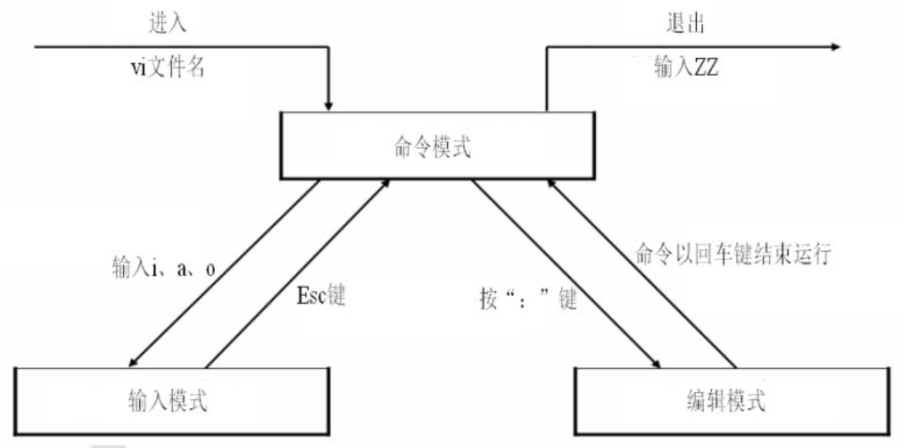
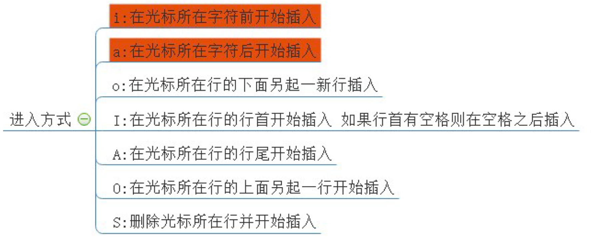
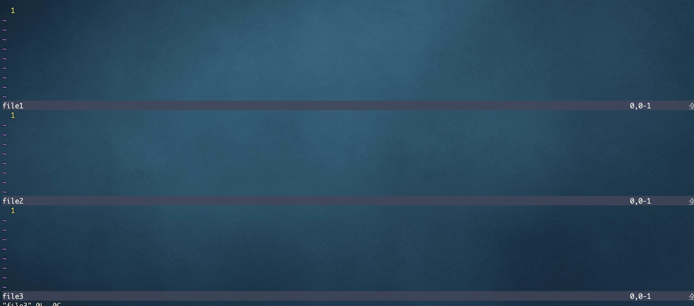

# vim

- Linux平台下的**文本编辑器：** emacs、nano、gedit、<font color=red>**vi**、**vim**</font>

vi（visual editor）编辑器通常被简称为vi，它是Linux和Unix系统上最基本的文本编辑器，类似于Windows 系统下的记事本。学会它后，我们将在Linux 的世界里游刃有余。

- 为什么要学习vim？

  1. 所有的Unix like系统都会**内置**vi文本编辑器，其他的文本编辑器则不一定会存在

  2. 很多软件的编辑接口都会主动调用vi

  3. vim具有<font color=red>程序编辑</font>的能力，可以主动以字体颜色辨别语法的正确性，方便程序设计

  4. 程序简单，编辑速度快

  5. vim是vi的升级版

## vim工作模式

vim工作在三种模式之下：



命令模式：是主要使用快捷键的模式，是我们后面学习的重点。命令模式想要进入输入模式，可以使用以下的方式：



输入模式：主要用于文本编辑，和记事本类似，输入数据就好。

末行模式（编辑模式）：

```
:w				保存不退出
	:w 新文件名	 文件另存为
:q				不保存退出
:wq				保存退出
:!				强制
	:q!			强制不保存退出，用于修改文件之后，不保存数据退出。
	:wq!		强制保存退出，当文件的所有者或者root用户，对文件没有写权限的时候，强制写入数据使用
:x				在文件没有修改的情况下，表示直接退出（等价于:q），在文件修改的情况下等价于（:wq）
```


## 1、命令行模式

问：命令行可以干什么？

答：可以进行一些基本的</font>复制、删除、跳转、撤销、移动</font>等操作


| 命令     | 含义                                        | 备注                             |
| -------- | ------------------------------------------- | -------------------------------- |
| yy       | 复制光标所在行                              | 3yy表示复制3行                   |
| p(小写p) | 光标所在行后面粘贴                          |                                  |
| P(大写P) | 光标所在行前面粘贴                          |                                  |
| gg       | 光标快速跳到文件首行，并且定位到首字符      | 3gg表示快速跳到文件第3行行首字符 |
| G        | 光标快速跳到文件尾行，并且定位到首字符      |                                  |
| home     | 跳转到行首                                  | Shift+6 即 ^ 符号表示行首        |
| end      | 跳转到行尾                                  | Shitf+4 即 $ 符号表示行尾        |
| dd       | 删除光标所在行                              | 3dd表示删除3行（包括光标所在行   |
| d^       | 从光标位置删至行首，不包括光标位            |                                  |
| d$       | 从光标位置删至行尾，包括光标位，与D作用相同 |                                  |
| dG       | 删除光标所在行以及下面所有行                |                                  |
| dgg      | 删除光标所在行以及上面所有行                |                                  |
| x(小写)  | 删除光标所在字符后面一个字符，3x删除3个字符 | 类似于windows下的delete键        |
| X(大写)  | 删除光标所在字符前面一个字符，3X删除3个字符 | 类似windows下的backspace键       |
| u        | 撤销操作                                    | ctrl+r 取消撤销                  |
|          |                                             |                                  |


### 移动光标

##### 1）上下左右移动光标

```
h	j	k	l
←	↓	↑	→
```

2）把光标移动到文件头或尾

```
gg	文件头
G	文件尾
```

3）移动到行首或行尾

```
^	行首
$	行尾
```

4）移动到指定行

```
:n	到第n行
```


### 删除或剪切

1）删除字母

```
x	删除单个字母
nx	删除n个字母


n是数字，如果打算从光标位置删除连续的10个字母，可以使用“10x”即可。
删除字母并不符合使用习惯，我们更习惯在编辑模式中，用“Backspace”键删除字母。
```

2）删除整行或剪切

```
dd		删除单行
ndd		删除多行
:n1,n2d	删除指定范围的行

删除整行或多行，这是比较常用的删除方法。
这里的dd快捷键既是删除，也是剪切。
删除内容放入了剪切板，如果不粘贴就是删除，如果粘贴就是剪切。粘贴方法如下：

p		 粘贴到光标后
P(大)	粘贴到光标前


:1,8d 	删掉文本的1到8行
```

3）从光标所在行删除到文件尾

```
dG	从光标所在行删除到文件尾
```


### 复制

```
yy	复制单行
nyy	复制多行

复制之后的粘贴，依然可以使用p键或P（大）键
```


### 撤销

```
u			撤销
ctrl + r	反撤销

“u”键能一直撤销到文件打开时的状态，类似Windows下“ctrl+z”键的作用。
“ctrl+r”能一直反撤销到最后一次操作状态，类似Windows下“ctrl+y”键的作用。
```


### 替换

```
r	替换光标所在处的字符
R	从光标所在处开始替换字符，按ESC结束

“r”键替换单一字符，不用进入输入模式，实际使用时，比进入输入模式删除后再修改，要方便。
```


### vim配置文件

这次末行模式参数设置，多数需要在vim中才能生效。

| 设置参数                                            | 含义                                                         |
| --------------------------------------------------- | ------------------------------------------------------------ |
| `:set nu`<br />`:set number`<br />`:set nonu`<br /> | 显示与取消行号。                                             |
| `:syntax on`<br />`syntax off`                      | 是否依据语法显示相关的颜色帮助。<br />在Vim中修改相关的配置文件或Shell脚本文件时（如前面示例的脚本/etc/init.d/sshd），<br />默认会显示相应的颜色，用来帮助排错。<br />如果觉得颜色产生了干扰，则可以取消此设置 |
| `:set hlsearch`<br />`:set nohlsearch`              | 设置是否将查找的字符串高亮显示。默认是set hlsearch高亮显示   |
| `:set ruler`<br />`:set noruler`                    | 设置是否显示右下角的状态栏。默认是set ruler显示              |
| `:set showmode`<br />`:set noshowmode`              | 设置是否在左下角显示如”--INSERT--“之类的状态栏。默认是set showmode显示 |
| `:set list`<br />`:set nolist`                      | 设置是否显示隐藏字符（Tab键用”`^I`“表示，回车键用”`$`“表示）。<br />默认是nolist显示。如果使用set list显示隐藏字符，类似”cat -A 文件名“。 |

vim支持更多的设置参数，可以通过“:set all”进行查看。

大家会发现，这些设置参数都只是临时生效，一旦关闭文件再打开，又需要重新输入。如果想要永久生效，需要手工建立vim的配置文件“`~/.vimrc`”,把你需要的参数写入配置文件就永久生效了。

补充：Windows下回车符在Linux中是用“`^M$`”符。这样会导致Windows下编辑的程序脚本，无法在Linux中执行。这时可以通过命令“dos2unix”，把Windows格式转为Linux格式，当然反过来“unix2dos”命令就是把Linux格式转为Windows格式。这两个命令默认没有安装，需要手工安装才能使用。

```powershell
全局配置 /etc/vimrc
单用户配置 ~/.vimrc
[root@xiaoshaozi ~]# vim ~/.vimrc
 set nu
 

永久设置行号
echo "set number" >> /etc/vimrc
```

### 查找

```
/查找内容	从光标行向上查找
?查找内容	从光标行向下搜索
n			上一个
N			下一个

搜索摸索
:/root n往下匹配;N往上匹配
```

### 替换

```powershell
:1,10s/old/new/g	替换1到10行的所有old为new
:%s/old/new/g		替换整个文件的old为new


替换模式
:%s/root/ROOT/ 全文搜索,替换每一行匹配到的第一个关键字
:%s/root/ROOT/g 全文搜索,替换每一行所有匹配的关键字
:%s/root/ROOT/gc 交互式替换
:%s/\/sbin\/nologin/\/bin\/bash/ \转义符
:%s#/sbin/nologin#/bin/bash#g 更换分隔符
:7s/shutdown/SHUTDOWN/g 只替换第7行的内容
```

替换字符串，(注释`#`)前十行

```powershell
:1,10s/^/#/g	注释1到10行
:1,10s/^#//g	取消注释
```

替换字符串，（注释`//`）前十行

```powershell
:1,10s/^/\/\//g		注释1到10行
:1,10s/^\/\///g		取消注释
```


## vim使用技巧

### 在vim中导入其他文件内容或命令结果

#### 导入其他文件内容

```powershell
:r 文件名		把文件内容导入光标位置

:r /tmp/5.txt 	在光标所在行下面读取/tmp/5.txt文件内容
:3r /tmp/5.txt 	在当前文本的第3行后读取/tmp/5.txt文件
```

可以把其他文件的内容导入到光标所在位置

#### 保存内容到文件内

```powershell
地址定位
:1,5 w /tmp/5.txt 	#保存前5行内容到/tmp/5.txt
```


#### 在vim中执行系统命令

```
:!命令		在vim中执行系统命令
```

这里只是在vim中执行系统命令，但并不把系统命令的结果写入到文件中。主要用于在文件编辑中，查看系统信息，如时间。

```powershell
:n! command 用命令的执行结果替换第n行内容
:nr !command 在第n行下面读取命令所执行的结果
```


### 导入命令结果

```
:r !命令		在vim中执行系统命令，并吧命令结果导入光标所在行
```

在vim中执行系统命令，并吧命令结果导入光标所在行。


### 设定快捷键

```
:map 快捷键 快捷键执行的命令		自定义快捷键
```

vim允许自定义快捷键，常用的自定义快捷键如下：

```
:map ^P I#<ESC>		按”ctrl+p“时，在行首加入注释
:map ^B ^x			按”ctrl+b“时，删除行首第一个字母（删除注释）
```

注意：`^P`快捷键不能手工输入，需要执行`ctrl+V+P`来定义，或`ctrl+V`,然后`ctrl+P`。`^B`快捷键也一样


### 字符替换

```
:ab 源字符 替换为字符		字符替换
```

在vim编辑中，有时候需要频繁输入某一个长字符串（比如邮箱），这时使用字符串替换，能增加输入效率，例如：

```powershell
:ab mymail shenchao@163.com 	当碰到“mymail”时，转变为邮箱
```

注意：“源字符”不应设置的太短，否则有可能影响输入。


### 多文件打开

在vim中可以同时打开两个文件，只要执行如下命令：

```
[root@xiaoshaozi ~]# vim -o abc bcd
[root@xiaoshaozi ~]# vim -O abc bcd

#-o		小写o会上下分屏打开两个文件
#-O		大写O会左右分屏打开两个文件

切换窗口
	-o(小)	ctrl+w  上下键
	-O(大)	ctrl+w  左右键
```

这样可以同时打开两个文件，方便操作。




### vim打开文件

```powershell
vim 文件名			 	# 默认会进入命令行模式
vim +n 文件名			# 打开指定的文件，并且将光标移动到指定行
vim +/关键字 文件名	  # 打开指定的文件，并且高亮显示关键词


# rm -rf /tmp/*
# cp /etc/passwd /tmp/
[root@localhost ~]# vim /tmp/passwd
[root@localhost ~]# vim +5 /tmp/passwd
[root@localhost ~]# vim +/shutdown /tmp/passwd
```


### 取消高亮

```
取消高亮
:noh （no highlight）
```


### 多窗口编辑问题

<font color=red>当两个终端同时打开或者意外结束文件时，会产生一个.swap文件 （交换文件）</font>

#### 举例说明：

你在两个终端同时打开/tmp/passwd文件，会产生/tmp/.passwd.swp。这时，有六个按钮可以使用：

```powershell
O(pen for Read-Only):	打开成只读文件。
E(dit):		 用正常方式打开要编辑的文件，并不会载入暂存文件的内容。这很容易出现两个用户相互改变对方的文件的问题。
R(ecover)：	加载暂存文件的内容。
D(elete)：	如果你确定这个暂存文件是没有用的，则可以删除。
Q(uit)：		不进行任何操作，回到命令行。
A(bort)：	忽略这个编辑行为，和Q类似。

需要注意的是：
这个暂存文件不会因为你结束vim后自动删除，必须要手动删除。否则每次打开对应的文件时都会出现这样的提示。
```

使用`ctrl + z`接收当前终端vim编辑产生零时文件

使用`fg`命令重新进入继续编辑

## 可视化模式（了解）

按键：ctrl + v（可视块）或V（可视行），然后按下↑ ↓ ← →方向键来选中需要

复制的区块，按下y 键进行复制（不要按下yy），最后按下p 键粘贴

退出可视模式按下Esc

```powershell
# 快速注释
ctrl + v
选中区块
I
输入文字
esc

# 快速删除
ctrl + v
选中区块
d
```


## 高频命令

```powershell
命令行模式：
# 复制一行
yyp
# 删除行
dd
# 撤回
u
# 取消撤回
ctrl + r
# 文件末尾
G
# 文件首位
gg
# 行首
^
# 行末
$


# 挂起shell
Ctrl + z  
fg重新进入vim


# 快速注释
ctrl + v
选中区块
I
输入文字
esc

# 快速删除
ctrl + v
选中区块
d


# 选择复制
v
选中区
y
p


底行模式：
临时设置行号
:set number 或 :set nu


搜索摸索
:/root n往下匹配;N往上匹配
:%s/root/ROOT/gc 交互式替换
取消高亮
:noh （no highlight）


```


