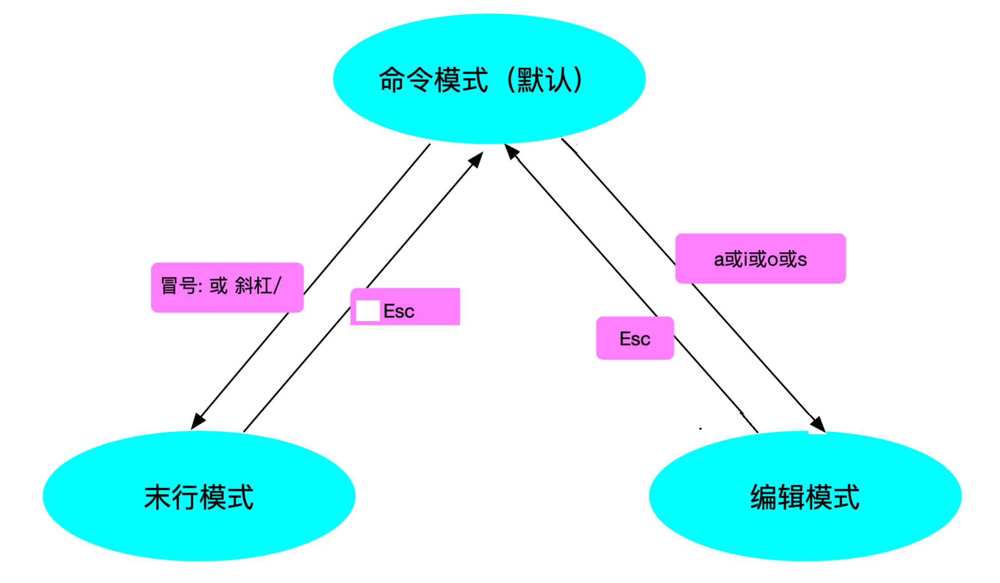

# vim

- Linux平台下的**文本编辑器：** emacs、nano、gedit、<font color=red>**vi**、**vim**</font>

vi（visual editor）编辑器通常被简称为vi，它是Linux和Unix系统上最基本的文本编辑器，类似于Windows 系统下的记事本。学会它后，我们将在Linux 的世界里游刃有余。

- 为什么要学习vim？

  1. 所有的Unix like系统都会**内置**vi文本编辑器，其他的文本编辑器则不一定会存在

  2. 很多软件的编辑接口都会主动调用vi

  3. vim具有<font color=red>程序编辑</font>的能力，可以主动以字体颜色辨别语法的正确性，方便程序设计

  4. 程序简单，编辑速度快

  5. vim是vi的升级版

## ㈠ vim编辑器三种模式

### 1、命令行模式

问：命令行可以干什么？

答：可以进行一些基本的</font>复制、删除、跳转、撤销、移动</font>等操作


| 命令     | 含义                                        | 备注                             |
| -------- | ------------------------------------------- | -------------------------------- |
| yy       | 复制光标所在行                              | 3yy表示复制3行                   |
| p(小写p) | 光标所在行后面粘贴                          |                                  |
| P(大写P) | 光标所在行前面粘贴                          |                                  |
| gg       | 光标快速跳到文件首行，并且定位到首字符      | 3gg表示快速跳到文件第3行行首字符 |
| G        | 光标快速跳到文件尾行，并且定位到首字符      |                                  |
| home     | 跳转到行首                                  | Shift+6 即 ^ 符号表示行首        |
| end      | 跳转到行尾                                  | Shitf+4 即 $ 符号表示行尾        |
| dd       | 删除光标所在行                              | 3dd表示删除3行（包括光标所在行   |
| d^       | 从光标位置删至行首，不包括光标位            |                                  |
| d$       | 从光标位置删至行尾，包括光标位，与D作用相同 |                                  |
| dG       | 删除光标所在行以及下面所有行                |                                  |
| dgg      | 删除光标所在行以及上面所有行                |                                  |
| x(小写)  | 删除光标所在字符后面一个字符，3x删除3个字符 | 类似于windows下的delete键        |
| X(大写)  | 删除光标所在字符前面一个字符，3X删除3个字符 | 类似windows下的backspace键       |
| u        | 撤销操作                                    | ctrl+r 取消撤销                  |
|          |                                             |                                  |

举例说明

① 环境准备

1. 删除/tmp/目录里的所有内容

2. 将/etc/passwd文件拷贝到/tmp目录里

```powershell
# rm -rf /tmp/*
# cp /etc/passwd /tmp/
```

② 使用vim工具打开文件

用法1： vim 文件名 默认会进入命令行模式

```powershell
[root@localhost ~]# vim /tmp/passwd
```

用法2： vim +数字 文件名 打开指定的文件，并且将光标移动到指定行

```powershell
[root@localhost ~]# vim +5 /tmp/passwd
```

用法3： vim +/关键字 文件名 打开指定的文件，并且高亮显示关键词

```powershell
[root@localhost ~]# vim +/shutdown /tmp/passwd
```


### 2、编辑模式

功能：</font>编辑文件内容</font>。


### 3、底行模式

① 如何进入底行模式？

- 命令模式进入底行模式：按冒号 :

- 编辑模式进入底行模式：先按 Esc键 退出到命令模式，然后再按冒号 :

 

② 底行模式能做什么？

1. 保存和退出

   保存文件，命令 :w ；另存为到其他文件，命令 :w 文件名

   保存退出，命令 :wq ;强制保存退出 :wq!

   退出不保存，命令 :q ;强制退出 :q!

   命令 :x 在文件没有修改的情况下，表示直接退出（等价于:q），在文件修改的情况下表

   示保存并退出（:wq）


2. 搜索替换

   ```powershell
   搜索摸索
   :/root n往下匹配;N往上匹配
   
   
   替换模式
   :%s/root/ROOT/ 全文搜索,替换每一行匹配到的第一个关键字
   :%s/root/ROOT/g 全文搜索,替换每一行所有匹配的关键字
   :%s/root/ROOT/gc 交互式替换
   :%s/\/sbin\/nologin/\/bin\/bash/ \转义符
   :%s#/sbin/nologin#/bin/bash#g 更换分隔符
   :7s/shutdown/SHUTDOWN/g 只替换第7行的内容
   取消高亮
   :noh （no highlight）
   ```

   

3. 其他功能

   ```powershell
   临时设置行号
   :set number 或 :set nu
   永久设置行号
   echo "set number" >> /etc/vimrc
   
   :set list 查看控制符
   
   地址定位
   :1,5 w /tmp/5.txt 保存前5行内容到/tmp/5.txt
   :r /tmp/5.txt 在光标所在行下面读取/tmp/5.txt文件内容
   :3r /tmp/5.txt 在当前文本的第3行后读取/tmp/5.txt文件
   :1,8d 删掉文本的1到8行
   :nr !command 在第n行下面读取命令所执行的结果
   :n! command 用命令的执行结果替换第n行内容
   ```

   


## **㈡** vim编辑器三种模式切换



## ㈢ 多窗口编辑问题

<font color=red>当两个终端同时打开或者意外结束文件时，会产生一个.swap文件 （交换文件）</font>

#### 举例说明：

你在两个终端同时打开/tmp/passwd文件，会产生/tmp/.passwd.swp。这时，有六个按钮可以使用：

```powershell
O(pen for Read-Only):打开成只读文件。
E(dit):用正常方式打开要编辑的文件，并不会载入暂存文件的内容。这很容易出现两个用户相互改变对方的文件的问题。
R(ecover)：加载暂存文件的内容。
D(elete)：如果你确定这个暂存文件是没有用的，则可以删除。
Q(uit)：不进行任何操作，回到命令行。
A(bort)：忽略这个编辑行为，和Q类似。

需要注意的是：
这个暂存文件不会因为你结束vim后自动删除，必须要手动删除。否则每次打开对应的文件时都会出现这样的提示。
```


## ㈣ 可视化模式（了解）

按键：ctrl + v（可视块）或V（可视行），然后按下↑ ↓ ← →方向键来选中需要

复制的区块，按下y 键进行复制（不要按下yy），最后按下p 键粘贴

退出可视模式按下Esc

```powershell
# 快速注释
ctrl + v
选中区块
I
输入文字
esc

# 快速删除
ctrl + v
选中区块
d
```


## ㈤ 课堂练习

1. 将/etc/passwd 拷贝到/tmp/下面。修改/tmp/passwd,在文件的第15行下添加“hello heima”，光标停留在hello heima上，复制5行，粘贴在文件的最下面，保存；然后全文搜索将“/bin/bash”替换成itcast，保存后面20行到/tmp/passwd.bak,退出编辑。

2. 查找/etc/下面的所有目录，并将其重定向到/tmp/etcdir文件里

3. 在/tmp/etcdir文件中追加“好好学习，天天向上”，然后把/etc/passwd文件的内容添加到/tmp/etcdir文件里面，并重命名为newetcdir


## 高频命令

```powershell
命令行模式：
# 复制一行
yyp
# 删除行
dd
# 撤回
u
# 取消撤回
ctrl + r
# 文件末尾
G
# 文件首位
gg
# 行首
^
# 行末
$


# 挂起shell
Ctrl + z  
fg重新进入vim


# 快速注释
ctrl + v
选中区块
I
输入文字
esc

# 快速删除
ctrl + v
选中区块
d


# 选择复制
v
选中区
y
p


底行模式：
临时设置行号
:set number 或 :set nu


搜索摸索
:/root n往下匹配;N往上匹配
:%s/root/ROOT/gc 交互式替换
取消高亮
:noh （no highlight）


```

