# 软件包管理

## 1、软件包分类

### ㈠ 软件包类型

- 二进制包
- 源码包

#### ① 二进制包

- 什么是二进制包？有什么特点？
  1. 二进制包，指的是已经 1 好了的软件包，只需要==直接安装==就可以使用。
  2. 二进制包，==不需要编译==，直接下载安装即可
  3. 二进制包，需要根据自己的计算机CPU以及操作系统去==选择合适==的
  4. 二进制包，命名方式一般为： xlockmore-5.31-2.el6.x86_64.rpm

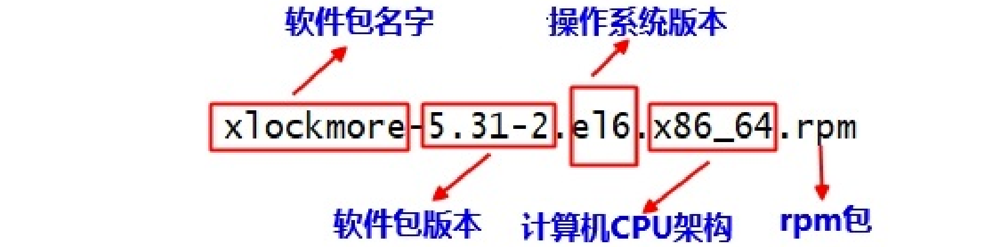

```
httpd-2.2.15-15.el6.centos.1.i686.rpm
httpd	软件包名
2.2.15	软件版本
15		软件发布的次数
el6		软件发行商。el6是RedHat公司发布，适合RHEL6.x（Red Hat Enterprise Linux）和CentOS6.x下使用
i686	适合的硬件平台。RPM包可以在不同的硬件平台安装，选择适合不同CPU的软件版本，可以最大化的发挥CPU性能，所以出现了所谓的i386（386以上计算机都可以安装）、i586（586以上的计算机都可以安装）、i686（奔腾II以上计算机都可以安装，目前所有的CPU都是奔腾II以上，所以这个软件版本居多）、x86_64（64位CPU可以安装）和noarch（没有硬件限制）等文件名了。
rpm		rpm包的扩展名。我们说过Linux下文件不是靠扩展名区分文件类型，也就是Linux中扩展名没有任何含义。可是这里怎么又出现了扩展名呢？原因很简单，如果我不把RPM的扩展名叫做“.rpm”，管理员很难知道这是一个RPM包，当然也就无法正确安装了。也就是说如果RPM包不用“.rpm”作为扩展名，系统可以正确识别没有问题，可是管理员很难识别这是个什么样的软件。
```

包全名：如果操作的是未安装软件包，则使用包全名，而且需要注意绝对路径

包名：如果操作的是已经安装的软件包，则使用包名即可，系统会生产RPM包的数据库（/var/lib/rpm/），而且可以在任意路径下操作


#### ② 源码包

- 什么是源码包？有什么特点？
  1. 源码包，指的是程序员写的原始的==程序代码文件==，==不能==够==直接==在计算机上==运行==。
  2. 源码包，需要进行==编译==，变成==二进制的软件包后==，才可安装使用
  3. 源码包，一般可以在任何的计算机上安装使用
  4. 源码包，命名方式一般为：
     - 软件包名.tar.gz
     - 软件包名.tar.bz2
     - 软件包名.tar.xz
     - 软件包名.zip


```powershell
[root@localhost ~]#vim hello.c
#include <stdio.h>
int main (void)
{
	printf ("hello world\n");
}

[root@localhost ~]# rpm -ivh /mnt/cdrom/Packages/gcc-4.4.6-4.el6.i686.rpm
    
[root@localhost ~]# gcc -c hello.c
#-c 生成“.o”头文件。这里会生成hello.o头文件，但是不会生成执行文件
[root@localhost ~]# gcc -o hello hello.o
#-o 生成执行文件，并制定执行文件名。这里生成的hello就是可执行文件
[root@localhost ~]# ./hello hello world
#执行hello文件
```

#### ③ 二进制源码包(了解)

- 什么是二进制源码包？有什么特点？
  1. 二进制源码包，是一个==半成品==，安装后不能直接使用
  2. 二进制源码包，需要使用 rpmbuild 工具重建成真正的 rpm 包或者重建成源码包才可安装使用
  3. 二进制源码包，命名方式一般为：
     - mysql-community-5.7.25-1.el6.==src==.rpm
     - mysql-community-5.7.25-1.el7.==src==.rpm

### ㈡ 常见的二进制包

| 系统平台                  | 包类型 | 工具         | 在线安装 |
| ------------------------- | ------ | ------------ | -------- |
| RedHat/Centos/Fedora/SUSE | rpm    | rpm,rpmbuild | yum/dnf  |
| Ubuntu/Debian             | deb    | dpkg         | apt      |


### ㈢ 总结二进制包和源码包区别

| 软件包类型 | 是否编译 | 安装难易程度         | 可定制性 |
| ---------- | -------- | -------------------- | -------- |
| 二进制包   | 否       | 易(直接安装)         | 差       |
| 源码包     | 是       | 难(配置—>编译—>安装) | 好       |


## 2、软件包安装方式

### ㈠ 二进制包

#### **①** ==rpm工具安装==

- 首先，需要下载好rpm包到本地

- 然后，直接使用rpm工具安装

RPM包依赖

 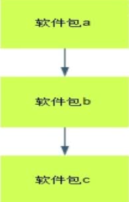

1）树形依赖a---->b---->c
2）环形依赖a---->b---->c---->a
3）函数库依赖

什么是模块依赖？我们举一个例子，尝试安装以下文件：

```powershell
[root@localhost Packages]# rpm -ivh mysql-connector-odbc-5.2.5-7.el7.x86_64.rpm
错误：依赖检测失败：
	libodbc.so.2()(64bit)被mysql-connector-odbc-5.2.5-7.el7.x86_64需要
	libodbcinst.so.2()(64bit)被mysql-connector-odbc-5.2.5-7.el7.x86_64需要
```

发现报错，需要安装“libodbc.so.2”函数库文件，这时会发现在光盘中根本找不到这个文件。那是因为函数库没有单独成包，是包含在某一个软件包中的。而如果要知道在哪个软件包中，需要查询网站www.rpmfind.net，如图：

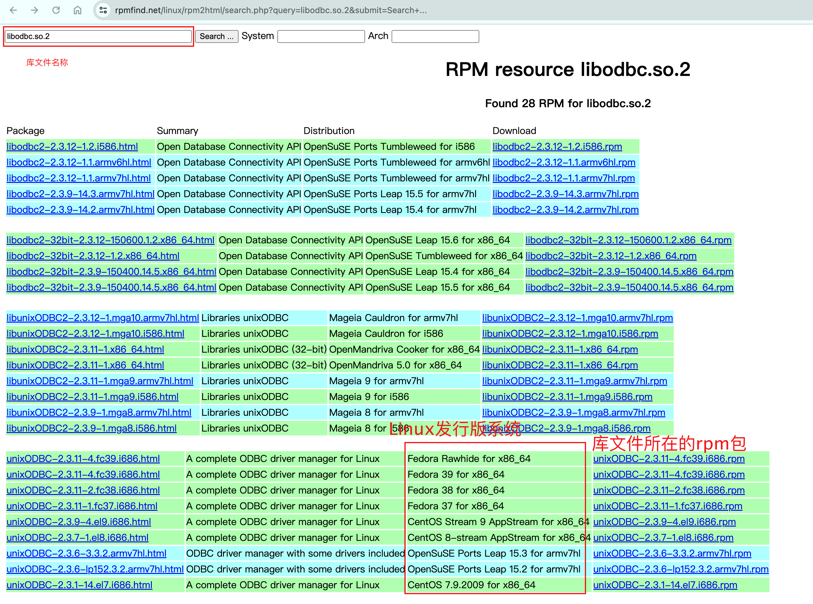

#### **②** yum/dnf工具安装

- 首先，需要**==配置软件仓库==**(里面存放很多软件包，但不一定在本地)

- 然后，使用yum/dnf工具安装


### ㈡ 源码包

#### ① 根据需求==配置==

功能的定制

#### ② 编译

使用==编译器==编译成==二进制的软件包==

#### ③ 安装

将软件包安装到指定位置

#### ④ 源码包安装优点

1. 可以在==任意平台==上编译安装，编译出来的软件包非常适应所在机器。

2. 可以在编译的时候，通过配置，==对某些功能进行定制==，开启或关闭相应的功能。


## 3、==二进制rpm包如何管理(重点)==

### ㈠ 如何获取rpm包

Linux只是内核，Linux发行版本：GNU/Linux

1. RedHat/Centos光盘

2. 推荐网站

   - www.rpmfind.net

   - rpm.pbone.net

3. 相应软件官方网站

   - http://www.mysql.com

   - http://nginx.org/packages/

### ㈡ 如何选择合适的rpm包

1. 选择==适合当前系统==的版本号

   - 找不到适合的，才去尝试别的系统版本号

   - el6兼容el5；el5无法安装 el6

2. 选择==适合当前计算机cpu==的架构

   - x86_64包，**只能**安装在64位的系统上

   - i386,i586,i686的软件包可以安装在32和64位系统上

   - noarch表示这个软件包与硬件构架无关，可以通用

   - 32位系统不能安装64位包

**建议**： 建议不要跨大版本号去安装软件包，尽量使用当前版本自带软件包安装


### ㈢ 如何管理rpm包

RPM包默认安装路径

| 路径            | 说明                       |
| --------------- | -------------------------- |
| /etc/           | 配置文件安装目录           |
| /usr/bin/       | 可执行的命令安装目录       |
| /usr/lib/       | 程序所使用的函数库保存位置 |
| /usr/share/doc/ | 基本的软件使用手册保存位置 |
| /usr/share/man/ | 帮助文件保存位置           |


#### 1）rpm工具管理

##### **①** rpm工具安装rpm包

(1)安装命令

```powershell
# rpm -ivh 包全名

注意：软件包的名字必须写全，xxx.rpm
选项：
	-i	install安装（install）
	-v	显示更详细的信息（verbose）
	-h	打印#显示安装进度（hash）
```


```
--nodeps	不检测依赖性安装。
	软件时会检测依赖性，确定所需的底层软件是否安装。如果没有安装则会报错。如果我不管依赖性，想强行安装，可以使用这个选项。
	注意：这样不检测依赖性安装的软件基本是不能使用的，所以不建议这样做
--replacefiles	替换文件安装。
	如果安装软件包，可是包中部分文件已经存在，那么正常安装时候，会报错“某个文件已经存在”从而导致软件无法安装,
	使用这个选项可以忽视这个报错，而覆盖安装
--replacepkgs	替换软件包安装。
	如果软件包已经安装，此选项可以把软件包重复安装一遍。
--force	强制安装。
	不管是否已经安装，都重新安装。
	就是—replacefiles和—replacepkgs的综合。
--test	测试安装。
	不会实际安装，只是检测一下依赖性。

--prefix	指定安装路径。
	为安装软件指定安装路径，而不使用默认安装路径。
	注意：如果指定了安装路径，软件没有安装到系统默认路径中的话，系统会找不到这些安装的软件，需要进行手工配置才能被系统识别。
	所以rpm包我们一般都采用默认路径安装。
```

xshell上传下载工具

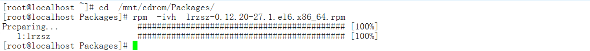

rz 下载

sz 上传


2）服务启动

```
[root@localhost ~]# service 服务名 start|stop|restart|status 
[root@localhost ~]# systemctl start|stop|restart|status 服务名
```


##### ② rpm工具卸载rpm包

```powershell
# rpm -e 包名
选项：
	--nodeps	不检查依赖性
	-e			卸载
```

注意：卸载软件只需要跟软件包名字即可


##### ③ rpm包的升级rpm包

```powershell
# rpm -Uvh 包全名
或者
# rpm -Fvh 包全名

选项说明：
	-v:输出详细信息
	-h:打印散列标记，一般和-v一起使用
	-U:升级软件包，如果该软件包没安装，会自动帮你安装
	-F:升级软件包，如果该软件包没安装，不会自动帮你安装
```


##### ④ 查看rpm包相关信息

```powershell
# 查看已经安装的所有rpm包
rpm -qa 软件包名
rpm -aq|grep 软件包名字

# 查看已经安装软件的详细信息
rpm -qi 软件包名
# 查看未安装的软件包的详细信息
rpm –qip 包全名

# 查看已经安装的软件的文件列表
rpm -ql 软件包名
# 查看未安装的rpm包里的文件列表
rpm -qlp 软件包(xxx.rpm)

# 查看指定文件来自哪个rpm包
rpm -qf 文件名

# 查询软件包所依赖的软件包
rpm –qR 包名
# 查询未安装软件包所依赖的软件包
rpm –qRp 包名


# 查看已经安装软件的文档列表
rpm -qd 软件包名


# 查看已经安装软件的配置文件
rpm -qc 软件包名


选项：
	-q	查询（query）
	-a	所有（all）
	-i	查询软件信息(information)
	-p	查询没有安装的软件包（package）
	-l	列出软件包中所有文件列表，以及安装目录
	-d	查看文档
	-c	查看配置文件目录
	-f	系统文件属于哪个软件包（file）
	-R	查询软件包的依赖性（requires）
```

##### ⑤ rpm工具其他安装选项

```powershell
--force
表示强制
rpm -ivh 软件包 --force 
强制安装软件包
rpm -e 软件包名 --force 
强制卸载软件包


--nodeps 
忽略依赖关系
rpm -ivh 软件包 --nodeps
忽略依赖关系安装
rpm -e 软件包 --nodeps 
忽略依赖关系卸载


其他了解：
rpm --import key_file 
导入公钥用于检查rpm文件的签名
rpm --checksig package.rpm 
检查rpm包的签名
rpm工具管理rpm软件包

安装、卸载、升级、查看
缺点：有依赖关系需要我们人肉去解决 A---->B和C
```

##### ⑥rpm校验

```powershell
[root@localhost ~]#rpm –Va
选项：
	-Va	校验本机已经安装的所有软件包
	
[root@localhost ~]#rpm –V 已安装的包名
选项：
	-V校验指定RPM包中的文件（verify）
	
[root@localhost ~]#rpm –Vf 系统文件名
选项：
	-Vf校验某个系统文件是否被修改
```

验证举例

```powershell
[root@iZuf616fn1k2l61xnal11vZ html]# rpm -V nginx
S.5....T.  c /etc/nginx/nginx.conf
```

出现了提示信息，我们来解释下最前面共有8个信息内容，是表示验证内容的。文件名前面的c是表示这是个配置文件（configuration）。最后是文件名。那么验证内容中的8个信息的具体内容如下：

​		S	文件大小是否改变
​		M	文件的类型或文件的权限（rwx）是否被改变
​		5	文件MD5校验和是否改变（可以看成文件内容是否改变）
​		D	设备的主从代码是否改变
​		L	文件路径是否改变
​		U	文件的属主（所有者）是否改变
​		G	文件的属组是否改变
​		T	文件的修改时间是否改变
apache配置文件的文件类型是c，那么还有哪些文件类型呢？

​		c	配置文件（config file）
​		d	普通文档（documentation）
​		g	“鬼”文件（ghost file），很少见，就是该文件不应该被这个RPM包包含
​		l	授权文件（license file）
​		r	描述文件（read me）


##### ⑦数字证书

​		刚刚的校验方法只能对已经安装的RPM包中的文件进行校验，但是如果RPM包本身就被动过手脚，那么校验就不能解决问题了。我们就必须使用数字证书验证了。

数字证书有如下特点：

- 首先必须找到原厂的公钥文件，然后进行安装
- 再安装RPM包是，会去提取RPM包中的证书信息，然后和本机安装的原厂证书进行验证
- 如果验证通过，则允许安装；如果验证不通过，则不允许安装并警告

数字证书位置

```powershell
#光盘中的数字证书位置
[root@localhost ~]# ll /media/centos7_iso/RPM-GPG-KEY-CentOS-7
-rw-rw-r-- 17 root root 1690 12月 10 2015 /media/centos7_iso/RPM-GPG-KEY-CentOS-7


#系统中的数字证书位置
[root@localhost ~]# ll /etc/pki/rpm-gpg/RPM-GPG-KEY-CentOS-7
-rw-r--r--. 1 root root 1690 10月 23 2020 /etc/pki/rpm-gpg/RPM-GPG-KEY-CentOS-7

```

数字证书导入

```powershell
[root@localhost ~]# rpm --import /etc/pki/rpm-gpg/RPM-GPG-KEY-CentOS-7
```

我们如何查询系统中安装好的数字证书呢？命令如下：

```powershell
[root@localhost ~]# rpm -qa | grep gpg-pubkey
gpg-pubkey-621e9f35-58adea78
gpg-pubkey-f4a80eb5-53a7ff4b
```

数字证书移除

```
rpm -e gpg-pubkey-621e9f35-58adea78
```


⑧提取rpm包包中文件（了解）

1）cpio命令

cpio命令主要有三种基本模式：“-o”模式指的是copy-out模式，就是把数据备份到文件库中；“-i”模式指的是copy-in模式，就是把数据从文件库中恢复；“-p”模式指的是复制模式，就是不把数据备份到cpio库中，而是直接复制为其他文件。命令如下：

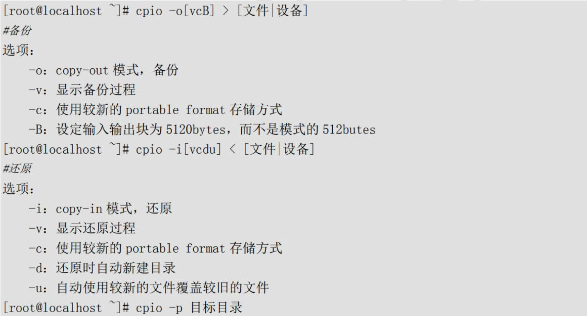

举几个例子吧，先来看看使用cpio备份数据的方法，命令如下：


再来看看如何恢复cpio的备份数据，命令如下：

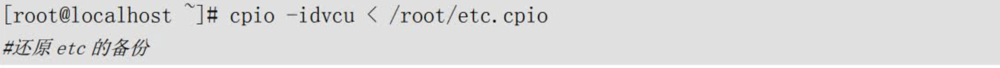

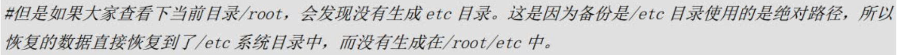

在CentOS5.x的版本中，是可以利用上面的命令备份与恢复指定的文件。但是到CentOS6.x当中，需要更加严谨。如果备份时使用绝对路径，则恢复的数据会直接到绝对路径指定的路径中，如果需要把数据恢复到当前目录中，则需要使用相对路径，例如：

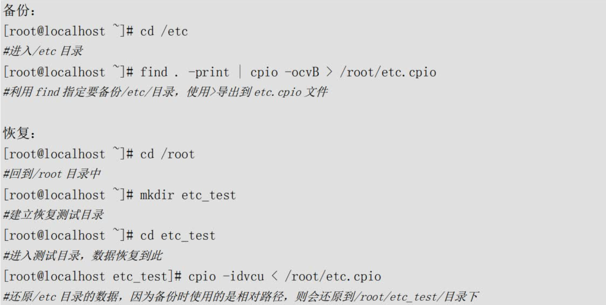

最后来演示一下cpio命令的“-p”复制模式，命令如下：

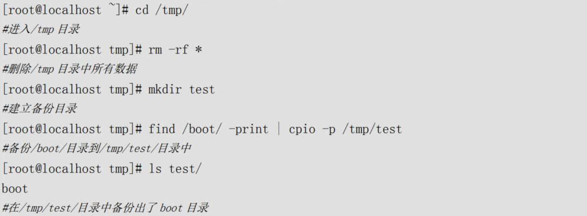

2）提取RPM包中文件

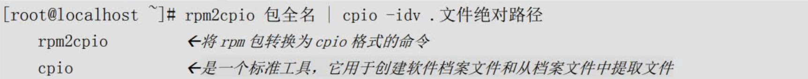

举个例子，现在我假设把系统中的/bin/ls命令不小心误删除了，那么我可以修复回来吗？这时有两种方法修复，要不就是使用—force选项覆盖安装一遍coreutils-8.4-19.el6.i686包，要不就可以使用cpio命令提取出/bin/ls命令文件，再把它拷贝到对应位置就可以了。不过我是怎么知道/bin/ls命令是属于coreutils-8.4-19.el6.i686这个软件包的呢？还记得-qf选项吗？命令如下：

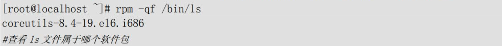

那么我们在讲RPM包中文件提取，所以我们使用第二章方法，cpio命令提取出ls命令文件，然后拷贝到对应位置，命令如下：

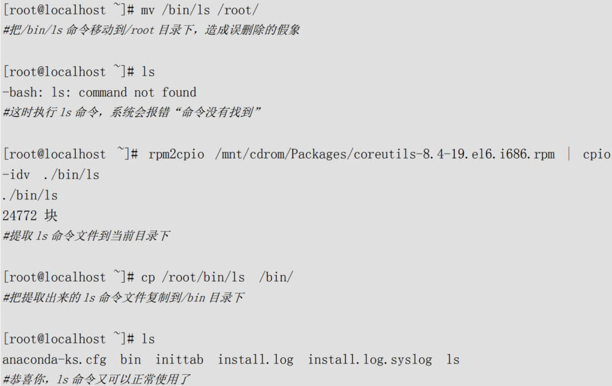


#### 2）==yum（dnf）工具管理==

yum/dnf优点：能够自动解决依赖关系

**核心：**需要有一个软件仓库，软件仓库指的是来存放**软件包**和**软件包之间的依赖关系**地方。

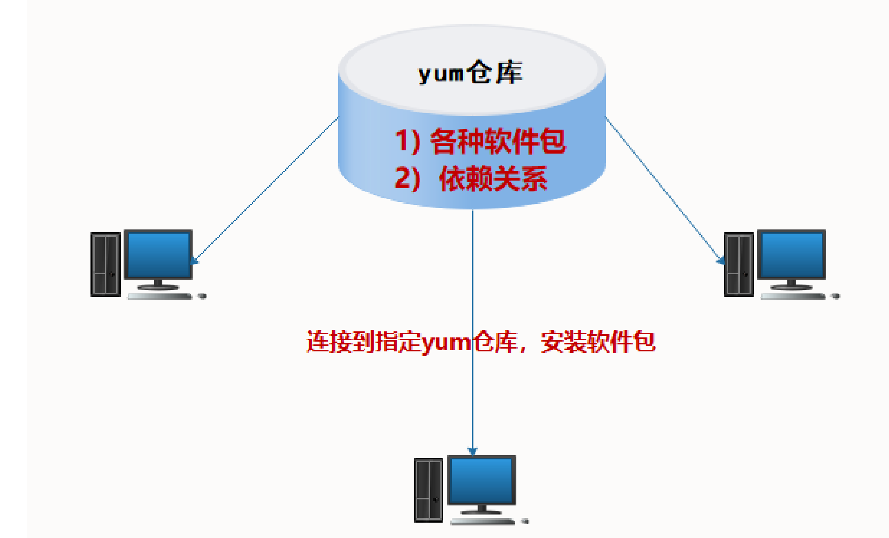


1. 需要有软件仓库

   - 仓库可以在本地——>本地yum源

   - 仓库可以在远程——>网络yum源——>网络必须ok

2. 需要告诉yum工具到哪个仓库里找
   - 默认有一个地方，存放了xxx.repo文件——>定义了去哪个仓库里找


##### yum源文件解析

yum源配置文件保存在/etc/yum.repos.d/目录中，文件的扩展名一定是“*.repo”。也就是说，yum源配置文件只要扩展名是“*.repo”就会生效。

```powershell
[root@localhost ~]# ls /etc/yum.repos.d/
CentOS-Base.repo  CentOS-CR.repo  CentOS-Debuginfo.repo  CentOS-fasttrack.repo  CentOS-Media.repo  
CentOS-Sources.repo  CentOS-Vault.repo  CentOS-x86_64-kernel.repo
```

默认情况下`CentOS-Base.repo`文件生效。

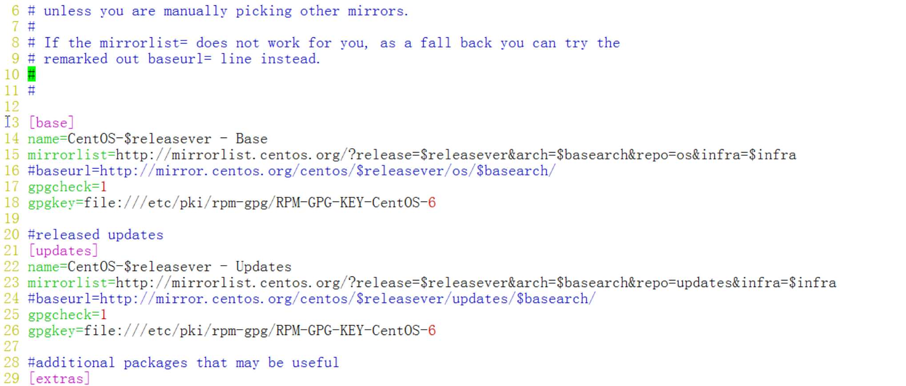

```powershell
[base]
name=CentOS-$releasever
enabled=1
failovermethod=priority
baseurl=http://mirrors.cloud.aliyuncs.com/centos/$releasever/os/$basearch/
gpgcheck=1
gpgkey=http://mirrors.cloud.aliyuncs.com/centos/RPM-GPG-KEY-CentOS-7

[updates]
name=CentOS-$releasever
enabled=1
failovermethod=priority
baseurl=http://mirrors.cloud.aliyuncs.com/centos/$releasever/updates/$basearch/
gpgcheck=1
gpgkey=http://mirrors.cloud.aliyuncs.com/centos/RPM-GPG-KEY-CentOS-7

[extras]
name=CentOS-$releasever
enabled=1
failovermethod=priority
baseurl=http://mirrors.cloud.aliyuncs.com/centos/$releasever/extras/$basearch/
gpgcheck=1
gpgkey=http://mirrors.cloud.aliyuncs.com/centos/RPM-GPG-KEY-CentOS-7
```

> 解释一下base这个容器。
>
> - [base]：容器名称，一定要放在[]中。
> - name：容器说明，可以自己随便写。
> - mirrorlist：镜像站点，这个可以注释掉。
> - baseurl：我们的yum源服务器的地址。默认是CentOS官方的yum源服务器，是可以使用的。
>   如果你觉得慢，则可以改成你喜欢的yum源地址。
> - enabled：此容器是否生效，如果不写或写成enabled=1则表示此容器生效，写成enabled=0
>   则表示此容器不生效。
> - gpgcheck：如果为1则表示RPM的数字证书生效；如果为0则表示RPM的数字证书不生效。
> - gpgkey：数字证书的公钥文件保存位置。不用修改。

光盘yum源`CentOS-Media.repo`


##### 搭建本地光盘yum源

第一步：放入CentOS安装光盘，并挂载光盘到指定位置。命令如下：

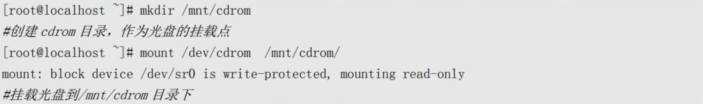

第二步：修改其他几个yum源配置文件的扩展名，让它们失效，因为只有扩展名是“*.repo”的文件才能作为yum源配置文件。当然也可以删除其他几个yum源配置文件，但是如果删除了，当你又想用网络作为yum源时，就没有了参考文件，所以最好还是修改扩展名。命令如下：

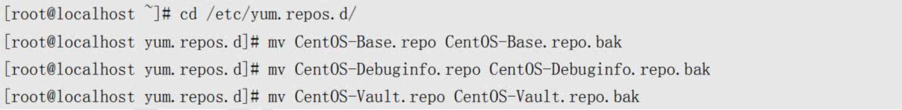

第三步：修改光盘yum源配置文件`CentOS-Media.repo`，参照以下方法修改：

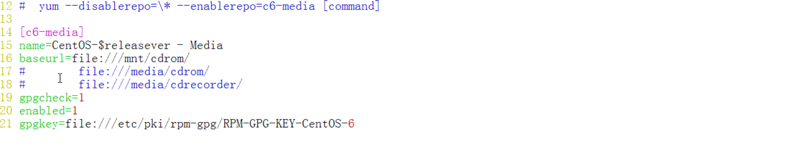

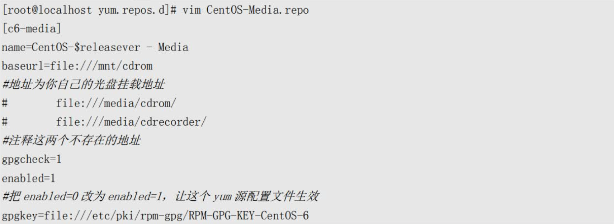

配置完成，现在可以感受一下yum的便捷了。


#####  搭建本地yum源

1）本地仓库的分类

- *BaseOS*存储库

>  BaseOS存储库旨在提供一套核心的底层操作系统的功能，为==基础软件==安装库

- *AppStream*存储库

>  AppStream存储库中包括额外的==用户空间应用程序、运行时语言和数据库==，以支持不同的工作负载和用例。AppStream中的内容有两种格式——熟悉的RPM格式和称为模块的RPM格式扩展


2）配置本地仓库

步骤1：挂载镜像到本地系统

/mnt

/media 一般用于第三方设备的挂载点

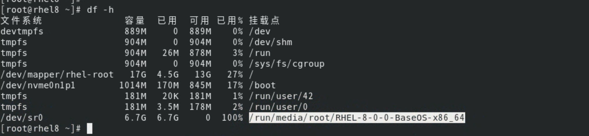

```powershell
[root@RedHat8 ~]# mount -o ro /dev/sr0 /mnt
手动将/dev/sr0设备挂载到指定 /mnt目录下


列出BaseOS和AppStream的内容如下说明仓库已准备好
[root@RedHat8 ~]# ls /mnt/BaseOS/
Packages repodata
[root@RedHat8 ~]# ls /mnt/AppStream/
Packages repodata
```


步骤2：修改配置文件指定本地存储库

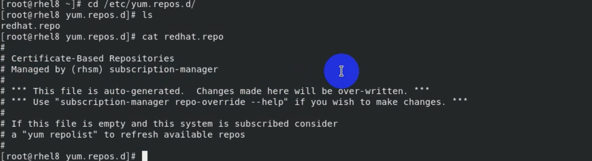

```powershell
[root@RedHat8 yum.repos.d]# pwd
/etc/yum.repos.d

[root@RedHat8 yum.repos.d]# cat local.repo
[BaseOS]
name=BaseOS
# 开启
enabled=1
# 本地软件包地址
baseurl=file:///mnt/BaseOS
# 不校验签名
gpgcheck=0

[AppStream]
name=AppStream
enabled=1
baseurl=file:///mnt/AppStream
gpgcheck=0
```


步骤3：查看是否成功

```powershell
清空yum缓存
[root@RedHat8 yum.repos.d]# yum clean all
创建yum缓存
[root@RedHat8 yum.repos.d]# yum makecache
查看仓库
[root@RedHat8 yum.repos.d]# yum repolist
仓库标识 仓库名称 状态
AppStream 		AppStream 			4,672
BaseOS			 BaseOS 			1,658
```


##### yum（dnf）工具使用

- 查看

  ```powershell
  查看仓库软件
  # yum list | grep samba
  
  查看已安装的软件
  # yum list installed | samba
  # rpm -q vsftpd
  # dnf list installed| grep vsftpd
  
  search查找
  # yum search httpd
  
  查询指定软件包的信息。
  # yum info samba
  ```

  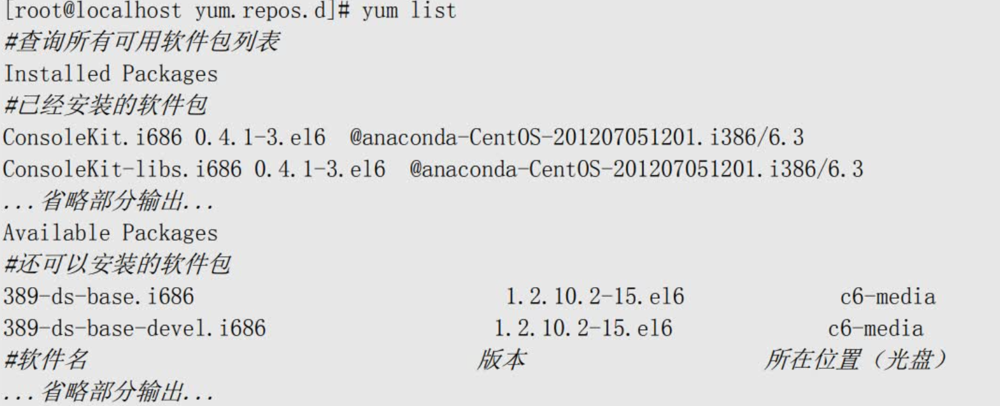

  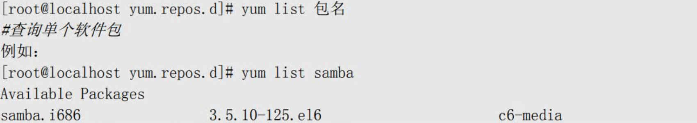

  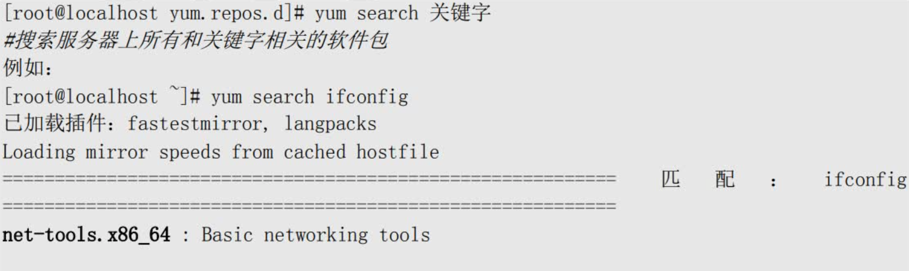

  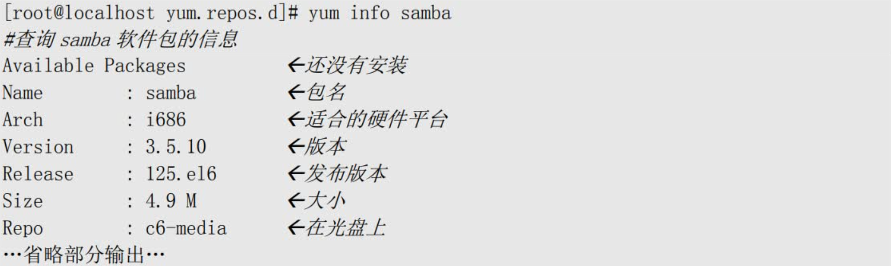

- 安装软件包

  ```powershell
  # yum -y install 软件包1 软件包2
  # yum -y groupinstall "包组名"
  注意：
  1.其中，-y选项表示取消交互
  2.包组里面包含很多的软件包。
  ```

  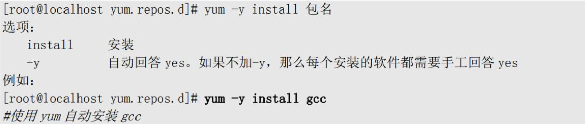


- 升级rpm包

  注意：在进行升级操作时，yum源服务器中软件包的版本要比本机安装的软件包的版本高。

  ```powershell
  # yum update 软件包名
  # yum update 
  ```

  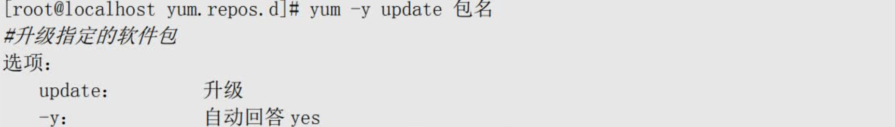

  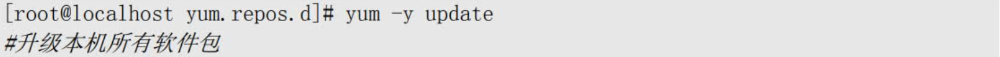

- 卸载软件包

  再次强调一下，除非你确定卸载的软件的依赖包不会对系统产生影响，否则不要执行yum的卸载，因为很有可能在卸载软件包的同时卸载的依赖包也是重要的系统文件，这就有可能导致系统崩溃。卸载命令如下：

  ```powershell
  # yum -y remove 软件包名
  # yum -y groupremove "包组名"
  ```

  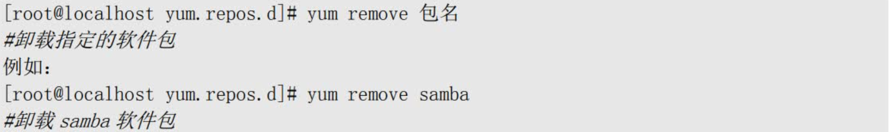


##### yum组管理命令

查询可以安装的软件组

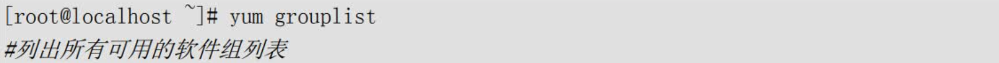

查询软件组内包含的软件

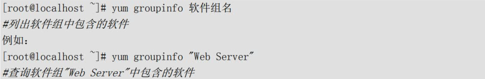

安装软件组

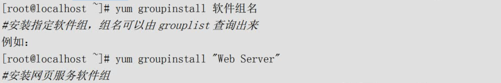

卸载软件组

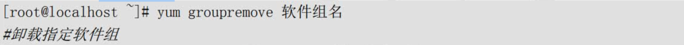


## 4、源码包安装

1、应该选择哪种软件包？

- 如果软件包是给大量客户提供访问，建议使用源码包安装，如LAMP环境搭建，因为源码包效率更高。
- 如果软件包是给Linux底层使用，或只给少量客户访问，建议使用rpm包安装，因为rpm包简单。

2、源码包是从哪里来的？

rpm包是光盘中直接包含的，所以不需要用户单独下载。而源码包是通过官方网站下载的，如果需要使用，是需要单独下载的。

3、是否可以在系统中即安装rpm包的Apache，又安装源码包的Apache？

答案是可以，因为两种安装方法安装的Apache，安装位置是不一样的，例如：

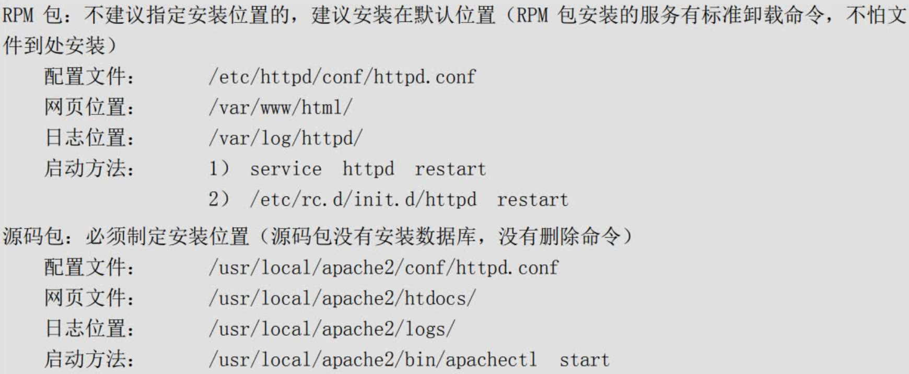

1.4生产服务器上，是否会同时安装两种Apache？

当然不会啊，因为系统中只有一个80端口，所以你只能启动一个Apache，装多个只能浪费资源。我们建议安装源码包的Apache。

### 安装过程

我们来解释一下源码包安装的具体步骤。

（1）下载软件包。

（2）解压缩。

（3）进入解压目录。

（4）./configure		编译前准备

这一步主要有三个作用：

①	在安装之前需要检测系统环境是否符合安装要求。

②	定义需要的功能选项。“`./configure`”支持的功能选项较多，可以执行“`./configure --help`”
		命令查询其支持的功能。一般都会通过“`./configure --prefix=安装路径`”来指定安装路径。

③	把系统环境的检测结果和定义好的功能选项写入`Makefile`文件，后续的编译和安装需要依赖这个文件的内容。

需要注意的是，`configure`不是系统命令，而是源码包软件自带的一个脚本程序，所以必须采用“`./configure`”方式执行（“`./`”代表在当前目录下）。

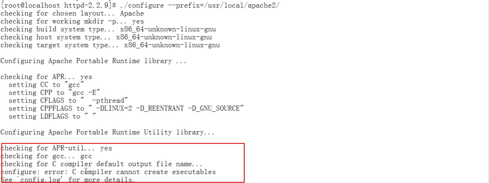

（5）`make`		编译

`make`会调用`gcc`编译器，并读取`Makefile`文件中的信息进行系统软件编译。编译的目的就是把源码程序转变为能被Linux识别的可执行文件，这些可执行文件保存在当前目录下。编译过程较为耗时，需要有足够的耐心。

（6）`make clean`：清空编译内容（非必需步骤）。

如果在“`./configure`”或“`make`”编译中报错，那么我们在重新执行命令前一定要记得执行`make clean`命令，它会清空`Makefile`文件或编译产生的“`.o`”头文件。

（7）`make install`：编译安装

这才是真正的安装过程，一般会写清楚程序的安装位置。如果忘记指定安装目录，则可以把这个命令的执行过程保存下来，以备将来删除使用。


> ```
> vim INSTALL
> ```
>
> 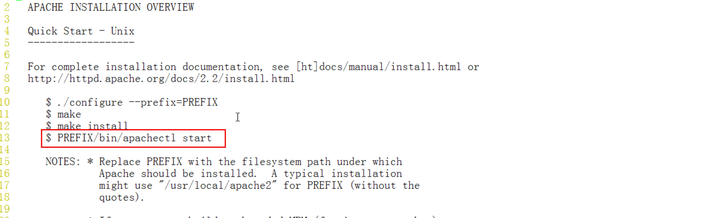
>
> 启动
>
> 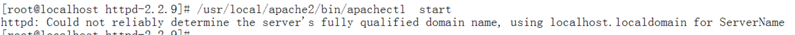
>
> `ps aux`
>
> 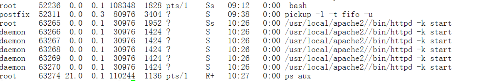
>
> 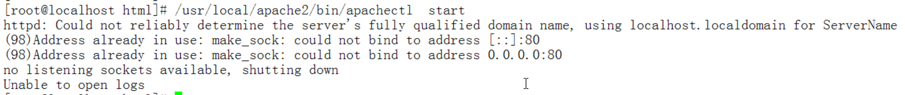


### 删除

源码包没有删除命令，如果需要删除，直接删除安装目录即可。

### 打入补丁

#### 补丁的生成

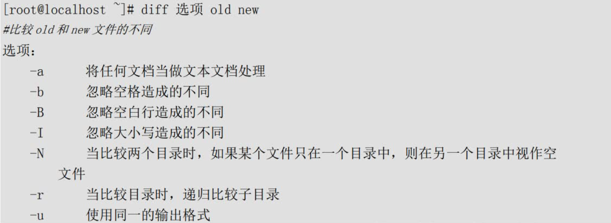

举例

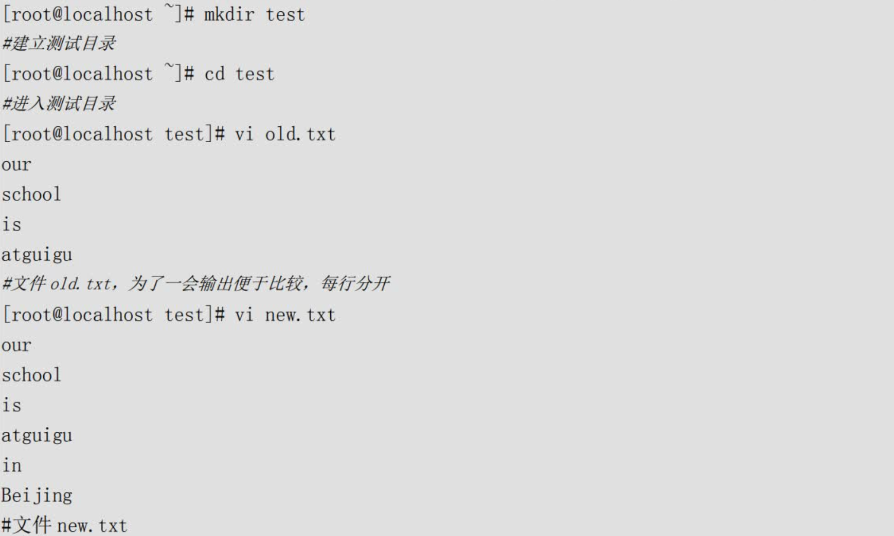

比较下两个文件的不同，并生成补丁文件“txt.patch”，命令如下：

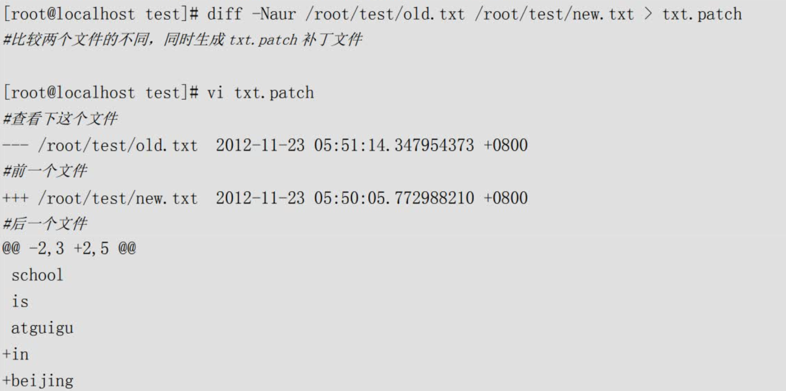

\#后一个文件比前一个文件多两行（+表示）

#### 打入补丁

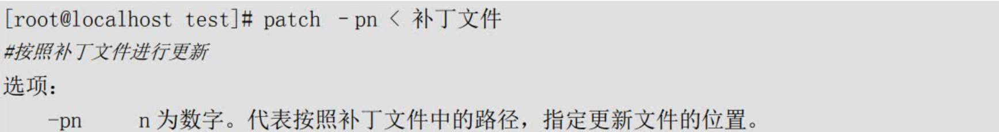

“-pn”不好理解，我们说明下。补丁文件是要打入旧文件的，但是你当前所在的目录和补丁文件中的记录的目录是不一定匹配的，所以就需要“-pn”来同步两个目录。比如我当前是在“/root/test”目录中（我要打补丁的旧文件就在当前目录下），补丁文件中记录的文件目录为“/root/test/old.txt”，这时如果写入“-p1”（在补丁文件目录中取消一级目录）那么补丁文件就会打入“/root/test/root/test/old.txt”文件中，这显然是不对的。那如果写入的是“-p2”（在补丁文件目录中取消二级目录）那么补丁文件打入的就是“/root/test/test/old.txt”,这显然也不对。如果写入的是“-p3”（在补丁文件目录中取消三级目录）那么补丁文件就是打入的“/root/test/old.txt”，我们的old.txt文件就在这个目录下，所以就应该是“-p3”。那么我们更新下“old.txt”文件，命令如下：

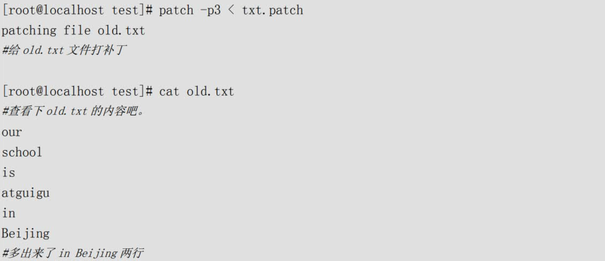


## 脚本安装程序

脚本程序包并不多见，所以在软件包分类中并没有把它列为一类。它更加类似于Windows下的程序安装，有一个可执行的安装程序，只要运行安装程序，然后进行简单的功能定制选择（比如指定安装目录等），就可以安装成功，只不过是在字符界面下完成的。

目前常见的脚本程序以各类硬件的驱动居多，我们需要学习一下这类软件的安装方式，以备将来不时之需。


### Webmin安装

我们来看看脚本程序如何安装和使用。安装一个叫作Webmin的工具软件，Webmin是一个基于Web的系统管理界面。借助任何支持表格和表单的浏览器（和File Manager模块所需要的Java），你就可以设置用户账号、apache、DNS、文件共享等。Webmin包括一个简单的Web服务器和许多CGI程序，这些程序可以直接修改系统文件，比如/etc/inetd.conf和/etc/passwd。Web服务器和所有的CGI程序都是用Perl 5编写的，没有使用任何非标准Perl模块。也就是说，Webmin是一个用Perl语言写的、可以通过浏览器管理Linux的软件。


首先下载Webmin软件，地址为http://sourceforge.net/projects/webadmin/files/webmin/，这里下载的是webmin-1.610.tar.gz。

接下来解压缩软件，命令如下：


进入解压目录，命令如下：


执行安装程序setup.sh，并指定功能选项，命令如下：

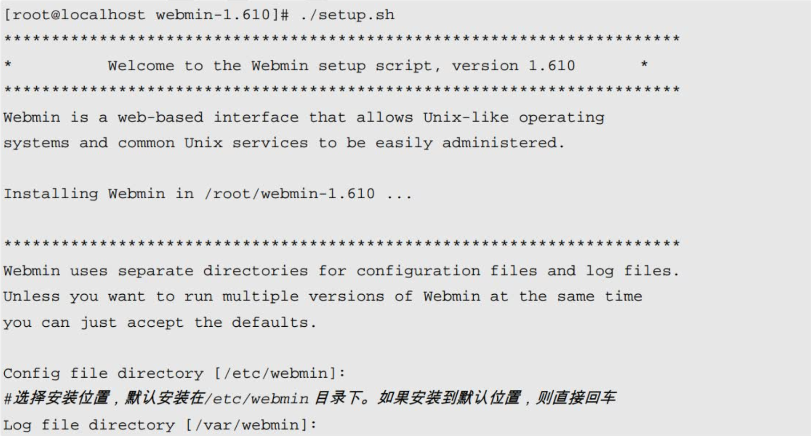

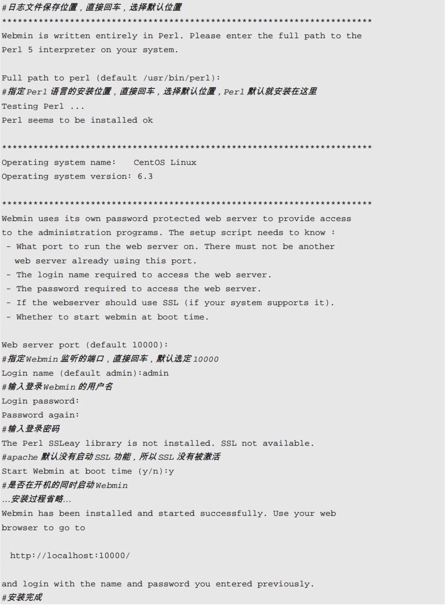
