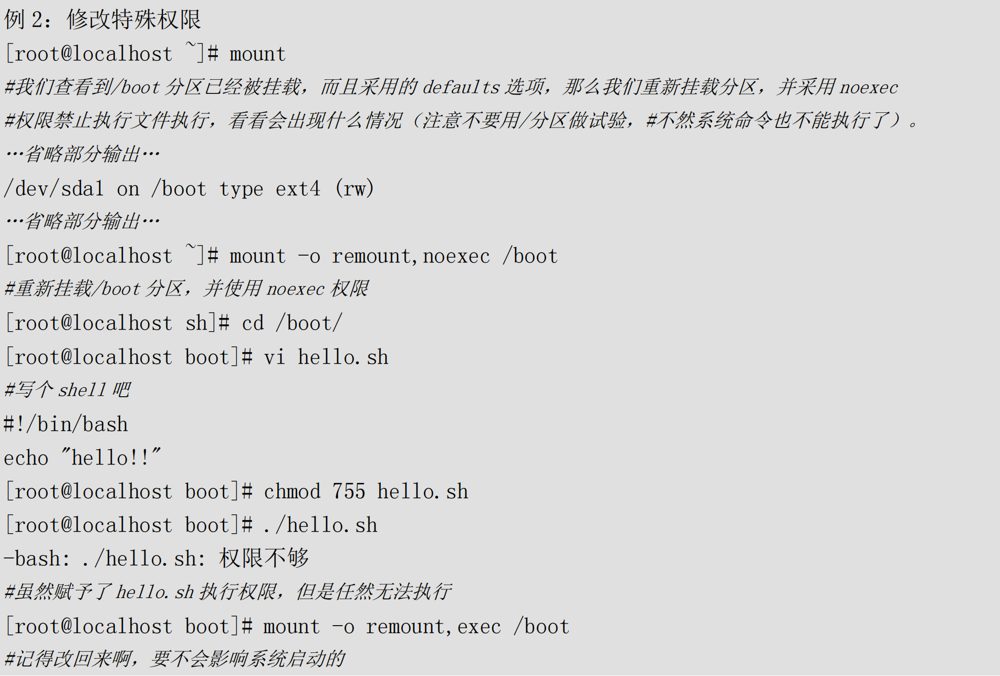
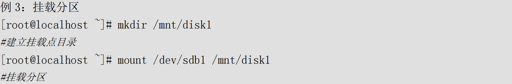
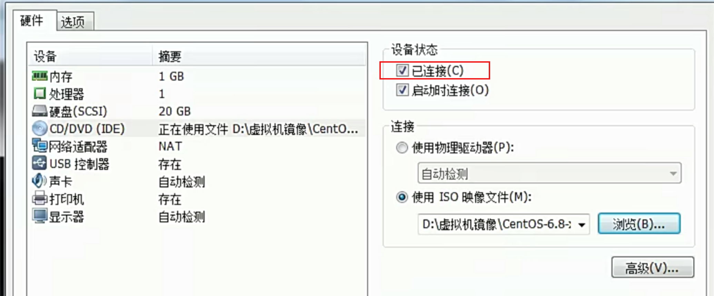
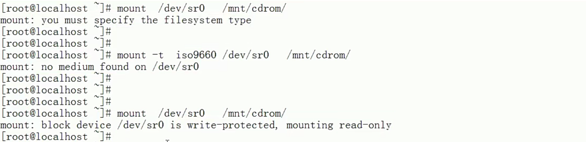
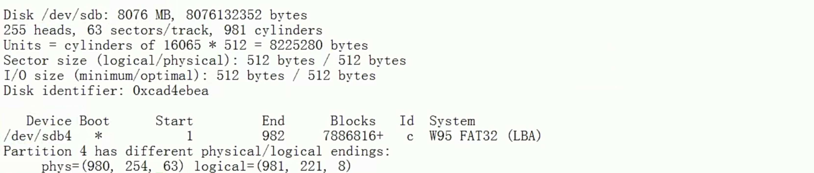
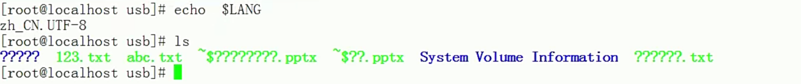

# 命令--挂载命令

> 将硬件资源，或文件资源💿，和📂空目录🔗连接起来的过程

## mount

linux 所有存储设备都必须挂载使用，包括硬盘

​		命令名称：mount

​		命令所在路径：/bin/mount

​		执行权限：所有用户

```powershell
#查询系统中已经挂载的设备，-l 会显不卷标名称
mount [-l]
df -h
df -HT

# 依据配置文件/etc/fstab的内容，自动挂载
mount -a

# 只需了解-o
# \代办这一行没有写完，换行
mount [-t 文件系统] [-L 卷标名] [-o 特殊选项] \
设备文件名 挂载点

选项：
	-t 文件系统：	加入文件系统类型来指定挂载的类型，可以ext3、ext4、iso9660等文件系统。具体可以参考下表
	-L 卷标名：		挂载指定卷标的分区，而不是安装设备文件名挂载
	-o 特殊选项：	可以指定挂载的额外选项，比如读写权限、同步异步等，如果不指定则默认值生效。
```

| 参数          | 说明                                                         |
| ------------- | ------------------------------------------------------------ |
| atime/noatime | 更新访问时间/不更新访问时间。访问分区文件时，是否更新文件的访问时间，默认为更新 |
| async/sync    | 异步/同步，默认为异步                                        |
| auto/noauto   | 自动/手动，mount -a命令执行时，是否会自动安装/etc/fstab文件内容挂载，默认为自动 |
| defaults      | 定义默认值，相当于rw,suid,dev,exec,auto,nouser,async这七个选项 |
| exec/noexec   | 执行/不执行，设定是否允许在文件系统中执行可执行文件，默认是exec允许 |
| remount       | 重新挂载已经挂载的文件系统，一般用于指定修改特殊权限         |
| rw/ro         | 读写/只读，文件系统挂载时，是否具有读写权限，默认是rw        |
| suid/nosuid   | 具有/不具有SUID权限，设定文件系统是否具有SUID和SGID的权限，默认是具有 |
| user/nosuer   | 允许/不允许普通用户挂载，设定文件系统是否允许普通用户挂载，默认是不允许，只有root可以挂载分区 |
| userquota     | 写入代表文件系统支持用户磁盘配额，默认不支持                 |
| grpquota      | 写入代表文件系统支持组磁盘配额，默认不支持                   |

举例

```
例1：
[root@localhost ~]# mount
#查看系统中已经挂载的文件系统，注意有虚拟文件系统
/dev/sda3 on / type ext4 (rw)
proc on /proc type proc (rw)
sysfs on /sys type sysfs (rw)
devpts on /dev/pts type devpts (rw,gid-5,mode-620)
tmpfs on /dev/shm type tmpfs (rw)
/dev/sdal on /boot type ext4 (rw)
none on /proc/sys/fs/binfmt misc type binfmt misc (rw)
sunrpc on /var/lib/nfs/rpc pipefs type rpc pipefs (rw)
#命令结果是代表: /dev/sda3 分区挂载到/目录，文件系统是 ext4，权限是读写

例 2: 修改特殊权限
root@localhost # mount
#我们查看到/boot 分区已经被挂载，而且采用的 defaults 选项，那么我们重新载分区，并采用noexec
#权限禁止执行文件执行，看看会出现什么情况(注意不要用/分区做试验，
#不然系统命令也不能执行了)
..·省略部分输出·..
root@localhost 7# mount -o remount,noexec /boot
#重新挂载/boot 分区，并使用 noexec 权限
```






## umount

譬如 /dev/hda5 已经挂载在/mnt/hda5上,用一下三条命令均可卸载挂载的文件系统

```
# umount /dev/hda5
# umount /mnt/hda5
# umount /dev/hda5 /mnt/hda5
```

为什么umount的时候老显示 device busy？

这是因为有程序正在访问这个设备，最简单的办法就是让访问该设备的程序退出以后再umount。可能有时候用户搞不清除究竟是什么程序在访问设备，如果用户不急着umount，则可以用:

```
# umount -l /mnt/hda5
```

来卸载设备。选项 –l 并不是马上umount，而是在该目录空闲后再umount。还可以先用命令ps aux 来查看占用设备的程序PID，然后用命令kill来杀死占用设备的进程，这样就umount的非常放心了。

## /etc/fstab文件

> `man 5 fstab`

```powershell
1.被挂载的设备：
		设备文件，LABEL，UUID，伪文件系统等
		
2.挂载点：
		swap为特殊挂载，挂载点为swap
              
3.文件系统类型

4.挂载选项：
		defaults为默认挂载选项(rw，suid，dev，exec，auto，nouser，and async)，可以有多个挂载选项，以逗号为分隔符

5.转储频率：
		0表示从不备份，1表示每天备份，2表示每隔一天备份
		
6.自检次序：
		0表示不自检，1,表示首先自检，一般是根文件系统为1，2,表示次级自检....
```


## 本地iso挂载

准备工作：上传镜像，创建挂载目录

```powershell
上传镜像文件到/home/jysp/CentOS-7-x86_64-Everything-2009.iso

[root@Server ~]# mkdir /media/centos7_iso                     #创建挂载点的目录
[root@Server ~]#  mount -o  loop /home/CentOS-7-x86_64-DVD-1708.iso   /media/centos7_iso
[root@Server ~]# df -HT            #查看镜像是否挂载成功
备注： -o是参数，loop是把一个文件当成硬盘分区mount挂着到目录
```

开机自动挂载：修改配置文件

```powershell
修改开机自动挂载配置：/etc/fstab
vim /etc/fstab
内容追加如下：
/home/jysp/CentOS-7-x86_64-Everything-2009.iso /media/centos7_iso/ iso9660 defaults,ro,loop 0 0 
保存退出。
```

例

```powershell
[root@localhost ~]# cat /etc/fstab 

#
# /etc/fstab
# Created by anaconda on Wed Dec 13 22:10:25 2023
#
# Accessible filesystems, by reference, are maintained under '/dev/disk'
# See man pages fstab(5), findfs(8), mount(8) and/or blkid(8) for more info
#
/dev/mapper/centos-root /                       xfs     defaults        0 0
UUID=1b7d1f9f-b2af-4efb-af81-7d7bc7ef1864 /boot                   xfs     defaults        0 0
/dev/mapper/centos-swap swap                    swap    defaults        0 0


/home/jysp/CentOS-7-x86_64-Everything-2009.iso /media/centos7_iso/ iso9660 defaults,ro,loop 0 0 

```


## 光盘挂载

光盘挂载的前提是指定光盘的设备文件名，不同版本的Linux，设备文件名并不相同：

- CentOS 5.x以前的系统，光盘设备文件名是/dev/hdc
- CentOS 6.x以后的系统，光盘设备文件名是/dev/sr0

不论哪个系统都有软连接/dev/cdrom，与可以作为光盘的设备文件名

（1）挂载

```powershell
[root@localhost /]# ls
bin  boot  dev  etc  home  lib  lib64  media  mnt  opt  proc  root  run  sbin  srv  sys  tmp  usr  var

一般都习惯挂载到mnt目录下 /cdrom下挂载光盘
# mnt:挂载u盘
# media:挂载光盘
# misc:挂载网络存储盘

mount -t iso9660 /dev/cdrom /mnt/cdrom
# Linux中的光盘格式为iso9660，默认的可以识别
mount /dev/cdrom /mnt/cdrom
```





（2）卸载

用完之后记得卸载：

```powershell
umount /dev/sr0
umount /mnt/cdrom
# 因为设备文件名和挂载点已经连接到一起，卸载哪一个都可以
```

​		注意：卸载的时候需要退出光盘目录，才能正常卸载

## 挂载U盘

(1)查看U盘

U盘会和硬盘公用设备文件名，所以U盘的设备文件名不是固定的，需要手工查询，查询命令：

```powershell
fdisk -l
#查询硬盘
```



（2）挂载U盘

```powershell
mount -t vfat /dev/sdb4 /mnt/usb/
# 挂载U盘。因为是Windows分区，所以是vfat文件系统格式
```

 

如果U盘中有中文，会发现中文是乱码。Linux要想正常显示中文，需要两个条件：

- 安装了中文编码和中文字体
- 操作终端需要支持中文显示（纯字符终端，是不支持中文编码的）

手工指定中文编码：

```powershell
mount -t vfat -o iocharset=utf8 /dev/sdb1 /mnt/usb/
# 挂载U盘，指定中文编码格式为UTF-8
```

如果需要卸载，可以执行

```powershell
umount /mnt/usb/
```


## 挂载NTFS分区

### Linux的驱动加载顺序

- 驱动直接放入系统内核之中。这种驱动主要是系统启动加载必须的驱动，数量较少。
- 驱动以模块的形式放入硬盘。大多数驱动都已这种方式保存，保存位置在`/lib/modules/3.10.0-862.el.x86_64/kernel/`中。
- 驱动可以被Linux识别，但是系统认为这种驱动异步不常用，默认不加载。如果需要加载这种驱动，需要重新编译内核，而NTFS文件系统的驱动就属于这种情况。
- 硬件不能被Linux内核识别，需要手工安装驱动。当然前提是厂商提供了改硬件针对Linux的驱动，否则就需要自己开发驱动了

### 使用 NTFS-3G 安装 NTFS 文件系统模块

下载 NTFS-3G 插件

我们从网站 http://www.tuxera.com/community/ntfs-3g-download/下载 NTFS-3G 插件到 Linux服务器上。

安装 NTFS-3G 插件

在编译安装 NTFS-3G 插件之前，要保证 gcc 编译器已经安装。具体安装命令如下:

```powershell
tar -zxvf ntfs-3g ntfsprogs-2013.1.13.tgz
# 解压
[root@localhost ~]# cd ntfs-3g ntfsprogs-2013.1.13
#进入解压目录
root@localhost ntfs-3g ntfsprogs-2013.1.13]# ./configure
#编译器准备。没有指定安装目录，安装到默认位置中
root@localhost ntfs-3g ntfsprogs-2013.1.137# make
#编译
root@localhost ntfs-3g ntfsprogs-2013.1.13]# make install
#编译安装
```

安装就完成了，已经可以挂载和使用 Windows 的 NTFS 分区了。不过需要注意挂载分区时的文件

系统不是 ntfs，而是 ntfs-3g。挂载命令如下:

```powershell
[root@localhost~]# mount -t ntfs-3g 分区设备文件名 挂载点
例如:
[root@localhost ~]# mount - t ntfs-3g /dev/sdbl /mnt/win
```


## nfs挂载

参考后续文章（服务管理--NFS）

```powershell
[jysp@jysp ~]$ df -HT
文件系统                类型      容量  已用  可用 已用% 挂载点
devtmpfs                devtmpfs   69G     0   69G    0% /dev
tmpfs                   tmpfs      69G     0   69G    0% /dev/shm
tmpfs                   tmpfs      69G  131M   69G    1% /run
tmpfs                   tmpfs      69G     0   69G    0% /sys/fs/cgroup
/dev/mapper/centos-root xfs       5.1T   84G  5.0T    2% /
/dev/sda2               xfs        11G  171M   11G    2% /boot
/dev/sda1               vfat      4.3G  9.5M  4.3G    1% /boot/efi
10.139.102.114:/data1   nfs4      128T  272G  128T    1% /home/jysp/workspace/platform_file_storage
10.139.102.114:/data    nfs4      128T  272G  128T    1% /home/jysp/ftps
tmpfs                   tmpfs      14G  197k   14G    1% /run/user/42
tmpfs                   tmpfs      14G     0   14G    0% /run/user/1000

```

