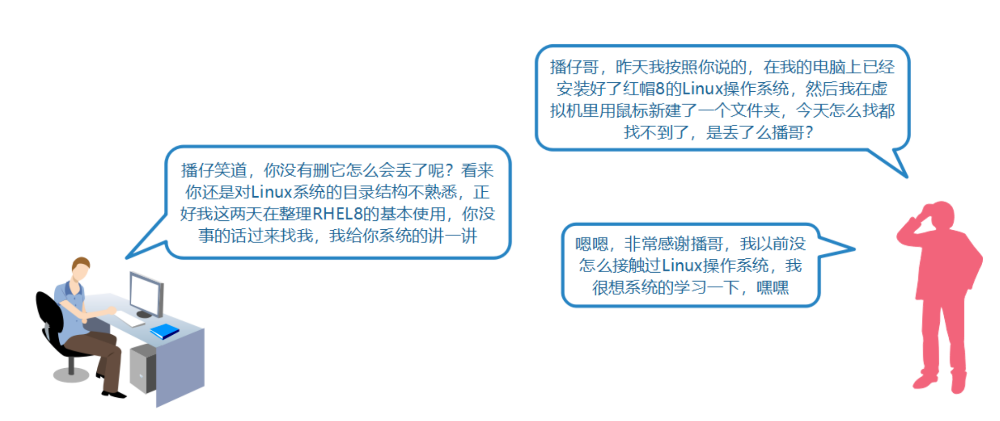
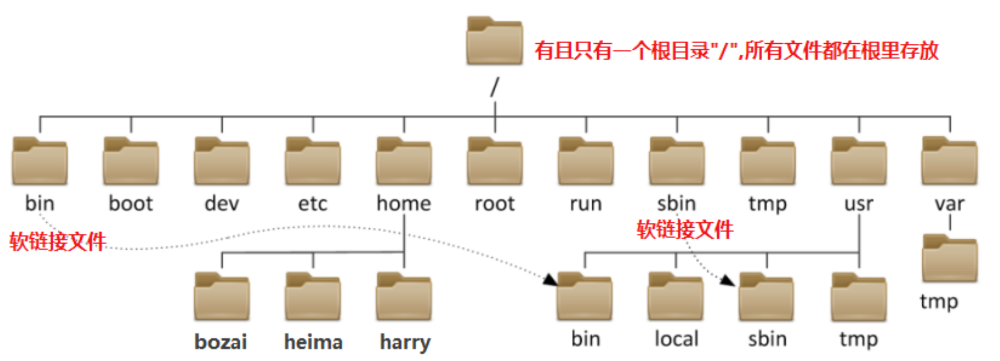
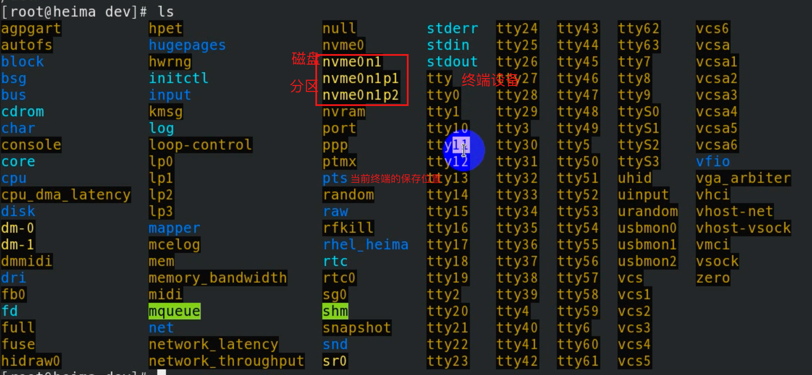
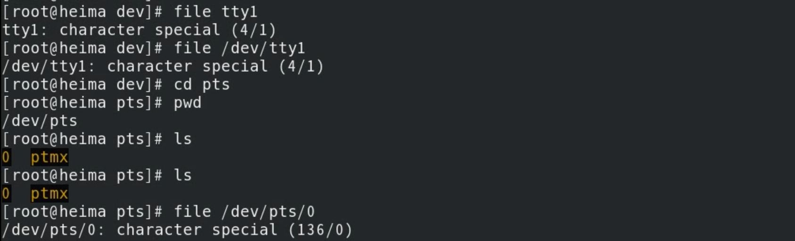
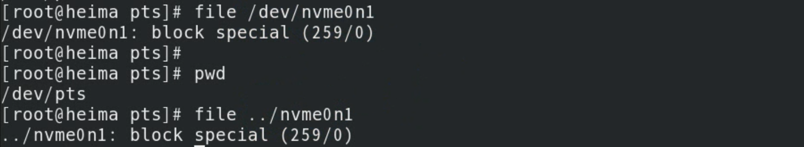
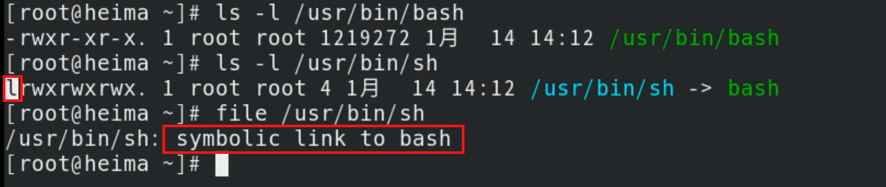
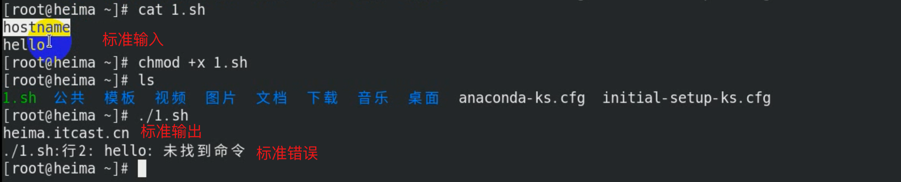

# 任务背景



# 任务要求

- [ ] 研究RHEL8.0的基本操作使用

# 任务分解

1. 研究RHEL8桌面环境如何操作

2. 研究Linux的目录树结构（如何存放文件）

3. 学习RHEL8的文件操作，如创建，删除等

4. 学习RHEL8的用户组管理

5. 学习RHEL8的权限管理

6. 学习RHEL8基础环境配置（网络，防火墙，selinux等）

7. 学习RHEL8下软件包的管理

8. 学习远程管理Linux服务器


# 任务实施

## 一、RHEL8桌面环境操作

### 1、桌面环境介绍

**㈠ 桌面布局**

**㈡ 打开常见的应用程序**

**㈢ 快捷键设置**

win + A

win + S

esc


### 2、终端的基本操作

**㈠ 打开多个终端**

**㈡ 快速清屏**

新建标签：command + T

新建窗口：command + N

关闭标签：command + Q

关闭窗口：command + W


放大：command + +

缩小：command + -

清屏：command + l

## 二、Linux的目录树结构

### 1、了解目录树结构



| 目录               | 说明                       | 备注                                 |
| ------------------ | -------------------------- | ------------------------------------ |
| /root              | 管理员root的家目录         |                                      |
| /home              | 普通用户的默认家目录       | /home/**bozai**  /home/**heima**     |
| /bin—>/usr/bin     | 普通用户的命令             | /usr/bin/**date** /usr/bin/**ls**    |
| /sbin—>/usr/sbin   | 管理员使用的命令           | /usr/sbin/**shutdown**               |
| /usr/local         | 第三方源码包默认安装目录   | 类似windows下 C:\Program Files       |
| /etc               | 系统和服务相关配置文件     | /etc/passwd                          |
| /var               | 动态，可以变化的数据文件   | 日志文件（/var/log/xxx）             |
| /tmp               | 临时文件存放目录           | 全局可写（系统或程序产生临时文件）   |
| /dev               | 设备文件                   | /dev/sda /dev/nvme0n1                |
| /lib—>/usr/lib     | 库文件                     | 软连接文件                           |
| /lib64—>/usr/lib64 | 库文件                     | 软连接文件                           |
| /proc              | 虚拟的文件系统             | 反映出来的是内核，进程信息或实时状态 |
| /boot              | 系统内核，引导程序相关文件 |                                      |
| /media             | 移动设备默认的挂载点       |                                      |
| /mnt               | 手工挂载设备的挂载点       |                                      |

### 2、理解文件路径表示方法

Who？——>当前登录的用户

Where?——>==**路径**==

> 我要在==哪儿==创建文件？
>
> 我要删除==什么地方==的什么文件？
>
> 我所要查看的==文件在哪里==？

What?——>操作命令

How？——>理清思路，找到方法，做就对了

- **绝对路径**
  1. 一定是以"/"(根)开头，它是唯一一个绝对能够描述文件所在路径的方式。
  2. "/" 根目录是linux操作系统最顶级的目录，没有任何路径比它还要靠前。

- **相对路径**
  1. 路径是相对的，文件所在的路径是相对于当前所在路径而言的。
  2. 当前路径使用 .或./ 表示；当前目录的上一级目录使用 ..或../ 表示
  3. 当前用户家目录使用 ~ 表示；上次工作路径使用 - 表示

- **路径切换和查看的相关命令**


| 命令 | 含义                                             | 使用方法  |
| ---- | ------------------------------------------------ | --------- |
| pwd  | 查看当前工作路径                                 | pwd       |
| cd   | 更改工作路径，切换路径(默认切换到当前用户家目录) | cd 新路径 |

- 举例说明

```powershell
[root@heima ~]# pwd 打印当前工作路径
/root

[root@heima ~]# cd /home 切换到/home目录下
[root@heima home]# cd ../ 切换到当前路径的上一级目录
[root@heima /]# pwd
/

[root@heima /]# cd ~ 切换到当前用户家目录
[root@heima ~]# cd - 切换到上一次工作路径
/

[root@heima /]# cd 切换到当前用户家目录
[root@heima ~]# pwd
/root
```


## 三、RHEL8文件操作管理

**重要：Linux下，一切皆文件！！！**

**说在前面：**

1. 接下来所有的命令需要在一个载体上执行，这个载体就叫做**终端**。

2. 终端上所有命令都需要一个东西**翻译解析**一下，计算机才能理解并执行。
3. 这个翻译解析的东西叫**SHELL**解释器**，RedHat和Centos默认shell解释器叫**bash。

4. 既然需要bash帮忙翻译解释相关命令，那么你所敲的命令必须**符合它的语法**，否则报错给你看。


```powershell
命令 [可选项] 参数
[root@localhost ~]# ls -l /root
命令：整条shell命令的主体
选项：会影响或微调命令的行为，通常以-, --
参数：命令作用的对象
```


### 1、判断文件类型(file)

常见文件类型  

| 文件类型               | 描述                                                         |
| ---------------------- | ------------------------------------------------------------ |
| 字符设备（c）          | 所有==输入输出的设备==，如：键盘、鼠标、显示器、打印机等     |
| 块设备（==b==）        | 所有==存储设备==称之为块设备文件，如：软盘、磁盘、光盘、U盘、磁带、光驱等 |
| 软连接文件（==l==）    | 类似于Windows下的快捷方式                                    |
| 目录文件（==d==）      | 相当于Windows下的文件夹                                      |
| 普通文件(==f==或==-==) | 类似Windows下记事本、word等，可以使用==相关命令==进行编辑、==查看文件内容== |
| 管道文件(p)            | 简单理解为==程序或进程之间通讯==的一种方式                   |
| 套接字文件(s)          | 简单理解为==程序或进程之间通讯==的一种方式                   |
|                        |                                                              |

- **用** file **命令来判断文件类型**

  ```powershell
  [root@localhost ~]# file /root
  /root: directory 目录
  [root@localhost ~]# file /root/install.log
  /root/install.log: ASCII text 普通的文本文件
  [root@localhost ~]# file /dev/sda
  /dev/sda: block special 块设备文件，存放数据
  [root@localhost ~]# file /dev/tty1
  /dev/tty1: character special 字符设备
  [root@localhost ~]# file /bin/sh
  /bin/sh: symbolic link to bash 软连接文件
  ```

  



字符设备



块设备



软链接文件



### 2、列出目录内容(==ls==)

```powershell
常见选项
-a all,查看目录下的所有文件，包括隐藏文件
-l 长列表显示
-h human，以人性化方式显示出来
-d 只列出目录名，不列出其他内容
-t 按修改时间排序
-r 逆序排列
-S 按文件的大小排序
-i 显示文件的inode号（索引号）
-R 递归列出目录中的内容
-m 用逗号分隔显示内容
示例：以不同的选项列出/root目录里的内容

[root@localhost ~]# ls -a /root
[root@localhost ~]# ls -l /root
[root@localhost ~]# ls -lh /root
[root@localhost ~]# ls -lt /root
[root@localhost ~]# ls -S /root
[root@localhost ~]# ls -R /root
[root@localhost ~]# ls -d /root 查看/root目录本身的信息
```

### 3、创建目录(==mkdir==)

```powershell
常见选项
-p 级联创建
[root@localhost ~]# mkdir /test/ 在根下创建test目录
[root@localhost ~]# mkdir ./test/ 在当前目录下创建test目录
[root@localhost ~]# mkdir ./test /test 创建多个目录
[root@localhost ~]# mkdir -p /test/yunwei/redhat

说明：
1.如果创建的目录的上一级目录不存在，就需要加-p参数；-p在前面和后面都可以
```

### 4、创建文件(==touch==)

==注意：Linux下文件的命名规则==

1. 文件名严格区分大小写 file FILE

2. 文件名不能包含特殊符号，如(/或*等)

3. 文件名最多可达255个字符

- 创建一个新的空文件（目标文件不存在）

  ```powershell
  [root@localhost ~]# touch /tmp/file1 在/tmp目录下创建file1文件
  [root@localhost ~]# touch file1 在当前目录下创建file1文件
  思考：这2个file1文件是同一个文件吗？
  答：不是同一个文件，因为路径不一样。
  ```

  

- 修改文件的时间（目标文件存在）

  - 查看文件的相关时间

    ```powershell
    [root@localhost tmp]# stat file1 查看文件的状态信息
    File: `file1'
    Size: 0 Blocks: 0 IO Block: 4096 regular empty file
    Device: fd00h/64768d Inode: 915714 Links: 1
    Access: (0644/-rw-r--r--) Uid: ( 0/ root) Gid: ( 0/ root)
    Access: 2019-04-01 17:36:00.353096343 +0800
    Modify: 2019-04-01 17:36:00.353096343 +0800
    Change: 2019-04-01 17:36:00.353096343 +0800
    Access:文件的查看访问时间
    Modify:文件的修改时间
    Change:文件的属性时间,文件的大小、权限等信息发生改变时，该时间会变化
    ```

  - 修改文件的时间

    ```powershell
    [root@localhost tmp]# touch file1
    [root@localhost tmp]# stat file1 查看文件的状态信息
    File: `file1'
    Size: 0 Blocks: 0 IO Block: 4096 regular empty file
    Device: fd00h/64768d Inode: 915714 Links: 1
    Access: (0644/-rw-r--r--) Uid: ( 0/ root) Gid: ( 0/ root)
    Access: 2019-04-01 17:41:00.353096343 +0800
    Modify: 2019-04-01 17:41:00.353096343 +0800
    Change: 2019-04-01 17:41:00.353096343 +0800
    
    其他修改：
    [root@localhost tmp]# touch -a file1 -t 201506161320 修改文件点访问时间
    [root@localhost tmp]# touch -m file1 -t 201612121330 修改文件修改时间
    -a：访问时间
    -m：修改时间
    -t：时间类型格式
    
    [root@localhost tmp]# touch -d 20110808 file1 修改文件日期
    [root@localhost tmp]# touch -d 1215 file1 修改文件时间
    [root@localhost tmp]# touch -d "20101012 11:11:11" file1 修改文件的日期和时间
    
    说明：大家只需要掌握touch -d的用法即可。
    
    注：RHEL6开始relatime，atime延迟修改，必须满足其中一个条件：
    1. 自上次atime修改后，已达到86400秒；
    2. 发生写操作时；
    ```

    

### 5、查看文件内容

- cat 命令：一般查看==小文件==，从第一行到最后一行列出来

  常见选项：

  -n：显示行号

  -A：显示控制字符，如换行符,制表符等（ linux $ 和 Windows ^M$ ）

- tac 命令：一般查看小文件，从最后一行到第一行列出来

- more和less 命令：一般查看大文件，q退出查看，可以搜索，建议less命令

  ```powershell
  less 文件
  	enter键：一行一行查看
  	空格键：一页一页查看
  	退出：Q键
  	/:搜索
  	n:查找下一个
  	gg:回到开头
  ```

- head 命令：默认查看文件前10行， head -n 15或head -15 表示查看前15行

- tail 命令：默认查看文件后10行， tail -n 15或tail -15 表示查看后15行； -f 表示动态查看

- ldd 命令：一般用来查看二进制的命令文件

```powershell
[root@localhost tmp]# cat /etc/passwd 查看/etc/passwd文件内容
[root@localhost tmp]# cat -n /etc/passwd 查看/etc/passwd文件内容，并打印行号
[root@localhost tmp]# tac /etc/passwd 查看/etc/passwd文件内容
[root@localhost tmp]# head -5 /etc/passwd 查看/etc/passwd文件的前5行内容
[root@localhost tmp]# tail -5 /etc/passwd 查看/etc/passwd文件的后5行内容
[root@localhost tmp]# more /var/log/messages
[root@localhost tmp]# less /var/log/messages
[root@localhost tmp]# ldd /bin/mkdir 查看mkdir命令文件（二进制）的内容
```

### 6、拷贝文件(==cp==)

注意：**本地**文件拷贝

```powershell
常用选项：
-a 递归拷贝文件，包括目录及文件属性信息
-r 拷贝目录
-p 拷贝文件包含文件的属性信息
-v 显示拷贝过程信息
用法：
cp 选项 需要拷贝的文件 拷贝到哪里去
# cp /root/file1 /home 拷贝/root/下的file1文件到/home目录下
# cp -r /home/itcast /root 拷贝/home/itcast目录到/root目录下
# su - user01 切换到user01用户下
$ touch file1
# cp -p /home/user01/file1 /tmp/ 拷贝home/user01/file1文件（包含属性信息）到/tmp下
# cp /root/file1 /tmp/test1 拷贝文件并且重命名


问：-a和-p有什么区别？
答：相同点都是需要拷贝文件的属性信息，比如拥有者（谁创建的等）；不同点在于，-p只能拷贝文件，-a既可以拷贝文件
也可以拷贝目录。
```

### 7、移动或重命名文件(==mv==)

```powershell
移动文件用法（不同路径下）：
# mv 需要移动的文件 移动到新的路径下

注意：文件的路径不一样
重命名用法（相同路径下）：
# mv 原来文件的名字 新文件的名字

注意：老文件和新文件的路径一样
# mv /root/file1 /tmp 移动/root/file1文件到/tmp目录下
# mv /tmp/file1 /tmp/test1 将/tmp目录下的file1文件重命名成test1
```

### 8、删除文件(rm)

```powershell
常用选项
-r 递归删除，一般用于删除目录
-f 直接删除，不提示
[root@localhost tmp]# rm file1 删除当前目录下的file1文件，有提示
[root@localhost tmp]# rm -r dir1 删除当前目录下的dir1目录，有提示
[root@localhost tmp]# rm -f /root/file1 强制删除/root/file1文件，不提示，直接删
```


# 扩展补充

## 一、Linux下如何获取帮助

### 1、简约求帮助(help)

```powershell
help命令：知道该命令的含义，相关参数不知道可以使用help
内部命令求帮助：help 命令
外部命令求帮助：命令 --help


cp --help
help cd


type命令：判断一个命令是内部还是外部
内部命令：shell内置的命令，bash
外部命令：第三方程序，软件带来的命令
```


### 2、详细求帮助(man)

```powershell
# man man
    ANUAL SECTIONS
    The standard sections of the manual include:
    1    User Commands 所有用户使用命令
    2    System Calls 系统调用
    3    C Library Functions 函数库
    4    Devices and Special Files 设备与特殊文件
    5    File Formats and Conventions 文档格式说明
    6    Games et. Al. 游戏
    7    Miscellanea 杂项
    8    System Administration tools and Deamons 系统管理员与程序用户相关


一般情况是不需要使用章节号，例如：
# man 1 ls
# man ls
# man useradd
# man setfacl （/EXAMPLES）
# man -f passwd 列出所有章节中的passwd手册
# man 1 passwd passwd命令的帮助
# man 5 passwd 用户配置文件的帮助
# man -a passwd 在所有章节中查找
# man -k passwd 以关键字导出man page

程序猿手册 man 23467
管理员手册 man 158
```

### 3、相关官方文档

```powershell
http://httpd.apache.org/docs/2.4/
http://nginx.org/
http://tengine.taobao.org/nginx_docs/cn/docs/
https://www.zabbix.com/documentation/3.4/zh/manual
https://puppet.com/docs
其他社区
https://www.linuxidc.com/
等等
```

## 二、Bash的标准输入输出

### 1、名词解释

- 标准输入（stdin）：键盘上的输入 文件描述符—>0

- 标准输出（stdout）：屏幕上==正确==的输出 文件描述符—>1

- 标准错误（stderr）：屏幕上==错误==的输出 文件描述符—>2


### 2、相关符号

`>` ：标准输出重定向,覆盖重定向, `1>或> `标准输出重定向，` 2> `标准错误重定向

`>>` ：重定向追加, `1>>` 标准输出追加，` 2>>`标准错误追加

`<` ：标准输入

`&>`：标准输出标准错误重定向


### 3、举例说明

① 环境准备

```powershell
编写简单脚本（先直接复制用，后面说）：
[root@localhost ~]# echo -e 'date\nuuu' > 1.sh 创建1.sh脚本文件
[root@localhost ~]# cat 1.sh
date
uuu

执行1.sh脚本，屏幕上有输出结果，如下：
[root@localhost ~]# bash 1.sh
Thu Feb 28 21:22:27 CST 2019 正确的结果叫标准输出
1.sh: line 2: uuu: command not found 错误的结果叫标准错误
```



② 需求1：

将标准输出（屏幕上的正确结果）重定向到/tmp/1.log文件中

```powershell
[root@localhost ~]# bash 1.sh 2> /tmp/2.log
Thu Feb 28 21:26:15 CST 2019 标准输出依然在屏幕，标准错误重定向到了文件中
[root@localhost ~]# cat /tmp/2.log
1.sh: line 2: uuu: command not found 文件里是标准错误的结果

注意：>或者2>都表示覆盖重定向
查看/etc/hosts文件内容，并将标准输出重定向到/tmp/1.log
[root@localhost ~]# cat /etc/hosts > /tmp/1.log
[root@localhost ~]# cat /tmp/1.log 查看该文件，发现原来内容被覆盖
127.0.0.1 localhost localhost.localdomain localhost4 localhost4.localdomain4
::1 localhost localhost.localdomain localhost6 localhost6.localdomain6

总结：>或者1>表示标准输出重定向；2>表示标准错误重定向
```

③ 需求2：

**将标准错误（屏幕上的错误结果）重定向到****/tmp/2.log****文件中**

```powershell
[root@localhost ~]# bash 1.sh 2> /tmp/2.log
Thu Feb 28 21:26:15 CST 2019 标准输出依然在屏幕，标准错误重定向到了文件中
[root@localhost ~]# cat /tmp/2.log
1.sh: line 2: uuu: command not found 文件里是标准错误的结果


注意：>或者2>都表示覆盖重定向
查看/etc/hosts文件内容，并将标准输出重定向到/tmp/1.log
[root@localhost ~]# cat /etc/hosts > /tmp/1.log
[root@localhost ~]# cat /tmp/1.log 查看该文件，发现原来内容被覆盖
127.0.0.1 localhost localhost.localdomain localhost4 localhost4.localdomain4
::1 localhost localhost.localdomain localhost6 localhost6.localdomain6


总结：>或者1>表示标准输出重定向；2>表示标准错误重定向
```


④ 需求3：

将标准输出和标准错误一起重定向到/tmp/3.log里

```powershell
[root@localhost ~]# bash 1.sh &>/tmp/3.log
[root@localhost ~]# cat /tmp/3.log
Thu Feb 28 21:33:36 CST 2019
1.sh: line 2: uuu: command not found
说明：
&>表示标准输出和标准错误一起重定向
```


⑤需求4：

不输出日志

```powershell
./1.sh >/dev/null 2>&1	将标准输出和标准错误扔掉（放到空设备）
等于
./1.sh &>/dev/null

说明
1）/dev/null		Linux系统下特殊的设备文件，空设备，类似黑洞
```


### 4、echo命令

==echo会将输入的字符串送往标准输出==，并在最后加上换行符。 可以理解为打印字符串。

```powershell
常见选项：
-n ：不输出最后的换行符“\n”
-e：解释转义字符（字符串中出现\n、\t等特殊字符，则特别加以处理，而不会将它当成一般文字输出）
```

举例说明：

```powershell
[root@localhost ~]# echo hello world 打印hello world
hello world
[root@localhost ~]# echo aaaa 打印aaaa
aaaa
[root@localhost ~]# echo hello > file1 将hello重定向到file1文件中
[root@localhost ~]# cat file1
hello


总结：
1. echo表示打印字符串，默认将字符串送往标准输出；默认会打印一个换行符
2. echo可以结合>或者>>符号来使用，进行文件的创建或内容追加。


常见控制字符：
\t 表示制表符
\n 表示换行符
\r 表示回车


[root@localhost ~]# echo -e 'date\nuuu' > 1.sh //-e表示将\n解释为换行符
[root@localhost ~]# cat 1.sh
date
uuu


help echo
```

