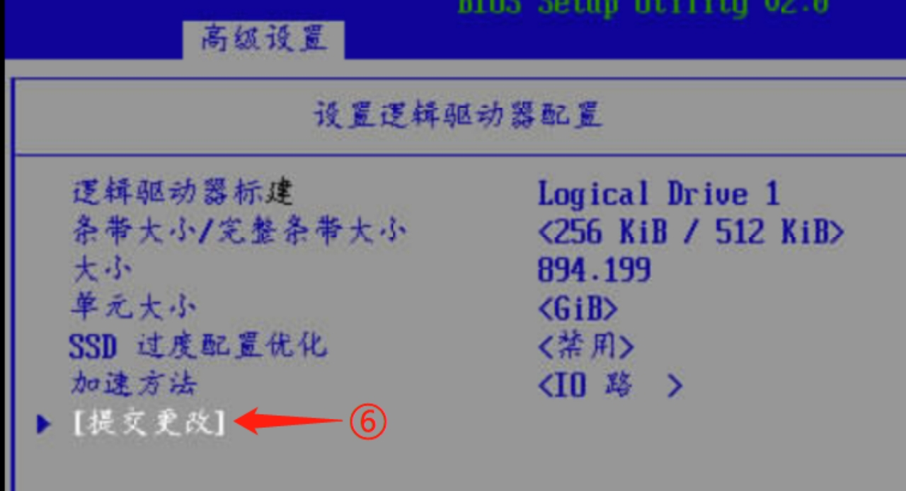

# Linux概述--物理机安装Linux

## 系统镜像获取


http://isoredirect.centos.org/centos/7/isos/

> 例如：
>
> [CentOS7.9.2009 arch](https://mirror-hk.koddos.net/centos-altarch/7.9.2009/isos/aarch64/)
>
> 阿里云镜像
>
> [CentOS7.9.2009 x86](https://mirrors.aliyun.com/centos/7.9.2009/isos/x86_64/)


## 华为Atlas 500pro


表 2-1 系统版本及适配信息
| 名称           | 内容                                                         |
| -------------- | ------------------------------------------------------------ |
| 操作系统型号   | CentOS-7-aarch64-Everything-2009.iso                         |
| 操作系统版本   | CentOS Linux release 7.9.2009 (AltArch)                      |
| 服务器硬件配置 | 内存:128GiB 磁盘: 5.2TiB（RAID1） CPU: Kunpeng 920 24 Core@2.6GHz |
| 服务器型号     | 华为主机 ATlas500 Pro                                        |


将个人电脑用网线直连华为Atlas 500pro服务器的Mgmt网口，并且新增个人电脑的IP，新增IP地址端是192.168.2.xxx（除192.168.2.100之外）。打开谷歌浏览器，输入网址：https://192.168.2.100/


点击“高级”，选择“[继续前往192.168.2.100（不安全）](chrome-error://chromewebdata/)”，就进入Mgmt的登入界面


输入用户名：Administator	密码：Admin@9000

登入完成之后，启动控制台


### RAID 1的配置

为了进行冗余，因此将服务器上四块磁盘进行两两的Raid 1的配置。

等待机器重启当中，等机器进入如图1-4所示界面之后，按下键盘”F4”按键，进入BIOS设置界面，此时会提示输入密码。如图1-5所示，该密码是：Admin@9000，按下回车键之后，有可能会出现提示您，建议修改密码如图1-6，不用理会，直接按回车键，稍等之后，进入如图1-7界面，选择“中文”直接按下回车键，之后，再按照图1-8所示的步骤进行操作。


之后进入raid的配置界面。选择界面中“阵列配置”→“创建阵列”，进入如图1-9的界面（界面中磁盘大小等以实际为主），选择其中两块大小一致的磁盘（按空格键选中）。按照图1-9图1-10图1-11图1-12所示的步骤进行操作。





#### centos7操作系统安装

Ø 系统版本号：CentOS Linux release 7.9.2009 (AltArch)

Ø 系统内核版本：4.18.0-193.28.1.el7.aarch64

Ø 安装软件(自带)：GUI和FTP

Ø 磁盘分区方案：硬件RAID1和软件的LVM


### 挂载虚拟光驱

进入控制之后进入控制台，在按照图1-13所示的步骤进行操作，添加操作系统镜像，之后点击“连接”


连接成功之后，如图1-14所示：

 

图 1-14

之后在按照图1-15所示进行操作，操作完成之后在按照图1-16进程操作：


等待机器进行重启。

### 安装操作系统

等待重启中，直到出现如图1-17所示为止，中间都不需要进行操作。

然后按照图1-17上所示进行选择，并按下回车键进行确认。


### 选择安装时使用的语言

选择确认之后，等到图1-18所示的界面，并安装上面的步骤进行选择。


点击继续之后，进行安装信息摘要部分，

### 选择软件安装

软件选择，安装如图1-19所示选择：

 


### 进行手动磁盘分区

安装目标位置(磁盘分区)，如图1-20所示

 

点击完成之后，进入手动分配各个分区的界面，如图1-21所示，并按照图1-21所示的步骤进行操作。


图 1-21

之后，删除所有的系统分区，删除步骤如图1-22(不要一次性删除完，保留一个，添加新的分区之后再删除这个)。


之后添加系统的各个分区，安装如下的顺序进行分区和分配大小。

Ø /boot/efi  4GB

Ø /boot   10GB

Ø Swap   128GB

Ø /     剩余所有容量

并且所有的系统分区都在同一磁盘组下。具体的操作步骤，如图1-25、图1-26、图1-27、图1-28所示。

 

图 1-23

 

图 1-24

重复图1-23、图1-24所示的步骤，将其他系统分区建立，建立“/”分区的时候，可以不填写期望容量。建立完成之后，如图1-25所示。

 

图 1-25

所有分区建立完成之后，点击上方的完成按键。弹出如图1-26所示，选择“接受更改”。

 

图 1-26

### 网络配置

可以在安装的时候，就配置网络的IP地址和子网掩码。如果不在该处配置，也可参考第1.3.9章节的配置，进行网络地址的配置。IP地址等信息根据实际情况配置。

在安装界面上选择“网络与主机名(N)”，如图1-27所示。

 

图 1-27

点击之后，选择第一个电口作为后面连接交换机的网口，即选择”enp125s0f4”进行配置，具体配置步骤，参数图1-28、图1-29、图1-30、图1-31和图1-32所示：

 

图 1-28

 

图 1-29

 

图 1-30

 

图 1-31

 

图 1-32

自动回到安装信息摘要的界面，点击右下角的“开始安装”

### 设置root密码和新建普通用户

设置root密码为：jysp，由于密码过于简单，需点击两次完成按键才能设置成功，具体步骤如图1-33和图1-34所示。

 

图 1-33

 


新建普通用户如图1-35所示.同样，如果设置的密码过于简单，也是要点击两次完成按键才可设置成功，新建的普通用户：jysp，jysp密码：jydw

 

图 1-35

等待操作系统安装完成之后点击“重启”。

### 关闭防火墙和selinux

直接在Mgmt的控制台上用root用户登入服务器。

按照图1-36所示，先停掉防火墙，并检查是否已停止，然后重开机自启中删除掉防火墙。


Ø 暂停防火墙：systemctl stop firewalld.service 

Ø 查看防火墙当前状态：systemctl status firewalld.service

Ø 删除防火墙开机自启：systemctl disable firewalld.service

 

图 1-36

临时关闭selinux命令：

 setenforce 0

永久关闭selinux，修改/etc/selinux/config文件，将

SELINUX=enforcing  修改为  SELINUX=disable

### 修改网络配置网络并启动网络（补充说明）

(1) 修改网卡配置文件修改IP地址

华为服务器正常是四个光口，两电口，现启用其第一个电口网口

修改配置文件/etc/sysconfig/network-scripts/ifcfg-enp125s0f4，将

BOOTPROTO=dhcp 修改为 BOOTPROTO=static

ONBOOT=on 修改为 ONBOOT=yes 

并新增：

IPADDR=192.168.1.66  #根据实际IP修改

NETMASK=255.255.255.0 #根据实际的子网掩码进行修改

修改之后如图1-37所示

 

(2) 图形化界面修改网络

如通过显示屏直连服务器，可在图形化界面上对服务器的IP地址进行配置。如图1-38、图1-39、图1-40和图1-41所示的操作步骤，当网线未插到第一个电口时，该电口配置显示“线缆已拔出”，具体的IP地址和子网掩码需根据实际情况填写(图中为示例)。

 

图 1-38

 

图 1-39

 

图 1-40

 

图 1-41

修改完成之后，重启一下网络：

systemctl restart network

之后用网线连接服务器的第一个电口，并测试网络是否正常。   

### 基础组件安装

如表2-1所示，汇总了安装的基础组件的相关信息，

表2-1

| 基础组件名称       | 版本                     | 操作和CPU架构  |
| ------------------ | ------------------------ | -------------- |
| MySQL              | 8.0.29-1.el7.aarch64     | Centos7（ARM） |
| Rabbitmq           | 3.8.34-1.el8.noarch      | Centos7（ARM） |
| Redis              | 5.0.9                    | Centos7（ARM） |
| Nginx              | 1.12.2-3.el7.aarch64     | Centos7（ARM） |
| Mqtt（emqx）       | 5.0.2-el7-arm64          | Centos7（ARM） |
| Influxdb           | 1.7.9_linux_arm64        | Centos7（ARM） |
| Vsftp              | 3.0.2-28.el7.aarch64     | Centos7（ARM） |
| Docker             | 18.06.3.ce-3.el7.aarch64 | Centos7（ARM） |
| Docker-compose     | 1.26.0-arm64             | Centos7（ARM） |
| Exagear            | 1169-1                   | Centos7（ARM） |
| Exagear for docker | 1169-1                   | Centos7（ARM） |

 

 

#### 配置yum源

Ø 系统版本：CentOS Linux release 7.9.2009 (AltArch)

Ø 配置方式：配置本地源

(1) 上传镜像并挂载

配置yum源，主要是解决某些软件安装时需要解决的依赖软件，或者解决某些Centos镜像中自带的软件库中已有的软件(如ftp,内核源码等)。

将CentOS-7-aarch64-Everything-2009.iso镜像文件上传到服务器上(可放在jysp用户的家目录下)，并在该上传的目录下执行挂载镜像的命令（当服务器重启，该挂载失效，需重新挂载。）：

```
mount -s CentOS-7-aarch64-Everything-2009.iso /media/
```

执行结果如图2-1所示

 

(2) 修改配置文件

在/etc/yum.repos.d/目录下新建目录bak，然后将yum.repo.d目录下的所有文件都移动到bak目录下。之后/etc/yum.repos.d/目录下新建文件CentOS-iso.repo，并写入：

```
[base]
name=CentOS-7 - iso
baseurl=file:///media
gpgcheck=0
enabled=1
```

 

保存退出之后，执行yum 软件包缓存更新命令(如图2-3所示)：

yum makecache  

 


## U盘物理机安装

### 制作启动盘

rufus工具制作

官网下载https://rufus.ie/zh/


