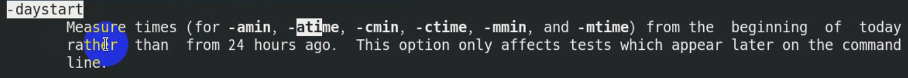

# 任务背景


# 任务要求

1. 掌握Linux下如何根据需求**查找文件**

2. 熟悉Linux下文件**打包压缩工具使用**

# 任务分解

1. 知道Linux下查找文件的相关命令工具有哪些

2. 知道Linux下打包压缩工具有哪些，有什么特点

3. 掌握相关工具使用

# 任务实施

## 一、Linux下文件查找命令

### 1、 命令查找

Linux下一切皆文件！

`which 命令` ：找出命令的绝对路径

`whereis 命令` ：找出命令的路径以及文档手册信息

```powershell
[root@heima ~]# which mkdir
/usr/bin/mkdir

[root@heima ~]# whereis mkdir
mkdir: /usr/bin/mkdir /usr/share/man/man1/mkdir.1.gz /usr/share/man/man1p/mkdir.1p.gz
/usr/share/man/man2/mkdir.2.gz /usr/share/man/man3p/mkdir.3p.gz
```


### 2、文件查找(==find==)

`find 命令`：**精确**查找，磁盘搜索，IO读写，cpu开销大

#### 用法1：找出来输出到屏幕

**==根据需求==**查找出来直接输出到屏幕

find 查找路径 选项 关键字

| 常见选项   | 含义                     | 备注                            |
| ---------- | ------------------------ | ------------------------------- |
| ==-name==  | 按照文件名查找文件       |                                 |
| ==-iname== | 按照文件名忽略大小写查找 |                                 |
| ==-size==  | 按照文件大小来查找       | +1M 大于1M -1M 小于1M 1M 等于1M |
| ==-type==  | 按照文件类型来查找       |                                 |
| ==-mtime== | 按文件修改时间来查找文件 | -n指n天以内，+n指n天以前        |
| -atime     | 按文件访问时间来查       |                                 |
| -ctime     | 按文件创建时间来查找文件 |                                 |
| -perm      | 按照文件权限来查找文件   |                                 |
|            |                          |                                 |

```powershell
举例说明：

0）环境准备
# mkdir /test
# touch /test/file1
# touch /test/FILE1
# cp -a /home/heima/* /test/


1）根据文件名查找
[root@heima ~]# find /test -name "file1"
[root@heima ~]# find /test -iname "file1"
[root@heima ~]# find /etc -name "*.conf"


2）根据文件类型查找
[root@heima ~]# find /usr/bin/ -type l		查找连接
[root@heima ~]# find /dev -type b			查找块设备
[root@heima ~]# cd /test
[root@heima test]# find . -type d			查找目录
[root@heima test]# find . -type f			查找文件


3）根据文件大小查找
[root@heima test]# find . -type f -size +1M
[root@heima test]# find . -type f -size -1M
[root@heima test]# find . -type f -size -1024k
[root@heima test]# find . -type f -size 9M
注意：-size -1M 当文件中没有小于1M的文件的时候，会变成查找-size -1k


4）根据文件属性（权限，创建者和所属组）
[root@heima test]# find . -user heima -group heima -type f
一般省略 -a: find . -user heima -a -group heima -a -type f 代表同时满足
[root@heima test]# find . -type f -perm 644
```

==-mtime选项举例：==

按文件修改时间来查找文件




```powershell
[root@heima test]# find ./ -type f -mtime +2
[root@heima test]# find ./ -type f -mtime -2
[root@heima test]# find ./ -type f -mtime 2
注意：这里的天数需要满24小时为一天的
find ./ -type f -daystart -mtime +2
```


#### 用法2：找出来执行命令

**根据需求**查找出来后==执行某个动作(命令)==

`find 路径 选项 关键字 动作`

| 常见动作 | 说明                                            |
| -------- | ----------------------------------------------- |
| -exec    | 对查找到的文件==直接==执行该参数后的shell命令   |
| -ok      | 对查找到的文件==询问式==执行该参数后的shell命令 |
| -delete  | 删除查找到的文件                                |
| -ls      | 列出查找到的文件,详细信息                       |
| -print   | 打印出查找到的文件（默认选项）                  |
|          |                                                 |

**举例说明：**


```powershell
语法结构：
注意：
1. -exec或者-ok后面写完命令必须以空格反斜杠\;结尾（ \;）
2. {}表示find命令所找出来的内容

find /test/ -type f -ok cp {} /tmp \;
```


## 二、Linux下文件压缩工具

### 1、常见的压缩与解压缩工具

| 压缩工具 | 说明                                                         | 解压缩工具 |
| -------- | ------------------------------------------------------------ | ---------- |
| zip      | 兼容类unix与windows，可以压缩多个文件或目录                  | unzip      |
| gzip     | 压缩单个文件，压缩率相对低，cpu开销相对低                    | gunzip     |
| bzip2    | 压缩单个文件，压缩率相对高，cpu开销相对高                    | bunzip2    |
| xz       | 压缩单个文件，压缩率高，压缩时间相对长，解压速度快，cpu开销高 | unxz       |
|          |                                                              |            |

### 2、工具的用法

#### **①** zip工具

```powershell
压缩：
zip 压缩后的文件 需要压缩的文件

选项：
-r 递归压缩,压缩目录

注意：zip压缩默认压缩后的格式就是.zip；当然也可以加后缀.zip,一般都加上

解压缩：
-d 指定解压缩路径


示例：
# 压缩多个目录下的文件，和文件夹
zip -r /tmp/test_passwd.zip /test/ /etc/passwd
# 压缩目录需要 添加递归压缩指令 -r 递归压缩
zip -r /tmp/test.zip /test/

# 解压到当前目录
unzip test.zip
# 解压到指定目录
unzip -d test_passwd.zip
```

#### ② gzip工具

```powershell
压缩：
gzip 需要压缩的单个文件

选项：
-d 解压缩
-r 递归压缩（目录）

解压缩：
gunzip 需要解压的文件
或者
gzip -d 需要解压的文件

gunzip file* 一次解压多个文件，*代表通配符；file*表示以file开头所有文件


示例：
# 只支持单个文件 默认会添加 .gz后缀
gzip file1
# 压缩多个单文件 file1.gz file2.gz file 3.gz 
gzip file1 file2 file3
# 递归压缩单个文件
gzip -r test
```

#### ③ bzip2工具

```powershell
压缩：
bzip2 需要压缩的文件

选项：
-d 解压缩
```

#### ④ xz 工具

```powershell
选项：
-z 压缩,默认
-d 解压缩 或者 unxz


压缩： 
xz 文件名
解压缩：
unxz 文件名
或者
xz -d 文件名
```

## 三、Linux下文件打包工具

`tar`命令：可以将==多个文件==打包成一个==并且压缩==，**==不会改变文件的属性==**，很常用。

用法：

`tar 选项 打包后的文件 需要打包的文件`

| 常用选项 | 说明                  |
| -------- | --------------------- |
| ==-c==   | ==创建tar包（打包）== |
| ==-z==   | ==调用gzip工具压缩==  |
| -j       | 调用bzip2工具压缩     |
| -J       | 调用xz工具压缩        |
| ==-v==   | ==显示详细信息==      |
| ==-f==   | ==指定包名==          |
| ==-x==   | ==解压==              |
| -C       | 指定解压路径          |
| -t       | 列出或查看tar包内容   |
| -r       | 往tar包里追加文件     |
|          |                       |

**注意说明：**

```powershell
1. 以上选项前面的横杠"-"可以省略
2. 如果已经将文件压缩打包，那么就不能追加；如果只是打包就可以追加。
3. 参数顺序需要注意，最好把-f参数放到所有参数后面。
4. 当出现以下提示时，加一个大P参数解决。
tar: Removing leading `/' from member names
```


```powershell
示例：打包、解压
# 使用gz工具、打包、显示过程、指定文件名称，压缩当前目录下所有文件
tar -zcvf /tmp/test.tar.gz *

# 解压时可以省略 打包工具
tar -xf /tmp/test.tar.gz -C /dir1/

tar -cvJf /tmp/boot_test.tar.xz /test/ /boot/
tar -PcvJf /tmp/boot_test.tar.xz /test/ /boot/
```


```powershell
示例:tar包预览、追加
tar cvf /tmp/test.tar ./*

# 列表查看tar包中的文件, -t 
tar -tf /tmp/test.tar

# 追加文件, -r
tar -Pf /tmp/test.tar -r /etc/hosts
tar -tf /tmp/test.tar
```


# 扩展补充

## 日期相关指令

### ==1、date命令（重点）==

`date` :**打印**或者**设置**当前系统日期和时间

`date --help` 自己先求帮助

```powershell
用法：date [选项]... [+格式]
　或：date [-u|--utc|--universal] [MMDDhhmm[[CC]YY][.ss]]
Display the current time in the given FORMAT, or set the system date.
 
Mandatory arguments to long options are mandatory for short options too.
  -d, --date=STRING         display time described by STRING, not 'now'
  -f, --file=DATEFILE       like --date once for each line of DATEFILE
  -I[TIMESPEC], --iso-8601[=TIMESPEC]  output date/time in ISO 8601 format.
                            TIMESPEC='date' for date only (the default),
                            'hours', 'minutes', 'seconds', or 'ns' for date
                            and time to the indicated precision.
  -r, --reference=文件          显示文件指定文件的最后修改时间
  -R, --rfc-2822                以RFC 2822格式输出日期和时间
                                例如：2006年8月7日，星期一 12:34:56 -0600
      --rfc-3339=TIMESPEC   output date and time in RFC 3339 format.
                            TIMESPEC='date', 'seconds', or 'ns' for
                            date and time to the indicated precision.
                            Date and time components are separated by
                            a single space: 2006-08-07 12:34:56-06:00
  -s, --set=STRING          set time described by STRING
  -u, --utc, --universal    print or set Coordinated Universal Time (UTC)
      --help            显示此帮助信息并退出
      --version         显示版本信息并退出

给定的格式FORMAT 控制着输出，解释序列如下：

  %%    一个文字的 %
  %a    当前locale 的星期名缩写(例如： 日，代表星期日)
  %A    当前locale 的星期名全称 (如：星期日)
  %b    当前locale 的月名缩写 (如：一，代表一月)
  %B    当前locale 的月名全称 (如：一月)
  %c    当前locale 的日期和时间 (如：2005年3月3日 星期四 23:05:25)
  %C    世纪；比如 %Y，通常为省略当前年份的后两位数字(例如：20)
  %d    按月计的日期(例如：01)
  %D    按月计的日期；等于%m/%d/%y
  %e    按月计的日期，添加空格，等于%_d
  %F    完整日期格式，等价于 %Y-%m-%d
  %g    ISO-8601 格式年份的最后两位 (参见%G)
  %G    ISO-8601 格式年份 (参见%V)，一般只和 %V 结合使用
  %h    等于%b
  %H    小时(00-23)
  %I    小时(00-12)
  %j    按年计的日期(001-366)
  %k   hour, space padded ( 0..23); same as %_H
  %l   hour, space padded ( 1..12); same as %_I
  %m   month (01..12)
  %M   minute (00..59)
  %n    换行
  %N    纳秒(000000000-999999999)
  %p    当前locale 下的"上午"或者"下午"，未知时输出为空
  %P    与%p 类似，但是输出小写字母
  %r    当前locale 下的 12 小时时钟时间 (如：11:11:04 下午)
  %R    24 小时时间的时和分，等价于 %H:%M
  %s    自UTC 时间 1970-01-01 00:00:00 以来所经过的秒数
  %S    秒(00-60)
  %t    输出制表符 Tab
  %T    时间，等于%H:%M:%S
  %u    星期，1 代表星期一
  %U    一年中的第几周，以周日为每星期第一天(00-53)
  %V    ISO-8601 格式规范下的一年中第几周，以周一为每星期第一天(01-53)
  %w    一星期中的第几日(0-6)，0 代表周一
  %W    一年中的第几周，以周一为每星期第一天(00-53)
  %x    当前locale 下的日期描述 (如：12/31/99)
  %X    当前locale 下的时间描述 (如：23:13:48)
  %y    年份最后两位数位 (00-99)
  %Y    年份
  %z +hhmm              数字时区(例如，-0400)
  %:z +hh:mm            数字时区(例如，-04:00)
  %::z +hh:mm:ss        数字时区(例如，-04:00:00)
  %:::z                 数字时区带有必要的精度 (例如，-04，+05:30)
  %Z                    按字母表排序的时区缩写 (例如，EDT)

默认情况下，日期的数字区域以0 填充。
The following optional flags may follow '%':

  -  (hyphen) do not pad the field
  _  (underscore) pad with spaces
  0  (zero) pad with zeros
  ^  use upper case if possible
  #  use opposite case if possible

在任何标记之后还允许一个可选的域宽度指定，它是一个十进制数字。
作为一个可选的修饰声明，它可以是E，在可能的情况下使用本地环境关联的
表示方式；或者是O，在可能的情况下使用本地环境关联的数字符号。

Examples:
Convert seconds since the epoch (1970-01-01 UTC) to a date
  $ date --date='@2147483647'

Show the time on the west coast of the US (use tzselect(1) to find TZ)
  $ TZ='America/Los_Angeles' date

Show the local time for 9AM next Friday on the west coast of the US
  $ date --date='TZ="America/Los_Angeles" 09:00 next Fri'

GNU coreutils online help: <http://www.gnu.org/software/coreutils/>
请向<http://translationproject.org/team/zh_CN.html> 报告date 的翻译错误
要获取完整文档，请运行：info coreutils 'date invocation'
```


#### ① 打印日期或时间

```powershell
打印系统当前日期或时间
[root@heima ~]# date
[root@heima ~]# date +%D
[root@heima ~]# date +%F
[root@heima ~]# date +%Y-%m-%d
[root@heima ~]# date +%T
[root@heima ~]# date +%X
[root@heima ~]# date +'%F %X'
[root@heima ~]# date +%c
打印系统非当前日期或时间
[root@heima ~]# date -d '+3days' +%F
[root@heima ~]# date -d '-3days' +%F
[root@heima ~]# date -d '3days' +%F
[root@heima ~]# date -d '3days ago' +%F
[root@heima ~]# date --date='30days' +%F


[jysp@jysp ~]$ date +'%Y %m %d'
2023 11 01
[jysp@jysp ~]$ date +%T
10:32:06
[jysp@jysp ~]$ date +%X
10时32分14秒
[jysp@jysp ~]$ date +%F %X
date: 额外的操作数 "%X"
Try 'date --help' for more information.
[jysp@jysp ~]$ date +'%F %X'
2023-11-01 10时32分30秒
[jysp@jysp ~]$ date +%c
2023年11月01日 星期三 10时33分10秒
[jysp@jysp ~]$ date -d
date：选项需要一个参数 -- d
Try 'date --help' for more information.
[jysp@jysp ~]$ date -d '+3days' +%F
2023-11-04
[jysp@jysp ~]$ date -d '+3days' +%c
2023年11月04日 星期六 10时34分06秒
[jysp@jysp ~]$ date -d '-3days' +%F
2023-10-29
[jysp@jysp ~]$ date -d '3days ago' +%F
2023-10-29
[jysp@jysp ~]$ date -d '3days' +%F
2023-11-04
[jysp@jysp ~]$ date --date='30days' +%F
2023-12-01
[jysp@jysp ~]$ 
```


#### ② 设置系统日期或时间

```powershell
选项：-s 设置当前系统时间，只有root权限才能设置，其他只能查看。
date -s 20200523 设置成20100523，这样会把具体时间设置成空00:00:00
date -s "01:01:01 2020-05-2" 这样可以设置全部时间
date -s "01:01:01 20200523" 这样可以设置全部时间
date -s "2020-05-23 01:01:01" 这样可以设置全部时间
date -s "20200523 01:01:01" 这样可以设置全部时间

注意：
红帽8，设置为过去的时间，过段时间会被重置为当前时间
```


#### ③ 系统时间同步硬件时间

`hwclock` :查看并且设置硬件时间

```powershell
选项：
# 设置系统时间：从硬件时间同步到系统时间
-s, --hctosys set the system time from the RTC
# 设置硬件时间：从系统时间同步到硬件时间
-w, --systohc set the RTC from the system time
# 查看硬件时间
-l, --localtime the RTC timescale is Local


举例说明：
[root@heima ~]# hwclock --hctosys
[root@heima ~]# hwclock
2019-06-23 18:44:10.377920+08:00

[root@heima ~]# date
2019年 06月 23日 星期日 18:44:21 CST
[root@heima ~]# date -s "20221010 12:12:12"
2022年 10月 10日 星期一 12:12:12 CST
[root@heima ~]# date
2022年 10月 10日 星期一 12:12:14 CST
[root@heima ~]# hwclock
2019-06-23 18:45:01.368135+08:00
[root@heima ~]# hwclock --systohc
[root@heima ~]# hwclock
2022-10-10 12:12:43.179274+08:00
```


`timedatectl`

```powershell
# 从7开始就有
timedatectl -h 设置和查看系统的时间和日期（设置时区以及开启或关闭ntp服务）

# 查看当前时间
[jysp@jysp ~]$ timedatectl status
      Local time: 三 2023-11-01 10:47:08 CST
  Universal time: 三 2023-11-01 02:47:08 UTC
        RTC time: 三 2023-11-01 02:47:42
       Time zone: Asia/Shanghai (CST, +0800)
     NTP enabled: yes
NTP synchronized: no
 RTC in local TZ: no
      DST active: n/a
# 关闭NTP同步
timedatectl set-ntp no

# 设置时间:系统时间、硬件时间
timedatectl set-time 2020-10-10
timedatectl set-time 11:11:11
timedatectl list-timezones
timedatectl set-timezone xxx


# 同步当前时间
# 6版本中
ntpdate

# 8版本中
timedatectl set-ntp yes
timedatectl status
chronyc makestep
```

 

#### ④ 应用案例

> 有时候我们需要用到当前的系统时间，如何调用？比如以当前系统日期命名创建目录或文件

```powershell
2020-10-10.log.tar.gz
2020-10-11.log.tar.gz
$()：括号里面的命令优先执行 	date +%F 		2019-06-23
`` ：引号里面的命令优先执行，不允许嵌套

创建目录和文件，以当前系统日期命名
[root@heima ~]# mkdir $(date +%F)
[root@heima ~]# touch $(date -d '+3days' +%Y%m%d).log
```

### 2、cal命令（了解）

`cal` :查看日历

```powershell
用法：
 cal [选项] [[[日] 月] 年]

选项：
 -1, --one        只显示当前月份(默认)
 -3, --three      显示上个月、当月和下个月
 -s, --sunday     周日作为一周第一天
 -m, --monday     周一用为一周第一天
 -j, --julian     输出儒略日
 -y, --year       输出整年
 -V, --version    显示版本信息并退出
 -h, --help       显示此帮助并退出

```


```powershell
cal 或者 cal -1 		表示直接输出当前月份的日历
cal -3 				 表示输出上一个月+本月+下个月的日历
cal -y 年份 			表示输出某一个年份的日历
```

# 今日目标打卡

- [ ] 能够使用find命令根据**文件类型**查找文件

- [ ] 能够使用find命令根据**文件的修改时间**来查找文件

- [ ] 能够使用find命令根据**文件的大小**来查找文件

- [ ] 能够使用gzip、bzip2、xz相关工具对文件进行压缩和解压缩

- [ ] 能够使用tar工具进行打包压缩文件

- [ ] 能够使用date命令查看和设置系统时间