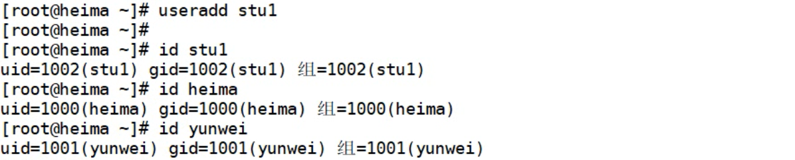
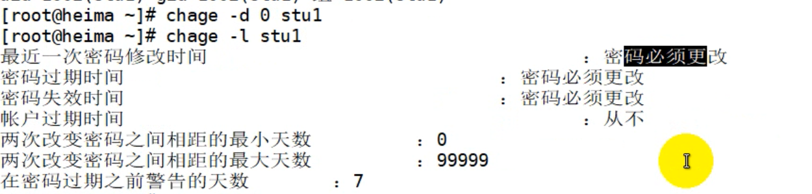
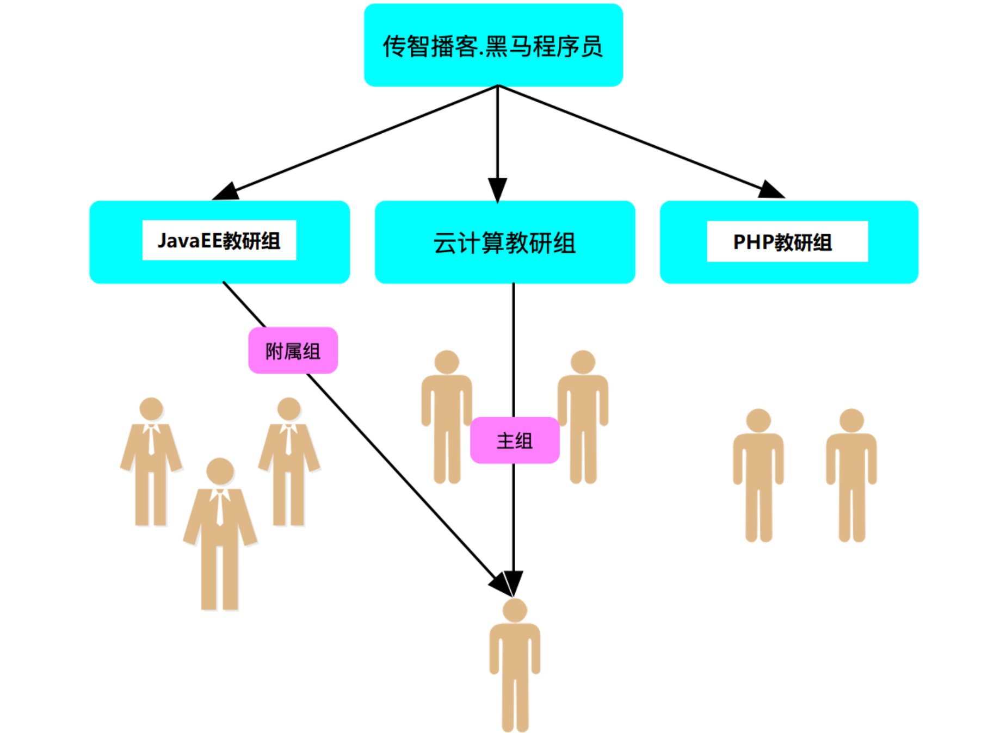

# 任务背景


# 任务要求

1. 给开发部门的同事每人创建一个账号，在跳板机

2. 加入到coding组里

# 任务分解

1. 创建coding组

2. 创建用户并加入到coding组里

3. 给每个账号设置密码

# 理论储备

## 一、Linux下用户管理

### ㈠ 用户概念及作用(了解)

**用户：**指的是==Linux操作系统中==用于管理系统或者服务的==人==

一问：管理系统到底在**管理什么**？

答：Linux下一切皆**文件**，所以用户管理的是相应的==文件==

二问：**如何管理**文件呢？

答：

1. 文件==基本管理==，比如文件的创建、删除、复制、查找、打包压缩等；文件的权限增加、减少等；

2. 文件==高级管理==，比如**程序文件**的安装、卸载、配置等。终极目的是对外提供稳定的服务。


### ㈡ 用户的分类(了解)

#### 1、超级用户

- 超级用户，也叫管理员，**==root==**。该用户(root)具有==所有权限==，==UID=0==并且绝对只能是0。

#### 2、系统用户

- 系统用户，也叫程序用户。一般都是由程序创建，用于程序或者服务运行时候的身份。

- 默认==不允许登录系统==。==1<=UID<=499==

- 比如后面要学的web服务的管理用户apache，文件共享ftp服务的管理用户ftp等

**注意：Centos7/RHEL8中，系统用户UID范围**：==1<=UID<=999==


#### 3、普通用户

- 普通用户，一般都是由管理员创建，用于==对系统进行有限的管理维护操作==。

- 默认可以登录系统。==500<=UID<=60000==

**注意：Centos7/RHEL8中，普通用户UID范围**：==1000<=UID<=60000==

==**特别说明**：==

1. 用户指的是操作系统上==管理系统或服务==的==人==，是人，就有相关的==属性信息==

2. 用户的属性信息包括但不限于，如：==家目录、唯一身份标识(UID)、所属组(GID)==等

3. 今天我们讨论的用户指的是==普通用户==，即由管理员创建的用户

### ==㈢ 用户的基本管理(掌握)==

#### 1、创建用户(useradd)

##### (1) 基本语法和选项

```powershell
useradd [选项] 用户名
常用选项：
-u 指定用户uid，唯一标识，必须唯一
-g 指定用户的默认组(主组)
-G 指定用户附加组(一个用户可以加入多个组，但是默认组只有一个)
-d 指定用户家目录(每个用户都有一个自己的家，并且默认在/home/xxx)
-s 指定用户默认shell


查看系统支持的shell(命令解释器)
[root@heima ~]# cat /etc/shells
/bin/sh 软连接文件
/bin/bash 系统默认的解释器
/usr/bin/sh 软连接文件
/usr/bin/bash 系统默认的解释器


其他shell：
/sbin/nologin 不能登录操作系统，也叫非交互式shell
/bin/dash
/bin/tcsh
/bin/csh
```

##### (2) 举例说明

###### ① 创建默认用户

```powershell
创建一个用户stu1
[root@heima ~]# useradd stu1
查看用户信息
[root@heima ~]# id stu1
uid=501(stu1) gid=501(stu1) groups=501(stu1)


注意：当创建一个默认用户时，系统会给该用户以下东西，以stu1为例说明


1）用户的UID(唯一标识) 501（系统自动分配）
2）用户的默认组(主组) stu1组，默认跟该用户的用户名一致；组ID(501),默认和用户UID一致
3）用户的家目录 /home/stu1
4）拷贝相应的文件到用户的家里
[root@heima ~]# su - stu1
[stu1@localhost ~]$ ls -a
. .. .bash_logout .bash_profile .bashrc .gnome2 .mozilla
```



###### ② 根据需求创建用户

1、创建用户，不允许登录

2、创建用户，指定家目录

```powershell
1. 创建用户stu2，但是不能登录操作系统
注意：-s 指定用户的默认shell，/sbin/nologin表示不能登录系统，也叫非交互
[root@heima ~]# useradd -s /sbin/nologin stu2
验证：
[root@heima ~]# id stu2
uid=502(stu2) gid=502(stu2) groups=502(stu2)
切换用户失败，说明该用户不能登录系统
[root@heima ~]# su - stu2
This account is currently not available.


2. 创建用户stu2，同时指定该用户的家目录为/rhome/stu2
注意：-d 指定用户的家目录，前提该用户家目录的上一级目录/rhome必须存在


[root@heima ~]# mkdir /rhome
[root@heima ~]# useradd -d /rhome/stu2 stu2
[root@heima ~]# id stu2
uid=502(stu2) gid=502(stu2) groups=502(stu2)
说明：指定stu2家目录/rhome/stu2时，只需要/rhome存在即可，系统会默认在/rhome下创建stu2目录
自己创建的目录中没有 “家具文件”，可以从 /etc/skel/ 下拷贝到家中即可
```


#### 2、用户密码设置(passwd)

两个方式：

1.交互式：`passwd 用户名`

2.非交互：`echo 密码|passwd --stdin 用户名`

```powershell
passwd 用户名 表示给指定用户修改密码
passwd 直接回车 表示给当前用户修改密码


[root@heima ~]# passwd stu1
Changing password for user stu1.
New password: 密码不显示
BAD PASSWORD: it is WAY too short
BAD PASSWORD: is too simple
Retype new password: 密码不显示
passwd: all authentication tokens updated successfully.


说明：
1.管理员root可以给任何用户修改密码
2.普通用户可以自己给自己修改密码，但是密码复杂度要符合规范


[root@heima ~]# echo 123|passwd --stdin stu2
更改用户 stu2 的密码 。
passwd：所有的身份验证令牌已经成功更新。

说明：使用这种方法不用交互可以直接设置成功，一般用于脚本中。
管道符“|”一般是将上一个命令的输出作为标准输入交给下一个命令
--stdin 标准输入
```

##### ① 保存用户信息的文件

/etc/passwd

/etc/shadow

```powershell
1. 用户信息保存文件/etc/passwd
了解相关配置文件内容，可以通过求man文档解决，即 man 5 passwd

以冒号:分割为7列，如下：
account --> stu1 用户名称
password --> x 密码,将密码单独存放在另外一个文件中
UID --> 501 用户ID
G  ID --> 501 组ID
GECOS --> 用户自定义,描述说明
directory --> /home/stu1 用户的家目录
shell --> /bin/bash用户的默认shell,其中/sbin/nologin表示非交互，不能登录系统


2. 用户密码信息保存文件/etc/shadow
了解相关配置文件内容，可以通过求man文档解决，即 man 5 shadow

以冒号:分隔为9列，如下：

login name
	登录的用户名
encrypted password
	加密后的密码;
	!!表示没有设置密码
date of last password change
	最后一次更改密码的天数（距离1970年的1月1日到现在的天数）
	值0有特殊含义，即用户下次登录系统时应更改密码。
minimum password age
	密码的最小生存周期;0表示可以立刻修改密码；如果是3，则表示3天后才能更改密码
maximum password age
	密码的最大生存周期;如果30表示每隔30天需要更新一次密码
password warning period 密码过期前几天发出警告；
	7表示过期前7天开始警告
password inactivity period
	密码的宽限期；如果3表示允许密码过期3天,3天内还能登录系统，但是要求修改密码。3天后（密码过期3天后账户被封锁，
	需要联系管理员）
account expiration date
	账户过期的时间，账户过期的用户不能登录；密码过期用户不能用原来的密码登录。以1970年1月1日算起。
reserved field
	保留
```

② 更改用户的账号信息(chage)

```powershell
chage --help
-d 修改用户最后一次更改密码的时间
-m 修改密码的最小存活期（几天后才能修改密码）
-M 修改密码的最大存活期（每隔多少天更新一次密码）
-W 修改密码过期前警告（过期前几天发出警告）
-I 修改允许密码过期几天
-E 修改账户过期时间
-l 列出账户的信息


举例说明：
查看用户账号的相关信息命令：chage -l stu1
[root@heima ~]# chage -l stu1
Last password change : Mar 04, 2019
Password expires : never
Password inactive : never
Account expires : never
Minimum number of days between password change : 0
Maximum number of days between password change : 99999
Number of days of warning before password expires : 7


修改用户账号的过期时间：2019-03-10过期
[root@heima ~]# chage -E '2019-03-10' stu1
[root@heima ~]# chage -l stu1
Last password change : Mar 04, 2019
Password expires : never
Password inactive : never
Account expires : Mar 10, 2019
Minimum number of days between password change : 0
Maximum number of days between password change : 99999
Number of days of warning before password expires : 7

修改用户账号的过期时间为10天以后：
[root@heima ~]# chage -E $(date +%F -d '+10days') stu1


修改用户登录后需要修改密码
chage -d 0 用户名
```




#### 3、修改用户信息(usermod)

##### ① 基本语法选项

```powershell
usermod [选项] 用户名
常用选项：
-u 指定用户uid，唯一标识，必须唯一
-g 指定用户的默认组(主组)
-G 指定用户附加组(一个用户可以加入多个组，但是默认组只有一个)
-d 指定用户家目录(每个用户都有一个自己的家，并且默认在/home/xxx)
-s 指定用户默认shell
-m 移动用户家目录，和-d一起使用
```

##### ② 举例说明

```powershell
1. 修改stu3用户的UID为1100
[root@heima ~]# usermod -u 1100 stu3

[root@heima ~]# tail -5 /etc/passwd
yunwei:x:1001:1001::/home/yunwei:/sbin/nologin
stu1:x:1002:1002::/home/stu1:/bin/bash
stu2:x:1003:1003::/rhome/stu2:/bin/bash
stu3:x:1100:1004::/rhome/stu3:/bin/bash
stu4:x:1005:1005::/home/stu4:/sbin/nologin


2.修改stu4用户的默认shell为可登录系统
[root@heima ~]# su - stu4
This account is currently not available.
[root@heima ~]# usermod -s /bin/sh stu4
[root@heima ~]# tail -5 /etc/passwd
yunwei:x:1001:1001::/home/yunwei:/sbin/nologin
stu1:x:1002:1002::/home/stu1:/bin/bash
stu2:x:1003:1003::/rhome/stu2:/bin/bash
stu3:x:1100:1004::/rhome/stu3:/bin/bash
stu4:x:1005:1005::/home/stu4:/bin/sh


3.修改stu5用户的家目录
[root@heima ~]# useradd -d /rhome/stu5 stu5
[root@heima ~]# usermod -md /home/stu5 stu5
```

#### 4、删除用*(userdel)

##### ① 基本语法选项

```powershell
userdel [选项] 用户名
常用选项:
-r 删除用户并且移除其家目录和邮箱
-f 强制删除正在登录的用户
```


##### ② 举例说明

```powershell
说明：
创建完用户后，家目录默认在/home/用户名下；用户的邮箱在/var/spool/mail/用户名
1. 删除stu4用户以及家目录
[root@heima ~]# userdel -r stu4
[root@heima ~]# id stu4
id: stu4: No such user


2.强制删除一个正在登录的用户
[root@heima ~]# userdel -r stu5
userdel: user stu5 is currently used by process 7998
[root@heima ~]# id stu5
uid=1101(stu5) gid=1101(stu5) 组=1101(stu5)
[root@heima ~]# userdel -rf stu5
userdel: user stu5 is currently used by process 7998
[root@heima ~]# id stu5
id: “stu5”：无此用户


3. 只删除用户user02，不删除其家目录
[root@heima ~]# userdel stu1
```

### ㈣ 总结

#### 1、创建用户（useradd）

1）useradd 用户名——>家目录/home/用户名、邮箱、UID、默认组（GID）[用户主组]

2）useradd [选项] 用户名字——>常用选项：-d/-s/-u/-g/-G


#### 2、设置用户密码（passwd）

1）passwd 用户名——>给指定的用户（管理员可以给任何人设置任何密码）

2）echo 密码|passwd --stdin 用户名——>非交互式（用于脚本中）

3）用户基本信息和用户密码信息保存文件——>/etc/passwd和/etc/shadow

4）扩展chage命令——>用来修改用户密码信息（账号过期时间、密码最小生存周期等）


#### 3、修改用户信息（usermod）

1）usermod [选项] 用户名——>usermod -md 新家 用户名


#### 4、删除用户(userdel)

1）userdel 用户名——>只删除用户，不删除用户家目录、邮箱等信息

2）userdel -r 用户名——>删除用户以及用户其他信息

3）userdel -f 用户名——>强制删除用户（删除正在登录的用户）


## 二、Linux下组管理

### ㈠ 组和用户的关系(理解)



**核心：**==组的目的是为了方便管理用户==

- 用户是操作系统上管理维护系统或服务的人

- 组是用户的一个==属性信息==

- 任何一个用户==默认都会有==一个==主组==(默认组)

- 一个用户除了主组也==可以有多个其他组==(**附加组**)

**一问：**用户的主组和附加组到底有啥关系呢？

**答：**用户的主组和附加组==半毛钱关系都木有==

**二问：**那要这个主组或者附加组有啥用呢？

**答：**肯定是**有用**的，组的目的是方便管理用户，用户的目的是管理==操作文件==，文件就有==权限==这个属性。

1. 用户要操作一些文件，文件是由用户创建，不同用户创建的文件的==属性信息==也就不一样

2. 文件的属性都有啥呢？比如，文件的==创建者==，文件==属于哪个组==，文件大小，文件时间等

3. 其中，不同用户所创建的==文件的属组==就是==该用户的主组==(默认组)

4. A用户附加组也有可能是其他用户的主组，道理同上（权限章节再细细体会组的作用）


### ==㈡ 组的管理(掌握)==

#### 1、创建组(groupadd)

/etc/group 组信息文件

##### ① 基本语法

```powershell
groupadd [选项] 组名
常用选项：
-g 指定组的GID(编号)，默认唯一
```

##### ② 举例说明

```powershell
1.创建一个组admin
[root@heima ~]# groupadd admin


2.查看组信息
[root@heima ~]# tail -1 /etc/group
admin:x:1005:
说明：关于/etc/group配置文件说明，可以man 5 group找帮助


3.创建一个组sysadmin，指定组的GID为1111
[root@heima ~]# groupadd -g 1001 sysadmin
[root@heima ~]# tail -1 /etc/group
admin:x:1005:
sysadmin:x:1111
```


#### 2、删除组(groupdel)

##### ① 基本语法

```powershell
groupdel 组名
```

② 举例说明

```powershell
[root@heima ~]# groupdel admin
[root@heima ~]# groupdel stu2
groupdel: cannot remove the primary group of user 'stu2'
注意：以上信息说明不能删除属于其他用户的主组
```


#### 3、组成员管理(gpasswd)

/etc/gshadow 组文件

##### ① 基本语法

```powershell
gpasswd [选项] 组名
常见选项：
-a 添加用户到组
-d 从组中删除成员
-A 指定管理员
-M 指定组成员（会覆盖），可以批量添加用户到组中
-r 删除密码


gpasswd 组名 给组设置密码
```

##### ② 举例说明

- 添加用户到组里

  ```powershell
  1. 创建3个用户user01~user03
  2. 将user01添加到sysadmin组里
  方法:1：指定user01用户的附加组为sysadmin（站在用户角度）
  # usermod -G sysadmin user01
  
  
  方法2：使用gpasswd命令添加用户到组里
  # gpasswd -a user01 sysadmin
  -a选项：表示往组里追加用户
  
  # gpasswd -M user02,user03 sysadmin 设置sysadmin组成员为user02,user03
  -M选项：表示覆盖设置组成员（会覆盖原来的成员列表）
  
  # gpasswd -A stu2 admin
  指定admin
  ```

- 删除组成员

  ```powershell
  将user03用户从组sysadmin里移除
  # gpasswd -d user03 sysadmin
  ```


### ㈢ 课堂练习

1. 创建一个admin组，组id为900

2. 创建一个用户tom,并且admin组作为tom用户的附加组（要求在建立用户的时候就完成）,密码为123

3. 创建一个用户jack,要求在建立用户之后使用gpasswd把jack加入到该组，密码为123

4. 给admin组设定一个默认密码为123 （gpasswd命令）

5. 把tom用户设定为admin组的组管理员（gpasswd命令）


### ㈣ 总结

#### 1、创建组（groupadd）

组的信息保存文件——>/etc/group和/etc/gshadow


#### 2、删除组（groupdel）

什么样的组不能删除？——>不能删除属于其他用户的主组


#### 3、管理组成员（gpasswd）

1）添加用户到组里——>gpasswd -a user1 组名 或 gpasswd -M user1,user2,... 组名

2）从组里移除用户——>gpasswd -d user1 组名


# 任务实施

## 一、创建coding组

```powershell
# groupadd coding
```

## 二、创建用户

```powershell
# useradd -G coding lidamao
# useradd -G coding wangergou
```

## 三、给用户设置密码

```powershell
# passwd lidamao
# echo 123|passwd --stdin wangergou
```

# 扩展补充

## 一、文件编辑工具(vim)

- Linux平台下的**文本编辑器：** emacs、nano、gedit、==**vi**、**vim**==

vi（visual editor）编辑器通常被简称为vi，它是Linux和Unix系统上最基本的文本编辑器，类似于Windows 系统下的记事本。学会它后，我们将在Linux 的世界里游刃有余。

- 为什么要学习vim？

  1. 所有的Unix like系统都会**内置**vi文本编辑器，其他的文本编辑器则不一定会存在

  2. 很多软件的编辑接口都会主动调用vi

  3. vim具有==程序编辑==的能力，可以主动以字体颜色辨别语法的正确性，方便程序设计

  4. 程序简单，编辑速度快

  5. vim是vi的升级版

### **㈠** vim编辑器三种模式

#### 1、命令行模式

问：命令行可以干什么？

答：可以进行一些基本的==复制、删除、跳转、撤销、移动==等操作


| 命令     | 含义                                        | 备注                             |
| -------- | ------------------------------------------- | -------------------------------- |
| yy       | 复制光标所在行                              | 3yy表示复制3行                   |
| p(小写p) | 光标所在行后面粘贴                          |                                  |
| P(大写P) | 光标所在行前面粘贴                          |                                  |
| gg       | 光标快速跳到文件首行，并且定位到首字符      | 3gg表示快速跳到文件第3行行首字符 |
| G        | 光标快速跳到文件尾行，并且定位到首字符      |                                  |
| home     | 跳转到行首                                  | Shift+6 即 ^ 符号表示行首        |
| end      | 跳转到行尾                                  | Shitf+4 即 $ 符号表示行尾        |
| dd       | 删除光标所在行                              | 3dd表示删除3行（包括光标所在行   |
| d^       | 从光标位置删至行首，不包括光标位            |                                  |
| d$       | 从光标位置删至行尾，包括光标位，与D作用相同 |                                  |
| dG       | 删除光标所在行以及下面所有行                |                                  |
| dgg      | 删除光标所在行以及上面所有行                |                                  |
| x(小写)  | 删除光标所在字符后面一个字符，3x删除3个字符 | 类似于windows下的delete键        |
| X(大写)  | 删除光标所在字符前面一个字符，3X删除3个字符 | 类似windows下的backspace键       |
| u        | 撤销操作                                    | ctrl+r 取消撤销                  |
|          |                                             |                                  |

##### 举例说明

###### ① 环境准备

1. 删除/tmp/目录里的所有内容

2. 将/etc/passwd文件拷贝到/tmp目录里

```powershell
# rm -rf /tmp/*
# cp /etc/passwd /tmp/
```


###### ② 使用vim工具打开文件

用法1： vim 文件名 默认会进入命令行模式

```powershell
[root@localhost ~]# vim /tmp/passwd
```

用法2： vim +数字 文件名 打开指定的文件，并且将光标移动到指定行

```powershell
[root@localhost ~]# vim +5 /tmp/passwd
```

用法3： vim +/关键字 文件名 打开指定的文件，并且高亮显示关键词

```powershell
[root@localhost ~]# vim +/shutdown /tmp/passwd
```


#### 2、编辑模式

功能：==编辑文件内容==。


#### 3、底行模式

##### ① 如何进入底行模式？

- 命令模式进入底行模式：按冒号 :

- 编辑模式进入底行模式：先按 Esc键 退出到命令模式，然后再按冒号 :

 

#### ② 底行模式能做什么？

1. 保存和退出

   保存文件，命令 :w ；另存为到其他文件，命令 :w 文件名

   保存退出，命令 :wq ;强制保存退出 :wq!

   退出不保存，命令 :q ;强制退出 :q!

   命令 :x 在文件没有修改的情况下，表示直接退出（等价于:q），在文件修改的情况下表

   示保存并退出（:wq）


2. 搜索替换

   ```powershell
   搜索摸索
   :/root n往下匹配;N往上匹配
   
   
   替换模式
   :%s/root/ROOT/ 全文搜索,替换每一行匹配到的第一个关键字
   :%s/root/ROOT/g 全文搜索,替换每一行所有匹配的关键字
   :%s/root/ROOT/gc 交互式替换
   :%s/\/sbin\/nologin/\/bin\/bash/ \转义符
   :%s#/sbin/nologin#/bin/bash#g 更换分隔符
   :7s/shutdown/SHUTDOWN/g 只替换第7行的内容
   取消高亮
   :noh （no highlight）
   ```

   

3. 其他功能

   ```powershell
   临时设置行号
   :set number 或 :set nu
   永久设置行号
   echo "set number" >> /etc/vimrc
   
   :set list 查看控制符
   
   地址定位
   :1,5 w /tmp/5.txt 保存前5行内容到/tmp/5.txt
   :r /tmp/5.txt 在光标所在行下面读取/tmp/5.txt文件内容
   :3r /tmp/5.txt 在当前文本的第3行后读取/tmp/5.txt文件
   :1,8d 删掉文本的1到8行
   :nr !command 在第n行下面读取命令所执行的结果
   :n! command 用命令的执行结果替换第n行内容
   ```

   


### **㈡** vim编辑器三种模式切换


### ㈢ 多窗口编辑问题

==当两个终端同时打开或者意外结束文件时，会产生一个.swap文件 （交换文件）==

#### 举例说明：

你在两个终端同时打开/tmp/passwd文件，会产生/tmp/.passwd.swp。这时，有六个按钮可以使用：

```powershell
O(pen for Read-Only):打开成只读文件。
E(dit):用正常方式打开要编辑的文件，并不会载入暂存文件的内容。这很容易出现两个用户相互改变对方的文件的问题。
R(ecover)：加载暂存文件的内容。
D(elete)：如果你确定这个暂存文件是没有用的，则可以删除。
Q(uit)：不进行任何操作，回到命令行。
A(bort)：忽略这个编辑行为，和Q类似。

需要注意的是：
这个暂存文件不会因为你结束vim后自动删除，必须要手动删除。否则每次打开对应的文件时都会出现这样的提示。
```


### ㈣ 可视化模式（了解）

按键：ctrl + v（可视块）或V（可视行），然后按下↑ ↓ ← →方向键来选中需要

复制的区块，按下y 键进行复制（不要按下yy），最后按下p 键粘贴

退出可视模式按下Esc

```powershell
# 快速注释
ctrl + v
选中区块
I
输入文字
esc

# 快速删除
ctrl + v
选中区块
d
```


### ㈤ 课堂练习

1. 将/etc/passwd 拷贝到/tmp/下面。修改/tmp/passwd,在文件的第15行下添加“hello heima”，光标停留在hello heima上，复制5行，粘贴在文件的最下面，保存；然后全文搜索将“/bin/bash”替换成itcast，保存后面20行到/tmp/passwd.bak,退出编辑。

2. 查找/etc/下面的所有目录，并将其重定向到/tmp/etcdir文件里

3. 在/tmp/etcdir文件中追加“好好学习，天天向上”，然后把/etc/passwd文件的内容添加到/tmp/etcdir文件里面，并重命名为newetcdir


**今日目标打卡**

- [ ] 能够根据需求创建普通用户

- [ ] 能够根据需求修改用户基本信息

- [ ] 能够将用户加入到指定组里

- [ ] 能够使用两种方法给用户设置密码

- [ ] 能够删除用户

- [ ] 能够创建并删除组

- [ ] 能够使用vim编辑器修改并保存文件


# 课后实战

## 作业1

1. 创建一个公司itcast，3个部门财务(cw)，人事(rs)，市场(sc)

   说明：==实际是创建4个组==，分别为itcast、cw、rs、sc，没有包含的关系

2. 每个部门创建2个用户，如 cw01 cw02，rs01，rs02，sc01，sc02；boss01管理公司所有部门；

   说明：boss01管理所有部门说明，boss01的附加组为财务、人事和市场部门

3. 所有用户账号有效期3个月<90天>，第一次登录强制修改密码，每隔15天更新一次密码；默认密码为123456

## 作业2

1. 添加3个用户，用户harry，natasha，sarsh，要求harry，natasha用户的附加组为admin组，sarsh用户点登录shell为非交互式shell。密码均为redhat

2. 修改harry用户的家目录为/home/heima/redhat/harry

3. 修改natasha，sarsh用户的主组为heima，并且可以登录系统
