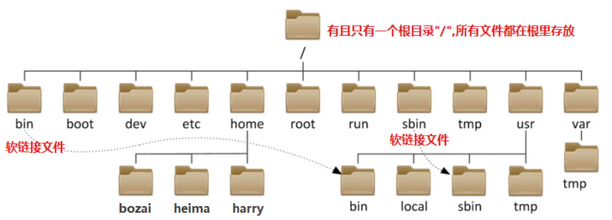

# 文件系统

### 终端的基本操作

**㈠ 打开多个终端**

**㈡ 快速清屏**

新建标签：command + T

新建窗口：command + N

关闭标签：command + Q

关闭窗口：command + W


放大：command + +

缩小：command + -

清屏：command + l


## Linux的目录树结构

### 1、了解目录树结构



| 目录               | 说明                       | 备注                                 |
| ------------------ | -------------------------- | ------------------------------------ |
| /root              | 管理员root的家目录         |                                      |
| /home              | 普通用户的默认家目录       | /home/**bozai**  /home/**heima**     |
| /bin—>/usr/bin     | 普通用户的命令             | /usr/bin/**date** /usr/bin/**ls**    |
| /sbin—>/usr/sbin   | 管理员使用的命令           | /usr/sbin/**shutdown**               |
| /usr/local         | 第三方源码包默认安装目录   | 类似windows下 C:\Program Files       |
| /etc               | 系统和服务相关配置文件     | /etc/passwd                          |
| /var               | 动态，可以变化的数据文件   | 日志文件（/var/log/xxx）             |
| /tmp               | 临时文件存放目录           | 全局可写（系统或程序产生临时文件）   |
| /dev               | 设备文件                   | /dev/sda /dev/nvme0n1                |
| /lib—>/usr/lib     | 库文件                     | 软连接文件                           |
| /lib64—>/usr/lib64 | 库文件                     | 软连接文件                           |
| /proc              | 虚拟的文件系统             | 反映出来的是内核，进程信息或实时状态 |
| /boot              | 系统内核，引导程序相关文件 |                                      |
| /media             | 移动设备默认的挂载点       |                                      |
| /mnt               | 手工挂载设备的挂载点       |                                      |


### 2、理解文件路径表示方法

Who？——>当前登录的用户

Where?——>==**路径**==

> 我要在==哪儿==创建文件？
>
> 我要删除==什么地方==的什么文件？
>
> 我所要查看的==文件在哪里==？

What?——>操作命令

How？——>理清思路，找到方法，做就对了

- **绝对路径**
  1. 一定是以"/"(根)开头，它是唯一一个绝对能够描述文件所在路径的方式。
  2. "/" 根目录是linux操作系统最顶级的目录，没有任何路径比它还要靠前。

- **相对路径**
  1. 路径是相对的，文件所在的路径是相对于当前所在路径而言的。
  2. 当前路径使用 .或./ 表示；当前目录的上一级目录使用 ..或../ 表示
  3. 当前用户家目录使用 ~ 表示；上次工作路径使用 - 表示

- **路径切换和查看的相关命令**


| 命令 | 含义                                             | 使用方法  |
| ---- | ------------------------------------------------ | --------- |
| pwd  | 查看当前工作路径                                 | pwd       |
| cd   | 更改工作路径，切换路径(默认切换到当前用户家目录) | cd 新路径 |

- 举例说明

```powershell
[root@heima ~]# pwd 打印当前工作路径
/root

[root@heima ~]# cd /home 切换到/home目录下
[root@heima home]# cd ../ 切换到当前路径的上一级目录
[root@heima /]# pwd
/

[root@heima /]# cd ~ 切换到当前用户家目录
[root@heima ~]# cd - 切换到上一次工作路径
/

[root@heima /]# cd 切换到当前用户家目录
[root@heima ~]# pwd
/root
```


