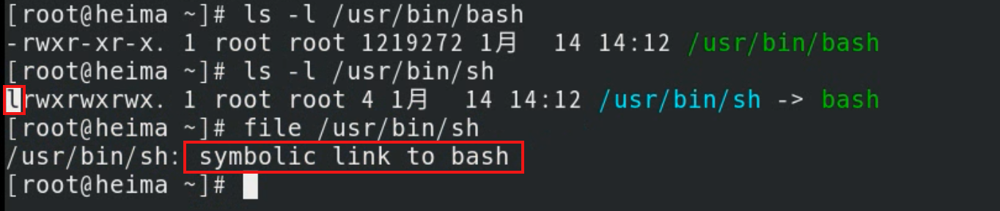

# 命令--文件操作管理

**重要：Linux下，一切皆文件！！！**

**说在前面：**

1. 接下来所有的命令需要在一个载体上执行，这个载体就叫做**终端**。

2. 终端上所有命令都需要一个东西**翻译解析**一下，计算机才能理解并执行。
3. 这个翻译解析的东西叫**SHELL**解释器**，RedHat和Centos默认shell解释器叫**bash。

4. 既然需要bash帮忙翻译解释相关命令，那么你所敲的命令必须**符合它的语法**，否则报错给你看。


```powershell
命令 [可选项] 参数
[root@localhost ~]# ls -l /root
命令：整条shell命令的主体
选项：会影响或微调命令的行为，通常以-, --
参数：命令作用的对象
```


## 1、file

> 判断文件类型

常见文件类型  

| 文件类型               | 描述                                                         |
| ---------------------- | ------------------------------------------------------------ |
| 字符设备（c）          | 所有==输入输出的设备==，如：键盘、鼠标、显示器、打印机等     |
| 块设备（==b==）        | 所有==存储设备==称之为块设备文件，如：软盘、磁盘、光盘、U盘、磁带、光驱等 |
| 软连接文件（==l==）    | 类似于Windows下的快捷方式                                    |
| 目录文件（==d==）      | 相当于Windows下的文件夹                                      |
| 普通文件(==f==或==-==) | 类似Windows下记事本、word等，可以使用==相关命令==进行编辑、==查看文件内容== |
| 管道文件(p)            | 简单理解为==程序或进程之间通讯==的一种方式                   |
| 套接字文件(s)          | 简单理解为==程序或进程之间通讯==的一种方式                   |
|                        |                                                              |

- **用** file **命令来判断文件类型**

  ```powershell
  [root@localhost ~]# file /root
  /root: directory 目录
  [root@localhost ~]# file /root/install.log
  /root/install.log: ASCII text 普通的文本文件
  [root@localhost ~]# file /dev/sda
  /dev/sda: block special 块设备文件，存放数据
  [root@localhost ~]# file /dev/tty1
  /dev/tty1: character special 字符设备
  [root@localhost ~]# file /bin/sh
  /bin/sh: symbolic link to bash 软连接文件
  ```

  


字符设备


块设备


软链接文件



## 2、ls

> 列出目录内容

```powershell
常见选项
-a all,查看目录下的所有文件，包括隐藏文件
-l 长列表显示
-h human，以人性化方式显示出来
-d 只列出目录名，不列出其他内容
-t 按修改时间排序
-r 逆序排列
-S 按文件的大小排序
-i 显示文件的inode号（索引号）
-R 递归列出目录中的内容
-m 用逗号分隔显示内容
示例：以不同的选项列出/root目录里的内容

[root@localhost ~]# ls -a /root
[root@localhost ~]# ls -l /root
[root@localhost ~]# ls -lh /root
[root@localhost ~]# ls -lt /root
[root@localhost ~]# ls -S /root
[root@localhost ~]# ls -R /root
[root@localhost ~]# ls -d /root 查看/root目录本身的信息
```

## 3、mkdir

> 创建目录

```powershell
常见选项
-p 级联创建
[root@localhost ~]# mkdir /test/ 在根下创建test目录
[root@localhost ~]# mkdir ./test/ 在当前目录下创建test目录
[root@localhost ~]# mkdir ./test /test 创建多个目录
[root@localhost ~]# mkdir -p /test/yunwei/redhat

说明：
1.如果创建的目录的上一级目录不存在，就需要加-p参数；-p在前面和后面都可以
```

## 4、touch

> 创建文件

注意：Linux下文件的命名规则

1. 文件名严格区分大小写 file FILE

2. 文件名不能包含特殊符号，如(/或*等)

3. 文件名最多可达255个字符

- 创建一个新的空文件（目标文件不存在）

  ```powershell
  [root@localhost ~]# touch /tmp/file1 在/tmp目录下创建file1文件
  [root@localhost ~]# touch file1 在当前目录下创建file1文件
  思考：这2个file1文件是同一个文件吗？
  答：不是同一个文件，因为路径不一样。
  ```

- 修改文件的时间（目标文件存在）

  - 查看文件的相关时间

    ```powershell
    [root@localhost tmp]# stat file1 查看文件的状态信息
    File: `file1'
    Size: 0 Blocks: 0 IO Block: 4096 regular empty file
    Device: fd00h/64768d Inode: 915714 Links: 1
    Access: (0644/-rw-r--r--) Uid: ( 0/ root) Gid: ( 0/ root)
    Access: 2019-04-01 17:36:00.353096343 +0800
    Modify: 2019-04-01 17:36:00.353096343 +0800
    Change: 2019-04-01 17:36:00.353096343 +0800
    Access:文件的查看访问时间
    Modify:文件的修改时间
    Change:文件的属性时间,文件的大小、权限等信息发生改变时，该时间会变化
    ```

  - 修改文件的时间

    ```powershell
    [root@localhost tmp]# touch file1
    [root@localhost tmp]# stat file1 查看文件的状态信息
    File: `file1'
    Size: 0 Blocks: 0 IO Block: 4096 regular empty file
    Device: fd00h/64768d Inode: 915714 Links: 1
    Access: (0644/-rw-r--r--) Uid: ( 0/ root) Gid: ( 0/ root)
    Access: 2019-04-01 17:41:00.353096343 +0800
    Modify: 2019-04-01 17:41:00.353096343 +0800
    Change: 2019-04-01 17:41:00.353096343 +0800
    
    其他修改：
    [root@localhost tmp]# touch -a file1 -t 201506161320 修改文件点访问时间
    [root@localhost tmp]# touch -m file1 -t 201612121330 修改文件修改时间
    -a：访问时间
    -m：修改时间
    -t：时间类型格式
    
    [root@localhost tmp]# touch -d 20110808 file1 修改文件日期
    [root@localhost tmp]# touch -d 1215 file1 修改文件时间
    [root@localhost tmp]# touch -d "20101012 11:11:11" file1 修改文件的日期和时间
    
    说明：大家只需要掌握touch -d的用法即可。
    
    注：RHEL6开始relatime，atime延迟修改，必须满足其中一个条件：
    1. 自上次atime修改后，已达到86400秒；
    2. 发生写操作时；
    ```

    

## 5、cat|more|less|head|tail

- cat 命令：一般查看小文件，从第一行到最后一行列出来

  常见选项：

  -n：显示行号

  -A：显示控制字符，如换行符,制表符等（ linux $ 和 Windows ^M$ ）

- tac 命令：一般查看小文件，从最后一行到第一行列出来

- more和less 命令：一般查看大文件，q退出查看，可以搜索，建议less命令

  ```powershell
  less 文件
  	enter键：一行一行查看
  	空格键：一页一页查看
  	退出：Q键
  	/:搜索
  	n:查找下一个
  	gg:回到开头
  ```

- head 命令：默认查看文件前10行， head -n 15或head -15 表示查看前15行

- tail 命令：默认查看文件后10行， tail -n 15或tail -15 表示查看后15行； -f 表示动态查看

- ldd 命令：一般用来查看二进制的命令文件

```powershell
[root@localhost tmp]# cat /etc/passwd 查看/etc/passwd文件内容
[root@localhost tmp]# cat -n /etc/passwd 查看/etc/passwd文件内容，并打印行号
[root@localhost tmp]# tac /etc/passwd 查看/etc/passwd文件内容
[root@localhost tmp]# head -5 /etc/passwd 查看/etc/passwd文件的前5行内容
[root@localhost tmp]# tail -5 /etc/passwd 查看/etc/passwd文件的后5行内容
[root@localhost tmp]# more /var/log/messages
[root@localhost tmp]# less /var/log/messages
[root@localhost tmp]# ldd /bin/mkdir 查看mkdir命令文件（二进制）的内容
```

## 6、cp

> 拷贝文件

注意：**本地**文件拷贝

```powershell
常用选项：
-a 递归拷贝文件，包括目录及文件属性信息
-r 拷贝目录
-p 拷贝文件包含文件的属性信息
-v 显示拷贝过程信息
用法：
cp 选项 需要拷贝的文件 拷贝到哪里去
# cp /root/file1 /home 拷贝/root/下的file1文件到/home目录下
# cp -r /home/itcast /root 拷贝/home/itcast目录到/root目录下
# su - user01 切换到user01用户下
$ touch file1
# cp -p /home/user01/file1 /tmp/ 拷贝home/user01/file1文件（包含属性信息）到/tmp下
# cp /root/file1 /tmp/test1 拷贝文件并且重命名


问：-a和-p有什么区别？
答：相同点都是需要拷贝文件的属性信息，比如拥有者（谁创建的等）；不同点在于，-p只能拷贝文件，-a既可以拷贝文件
也可以拷贝目录。
```

## 7、mv

> 移动或重命名文件

```powershell
移动文件用法（不同路径下）：
# mv 需要移动的文件 移动到新的路径下

注意：文件的路径不一样
重命名用法（相同路径下）：
# mv 原来文件的名字 新文件的名字

注意：老文件和新文件的路径一样
# mv /root/file1 /tmp 移动/root/file1文件到/tmp目录下
# mv /tmp/file1 /tmp/test1 将/tmp目录下的file1文件重命名成test1
```

## 8、rm

> 删除文件

```powershell
常用选项
-r 递归删除，一般用于删除目录
-f 直接删除，不提示
[root@localhost tmp]# rm file1 删除当前目录下的file1文件，有提示
[root@localhost tmp]# rm -r dir1 删除当前目录下的dir1目录，有提示
[root@localhost tmp]# rm -f /root/file1 强制删除/root/file1文件，不提示，直接删
```