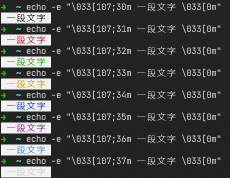

# 命令--echo命令

<font color=red>echo会将输入的字符串送往标准输出</font>，并在最后加上换行符。 可以理解为打印字符串。

```powershell
[root@localhost ~]# echo [选项] [输出内容]

常见选项：
    -n ：不输出最后的换行符“\n”（就是内容输出后不换行）
    -e：解释转义字符（字符串中出现\n、\t等特殊字符，则特别加以处理，而不会将它当成一般文字输出）
```

举例说明：

```powershell
[root@localhost ~]# echo hello world 打印hello world
hello world
[root@localhost ~]# echo aaaa 打印aaaa
aaaa
[root@localhost ~]# echo hello > file1 将hello重定向到file1文件中
[root@localhost ~]# cat file1
hello


总结：
1. echo表示打印字符串，默认将字符串送往标准输出；默认会打印一个换行符
2. echo可以结合>或者>>符号来使用，进行文件的创建或内容追加。


常见控制字符：
\t 表示制表符
\n 表示换行符
\r 表示回车


[root@localhost ~]# echo -e 'date\nuuu' > 1.sh //-e表示将\n解释为换行符
[root@localhost ~]# cat 1.sh
date
uuu


help echo
```


> -e 参数说明

| 控制字符 | 作用                                                         |
| -------- | ------------------------------------------------------------ |
| `\\`     | 输出`\`本身                                                  |
| `\a`     | 输出警告音                                                   |
| `\b`     | 退格键，也就是向左删除                                       |
| `\c`     | 取消输出行末的换行符。和“-n”选项一致                         |
| `\e`     | ESCAPE键                                                     |
| `\f`     | 换页符                                                       |
| `\n`     | 换行符                                                       |
| `\r`     | 回车键                                                       |
| `\t`     | 制表符，也就是Tab键                                          |
| `\v`     | 垂直制表符                                                   |
| `\0nnn`  | 按照八进制ASCII码表输出字符。其中0为数字零，nnn是三位八进制数 |
| `\xhh`   | 按照十六进制ASCII码表输出字符。其中hh是两位十六进制数        |


> 更多示例
>
> ```powershell
> 这个输出会输出\，同时会在系统音响中输出一声提示音
> [root@xiaoshaozi ~]# echo -e "\\ \a"
> 
> "\b"删除，所以输出时只有ac
> [root@xiaoshaozi ~]# echo -e "ab\bc"
> ac
> 
> 我们加入了制表符“\t”和换行符“\n”,所以会按照格式输出
> [root@xiaoshaozi ~]# echo -e "a\tb\tc\nd\te\tf"
> a       b       c
> d       e       f
> 
> 还是会输出上面的内容，不过是按照八进制ASCII码输出的。
> 也就是说141这个八进制，在ASCII码中代表小写的“a”，其他的以此类推
> [root@xiaoshaozi ~]# echo -e "\0141\t\0142\t\0143\n\0144\t\0145\t\0146"
> a       b       c
> d       e       f
> 
> 如果按照十六进制ASCII码也同样可以输出
> [root@xiaoshaozi ~]# echo -e "\x61\t\x62\t\x63\n\x64\t\x65\t\x66"
> a       b       c
> d       e       f
> 
> ```
>
> echo命令还可以进行一些比较有意思的东西，比如：
>
> 
>
> ```powershell
> 这条命令会把abcd按照红色输出。
> 解释下这个命令
> \e[1 	是标准格式，代表颜色输出开始，
> \e[0m	代表颜色输出结束，
> 31m		定义字体颜色是红色
> 
> echo
> 能够识别的颜色如下：
> 30m=黑色，
> 31m=红色，
> 32m=绿色，
> 33m=黄色，
> 34m=蓝色，
> 35m=洋红，
> 36m=青色，
> 37m=白色。
> echo
> 可以使用的背景颜色如下：
> 40m=黑色，
> 41m=红色，
> 42m=绿色，
> 43m=黄色，
> 44m=蓝色，
> 45m=洋红，
> 46m=青色，
> 47m=白色。
> ```


ASCII 控制字符 - "\\033"
====================

ASCII控制字符的编号范围是0-31和127（0x00-0x1F和0x7F），共33个字符。

输出到控制台时，可以利用控制字符来控制输出文本的显示效果。

控制字符可以用8进制或16进制表示，比如："\\033", "\\0x1b", "\\x1b"均表示同一个控制字符，含义是ESC

ESC后面跟一个格式字符串，用来设置颜色或控制光标

| 格式           | 含义                   |
| -------------- | ---------------------- |
| \\033\[0m      | 关闭所有属性           |
| \\033\[1m      | 设置高亮度             |
| \\033\[4m      | 下划线                 |
| \\033\[5m      | 闪烁                   |
| \\033\[7m      | 反显                   |
| \\033\[8m      | 消隐                   |
| \\033\[30~37m  | 设置前景色             |
| \\033\[40~47;m | 设置背景色             |
| \\033\[nA      | 光标上移n行            |
| \\033\[nB      | 光标下移n行            |
| \\033\[nC      | 光标右移n行            |
| \\033\[nD      | 光标左移n行            |
| \\033\[y;xH    | 设置光标位置           |
| \\033\[2J      | 清屏                   |
| \\033\[K       | 清除从光标到行尾的内容 |
| \\033\[s       | 保存光标位置           |
| \\033\[u       | 恢复光标位置           |
| \\033\[?25l    | 隐藏光标               |
| \\033\[?25h    | 显示光标               |

前景色和背景色对应的数字
------------

| 颜色 | 背景色 | 背景色加亮 | 前景色 | 前景色加亮 |
| ---- | ------ | ---------- | ------ | ---------- |
| 黑   | 40     | 100        | 30     | 90         |
| 红   | 41     | 101        | 31     | 91         |
| 绿   | 42     | 102        | 32     | 92         |
| 黄   | 43     | 103        | 33     | 93         |
| 蓝   | 44     | 104        | 34     | 94         |
| 紫   | 45     | 105        | 35     | 95         |
| 靛蓝 | 46     | 106        | 36     | 96         |
| 白   | 47     | 107        | 37     | 97         |

使用echo命令进行测试
------------

可以使用echo命令对格式字符串进行测试

例如:

`echo -e "\033[41;36m 一段文字 \033[0m"`

这里先把控制台的背景色设置为红色（41），文字的颜色设置为靛蓝色（36），打印一段文字后，关闭了所有设置（还原到默认状态下）


* * *

**测试不同的前景色**




