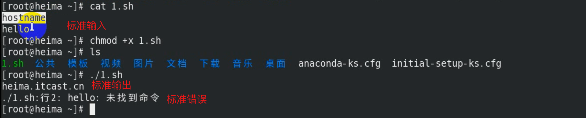

# shell--相关符号

### 1、名词解释

- 标准输入（stdin）：键盘上的输入 文件描述符—>0

- 标准输出（stdout）：屏幕上 正确 的输出 文件描述符—>1

- 标准错误（stderr）：屏幕上 错误 的输出 文件描述符—>2


### 2、相关符号

`>` ：标准输出重定向,覆盖重定向, `1>或> `标准输出重定向，` 2> `标准错误重定向

`>>` ：重定向追加, `1>>` 标准输出追加，` 2>>`标准错误追加

`<` ：标准输入

`&>`：标准输出标准错误重定向


### 3、举例说明

① 环境准备

```powershell
编写简单脚本（先直接复制用，后面说）：
[root@localhost ~]# echo -e 'date\nuuu' > 1.sh 创建1.sh脚本文件
[root@localhost ~]# cat 1.sh
date
uuu

执行1.sh脚本，屏幕上有输出结果，如下：
[root@localhost ~]# bash 1.sh
Thu Feb 28 21:22:27 CST 2019 正确的结果叫标准输出
1.sh: line 2: uuu: command not found 错误的结果叫标准错误
```



② 需求1：

将标准输出（屏幕上的正确结果）重定向到/tmp/1.log文件中

```powershell
[root@localhost ~]# bash 1.sh 2> /tmp/2.log
Thu Feb 28 21:26:15 CST 2019 标准输出依然在屏幕，标准错误重定向到了文件中
[root@localhost ~]# cat /tmp/2.log
1.sh: line 2: uuu: command not found 文件里是标准错误的结果

注意：>或者2>都表示覆盖重定向
查看/etc/hosts文件内容，并将标准输出重定向到/tmp/1.log
[root@localhost ~]# cat /etc/hosts > /tmp/1.log
[root@localhost ~]# cat /tmp/1.log 查看该文件，发现原来内容被覆盖
127.0.0.1 localhost localhost.localdomain localhost4 localhost4.localdomain4
::1 localhost localhost.localdomain localhost6 localhost6.localdomain6

总结：>或者1>表示标准输出重定向；2>表示标准错误重定向
```

③ 需求2：

将标准错误（屏幕上的错误结果）重定向到/tmp/2.log文件中

```powershell
[root@localhost ~]# bash 1.sh 2> /tmp/2.log
Thu Feb 28 21:26:15 CST 2019 标准输出依然在屏幕，标准错误重定向到了文件中
[root@localhost ~]# cat /tmp/2.log
1.sh: line 2: uuu: command not found 文件里是标准错误的结果


注意：>或者2>都表示覆盖重定向
查看/etc/hosts文件内容，并将标准输出重定向到/tmp/1.log
[root@localhost ~]# cat /etc/hosts > /tmp/1.log
[root@localhost ~]# cat /tmp/1.log 查看该文件，发现原来内容被覆盖
127.0.0.1 localhost localhost.localdomain localhost4 localhost4.localdomain4
::1 localhost localhost.localdomain localhost6 localhost6.localdomain6


总结：>或者1>表示标准输出重定向；2>表示标准错误重定向
```


④ 需求3：

将标准输出和标准错误一起重定向到/tmp/3.log里

```powershell
[root@localhost ~]# bash 1.sh &>/tmp/3.log
[root@localhost ~]# cat /tmp/3.log
Thu Feb 28 21:33:36 CST 2019
1.sh: line 2: uuu: command not found
说明：
&>表示标准输出和标准错误一起重定向
```


⑤需求4：

不输出日志

```powershell
./1.sh >/dev/null 2>&1	将标准输出和标准错误扔掉（放到空设备）
等于
./1.sh &>/dev/null

说明
1）/dev/null		Linux系统下特殊的设备文件，空设备，类似黑洞
```


