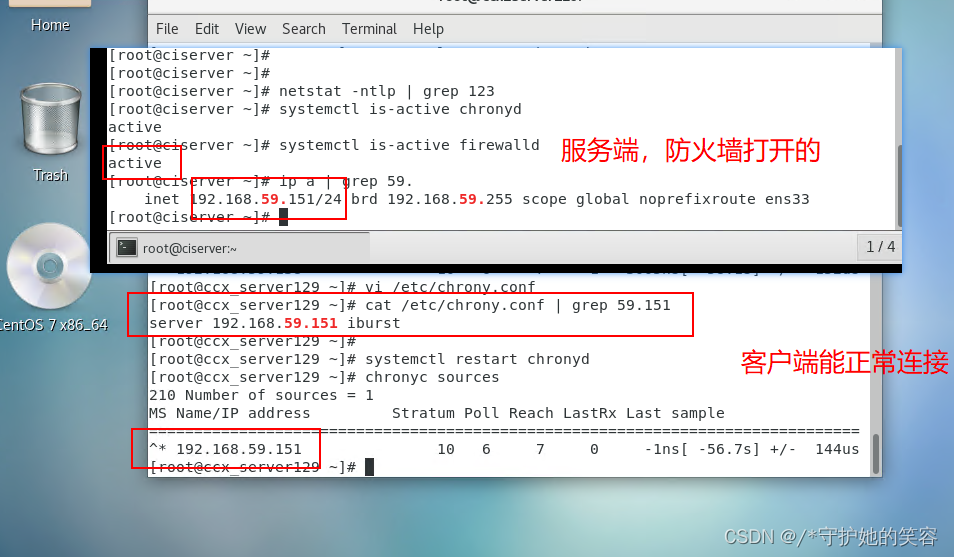

# 命令--13.时间日期

## 时区设置

在[Linux](https://so.csdn.net/so/search?q=Linux&spm=1001.2101.3001.7020)系统中，默认使用的是UTC时间。

即使在安装系统的时候，选择的时区是亚洲上海，Linux默认的BIOS时间（也称：硬件时间）也是[UTC时间](https://so.csdn.net/so/search?q=UTC时间&spm=1001.2101.3001.7020)。
在重启之后，系统时间会和硬件时间同步，如果两者不一致，会以硬件时间为标准进行时间的校准。所以，之前设置的时区和时间就失效了
北京时间比UTC时间早8小时，以2023年1月1日0000UTC为例，UTC时间是零点，北京时间为2023年1月1日早上8点整。

```powershell
# 查看当前系统时间
date

# 查看当前硬件时间
hwclock或clock

#查看当前系统时区
date -R


[root@jysp jysp]# date 
2023年 12月 15日 星期五 09:14:28 CST

[root@jysp jysp]# hwclock
2023年12月15日 星期五 09时12分57秒  -0.179492 秒

[jysp@jysp ~]$ date -R
Fri, 15 Dec 2023 09:12:23 +0800

```

### 图形化设置

CentOS7如何图形化设置时区？

这与图形化设置网络、设置主机名、设置新用户等，基本相同。过程简单，对于初学者比较友好。

#### 1.进入设置

点击【应用程序】->【系统工具】->【设置】选项


#### 2.找到时区

点击【详细信息】->【日期和时间】


#### 3.操作认证

点击【解锁】并输入密码进行【认证】

Centos7不需要认证，而Centos8和ubuntu 修改时区时需要认证。按要求认证即可。


#### 4.自动设置

开启【自动设置日期和时间】、【自动设置时区】选项

根据情况，可决定是否开启自动设置。


### tzselect

用tzselect设置时区采用人机交互的形式，十分方便。

命令中第一个字母t是时间time的简写;
命令中第二个字母z是区域zone的简写。

使用tzselect 设置时区，按照提示，一步步进行，没有难度。
按照提示一路选择: 5) asia —-> 9) china ——> 1) beijing
但成功设置后，会提示把时区变量作为全局变量添加到profile中


1.可以采用命令追加形式

    echo “export TZ='Asia/Shanghai'”  >>/etc/profile

2.可以采用vim 打开文件，在最后一行添加内容

    export  TZ='Asia/Shanghai'

保存，退出
完成对文件的修改后，并不能马上更改时区，仍然需要执行命令 source /etc/profile
当执行source命令时，系统会退出当前bash，并重新登录。
再重新查看时间与时区，已更新。


### timedatectl

timedatectl是一个命令行工具，它允许你查看或者修改系统的时间和日期。它在所有现代的基于 system 的 linux 系统中都可以使用。
timedatectl 打印当前时区信息
如果不带参数直接运行，会正常打印出时间信息。

timedatectl 查看可以设置的时区

    timedatectl list-timezones

带上list-timezones参数运行下，看到如下的结果：

上面的结果展示不全， 往下翻找可以看到 Asia/Shanghai 这一行。

不想全部看完，可按q退出查看。

timedatectl 设置时区

    timedatectl set-timezone Asia/Shanghai


### cp文件设置时区

cp文件设置时区

        cp /usr/share/zoneinfo/Asia/Shanghai /etc/localtime

这种方式也可以设置时间，但是还是建议使用timedatectl工具。 因为timedatectl工具屏蔽了各个linux的差异性。vim修改时区文件


### vim修改时区文件

我们如何确定自己的时区是正确的？
时区文件默认的是：/etc/localtime
下面命令会把我们系统的时间还有时区显示出来


原文链接：https://blog.csdn.net/qq_36142959/article/details/132719285

## 时间命令

### 1、date命令（重点）

`date` :**打印**或者**设置**当前系统日期和时间

`date --help` 自己先求帮助

```powershell
用法：date [选项]... [+格式]
　或：date [-u|--utc|--universal] [MMDDhhmm[[CC]YY][.ss]]
Display the current time in the given FORMAT, or set the system date.
 
Mandatory arguments to long options are mandatory for short options too.
  -d, --date=STRING         display time described by STRING, not 'now'
  -f, --file=DATEFILE       like --date once for each line of DATEFILE
  -I[TIMESPEC], --iso-8601[=TIMESPEC]  output date/time in ISO 8601 format.
                            TIMESPEC='date' for date only (the default),
                            'hours', 'minutes', 'seconds', or 'ns' for date
                            and time to the indicated precision.
  -r, --reference=文件          显示文件指定文件的最后修改时间
  -R, --rfc-2822                以RFC 2822格式输出日期和时间
                                例如：2006年8月7日，星期一 12:34:56 -0600
      --rfc-3339=TIMESPEC   output date and time in RFC 3339 format.
                            TIMESPEC='date', 'seconds', or 'ns' for
                            date and time to the indicated precision.
                            Date and time components are separated by
                            a single space: 2006-08-07 12:34:56-06:00
  -s, --set=STRING          set time described by STRING
  -u, --utc, --universal    print or set Coordinated Universal Time (UTC)
      --help            显示此帮助信息并退出
      --version         显示版本信息并退出

给定的格式FORMAT 控制着输出，解释序列如下：

  %%    一个文字的 %
  %a    当前locale 的星期名缩写(例如： 日，代表星期日)
  %A    当前locale 的星期名全称 (如：星期日)
  %b    当前locale 的月名缩写 (如：一，代表一月)
  %B    当前locale 的月名全称 (如：一月)
  %c    当前locale 的日期和时间 (如：2005年3月3日 星期四 23:05:25)
  %C    世纪；比如 %Y，通常为省略当前年份的后两位数字(例如：20)
  %d    按月计的日期(例如：01)
  %D    按月计的日期；等于%m/%d/%y
  %e    按月计的日期，添加空格，等于%_d
  %F    完整日期格式，等价于 %Y-%m-%d
  %g    ISO-8601 格式年份的最后两位 (参见%G)
  %G    ISO-8601 格式年份 (参见%V)，一般只和 %V 结合使用
  %h    等于%b
  %H    小时(00-23)
  %I    小时(00-12)
  %j    按年计的日期(001-366)
  %k   hour, space padded ( 0..23); same as %_H
  %l   hour, space padded ( 1..12); same as %_I
  %m   month (01..12)
  %M   minute (00..59)
  %n    换行
  %N    纳秒(000000000-999999999)
  %p    当前locale 下的"上午"或者"下午"，未知时输出为空
  %P    与%p 类似，但是输出小写字母
  %r    当前locale 下的 12 小时时钟时间 (如：11:11:04 下午)
  %R    24 小时时间的时和分，等价于 %H:%M
  %s    自UTC 时间 1970-01-01 00:00:00 以来所经过的秒数
  %S    秒(00-60)
  %t    输出制表符 Tab
  %T    时间，等于%H:%M:%S
  %u    星期，1 代表星期一
  %U    一年中的第几周，以周日为每星期第一天(00-53)
  %V    ISO-8601 格式规范下的一年中第几周，以周一为每星期第一天(01-53)
  %w    一星期中的第几日(0-6)，0 代表周一
  %W    一年中的第几周，以周一为每星期第一天(00-53)
  %x    当前locale 下的日期描述 (如：12/31/99)
  %X    当前locale 下的时间描述 (如：23:13:48)
  %y    年份最后两位数位 (00-99)
  %Y    年份
  %z +hhmm              数字时区(例如，-0400)
  %:z +hh:mm            数字时区(例如，-04:00)
  %::z +hh:mm:ss        数字时区(例如，-04:00:00)
  %:::z                 数字时区带有必要的精度 (例如，-04，+05:30)
  %Z                    按字母表排序的时区缩写 (例如，EDT)

默认情况下，日期的数字区域以0 填充。
The following optional flags may follow '%':

  -  (hyphen) do not pad the field
  _  (underscore) pad with spaces
  0  (zero) pad with zeros
  ^  use upper case if possible
  #  use opposite case if possible

在任何标记之后还允许一个可选的域宽度指定，它是一个十进制数字。
作为一个可选的修饰声明，它可以是E，在可能的情况下使用本地环境关联的
表示方式；或者是O，在可能的情况下使用本地环境关联的数字符号。

Examples:
Convert seconds since the epoch (1970-01-01 UTC) to a date
  $ date --date='@2147483647'

Show the time on the west coast of the US (use tzselect(1) to find TZ)
  $ TZ='America/Los_Angeles' date

Show the local time for 9AM next Friday on the west coast of the US
  $ date --date='TZ="America/Los_Angeles" 09:00 next Fri'

GNU coreutils online help: <http://www.gnu.org/software/coreutils/>
请向<http://translationproject.org/team/zh_CN.html> 报告date 的翻译错误
要获取完整文档，请运行：info coreutils 'date invocation'
```


#### ① 打印日期或时间

```powershell
常用格式：
    获取系统当前时间
    yyyy-mm-dd
	    date +%F
    	date +%Y-%m-%d

    yyyy-mm-dd HH:mm:ss
	    date +'%F %T'
    	date +'%Y-%m-%d %H:%M:%S'

	获取非当前时间 days,months,years
	yyyy-mm-dd
		date -d '+3days' +'%F %T'
		date --date='3days' +'%F %T'
		
		date -d '-3days' +'%F %T'
		date -d '3days ago' +'%F %T'
		date --date='-3days' +'%F %T'


打印系统当前日期或时间
[root@heima ~]# date
[root@heima ~]# date +%D
[root@heima ~]# date +%F
[root@heima ~]# date +%Y-%m-%d
[root@heima ~]# date +%T
[root@heima ~]# date +%X
[root@heima ~]# date +'%F %X'
[root@heima ~]# date +%c
打印系统非当前日期或时间
[root@heima ~]# date -d '+3days' +%F
[root@heima ~]# date -d '-3days' +%F
[root@heima ~]# date -d '3days' +%F
[root@heima ~]# date -d '3days ago' +%F
[root@heima ~]# date --date='30days' +%F


[jysp@jysp ~]$ date +'%Y %m %d'
2023 11 01
[jysp@jysp ~]$ date +%T
10:32:06
[jysp@jysp ~]$ date +%X
10时32分14秒
[jysp@jysp ~]$ date +%F %X
date: 额外的操作数 "%X"
Try 'date --help' for more information.
[jysp@jysp ~]$ date +'%F %X'
2023-11-01 10时32分30秒
[jysp@jysp ~]$ date +%c
2023年11月01日 星期三 10时33分10秒
[jysp@jysp ~]$ date -d
date：选项需要一个参数 -- d
Try 'date --help' for more information.
[jysp@jysp ~]$ date -d '+3days' +%F
2023-11-04
[jysp@jysp ~]$ date -d '+3days' +%c
2023年11月04日 星期六 10时34分06秒
[jysp@jysp ~]$ date -d '-3days' +%F
2023-10-29
[jysp@jysp ~]$ date -d '3days ago' +%F
2023-10-29
[jysp@jysp ~]$ date -d '3days' +%F
2023-11-04
[jysp@jysp ~]$ date --date='30days' +%F
2023-12-01
[jysp@jysp ~]$ 
```


#### ② 设置系统日期或时间

```powershell
选项：-s 设置当前系统时间，只有root权限才能设置，其他只能查看。
date -s 20200523 设置成20100523，这样会把具体时间设置成空00:00:00
date -s "01:01:01 2020-05-2" 这样可以设置全部时间
date -s "01:01:01 20200523" 这样可以设置全部时间
date -s "2020-05-23 01:01:01" 这样可以设置全部时间
date -s "20200523 01:01:01" 这样可以设置全部时间

注意：
红帽8，设置为过去的时间，过段时间会被重置为当前时间
```


### 2、hwclock命令

#### ③ 系统时间同步硬件时间

`hwclock` :查看并且设置硬件时间

```powershell
选项：
# 设置系统时间：从硬件时间同步到系统时间
-s, --hctosys set the system time from the RTC
# 设置硬件时间：从系统时间同步到硬件时间
-w, --systohc set the RTC from the system time
# 查看硬件时间
-l, --localtime the RTC timescale is Local


举例说明：
[root@heima ~]# hwclock --hctosys
[root@heima ~]# hwclock
2019-06-23 18:44:10.377920+08:00

[root@heima ~]# date
2019年 06月 23日 星期日 18:44:21 CST
[root@heima ~]# date -s "20221010 12:12:12"
2022年 10月 10日 星期一 12:12:12 CST
[root@heima ~]# date
2022年 10月 10日 星期一 12:12:14 CST
[root@heima ~]# hwclock
2019-06-23 18:45:01.368135+08:00
[root@heima ~]# hwclock --systohc
[root@heima ~]# hwclock
2022-10-10 12:12:43.179274+08:00
```

### 3、timedatectl命令

`timedatectl`

查看当前时间、时区、NTP服务状态
设置系统时间、硬件时间、时区

> ntp服务

```powershell
# 从7开始就有
timedatectl -h 设置和查看系统的时间和日期（设置时区以及开启或关闭ntp服务）

# 查看当前时间
[jysp@jysp ~]$ timedatectl status
      Local time: 三 2023-11-01 10:47:08 CST
  Universal time: 三 2023-11-01 02:47:08 UTC
        RTC time: 三 2023-11-01 02:47:42
       Time zone: Asia/Shanghai (CST, +0800)
     NTP enabled: yes
NTP synchronized: no
 RTC in local TZ: no
      DST active: n/a


# 关闭NTP同步
timedatectl set-ntp no


# 设置时间:系统时间、硬件时间
timedatectl set-time 2020-10-10
timedatectl set-time 11:11:11
timedatectl list-timezones
timedatectl set-timezone xxx


# 同步当前时间
# 6版本中
ntpdate

# 8版本中
timedatectl set-ntp yes
timedatectl status
chronyc makestep
```

 

### 4、cal命令（了解）

`cal` :查看日历

```powershell
用法：
 cal [选项] [[[日] 月] 年]

选项：
 -1, --one        只显示当前月份(默认)
 -3, --three      显示上个月、当月和下个月
 -s, --sunday     周日作为一周第一天
 -m, --monday     周一用为一周第一天
 -j, --julian     输出儒略日
 -y, --year       输出整年
 -V, --version    显示版本信息并退出
 -h, --help       显示此帮助并退出

```

```powershell
cal 或者 cal -1 		表示直接输出当前月份的日历
cal -3 				 表示输出上一个月+本月+下个月的日历
cal -y 年份 			表示输出某一个年份的日历
```


### 5、tzselector（了解）

用tzselect设置时区采用人机交互的形式，十分方便。

命令中第一个字母t是时间time的简写;
命令中第二个字母z是区域zone的简写。

使用tzselect 设置时区，按照提示，一步步进行，没有难度。
按照提示一路选择: 5) asia —-> 9) china ——> 1) beijing

### 综合应用

#### ④ 应用案例

> 有时候我们需要用到当前的系统时间，如何调用？比如以当前系统日期命名创建目录或文件

```powershell
2020-10-10.log.tar.gz
2020-10-11.log.tar.gz
$()：括号里面的命令优先执行 	date +%F 		2019-06-23
`` ：引号里面的命令优先执行，不允许嵌套

创建目录和文件，以当前系统日期命名
[root@heima ~]# mkdir $(date +%F)
[root@heima ~]# touch $(date -d '+3days' +%Y%m%d).log
```


## 时间同步NTP

### 1、了解时间同步的重要性

由于IT系统中，准确的计时非常重要，有很多种原因需要准确计时，如

在网络传输中，数据包和日志需要准确的时间戳

各种应用程序中，如订单信息，交易信息等都需要准确的时间戳

在Linux系统中， Network Time Protocol (NTP)，NTP协议由在用户空间中运行的守护程序实现，即ntp和chrony。

> 红帽6以前使用ntp，红帽7ntp和chrony，红帽8 chrony


### 2、了解时间同步服务器


**查看可以提供时间同步的服务器：**

http://www.ntp.org.cn/pool


### 3、chrony如何同步自己系统时间

> 需要联网

（1）方式一：自动同步

```powershell
# 手动设置时间
date -s "2020-10-10 10:10:10"

# 查看chrony安装包
yum list|grep chrony

# 查看软件包，配置文件位置
rpm -qc chrony
```


```powershell
# 重启服务
systemctl restart chronyd.service
systemctl status chronyd.service

# 修改时间，测试自动同步
date -s "2020-10-10 10:10:10"
```

（2）方式二：手动临时同步

临时指定ntp服务器同步

```powershell
systemctl status chronyd.service
systemctl stop chronyd.service

chronyd -q "server cn.ntp.org.cn iburst"
```

### 4、chrony搭建时间同步服务

#### ㈠ 了解RHEL7和RHEL8区别

- 在RHEL7中，用户可以在**ntp**和**chrony**之间进行选择，以确保准确的计时。

- 在RHEL8中，不再支持**ntp**,使用**chronyd**守护进程来实现NTP,默认已启用,从chrony软件包获得。

- chrony和ntp之间的差异

  - ntpd服务器在控制客户端访问方式上默认响应来自任何地址的请求，相对不安全chronyd默认不允许访问，要想提供时间同步服务端需要在allow中指定

  - ntpd 和 chronyd 在系统时钟校正方面的默认行为也不同。

  - 客户端同步方式有差异

- 还有很多不同可以参考官方网站：https://chrony.tuxfamily.org/comparison.html

**总结：**

**chrony**在各种条件下表现良好，包括间歇性网络连接，高度拥挤的网络，温度变化（普通计算机时钟对温度敏感），以及不能连续运行或在虚拟机上运行的系统。

#### ㈡ RHEL8配置时间同步服务

1. 关闭防火墙和selinux（实验）

2. 配置软件仓库

3. 软件三部曲

   - 安装软件

   - 确认软件是否成功安装

   - 查看软件的文件列表（配置文件、程序本身、man手册）

4. 了解配置文件（man 5 xxx.conf）

5. 根据需求通过修改配置文件来完成服务搭建

6. 启动服务，开机自启动

7. 测试验证

- 时间同步服务器端

  ```powershell
  # 防火墙
  systemctl status firewalld.service
  # selinux
  getenforce
  # 软件仓库
  dnf repolist
  # 查看软件包
  rpm -q chrony
  # 查看配置文件
  rpm -ql chrony
  
  
  
  # vim /etc/chrony.conf
  #自己本身向谁来同步时间
  pool cn.ntp.org.cn iburst
  #允许哪些客户端来同步,192.168.159网段的ip/子网掩码24位
  allow 192.168.159.0/24
  
  重启服务
  systemctl restart chronyd.service
  
  查看服务状态
  systemctl status chronyd.service
  
  查看udp端口状态
  netstat -nlup|grep chronyd
  ```

- 客户端

  修改配置文件

  

  

  ```powershell
  重启服务
  systemctl restart chronyd.service
  
  查看当前客户端使用的源
  chronyc sources
  chronyc sourcestats
  chronyc sources -v
  
  [root@client ~]# chronyc sources
  210 Number of sources = 1
  MS Name/IP address Stratum Poll Reach LastRx Last sample
  ===============================================================================
  ^? 192.168.159.100 3 6 37 5 +10766h[+10766h] +/- 3872us
  
  手动同步时间，官方不建议使用
  [root@client ~]# chronyc makestep
  200 OK
  ```


> *代办当前在使用的源


### 5、windows开启ntp服务功能

（1）打开搜索`注册表`或`win+R 输入regedit`


 （2）设定授权时间服务器

注册表路径： HKEY_LOCAL_MACHINE\SYSTEM\CurrentControlSet\Services\W32Time\Config

修改 AnnounceFlags 数a改为 5


HKEY_LOCAL_MACHINE\SYSTEM\CurrentControlSet\Services\W32Time\TimeProviders\NtpServer

修改 Enabled 数值0修改为 1


（3）搜索`服务`或 `win+R 输入services.msc `打开服务面板


（4）启动服务


服务的启停，需要使用管理员运行

- net start w32time

- net stop w32time

```
Microsoft Windows [版本 10.0.19045.3693]
(c) Microsoft Corporation。保留所有权利。

C:\WINDOWS\system32>net start w32time
请求的服务已经启动。

请键入 NET HELPMSG 2182 以获得更多的帮助。


C:\WINDOWS\system32>net stop w32time
Windows Time 服务正在停止.
Windows Time 服务已成功停止。


C:\WINDOWS\system32>net start w32time
Windows Time 服务正在启动 .
Windows Time 服务已经启动成功。
```


本机测试

```
C:\Users\miyufeng>w32tm /stripchart /computer:127.0.0.1
正在跟踪 127.0.0.1 [127.0.0.1:123]。
当前时间是 2023/12/17 15:23:45。
15:23:45, d:+00.0013197s o:+00.0004149s  [                           *                           ]
15:23:47, d:+00.0006835s o:+00.0002398s  [                           *                           ]
15:23:49, d:+00.0004796s o:+00.0000808s  [                           *                           ]
```


（5）防火墙配置


（6）局域网内设备时间同步测试


### 6、ntp工具

#### ntp客户端

1、安装ntp和[ntpdate](https://so.csdn.net/so/search?q=ntpdate&spm=1001.2101.3001.7020)两个rpm包。

使用yum install ntp、yum install ntpdate命令执行安装操作（本次省略）

2、配置ntp客户端文件【/etc/ntp.conf】中的server项, 只保留server的有效行（默认有3-4行server有效行去向公网同步时间，需注释掉）。如

```shell
server 172.29.12.120  perfer      #提供ntp-server的主机地址
server  172.29.120.12 perfer  (iburst）    #提供ntp-server的主机地址
```

\#restrict default kod nomodify notrap nopeer noquery 注释此行内容  作为ntp服务器可注释掉（取消默认不行其他主机连接同步时间）

server x.x.x.x iburst  同步时间服务ip  客户端只是配这个就可以

3、启动ntpd服务、并添加至开机启动项。如

启动服务

```shell
systemctl  start  ntpd        #启动ntpd服务
systemctl  start  ntpdate
systemctl enable  ntpd        #将ntpd添加到开机启动项
systemctl enable  ntpdate
systemctl is-enabled ntpd        #查看是否在开机启动项
systemctl is-enabled ntpdate
systemctl list-unit-files | grep ntp     #查看是否在开机启动项
systemctl status ntpd                     #查看ntpd服务的状态
```

4、验证

```shell
 ntpq -p           #查看该主机使用的ntp-server情况和同步延时等信息；
 timedatectl      #查看ntpd服务或chronyd服务是否生效。
                  #只有centos7、redhat7、ubuntu14等以上（含）才有该命令；
```

5、其他配置（或添加时间同步的计划任务）
使用ntpdate命令也可以执行[ntp时间同步](https://so.csdn.net/so/search?q=ntp时间同步&spm=1001.2101.3001.7020)，不需要ntp客户的ntpd服务。如

```shell
ntpdate 172.29.120.12     #向172.29.120.12的ntpserver主机同步本地系统时间。
ntpdate -u 172.29.120.12  ##同上，-u参数是可以在客户端ntpd服务启动时同时执行的命令。
```

计划任务中的时间同步，同样的效果。也可以和客户端的ntpd服务同时存在。

```shell
crontab -l
0 0 * * 0 /usr/sbin/ntpdate -u 172.29.120.12 || /usr/sbin/ntpdate -u 172.29.12.120
```


查看服务状态 ntpstat ntptime timedatectl 三个命令看状态


CentOS7下使用NTP遇到的问题
问题1、在CentOS7下使用NTP时，客户端ntpd服务添加到开机启动项中了，但主机系统启动后ntpd服务还是停止状态（dead），无法正常启动。
解决以上现象有两种方法 ，本人常用方法一的操作：
方法一：
1.通过命令 systemctl enable ntpd 设置NTP服务开机自启动。
2.重启虚拟机后查看 服务运行状态 systemctl status ntpd ，发现服务并没有成功启动。
3.查看chrony是否被设置为开机自启动。通过指令 systemctl is-enabled chronyd
或systemctl list-unit-files | grep chrony 查看，发现这个服务已经被设置为开机自启动所以导致NTP服务的自启动失败。
4.所以要把 chrony 的自启动去掉。执行指令 systemctl disable chronyd 。
5.重启虚拟机， 执行 systemctl status ntpd ，问题解决。
systemctl list-unit-files|grep ntpd
systemctl list-unit-files|grep chrony


方法二：
需要开机自启动某服务，第一个想到的当然是开机启动自定义脚本。
在Centos之前版本只要在 /etc/rc.d/rc.local 文件中加入 启动服务的命令，当虚拟机重启时就会执行该文件中的命令，服务也就启动了。但是但Centos7版本，这个文件的权限被降低了，所以当你打开这个文件时，注释中很友好的提示让你给这个文件赋权，以确保它有可执行权限。chmod +x /etc/rc.d/rc.local 。
所以只要把指令写到这个文件中，就可以在开机时启动服务或者让虚拟机做其它事情。
chmod +x /etc/rc.d/rc.local
echo “systemctl start ntpd” >> !$


问题2、ntpdate命令执行报错，提示ntpd服务已经存在（ntpdate：the NTP socket is in use, exiting）
报错的原因是因为客户端有ntpd服务在运行。因此需要继续执行，必须加-u参数，如
update -u 172.29.120.12


问题3、启动了ntpd服务，却未执行过同步时间操作。
需要检查ntpd服务是否生效、并应用是否也生效了。如


查看状态 ntpstat ntptime timedatectl


1、npq -p 执行结果的参数解释


ntpq -p命令列出了所有作为时钟源校正过本地NTP服务器时钟上层NTP服务器的列表，每一列的含义分别如下：
remote：响应请求的NTP服务器的名称（IP地址或域名），带“”的表示本地NTP服务器与该服务器同步
refid：远程NTP服务器使用的上一级ntp服务器的IP地址
st：远程NTP服务器的级别，由于NTP是层级结构，有顶端的服务器，多层的Relay Server再到客户端。所以服务器从高到低，级别可以设定为1~16级。为了减缓负荷和网络堵塞，原则上应该避免直接连接到级别为1的服务器。
t：本地NTP服务器与远程NTP服务器的通信方式。u：单播；b：广播；I：本地
when：上次成功请求后到现在的秒数
poll：本地NTP服务器与远程NTP服务器同步的时间间隔。
reach：这是一个八进制的值，用来测试衡量前八次查询是否成功和服务器连接。377表示都成功，0表示不成功
delay：网络延时，单位为微秒（μs）
offset：本地NTP服务器与远程NTP服务器的时间偏移，单位为毫秒（ms）。offset越接近于0，主机与NTP服务器的时间越接近
jitter：查询偏差的分布值，用于表示远程NTP的网络延时是否稳定，单位为微秒（μs）*


2、timedatectl 命令的讲解
timedatectl输出解析


1.1.Local time
本地时间，初始值来自于RTC，由内核维护，系统启动之后和RTC就没有关系，通常等于RTC+时区值（如上图的本地时间=RTC+8）

1.2.Universal time
系统时间永远是UTC，在应用程序使用的时候转换为本地时间

1.3.RTC（real-time clock）time
指硬件时间，一般是主板上的特殊电路，专用用于记录时间，有电池供电，不受服务器和操作系统的开启关闭影响。也称作BIOS时间。
需要注意的是：当/etc/sysconfig/clock 文件中 UTC=true时， BIOS 使用UTC时间； UTC=false时， BIOS 使用本地时间。
hwclock --localtime #显示 BIOS 中实际的时间
hwclock --systohc #根据系统时间设置硬件时间

1.4.Time zone
本地时区，即服务器所在的时区，在中国通常使用Asia/Shanghai
timedatectl set-timezone “Asia/Shanghai” #设置时区为上海

1.5.NTP enable
状态为“yes”,表示开启NTP同步。
网络时间协议，英文名称：Network Time Protocol（NTP）是用来使计算机时间同步化的一种协议，它可以使计算机对其服务器或时钟源（如石英钟，GPS等等)做同步化，它可以提供高精准度的时间校正。
timedatectl set-ntp true #开启ntp同步
timedatectl set-ntp false #禁止ntp同步

1.6.NTP synchronized
为“yes”,表示NTP同步完成。

1.7.RTC in local TZ
设置RTC时间，为"no"表示未设置
timedatectl set-local-rtc 1 #将RTC设置为本地时间
timedatectl set-local-rtc 0 #将RTC设置为UTC

2.2、timedatectl常用命令
timedatectl set-time 15:58:30 #只设置时间
timedatectl set-time 20151120 #只设置日期
timedatectl set-time ‘16:10:40 2015-11-20’ #设置时间和日期2.3 相关命令

rpm -qi ntp 查看版本   最新

date  系统时间
clock  硬件时间


date -s  设置系统时间
clock  -w 系统时间同步到硬件时间

ntpdate IP  同步ntp服务器时间

chkconfig --list ntpd 查看开机启动

chkconfig ntpd on  开机启动

ntpq -p  客户端查看同步情况 *号代表同步成功
ntpstat

ps aux | grep ntpd  查看进程


ss -ntul 看进程端口
netstat -anp | grep   ntpd
ss -ntulp  看进程端口

crontab -l; echo "*/60 * * * * /usr/sbin/ntpdate x.x.x.x(ntp服务器IP) >>/tmp/ntp.log  设置定时同步
crontab -l   查看计划任务

echo "*/60 * * * * /usr/sbin/ntpdate x.x.x.x(ntp服务器IP) >>/tmp/ntp.log


## chrony和ntp

### chrony和ntp的区别

*   （1）chronyd做的比ntpd好的
    *   chronyd可以在时断时续访问参考时间源的环境下工作，而ntpd需要定期轮询参考时间源才能正常工作。
    *   即使网络拥塞时间更长，chronyd也可以运行良好。
    *   chronyd通常可以更快、更准确地同步时钟。
    *   chronyd能够快速适应晶体振荡器温度变化引起的时钟频率的突然变化，而ntpd可能需要很长时间才能稳定下来。
    *   在默认配置下，为了不影响其他正在运行的程序，chronyd从不在系统启动同步时钟之后执行时间步进。ntpd也可以配置为从不步进时间，但它必须使用不同的方法来调整时钟，这有一些缺点，包括对时钟精度的负面影响。
    *   chronyd可以在更大的范围内调整Linux系统上的时钟频率，这使得它甚至可以在时钟损坏或不稳定的机器上运行。例如，在一些虚拟机上。
    *   chronyd体积更小，占用的内存更少，而且只有在必要的时候才会唤醒CPU，这对于节能来说是更好的选择。
*   （2）chronyd能做的但ntpd做不到的
    *   chronyd提供了对孤立网络的支持，在孤立网络中，时间校正的唯一方法就是手动输入。例如，由管理员查看时钟。chronyd可以检查在不同的更新中修正的错误，从而估算出计算机增加或减少时间的速度，并在随后使用这个估算来调整计算机时钟。
    *   chronyd可以计算RTC时钟（在计算机关闭时保持时间的时钟）的增益和损耗率。它可以在系统启动时使用这些计算的数据，以及从RTC时钟获取的时间调整值来设置系统时间。RTC时钟设备目前仅在Linux系统上可用。  
        支持Linux上的硬件时间戳，允许在本地网络上进行非常精确的同步。
*   （3）ntpd做得到但chronyd做不到的
    *   ntpd支持NTP v4（RFC 5905）的所有同步模式，包括broadcast、multicast和manycast clients and servers模式。请注意，broadcast和multicast模式（即使有身份验证）与普通servers and clients模式相比，更不精确、更不安全，通常应避免使用。
    *   ntpd支持使用公钥加密的Autokey协议（RFC 5906）对服务器进行身份验证。注意，该协议已被证明是不安全的，可能会被Network Time Security（NTS）取代。
    *   ntpd包含很多参考时间源的驱动程序，而chronyd依赖于其他程序（例如gpsd），以使用共享内存（SHM）或Unix domain socket（SOCK）访问参考时间源的数据。
*   （4）chronyd与ntpd，该怎么选
    *   除了由不支持Chrony的工具管理或监视的系统，或者具有不能与Chrony一起使用的硬件参考时钟的系统之外，其他系统都应该首选Chrony。
    *   需要使用Autokey协议对数据包进行身份验证的系统只能使用ntpd，因为chronyd不支持这个协议。Autokey协议存在严重的安全问题，应避免使用该协议。使用对称密钥进行身份验证，而不是使用Autokey，这是chronyd和ntpd都支持的。Chrony支持更强的哈希函数，如SHA256和SHA512，而ntpd只能使用MD5和SHA1。


### chrony的组成与端口说明

*   chrony 是由 守护进程 chronyd 以及 命令行工具 chronyc 组成的，具体如下图  
    


*   chronyd 在后台静默运行并通过 `123` 端口与时间服务器定时同步时间，默认的配置文件是 `/etc/chrony.conf`
    
*   chronyc 通过 `323` 端口与 chronyd 交互，可监控 chronyd 的性能并在运行时更改各种操作参数  
    chronyc 通过下面的方式访问 chronyd
    
    *   1、通过 IPv4 或 IPv6 访问
    *   2、通过 Unix 域 socket, 但只能访问到本地的 chronyd，而且需要 root 用户或者 chrony 用户才能访问
*   chronyd和ntp一样，端口都是`udp`

```
[root@yum-centos-dmz ~]# netstat -nulp | grep chro
udp        0      0 0.0.0.0:123             0.0.0.0:*                           8938/chronyd        
udp        0      0 127.0.0.1:323           0.0.0.0:*                           8938/chronyd        
udp6       0      0 ::1:323                 :::*                                8938/chronyd        
[root@yum-centos-dmz ~]# 

```

*   默认情况下，chronyc 先通过 Unix 域 socket 访问 chronyd，默认的 socket 文件是 `/var/run/chrony/chronyd.sock`, 如果失败（常见的原因是使用非 root 用户运行 chronyc ），将尝试通过 127.0.0.1 访问 chronyd


### chrony安装和命令管理说明

*   在新的 Linux 发行版（centos8、Ubuntu 20.04、Fedora 30）及以后的版本中，系统默认已经安装了 chrony，在这之前的版本是没有安装的，可以使用下面的命令进行安装  
    `yum install chrony -y`
*   安装完成后，chrony 服务默认会自动加到 systemctl 中管理，下面列出了一些常用的命令

```
#查询 chronyd 服务状态
systemctl status chronyd     

#启动 chronyd 服务
systemctl start chronyd   

#关闭 chronyd 服务
systemctl stop chronyd   

#重启 chronyd 服务
systemctl restart chronyd   

#设置 chronyd 服务开机自启
systemctl enable chronyd
systemctl daemon-reload

```

#### 启动服务报错处理

另外，启动 chronyd 服务的时候如果出现下面截图中的错误，需要安装或者升级 `libsepol`、`policycoreutils-python`【最小化安装的系统可能会出现这种问题】 
查看日志或者执行`journalctl -xe`均可查看报错内容~  

*   具体的问题说明详见[Red Hat Bugzilla – Bug 1592775](https://bugzilla.redhat.com/show_bug.cgi?id=1592775)
    
*   解决方法 安装 libsepol 和 policycoreutils-python 
    `yum install libsepol policycoreutils-python -y`

### chrony常用配置参数说明

*   守护进程 chronyd 的默认配置文件是 `/etc/chrony.conf`，其中可配置项很多，这里介绍一些常用的

| 配置项           | 说明                                                         |
| ---------------- | ------------------------------------------------------------ |
| server           | 客户端需找哪个服务器询问当前时间                             |
| pool             | 同 server 配置项                                             |
| driftfile        | 本地时钟和服务器时钟的预估漂移保存到哪个文件中               |
| makestep         | 纠正客户端时间的步进参数                                     |
| rtcsync          | 是否允许内核同步实时时钟                                     |
| allow            | 允许客户端通过内网地址同步时钟                               |
| local stratum 10 | 开启，即使server指令种时间服务器不可用，也允许将本地时间作为标准时间授予其他客户端 |
| logdir           | 日志目录                                                     |

### chronyd常用命令说明

*   查看时间同步源状态： `chronyc sourcestats -v` 【-v是列出详细，可以不要】
*   立即校准时间服务器：`chronyc tracking` 【配置的时候默认是自动校准的，一般用于服务端修改时间了，客户端立即校准用】
*   启用NTP时间同步： `timedatectl set-ntp yes`【默认是启用的，timedatectl命令可以查看状态】
*   查看客户端连接情况【服务端执行】：`chronyc clients`
*   列出ntp状态详细：`timedatectl`  
    下面timedatectl说明中有详细介绍哈
    *   设置硬件时间  
        硬件时间默认为UTC： `timedatectl set-local-rtc 1/0`
        *   设置硬件时钟为本地时间：`timedatectl set-local-rtc 1`
        *   设置硬件时钟为UTC时间：`timedatectl set-local-rtc 0`
    *   启用NTP时间同步： `timedatectl set-ntp yes`
    *   开启 NTP：`timedatectl set-ntp true/flase`
    *   校准时间服务器： `chronyc tracking`

```
[root@yum-centos-dmz ~]# timedatectl 
      Local time: Wed 2022-07-06 09:53:00 CST
  Universal time: Wed 2022-07-06 01:53:00 UTC
        RTC time: Wed 2022-07-06 01:44:58
       Time zone: Asia/Shanghai (CST, +0800)  # 当前zone【我们要 +8 才正常】 最后timedatectl命令有说如何定义
     NTP enabled: yes   # ntp是否启用
NTP synchronized: yes  # 是否完成过一次ntp同步
 RTC in local TZ: no    #是否启用rtc时间【我们为cst+8，所以这为no才是正常的】
      DST active: n/a
[root@yum-centos-dmz ~]# 

```

#### ntpdate客户端立即更新时间

*   立即更新时间，我们可以使用ntpdate  
    这个还是比较好用的，如果服务端时间更新了，客户端没有及时更新，可以执行这个命令  
    如下，我在服务端更新时间了

```
[root@ccx_server128 ~]# date
2022年 03月 01日 星期二 01:10:04 CST
[root@ccx_server128 ~]# timedatectl set-time "2022-02-28 17:10:34"
Failed to set time: Automatic time synchronization is enabled
[root@ccx_server128 ~]# timedatectl 
      Local time: 二 2022-03-01 01:13:18 CST
  Universal time: 一 2022-02-28 17:13:18 UTC
        RTC time: 一 2022-02-28 17:13:18
       Time zone: Asia/Shanghai (CST, +0800)
     NTP enabled: yes
NTP synchronized: no
 RTC in local TZ: no
      DST active: n/a
[root@ccx_server128 ~]# timedatectl set-time "2022-06-28 17:10:34"
Failed to set time: Automatic time synchronization is enabled
[root@ccx_server128 ~]# timedatectl set-ntp no
[root@ccx_server128 ~]# timedatectl set-time "2022-02-28 17:13:55"
[root@ccx_server128 ~]# date
2022年 02月 28日 星期一 17:13:57 CST
[root@ccx_server128 ~]# timedatectl 
      Local time: 一 2022-02-28 17:14:02 CST
  Universal time: 一 2022-02-28 09:14:02 UTC
        RTC time: 一 2022-02-28 09:14:02
       Time zone: Asia/Shanghai (CST, +0800)
     NTP enabled: no
NTP synchronized: no
 RTC in local TZ: no
      DST active: n/a
[root@ccx_server128 ~]# timedatectl set-ntp yes
[root@ccx_server128 ~]# 

# 然后我去客户端立即获取。。。多香啊
[root@ccx_server129 ~]# date
Tue Mar  1 01:15:13 CST 2022
[root@ccx_server129 ~]# 
[root@ccx_server129 ~]# ntpdate 192.168.59.128
28 Feb 17:15:37 ntpdate[46458]: step time server 192.168.59.128 offset -28789.784156 sec
[root@ccx_server129 ~]# date
Mon Feb 28 17:15:39 CST 2022
[root@ccx_server129 ~]# 

```

*   当然，这也带来一个问题，好像chronyd状态出问题了，不是`^*`了，然后重启一下又恢复正常，所以，可能这个netdate和重启服务效果一样吧。

```
[root@ccx_server129 ~]# chronyc sources
210 Number of sources = 1
MS Name/IP address         Stratum Poll Reach LastRx Last sample               
===============================================================================
^? ccx_server128                 0   6   377     -     +0ns[   +0ns] +/-    0ns
[root@ccx_server129 ~]# systemctl restart chronyd #重启了
[root@ccx_server129 ~]# chronyc sources
210 Number of sources = 1
MS Name/IP address         Stratum Poll Reach LastRx Last sample               
===============================================================================
^? ccx_server128                10   6     1     2  -3874ns[-3874ns] +/-  106us
[root@ccx_server129 ~]# chronyc sources
210 Number of sources = 1
MS Name/IP address         Stratum Poll Reach LastRx Last sample               
===============================================================================
^* ccx_server128                10   6     7     1  +1884ns[-7831ns] +/-   99us
[root@ccx_server129 ~]# 

```

## 内网chrony配置时间同步

### 内网环境服务端配置

*   守护进程 chronyd 既可作为客户端 与 服务器同步时间，又可作为一个服务器，接受其他客户端同步时间的请求
    
*   下面以配置局域网时间服务器为例来说明 chronyd 的客户端和服务器的配置，虚拟机规划如下：
    

| 用途     | ip             | 系统                                 | 配置前系统时间                       |
| -------- | -------------- | ------------------------------------ | ------------------------------------ |
| 服务端ip | 192.168.59.128 | CentOS Linux release 7.6.1810 (Core) | 2022年 02月 28日 星期一 19:41:38 CST |
| 客户端ip | 192.168.59.129 | CentOS Linux release 7.6.1810 (Core) | Mon Feb 28 06:46:54 EST 2022         |

*   注：我上面2台虚拟机没有通公网的，所以我下面安装服务用的是本地源方式搭建。

### 时区确定

*   配置前先执行timedatectl 如果是UTC时间，如下`UTC，+0`，则需要修改时区

```
[root@test21 ~]# timedatectl 
      Local time: Wed 2022-07-06 06:50:32 UTC
  Universal time: Wed 2022-07-06 06:50:32 UTC
        RTC time: Wed 2022-07-06 06:50:32
       Time zone: UTC (UTC, +0000)
     NTP enabled: yes
NTP synchronized: no
 RTC in local TZ: no
      DST active: n/a
[root@test21 ~]# 

```

*   修改方式为： `timedatectl set-timezone Asia/Shanghai`，修改后正确信息如下

```
[root@test21 ~]# timedatectl set-timezone Asia/Shanghai
[root@test21 ~]# timedatectl 
      Local time: Wed 2022-07-06 14:54:56 CST
  Universal time: Wed 2022-07-06 06:54:56 UTC
        RTC time: Wed 2022-07-06 06:54:56
       Time zone: Asia/Shanghai (CST, +0800)
     NTP enabled: yes
NTP synchronized: no
 RTC in local TZ: no
      DST active: n/a
[root@test21 ~]# 

```

### 安装chrony

```
[root@ccx_server128 ~]# yum install -y chrony
[root@ccx_server128 ~]# 
[root@ccx_server128 ~]# systemctl enable chronyd --now
[root@ccx_server128 ~]# systemctl is-active chronyd
active
[root@ccx_server128 ~]# 
```

### 服务端配置

*   安装 chrony 之后，默认的配置是客户端的启动配置的，要想作为一个时间服务器来运行的话， 需要在配置中增加 `allow` 配置项，它表示允许客户端通过该地址和服务器同步时间  
    默认配置文件：`/etc/chrony.conf`
    
*   另外，时间服务器的时间也需要从网络上其他的时间服务器进行同步，这里直接用默认的即可，具体的配置如下  
    【其实我没做啥修改，就把allow取消注释，然后加上服务端的ip即可】  
    我给没注释的代码都加上说明了，可以看看哦。
    

```
[root@ccx_server128 ~]# cat /etc/chrony.conf 
# Use public servers from the pool.ntp.org project.
# Please consider joining the pool (http://www.pool.ntp.org/join.html).
#server 0.centos.pool.ntp.org iburst
#server 1.centos.pool.ntp.org iburst
#server 0.centos.pool.ntp.org iburst
#server 1.centos.pool.ntp.org iburst
#表示与本机IP同步时间，其他server注释或删除
#注：内网环境必须这么做，否则其他会无法同步成功。 如果通公网，可以使用公网的服务器时间
server 127.127.1.0

# Record the rate at which the system clock gains/losses time.
# 为了在下次启动时稳定的同步，系统时钟的预估漂移需要保存到指定的文件中
driftfile /var/lib/chrony/drift

# Allow the system clock to be stepped in the first three updates
# if its offset is larger than 1 second.
# 如果系统时钟由于某种原因与启动后的服务器时间相差甚远，允许 chronyd 
# 通过步进而不是回转来快速纠正它，这个过程将花费很长时间
makestep 1.0 3

# Enable kernel synchronization of the real-time clock (RTC).
# 为了使客户端实时时钟接近服务器的时钟，以便下次时钟启动时更接近真实的时间
# 增加了一种 rtcsync 模式，该模式下，系统时间会定期的拷贝到实时时钟里
rtcsync

# Enable hardware timestamping on all interfaces that support it.
#hwtimestamp *

# Increase the minimum number of selectable sources required to adjust
# the system clock.
#minsources 2

# Allow NTP client access from local network.
# 允许指定网络的主机同步时间，不指定就是拒绝所有，且默认不开启。
# 如果要允许所有则：  allow 0.0.0.0/24
#如下，允许一个网段，如果有多个网段，则添加多个allow
allow 192.168.59.0/24
#allow ...

# Serve time even if not synchronized to a time source.
# 不去同步任何人的时间，时间同步服务级别
# 开启后，即使server指令中时间服务器不可用，也允许将本地时间作为标准时间授予其他客户端
#注：内网环境必须开，否则其他虚拟机无法同步时间
local stratum 10

# Specify file containing keys for NTP authentication.
#keyfile /etc/chrony.keys

# Specify directory for log files.
# chrony日志存放路径
logdir /var/log/chrony

# Select which information is logged.
#log measurements statistics tracking
[root@ccx_server128 ~]# 
```


#### pool说明

*   pool=server。 一般我们都直接用server，只是我这说明一下pool的意思罢了。
*   pool 配置项
    *   客户端需要去时间服务器获取时间，配置文件中 server 和 pool 配置项表示时间服务器的地址，支持域名或者IP
    *   pool指的是进行时间同步的服务器IP地址或域名，作为服务器来说，其机器时间也需要从其他时间服务器同步，此时，服务器是作为一个客户端从网络服务器上获取时间
    *   建议配置多个时间服务器的地址，优先选择同步良好，网络稳定且靠近客户端的地址

#### 防火墙设置

*   注：chronyd和ntp一样端口是upd的而非tcp，都是依赖123端口通信的，323是chronyd之间通信用的，如果你放开了123端口别人连接不上，关闭防火墙又能连上了，那把323端口开放【理论不用开放这个的】

```
[root@ccx_server128 ~]#  netstat -nulp | grep chro
udp        0      0 0.0.0.0:123             0.0.0.0:*                           11048/chronyd        
udp        0      0 127.0.0.1:323           0.0.0.0:*                           11048/chronyd        
udp6       0      0 ::1:323                 :::*                                11048/chronyd        
[root@ccx_server128 ~]#  

```

*   可以先查看防火墙状态，如果是关闭的，那么下面操作不用做了，我的是测试机，是可以直接关闭防火墙的【如果客户端已配置，则关闭服务端防火墙后，客户端重启 `systemctl restart chronyd`】  
    以firewalld为例

```
[root@ccx_server128 ~]# ip a | grep 128
    inet6 ::1/128 scope host 
    inet 192.168.59.128/24 brd 192.168.59.255 scope global noprefixroute ens33
[root@ccx_server128 ~]# systemctl is-active firewalld.service 
active
[root@ccx_server128 ~]# systemctl stop firewalld.service
[root@ccx_server128 ~]# 
[root@ccx_server128 ~]# systemctl is-active firewalld.service 
inactive
[root@ccx_server128 ~]# 

```

*   时间服务器如果有开启防火墙的话，需要开启 UDP 协议 的 123 端口，以允许客户端向服务器发送获取时间的请求  
    以firewalld为例

```
[root@ccx_server128 ~]# firewall-cmd --permanent --add-port=123/udp
success
[root@ccx_server128 ~]# firewall-cmd --reload
success

```

*   如果想要关闭防火墙的 123 端口，在服务器机器上执行下面的命令  
    以firewalld为例

```
[root@ccx_server128 ~]# firewall-cmd --permanent --remove-port=123/udp
success
[root@ccx_server128 ~]# firewall-cmd --reload
success

```

*   关于防火墙，我重新用一个新的ip搭建了个chronyd服务【和128一样的搭建方法】，将防火墙打开，测试客户端是否能正常同步，发现也能正常同步，防火墙不拦截嘛？【该测试仅用于参考】  
    

#### 重启chrony

*   为使配置生效，需要重启 chronyd 服务

```
[root@ccx_server128 ~]# systemctl restart chronyd
[root@ccx_server128 ~]# systemctl is-active chronyd
active
[root@ccx_server128 ~]# 

```

*   查看端口监听是否正常

```
[root@ccx_server128 ~]#  netstat -nulp | grep chro
udp        0      0 0.0.0.0:123             0.0.0.0:*                           11048/chronyd        
udp        0      0 127.0.0.1:323           0.0.0.0:*                           11048/chronyd        
udp6       0      0 ::1:323                 :::*                                11048/chronyd        
[root@ccx_server128 ~]#  

```

#### 服务端同步ntp服务器时间&时间模式调整

*   内网主机是以本机时间为准，所以没有同步网络时间的概念，但是可以通过最后面timedatectl命令调整本机时间，其他客户端会自动更新为本机时间的。

#### 查询ntp是否同步&查看同步的客户端信息

*   查看时间同步源状态： `chronyc sourcestats -v`
    
    *   因为我是本地源，所以是同步不成功的，这是正常的，这种情况就需要后面手动维护本机时间，确保客户端的时间能准确，也就是说，客户端的时间准不准确，就看自己平常咋维护服务端的时间了。  
        
    *   但是外网的不是这样，使用了ntp服务器时间，那么这就得有一条是同步成功的【具体看下面外网搭建】
*   服务端命令：`chronyc clients`【查看哪些ip连接我的ntp时间了】  
    注：我下面显示的是主机名而不是ip，是因为我添加解析了！！！如果没添加解析，显示的是ip。
    

```
# 注：要有客户端连了才有该信息，没人连是为空。
[root@ccx_server128 ~]# chronyc clients
Hostname                      NTP   Drop Int IntL Last     Cmd   Drop Int  Last
===============================================================================
ccx_server129                  16      0   6   -    15       0      0   -     -
[root@ccx_server128 ~]# 
[root@ccx_server128 ~]# cat /etc/hosts
127.0.0.1   localhost localhost.localdomain localhost4 localhost4.localdomain4
::1         localhost localhost.localdomain localhost6 localhost6.localdomain6
192.168.59.129 ccx_server129
[root@ccx_server128 ~]# 

```

### 内网客户端配置

#### 时区确定

*   配置前先执行timedatectl 如果是UTC时间，如下`UTC，+0`，则需要修改时区

```
[root@test21 ~]# timedatectl 
      Local time: Wed 2022-07-06 06:50:32 UTC
  Universal time: Wed 2022-07-06 06:50:32 UTC
        RTC time: Wed 2022-07-06 06:50:32
       Time zone: UTC (UTC, +0000)
     NTP enabled: yes
NTP synchronized: no
 RTC in local TZ: no
      DST active: n/a
[root@test21 ~]# 

```

*   修改方式为： `timedatectl set-timezone Asia/Shanghai`，修改后正确信息如下

```
[root@test21 ~]# timedatectl set-timezone Asia/Shanghai
[root@test21 ~]# timedatectl 
      Local time: Wed 2022-07-06 14:54:56 CST
  Universal time: Wed 2022-07-06 06:54:56 UTC
        RTC time: Wed 2022-07-06 06:54:56
       Time zone: Asia/Shanghai (CST, +0800)
     NTP enabled: yes
NTP synchronized: no
 RTC in local TZ: no
      DST active: n/a
[root@test21 ~]# 

```

#### 安装chrony

```
[root@ccx_server129 ~]# yum install -y chrony
[root@ccx_server129 ~]# 
[root@ccx_server129 ~]# systemctl enable chronyd --now
[root@ccx_server129 ~]# systemctl is-active chronyd
active
[root@ccx_server129 ~]# 

```

#### 客户端配置

*   安装好 chrony 之后，编辑 `/etc/chrony.conf` 配置文件，客户端的配置比较简单  
    我给没注释的代码都加上说明了，可以看看哦。

```
[root@ccx_server129 ~]# cat /etc/chrony.conf
# Use public servers from the pool.ntp.org project.
# Please consider joining the pool (http://www.pool.ntp.org/join.html).
# 同步时间的服务器 IP 或 域名
# 这直接使用服务端的ip即可
server 192.168.59.128 iburst
#server 1.centos.pool.ntp.org iburst
#server 2.centos.pool.ntp.org iburst
#server 3.centos.pool.ntp.org iburst

# Record the rate at which the system clock gains/losses time.
# 系统时钟的预估漂移保存到指定的文件中，是为了在下次启动时能稳定的同步
driftfile /var/lib/chrony/drift

# Allow the system clock to be stepped in the first three updates
# if its offset is larger than 1 second.
# 如果系统时钟由于某种原因与启动后的服务器时间相差甚远，允许 chronyd 
# 通过步进而不是回转来快速纠正它
makestep 1.0 3

# Enable kernel synchronization of the real-time clock (RTC).
# 为了使客户端实时时钟接近服务器的时钟，以便下次时钟启动时更接近真实的时间
# 增加了一种 rtcsync 模式，该模式下，系统时间会定期的拷贝到实时时钟里
rtcsync

# Enable hardware timestamping on all interfaces that support it.
#hwtimestamp *

# Increase the minimum number of selectable sources required to adjust
# the system clock.
#minsources 2

# Allow NTP client access from local network.
#allow 192.168.0.0/16

# Serve time even if not synchronized to a time source.
#local stratum 10

# Specify file containing keys for NTP authentication.
#keyfile /etc/chrony.keys

# Specify directory for log files.
# chrony日志存放路径
logdir /var/log/chrony

# Select which information is logged.
#log measurements statistics tracking
[root@ccx_server129 ~]# 

```

#### [](https://blog.csdn.net/cuichongxin/article/details/123178318)重启chrony

*   为使配置生效，需要重启 chronyd 服务

```
[root@ccx_server129 ~]# systemctl restart chronyd
[root@ccx_server129 ~]# systemctl is-active chronyd
active
[root@ccx_server129 ~]# 

```

#### 查看服务器信息

*   客户端查看连接情况命令：`chronyc sources -v`【加-v显示详细信息，可以不加】  
    如下，我没同步前时间为`15:28`，同步以后时间变成`23:22`了【和服务端一样】【如果没有自动同步可以执行`chronyc tracking`立即同步】  
    显示的是主机名而非ip是因为我添加解析了。。。没添加解析是显示的ip
    *   `^?`同步失败
    *   `^*` 同步成功【可能不是立即显示，反正只要Reach有值就表示成功了，状态需要等一会才能更新】

```
[root@ccx_server129 ~]# 
[root@ccx_server129 ~]# date
Mon Feb 28 15:28:05 CST 2022
[root@ccx_server129 ~]# systemctl restart chronyd
[root@ccx_server129 ~]# chronyc sources
210 Number of sources = 1
MS Name/IP address         Stratum Poll Reach LastRx Last sample               
===============================================================================
^? ccx_server128                10   6     3     0  +2317ns[+2317ns] +/-   90us
[root@ccx_server129 ~]# chronyc sources
210 Number of sources = 1
MS Name/IP address         Stratum Poll Reach LastRx Last sample               
===============================================================================
^? ccx_server128                10   6     3     1  +2317ns[+2317ns] +/-   90us
[root@ccx_server129 ~]# chronyc sources
210 Number of sources = 1
MS Name/IP address         Stratum Poll Reach LastRx Last sample               
===============================================================================
^? ccx_server128                10   6     3     1  +2317ns[+2317ns] +/-   90us
[root@ccx_server129 ~]# chronyc sources
210 Number of sources = 1
MS Name/IP address         Stratum Poll Reach LastRx Last sample               
===============================================================================
^* ccx_server128                10   6    17     0  -1762ns[-2940ns] +/-   92us
[root@ccx_server129 ~]# chronyc sources
210 Number of sources = 1
MS Name/IP address         Stratum Poll Reach LastRx Last sample               
===============================================================================
^* ccx_server128                10   6    17     2  -1762ns[-2940ns] +/-   92us
[root@ccx_server129 ~]# date
Mon Feb 28 23:22:20 CST 2022
[root@ccx_server129 ~]# 
[root@ccx_server129 ~]# 
[root@ccx_server129 ~]# cat /etc/hosts
127.0.0.1   localhost localhost.localdomain localhost4 localhost4.localdomain4
::1         localhost localhost.localdomain localhost6 localhost6.localdomain6
192.168.59.128 ccx_server128
[root@ccx_server129 ~]# 
[root@ccx_server129 ~]# chronyc sources -v
210 Number of sources = 1

  .-- Source mode  '^' = server, '=' = peer, '#' = local clock.
 / .- Source state '*' = current synced, '+' = combined , '-' = not combined,
| /   '?' = unreachable, 'x' = time may be in error, '~' = time too variable.
||                                                 .- xxxx [ yyyy ] +/- zzzz
||      Reachability register (octal) -.           |  xxxx = adjusted offset,
||      Log2(Polling interval) --.      |          |  yyyy = measured offset,
||                                \     |          |  zzzz = estimated error.
||                                 |    |           \
MS Name/IP address         Stratum Poll Reach LastRx Last sample               
===============================================================================
^* ccx_server128                10   9   377   386    -15us[  -19us] +/-  133us
[root@ccx_server129 ~]# 

```

*   而且，当时间同步成功以后，ntp服务这些全是yes  
    下面NTP synchronized状态如果为no，手动改为yes是不生效的。。成功以后状态会自动变成yes。  
    开启ntp命令是：`timedatectl set-ntp true/flase`

```
[root@ccx_server129 ~]# timedatectl 
      Local time: Mon 2022-02-28 23:38:32 CST
  Universal time: Mon 2022-02-28 15:38:32 UTC
        RTC time: Mon 2022-02-28 15:38:32
       Time zone: Asia/Shanghai (CST, +0800)
     NTP enabled: yes
NTP synchronized: yes
 RTC in local TZ: yes
      DST active: n/a
# 这个警告是因为我吧时间改为本地了，下面有说改回RTC的方法哈。
Warning: The system is configured to read the RTC time in the local time zone.
         This mode can not be fully supported. It will create various problems
         with time zone changes and daylight saving time adjustments. The RTC
         time is never updated, it relies on external facilities to maintain it.
         If at all possible, use RTC in UTC by calling
         'timedatectl set-local-rtc 0'.
[root@ccx_server129 ~]# 

```

#### 没加解析的服务器端说明

*   上面是因为我排错的过程中添加解析了，所以无论是客户端还是服务端看到的ip都是主机名。。。  
    我下面呢重新用一台没加解析的虚拟机做服务端，重新试一下效果哦。
    
*   我这不对代码做解释了哦，具体的代码说明看上面哈~
    
*   服务端配置
    

```
[root@ciserver ~]# ip a | grep 151
    inet 192.168.59.151/24 brd 192.168.59.255 scope global noprefixroute ens33
[root@ciserver ~]# cat /etc/chrony.conf 
# Use public servers from the pool.ntp.org project.
# Please consider joining the pool (http://www.pool.ntp.org/join.html).
#server 0.centos.pool.ntp.org iburst
#server 1.centos.pool.ntp.org iburst
#server 2.centos.pool.ntp.org iburst
#server 3.centos.pool.ntp.org iburst
#server 192.168.59.128
server 127.127.1.0

# Record the rate at which the system clock gains/losses time.
driftfile /var/lib/chrony/drift

# Allow the system clock to be stepped in the first three updates
# if its offset is larger than 1 second.
makestep 1.0 3

# Enable kernel synchronization of the real-time clock (RTC).
rtcsync

# Enable hardware timestamping on all interfaces that support it.
#hwtimestamp *

# Increase the minimum number of selectable sources required to adjust
# the system clock.
#minsources 2

# Allow NTP client access from local network.
#allow 192.168.0.0/16
allow 192.168.59.0/24

# Serve time even if not synchronized to a time source.
local stratum 10

# Specify file containing keys for NTP authentication.
#keyfile /etc/chrony.keys

# Specify directory for log files.
logdir /var/log/chrony

# Select which information is logged.
#log measurements statistics tracking
[root@ciserver ~]# 
[root@ciserver ~]# systemctl restart chronyd
[root@ciserver ~]# 
[root@ciserver ~]# chronyc clients
Hostname                      NTP   Drop Int IntL Last     Cmd   Drop Int  Last
===============================================================================
[root@ciserver ~]# 
[root@ciserver ~]# date
Mon Feb 28 17:54:19 CST 2022
[root@ciserver ~]# 

# 下面客户端配置完毕以后再回到服务端，可以看到客户端的ip了哦
[root@ciserver ~]# chronyc clients
Hostname                      NTP   Drop Int IntL Last     Cmd   Drop Int  Last
===============================================================================
192.168.59.129                  5      0   4   -    34       0      0   -     -
[root@ciserver ~]# 

```

*   客户端  
    我还是用上面的那个客户端来做测试吧

```
[root@ccx_server129 ~]# cat /etc/chrony.conf
# Use public servers from the pool.ntp.org project.
# Please consider joining the pool (http://www.pool.ntp.org/join.html).
server 192.168.59.151 iburst
#server 192.168.59.128 iburst
#server 1.centos.pool.ntp.org iburst
#server 2.centos.pool.ntp.org iburst
#server 3.centos.pool.ntp.org iburst

# Record the rate at which the system clock gains/losses time.
driftfile /var/lib/chrony/drift

# Allow the system clock to be stepped in the first three updates
# if its offset is larger than 1 second.
makestep 1.0 3

# Enable kernel synchronization of the real-time clock (RTC).
rtcsync

# Enable hardware timestamping on all interfaces that support it.
#hwtimestamp *

# Increase the minimum number of selectable sources required to adjust
# the system clock.
#minsources 2

# Allow NTP client access from local network.
#allow 192.168.0.0/16
#allow 192.168.59.128
#local stratum 10
# Serve time even if not synchronized to a time source.
#local stratum 10

# Specify file containing keys for NTP authentication.
#keyfile /etc/chrony.keys

# Specify directory for log files.
logdir /var/log/chrony

# Select which information is logged.
#log measurements statistics tracking
[root@ccx_server129 ~]# 
[root@ccx_server129 ~]# date #之前服务端的时间
Mon Feb 28 17:48:46 CST 2022
[root@ccx_server129 ~]# 
[root@ccx_server129 ~]# systemctl restart chronyd #重启
[root@ccx_server129 ~]# 
[root@ccx_server129 ~]# chronyc sources #生效了哦，同步成功了
210 Number of sources = 1
MS Name/IP address         Stratum Poll Reach LastRx Last sample               
===============================================================================
^* 192.168.59.151               10   6    17     3  -1053ns[-1698ns] +/-  150us
[root@ccx_server129 ~]#  #时间也变了
[root@ccx_server129 ~]# date
Mon Feb 28 17:54:56 CST 2022
[root@ccx_server129 ~]# 

```

外网chrony配置时间同步
-----------------------------------------------------------------------------

### 外网环境chrony服务端配置

#### 时区确定

*   配置前先执行timedatectl 如果是UTC时间，如下`UTC，+0`，则需要修改时区

```
[root@test21 ~]# timedatectl 
      Local time: Wed 2022-07-06 06:50:32 UTC
  Universal time: Wed 2022-07-06 06:50:32 UTC
        RTC time: Wed 2022-07-06 06:50:32
       Time zone: UTC (UTC, +0000)
     NTP enabled: yes
NTP synchronized: no
 RTC in local TZ: no
      DST active: n/a
[root@test21 ~]# 

```

*   修改方式为： `timedatectl set-timezone Asia/Shanghai`，修改后正确信息如下

```
[root@test21 ~]# timedatectl set-timezone Asia/Shanghai
[root@test21 ~]# timedatectl 
      Local time: Wed 2022-07-06 14:54:56 CST
  Universal time: Wed 2022-07-06 06:54:56 UTC
        RTC time: Wed 2022-07-06 06:54:56
       Time zone: Asia/Shanghai (CST, +0800)
     NTP enabled: yes
NTP synchronized: no
 RTC in local TZ: no
      DST active: n/a
[root@test21 ~]# 

```

#### 安装chrony

```
[root@ccx_server128 ~]# yum install -y chrony
[root@ccx_server128 ~]# 
[root@ccx_server128 ~]# systemctl enable chronyd --now
[root@ccx_server128 ~]# systemctl is-active chronyd
active
[root@ccx_server128 ~]# 

```

#### 服务端配置【国内常用的几个ntp服务器地址】

*   国内NTP时间服务器：  
    验证是否能用： 在配置主机上ping下面域名，能ping通就可以用。

```
#最常见、熟知的就是，www.pool.ntp.org/zone/cn
ntp.ntsc.ac.cn #国家授时中心 网络授时服务器的域名
cn.ntp.org.cn #中国
edu.ntp.org.cn #中国教育网
ntp1.aliyun.com #阿里云
ntp2.aliyun.com #阿里云
cn.pool.ntp.org #最常用的国内NTP服务器

```

*   外网配置很简单，也没啥讲究，配置文件`/etc/chrony.conf` 修改一个内容就行了，修改内容如下：  
    注：代码意思见上面内网环境中的服务端配置说明哈。

```
# 先在主机上ping一下，确定能ping通下面ntp服务器地址才行哈
[root@yum-centos-dmz ~]# ping .cn.pool.ntp.org
ping: .cn.pool.ntp.org: Name or service not known
[root@yum-centos-dmz ~]# ping cn.pool.ntp.org
PING cn.pool.ntp.org (219.216.128.25) 56(84) bytes of data.
64 bytes from 219.216.128.25 (219.216.128.25): icmp_seq=1 ttl=44 time=80.5 ms
64 bytes from 219.216.128.25 (219.216.128.25): icmp_seq=2 ttl=44 time=80.2 ms
^C
--- cn.pool.ntp.org ping statistics ---
2 packets transmitted, 2 received, 0% packet loss, time 1001ms
rtt min/avg/max/mdev = 80.285/80.408/80.531/0.123 ms
[root@yum-centos-dmz ~]# 

#把配置文件下面四行注释掉：
server 0.centos.pool.ntp.org iburst
server 1.centos.pool.ntp.org iburst
server 2.centos.pool.ntp.org iburst
server 3.centos.pool.ntp.org iburst
#然后在下面添加这几行，也可以添加上面的ntp服务器地址
server 0.cn.pool.ntp.org iburst
server 1.cn.pool.ntp.org iburst
server 2.cn.pool.ntp.org iburst
server 3.cn.pool.ntp.org iburst

# 添加下面内容，允许所有虚拟机连接
allow 0.0.0.0/24

# 取消注释下面行。外网环境下面如果不取消注释，可能chronyd服务无法同步，只有ntp可以同步，开了好。
local stratum 10

# 完整代码配置文件如下
[root@yum-centos-dmz yum.repos.d]# cat /etc/chrony.conf 
# Use public servers from the pool.ntp.org project.
# Please consider joining the pool (http://www.pool.ntp.org/join.html).
#server 0.centos.pool.ntp.org iburst
#server 1.centos.pool.ntp.org iburst
#server 2.centos.pool.ntp.org iburst
#server 3.centos.pool.ntp.org iburst
#一定要先ping，要确保地址能ping通才可以正常同步啊！！！！
server cn.ntp.org.cn iburst
server cn.pool.ntp.org iburst
#server 0.cn.pool.ntp.org iburst
#server 1.cn.pool.ntp.org iburst
#server 2.cn.pool.ntp.org iburst
#server 3.cn.pool.ntp.org iburst

# Record the rate at which the system clock gains/losses time.
driftfile /var/lib/chrony/drift

# Allow the system clock to be stepped in the first three updates
# if its offset is larger than 1 second.
makestep 1.0 3

# Enable kernel synchronization of the real-time clock (RTC).
rtcsync

# Enable hardware timestamping on all interfaces that support it.
#hwtimestamp *

# Increase the minimum number of selectable sources required to adjust
# the system clock.
#minsources 2

# Allow NTP client access from local network.
#allow 192.168.0.0/16
allow 1.2.105.0/24
allow 1.2.0.0/16

# Serve time even if not synchronized to a time source.
local stratum 10

# Specify file containing keys for NTP authentication.
#keyfile /etc/chrony.keys

# Specify directory for log files.
logdir /var/log/chrony

# Select which information is logged.
#log measurements statistics tracking
[root@yum-centos-dmz yum.repos.d]#

```

#### 防火墙设置

*   引用上面内网中内容，方法一样。
*   注：chronyd和ntp一样端口是upd的而非tcp，都是依赖123端口通信的，323是chronyd之间通信用的，如果你放开了123端口别人连接不上，关闭防火墙又能连上了，那把323端口开放【理论不用开放这个的】

```
[root@ccx_server128 ~]#  netstat -nulp | grep chro
udp        0      0 0.0.0.0:123             0.0.0.0:*                           11048/chronyd        
udp        0      0 127.0.0.1:323           0.0.0.0:*                           11048/chronyd        
udp6       0      0 ::1:323                 :::*                                11048/chronyd        
[root@ccx_server128 ~]#  

```

*   可以先查看防火墙状态，如果是关闭的，那么下面操作不用做了，我的是测试机，是可以直接关闭防火墙的【如果客户端已配置，则关闭服务端防火墙后，客户端重启 `systemctl restart chronyd`】  
    以firewalld为例

```
[root@ccx_server128 ~]# ip a | grep 128
    inet6 ::1/128 scope host 
    inet 192.168.59.128/24 brd 192.168.59.255 scope global noprefixroute ens33
[root@ccx_server128 ~]# systemctl is-active firewalld.service 
active
[root@ccx_server128 ~]# systemctl stop firewalld.service
[root@ccx_server128 ~]# 
[root@ccx_server128 ~]# systemctl is-active firewalld.service 
inactive
[root@ccx_server128 ~]# 

```

*   时间服务器如果有开启防火墙的话，需要开启 UDP 协议 的 123 端口，以允许客户端向服务器发送获取时间的请求  
    以firewalld为例

```
[root@ccx_server128 ~]# firewall-cmd --permanent --add-port=123/udp
success
[root@ccx_server128 ~]# firewall-cmd --reload
success

```

*   如果想要关闭防火墙的 123 端口，在服务器机器上执行下面的命令  
    以firewalld为例

```
[root@ccx_server128 ~]# firewall-cmd --permanent --remove-port=123/udp
success
[root@ccx_server128 ~]# firewall-cmd --reload
success

```

#### 重启chrony

*   为使配置生效，需要重启 chronyd 服务

```
[root@yum-centos-dmz ~]# systemctl restart chronyd
[root@yum-centos-dmz ~]# systemctl is-active chronyd
active
[root@yum-centos-dmz ~]# 

```

*   查看端口监听是否正常

```
[root@yum-centos-dmz ~]# netstat -nulp | grep chro
udp        0      0 0.0.0.0:123             0.0.0.0:*                           14248/chronyd       
udp        0      0 127.0.0.1:323           0.0.0.0:*                           14248/chronyd       
udp6       0      0 ::1:323                 :::*                                14248/chronyd       
[root@yum-centos-dmz ~]# 

```

#### 服务端同步ntp服务器时间&时间模式调整

*   理论上重启服务以后会自动同步时间的，如果没有自动同步，可以执行下面命令立即同步。  
    只要出现`^*`行就代表成功。【如果没有自动同步可以执行`chronyc tracking`立即同步】

```
[root@yum-centos-dmz ~]# chronyc sources -v
210 Number of sources = 4

  .-- Source mode  '^' = server, '=' = peer, '#' = local clock.
 / .- Source state '*' = current synced, '+' = combined , '-' = not combined,
| /   '?' = unreachable, 'x' = time may be in error, '~' = time too variable.
||                                                 .- xxxx [ yyyy ] +/- zzzz
||      Reachability register (octal) -.           |  xxxx = adjusted offset,
||      Log2(Polling interval) --.      |          |  yyyy = measured offset,
||                                \     |          |  zzzz = estimated error.
||                                 |    |           \
MS Name/IP address         Stratum Poll Reach LastRx Last sample               
===============================================================================
^- electrode.felixc.at           3   6   377    31    -14us[  -14us] +/-  181ms
^* 120.25.115.20                 2   6   146   164  -2455us[+2334us] +/-   35ms
^- tick.ntp.infomaniak.ch        1   6   377    29  -3515us[-3515us] +/-  102ms
^- makaki.miuku.net              2   6   377    30    -72ms[  -72ms] +/-  138ms
[root@yum-centos-dmz ~]# chronyc sources 
210 Number of sources = 4
MS Name/IP address         Stratum Poll Reach LastRx Last sample               
===============================================================================
^- electrode.felixc.at           3   6   377     8    +30ms[  +30ms] +/-  153ms
^* 120.25.115.20                 2   6   231    11  -3186us[-5099us] +/-   38ms
^- tick.ntp.infomaniak.ch        1   6   377     7    -47ms[  -47ms] +/-  151ms
^- makaki.miuku.net              2   6   377     7    -21ms[  -21ms] +/-   91ms
[root@yum-centos-dmz ~]# 
[root@yum-centos-dmz ~]# date
Tue Jul  5 02:53:16 UTC 2022
[root@yum-centos-dmz ~]#

```

*   理论上重启服务时间就自动同步的，但我看到虚拟机上的时间一直是2点过，而我本地的时间是10点过，不对啊，但同步又是成功的，后面我发现分和秒都和我本地对上的，想起了虚拟机是UTC模式啊，也就是没有+8.。。问题就在这。  
    所以我们就将UTC模式调整一下嘛【文章最后有说timedatectl命令的使用方式哈】

```
[root@yum-centos-dmz ~]# date
Tue Jul  5 03:09:28 UTC 2022

# 下面命令可以看到UTC是+0
[root@yum-centos-dmz ~]# timedatectl 
      Local time: Tue 2022-07-05 03:09:30 UTC
  Universal time: Tue 2022-07-05 03:09:30 UTC
        RTC time: Tue 2022-07-05 03:01:29
       Time zone: UTC (UTC, +0000)
     NTP enabled: yes
NTP synchronized: yes
 RTC in local TZ: no
      DST active: n/a
[root@yum-centos-dmz ~]# 
[root@yum-centos-dmz ~]# timedatectl list-timezones | grep hai
Asia/Shanghai
[root@yum-centos-dmz ~]# timedatectl set-timezone Asia/Shanghai

# 调整为上海以后就UTC就变成+8了，正常了。
[root@yum-centos-dmz ~]# timedatectl 
      Local time: Tue 2022-07-05 11:10:33 CST
  Universal time: Tue 2022-07-05 03:10:33 UTC
        RTC time: Tue 2022-07-05 03:02:33
       Time zone: Asia/Shanghai (CST, +0800)
     NTP enabled: yes
NTP synchronized: yes
 RTC in local TZ: no
      DST active: n/a

# 再次查看时间，正常了，搞定。
[root@yum-centos-dmz ~]# date
Tue Jul  5 11:10:39 CST 2022
[root@yum-centos-dmz ~]# 

```

#### 查看同步的客户端信息

*   服务端命令：`chronyc clients`【查看哪些ip连接我的ntp时间了】  
    注：我下面显示的是主机名而不是ip，是因为我添加解析了！！！如果没添加解析，显示的是ip。

```
# 注：要有客户端连了才有该信息，没人连是为空。
[root@yum-centos-dmz ~]# chronyc clients
Hostname                      NTP   Drop Int IntL Last     Cmd   Drop Int  Last
===============================================================================
ccx_server129                  16      0   6   -    15       0      0   -     -
[root@yum-centos-dmz ~]#

# 下面是别人连接以后【ip有修改】
[root@yum-centos-dmz ~]# chronyc  clients
Hostname                      NTP   Drop Int IntL Last     Cmd   Drop Int  Last
===============================================================================
1.2.102.47                   5      0   6   -    51       0      0   -     -
1.2.105.58                   3      0   6   -   141       0      0   -     -
1.2.105.39                   8      0   6   -     1       0      0   -     -
1.2.102.36                   4      0   6   -    15       0      0   -     -
1.2.102.16                   3      0   6   -    10       0      0   -     -
1.2.102.54                   2      0   6   -    48       0      0   -     -
1.2.102.55                   2      0   6   -    29       0      0   -     -
[root@yum-centos-dmz ~]# 

```

### 外网客户端连接

#### 时区确定

*   配置前先执行timedatectl 如果是UTC时间，如下`UTC，+0`，则需要修改时区

```
[root@test21 ~]# timedatectl 
      Local time: Wed 2022-07-06 06:50:32 UTC
  Universal time: Wed 2022-07-06 06:50:32 UTC
        RTC time: Wed 2022-07-06 06:50:32
       Time zone: UTC (UTC, +0000)
     NTP enabled: yes
NTP synchronized: no
 RTC in local TZ: no
      DST active: n/a
[root@test21 ~]# 

```

*   修改方式为： `timedatectl set-timezone Asia/Shanghai`，修改后正确信息如下

```
[root@test21 ~]# timedatectl set-timezone Asia/Shanghai
[root@test21 ~]# timedatectl 
      Local time: Wed 2022-07-06 14:54:56 CST
  Universal time: Wed 2022-07-06 06:54:56 UTC
        RTC time: Wed 2022-07-06 06:54:56
       Time zone: Asia/Shanghai (CST, +0800)
     NTP enabled: yes
NTP synchronized: no
 RTC in local TZ: no
      DST active: n/a
[root@test21 ~]# 

```

#### chronyd的方法连接

##### 安装chrony

```
[root@ccx_server129 ~]# yum install -y chrony
[root@ccx_server129 ~]# 
[root@ccx_server129 ~]# systemctl enable chronyd --now
[root@ccx_server129 ~]# systemctl is-active chronyd
active
[root@ccx_server129 ~]# 

```

##### 客户端配置

*   安装好 chrony 之后，编辑 `/etc/chrony.conf` 配置文件，客户端的配置比较简单  
    我给没注释的代码都加上说明了，可以看看哦。

```
[root@test ~]#  cat /etc/chrony.conf
# Use public servers from the pool.ntp.org project.
# Please consider joining the pool (http://www.pool.ntp.org/join.html).
# 同步时间的服务器 IP 或 域名
# 这直接使用服务端的ip即可
server 1.2.105.41 iburst
#server 1.centos.pool.ntp.org iburst
#server 2.centos.pool.ntp.org iburst
#server 3.centos.pool.ntp.org iburst

# 其他配置默认不动即可。


```

##### 重启chrony

*   为使配置生效，需要重启 chronyd 服务

```
[root@test ~]#  systemctl restart chronyd
[root@test ~]#  systemctl is-active chronyd
active
[root@test ~]# 

```

##### 查看服务器信息

*   客户端查看连接情况命令：`chronyc sources -v`【加-v显示详细信息，可以不加】  
    如下，我没同步前时间为`15:28`，同步以后时间变成`23:22`了【和服务端一样】【如果没有自动同步可以执行`chronyc tracking`立即同步】  
    显示的是主机名而非ip是因为我添加解析了。。。没添加解析是显示的ip
    *   `^?`同步失败
    *   `^*` 同步成功【可能不是立即显示，反正只要Reach有值就表示成功了，状态需要等一会才能更新】  
        

#### ntp的方式连接chronyd服务端【必看】

##### ntp服务端搭建

*   本文主要说的是chronyd服务，ntp是我测试的时候做过，也顺便说一下，ntp超级简单。  
    为什么用chronyd，是因为chronyd管理更方便，比如可以看到已经连接该主机的ip有哪些。
*   安装ntp，ntpdate已经系统默认安装过了

```
[root@localhost ~]# yum install -y ntp

```

*   修改ntp配置文件

```
[root@localhost ~]# vim /etc/ntp.conf

#把配置文件下面四行注释掉：
server 0.centos.pool.ntp.org iburst
server 1.centos.pool.ntp.org iburst
server 2.centos.pool.ntp.org iburst
server 3.centos.pool.ntp.org iburst

#然后在下面添加这几行即可，其他默认不变就行了。
#也可以使用上面chronyd中说到的公网ntp服务器
server 0.cn.pool.ntp.org iburst
server 1.cn.pool.ntp.org iburst
server 2.cn.pool.ntp.org iburst
server 3.cn.pool.ntp.org iburst

```

*   权限配置说明【默认允许所有连接，下面内容了解为主】
    
    *   1 配置方法一：只允许192.168.100.0网段的客户机进行时间同步  
        在`restrict default kod nomodify notrap nopeer noquery`（表示默认拒绝所有IP的时间同步）之后增加一行：  
        `restrict 192.168.100.0 mask 255.255.255.0 nomodify notrap`
        
    *   2 配置方法二：允许任何ip的客户机都可以进行时间同步  
        将`restrict default kod nomodify notrap nopeer noquery`修改为如下行：  
        `Restrict default nomodify`
    
*   参数说明：
    
    *   `ignore` ：关闭所有的 NTP 联机服务
    *   `nomodify`：客户端不能更改服务端的时间参数，但是客户端可以通过服务端进行网络校时。
    *   `notrust`：客户端除非通过认证，否则该客户端来源将被视为不信任子网
    *   `noquery`：不提供客户端的时间查询
*   启动ntp服务，并开机自启动
    

```
[root@localhost ~]# systemctl start ntpd
[root@localhost ~]# systemctl enable ntpd

```

*   查询ntp是否同步

```
[root@localhost ~]# ntpq -p
     remote           refid      st t when poll reach   delay   offset  jitter
==============================================================================
*119.28.206.193  100.122.36.196   2 u  128  128  377   19.711   -0.468   5.363

```

*   如果没有立即同步可以执行 `ntpdate cn.pool.ntp.org` 或 `ntpdate -u cn.pool.ntp.org` 立即同步  
    同步成功后如下，`NTP synchronized: yes`

```
[root@yum-centos-dmz ~]# timedatectl 
      Local time: Wed 2022-07-06 14:08:15 CST
  Universal time: Wed 2022-07-06 06:08:15 UTC
        RTC time: Wed 2022-07-06 06:00:13
       Time zone: Asia/Shanghai (CST, +0800)
     NTP enabled: yes
NTP synchronized: yes
 RTC in local TZ: no
      DST active: n/a
[root@yum-centos-dmz ~]# 

```

*   开启防火墙ntp默认端口udp123

```
[root@localhost ~]# firewall-cmd --permanent --zone=public --add-port=123/udp
success
[root@localhost ~]# firewall-cmd --reload
success

```

##### 说明【重要】

*   服务器是chronyd服务，客户端如果我也用chronyd服务，有可能能用，有可能不能用，明白我意思吧？  
    但是我服务端是chronyd，我客户端用ntp方式，欸，那么就很好用，随时用随时正确。
*   如下，chronyd服务是不正常的，但是我用ntpdata拉取时间后重启又

```
# 现在状态正常
[root@host-10-241-105-39 ~]# systemctl is-active chronyd
active
[root@host-10-241-105-39 ~]#
[root@host-10-241-105-39 ~]# 
# 看，之前的是一直同步失败的
[root@host-10-241-105-39 ~]# timedatectl 
      Local time: Wed 2022-07-06 12:13:41 CST
  Universal time: Wed 2022-07-06 04:13:41 UTC
        RTC time: Wed 2022-07-06 04:13:41
       Time zone: Asia/Shanghai (CST, +0800)
     NTP enabled: yes
NTP synchronized: no
 RTC in local TZ: no
      DST active: n/a
[root@host-10-241-105-39 ~]# 

# 我用ntp的方式更新时间成功了 
[root@host-10-241-105-39 ~]# ntpdate 1.2.105.41
 6 Jul 12:22:13 ntpdate[6220]: step time server 1.2.105.41 offset 481.822244 sec
[root@host-10-241-105-39 ~]# timedatectl 
      Local time: Wed 2022-07-06 12:22:21 CST
  Universal time: Wed 2022-07-06 04:22:21 UTC
        RTC time: Wed 2022-07-06 04:14:19
       Time zone: Asia/Shanghai (CST, +0800)
     NTP enabled: yes
NTP synchronized: no
 RTC in local TZ: no
      DST active: n/a
[root@host-10-241-105-39 ~]# date
Wed Jul  6 12:22:29 CST 2022
[root@host-10-241-105-39 ~]#

# 我修改时间为错误的
[root@host-10-241-105-39 ~]# timedatectl set-time "2022-06-28 17:10:34"
Failed to set time: Automatic time synchronization is enabled
[root@host-10-241-105-39 ~]# date
Wed Jul  6 12:22:59 CST 2022
[root@host-10-241-105-39 ~]# 
[root@host-10-241-105-39 ~]# timedatectl set-ntp no
[root@host-10-241-105-39 ~]# timedatectl set-time "2022-07-01 17:10:34"
[root@host-10-241-105-39 ~]# date
Fri Jul  1 17:10:35 CST 2022
[root@host-10-241-105-39 ~]#

# 使用chronyd的方式又成功了，他奶奶的，之前一直搞都是错误的同步不了。
[root@host-10-241-105-39 ~]# chronyc tracking
506 Cannot talk to daemon
[root@host-10-241-105-39 ~]# systemctl is-active chronyd
unknown
[root@host-10-241-105-39 ~]# systemctl restart chronyd
[root@host-10-241-105-39 ~]# chronyc tracking
Reference ID    : 00000000 ()
Stratum         : 0
Ref time (UTC)  : Thu Jan 01 00:00:00 1970
System time     : 0.000000000 seconds slow of NTP time
Last offset     : +0.000000000 seconds
RMS offset      : 0.000000000 seconds
Frequency       : 26.307 ppm slow
Residual freq   : +0.000 ppm
Skew            : 0.000 ppm
Root delay      : 1.000000000 seconds
Root dispersion : 1.000000000 seconds
Update interval : 0.0 seconds
Leap status     : Not synchronised
[root@host-10-241-105-39 ~]# timedatectl 
      Local time: Wed 2022-07-06 12:26:12 CST
  Universal time: Wed 2022-07-06 04:26:12 UTC
        RTC time: Fri 2022-07-01 09:12:31
       Time zone: Asia/Shanghai (CST, +0800)
     NTP enabled: no
NTP synchronized: yes
 RTC in local TZ: no
      DST active: n/a
[root@host-10-241-105-39 ~]# date
Wed Jul  6 12:26:23 CST 2022
[root@host-10-241-105-39 ~]# 
[root@host-10-241-105-39 ~]# chronyc sources
210 Number of sources = 1
MS Name/IP address         Stratum Poll Reach LastRx Last sample               
===============================================================================
^* host-10-241-105-41.opens>     4   6   177    41    +39us[  +73us] +/-   91ms
[root@host-10-241-105-39 ~]# 

```

##### 客户端安装ntpd

```
[root@host-10-241-105-39 ~]#  yum install -y ntp
[root@host-10-241-105-39 ~]#  
[root@host-10-241-105-39 ~]#  systemctl enable ntpd --now
[root@host-10-241-105-39 ~]#  systemctl is-active ntpd
active
[root@host-10-241-105-39 ~]# 

```

##### 客户端配置并重启服务

*   指需要修改一项，server注释现有的4项，加一个服务端ip即可。

```
[root@test ~]# cat /etc/ntp.conf | grep iburst
#server 0.centos.pool.ntp.org iburst
##server 1.centos.pool.ntp.org iburst
#server 2.centos.pool.ntp.org iburst
#server 3.centos.pool.ntp.org iburst
server 1.2.105.41 iburst
[root@test ~]# 

```

*   重启服务生效

```
[root@test ~]# systemctl restart ntpd

```

##### 客户端与NTP server服务器同步一下时间

*   如果时间没有立即同步，执行：`ntpdata -u 服务端ip`  
    如下，我修改为错误时间立即同步回来。

```
[root@test ~]# systemctl status ntpd
● ntpd.service - Network Time Service
   Loaded: loaded (/usr/lib/systemd/system/ntpd.service; disabled; vendor preset: disabled)
   Active: active (running) since Wed 2022-07-06 04:05:58 UTC; 32min ago
  Process: 21024 ExecStart=/usr/sbin/ntpd -u ntp:ntp $OPTIONS (code=exited, status=0/SUCCESS)
 Main PID: 21025 (ntpd)
   CGroup: /system.slice/ntpd.service
           └─21025 /usr/sbin/ntpd -u ntp:ntp -g

Jul 06 04:05:58 test.novalocal ntpd[21025]: Listen normally on 3 eth0 1.2.105.58 UDP 123
Jul 06 04:05:58 test.novalocal ntpd[21025]: Listen normally on 4 lo ::1 UDP 123
Jul 06 04:05:58 test.novalocal ntpd[21025]: Listen normally on 5 eth0 fe80::f816:3eff:fe18:a626 UDP 123
Jul 06 04:05:58 test.novalocal ntpd[21025]: Listening on routing socket on fd #22 for interface updates
Jul 06 04:05:58 test.novalocal ntpd[21025]: 0.0.0.0 c016 06 restart
Jul 06 04:05:58 test.novalocal ntpd[21025]: 0.0.0.0 c012 02 freq_set kernel 0.000 PPM
Jul 06 04:05:58 test.novalocal ntpd[21025]: 0.0.0.0 c011 01 freq_not_set
Jul 06 04:06:05 test.novalocal ntpd[21025]: 0.0.0.0 c614 04 freq_mode
Jul 06 04:27:22 test.novalocal ntpd[21025]: 0.0.0.0 0612 02 freq_set kernel 17.735 PPM
Jul 06 04:27:22 test.novalocal ntpd[21025]: 0.0.0.0 0615 05 clock_sync
[root@test ~]# 
[root@test ~]# date
Wed Jul  6 04:38:23 UTC 2022
[root@test ~]# timedatectl set-ntp no
[root@test ~]# timedatectl set-time "2022-06-28 17:10:34"
[root@test ~]# ntpdate 1.2.105.41
28 Jun 17:10:46 ntpdate[21076]: the NTP socket is in use, exiting
[root@test ~]# date
Tue Jun 28 17:10:48 UTC 2022
[root@test ~]# ntpdate -u 1.2.105.41
 6 Jul 04:39:32 ntpdate[21079]: step time server 1.2.105.41 offset 646112.382185 sec
[root@test ~]# date
Wed Jul  6 04:39:35 UTC 2022
[root@test ~]# 

```

##### 查看同步状态

*   客户端和服务器都可以查询。
*   前面有`*`则正常。

```
#客户端1
[root@test ~]# ntpq -p
     remote           refid      st t when poll reach   delay   offset  jitter
==============================================================================
*host-10-241-105 162.159.200.1    4 u   45   64  377    0.643    3.976  11.360
[root@test ~]# 

#客户端2
[root@xz-oa-uatapp-05 ~]# ntpq -p
     remote           refid      st t when poll reach   delay   offset  jitter
==============================================================================
*1.2.105.41   162.159.200.1    4 u   59   64  377    1.296   -4.194   0.785
[root@xz-oa-uatapp-05 ~]# 

```

##### 同步时间加入定时任务

*   理论上同步一次时间，如果系统不重启会一直生效保持和服务端时间一致，如果重启后没有立即更新，执行一下 `ntpdate -u 服务端ip`即可，个人觉得加定时任务意义不大。
*   客户端设置：

```
[root@test ~]# ls /usr/sbin/ntpdate 
/usr/sbin/ntpdate
[root@test ~]# 
[root@test ~]# crontab -e

#加入一行，意思是每天8点30同步一次时间
30 8 * * * /usr/sbin/ntpdate -u 1.2.105.41

```

[](https://blog.csdn.net/cuichongxin/article/details/123178318)时间不同步可能的原因
-------------------------------------------------------------------------

### 1.chrony服务端、客户端 版本是否一致和服务是否正常【chrony各版本之间差异很大，确保版本一致】

*   查看客户端和服务端版本是否一致

```
# 服务端
[root@ccx_server128 ~]# chronyc -v
chronyc (chrony) version 3.2 (+READLINE +IPV6 +DEBUG)
[root@ccx_server128 ~]# 
#客户端
[root@ccx_server129 ~]# chronyc -v
chronyc (chrony) version 3.2 (+READLINE +IPV6 +DEBUG)
[root@ccx_server129 ~]# 

```

*   查看服务是否正常

```
# 服务端
[root@ccx_server128 ~]# systemctl is-active chronyd
active
[root@ccx_server128 ~]# 
# 客户端
[root@ccx_server129 ~]# systemctl is-active chronyd
active
[root@ccx_server129 ~]# 

```

### 2、服务端防火墙原因

*   防火墙这个东西应该没啥好说的了，无论是iptables还是firewalld都最好关闭，如果不能关闭，则放开123端口【上面有说防火墙设置。】
*   selinux也可以关闭。  
    `setenforce 0`临时关闭

### 3、检查服务端和客户端是否能互通

*   也就是说客户端和服务端是不是在同一网络，能互相ssh就证明网络没问题。

### 4、看看时区是否正确

*   执行`date` 如果时区不是CST修改时区，我今天就遇到这个问题了，修改方式如下  
    这种情况一般是要和服务端保持一致哈，如果服务端不是est，客户端单独改了也没用。

```
[root@ccx_server129 ~]# date
Mon Feb 28 07:58:21 EST 2022
[root@ccx_server129 ~]# 
[root@ccx_server129 ~]# timedatectl set-timezone Asia/Shanghai
[root@ccx_server129 ~]# date
Mon Feb 28 22:56:13 CST 2022
[root@ccx_server129 ~]# 

```

### 5、间隔2小时左右，chrony服务端机器ntp不同步

*   意思是NTP synchronized这个出问题了，看下面注释后面说的  
    但是此时同步状态是正常的【^\*】
*   未找到相应解决办法。临时解决方法 ：在定时任务中 每隔一段时间重启该客户端的chrony。

```
[root@ccx_server129 ~]# timedatectl 
      Local time: Tue 2022-03-01 00:22:57 CST
  Universal time: Mon 2022-02-28 16:22:57 UTC
        RTC time: Mon 2022-02-28 16:22:57
       Time zone: Asia/Shanghai (CST, +0800)
     NTP enabled: yes
NTP synchronized: yes # 就是这个变成no了
 RTC in local TZ: yes
      DST active: n/a

Warning: The system is configured to read the RTC time in the local time zone.
         This mode can not be fully supported. It will create various problems
         with time zone changes and daylight saving time adjustments. The RTC
         time is never updated, it relies on external facilities to maintain it.
         If at all possible, use RTC in UTC by calling
         'timedatectl set-local-rtc 0'.
[root@ccx_server129 ~]# 
[root@ccx_server129 ~]# chronyc sources
210 Number of sources = 1
MS Name/IP address         Stratum Poll Reach LastRx Last sample               
===============================================================================
^* ccx_server128                10   9   377   499    -15us[  -19us] +/-  133us
[root@ccx_server129 ~]# 

```

### 6、更换为ntp方式连接

*   我在测试环境各种顺畅，跑到真实环境就是各种报错，真绝了。这是今天遇到的一个大坑，解决方式就是更换为ntp。
*   服务端是chronyd，客户端用chronyd老是出问题，就改用ntp的方式连接chronyd即可。具体方法见上面ntp的方式连接chronyd服务端。

### 7、配置文件server和allow

我的服务端今天我是改为如下才正常的。  
可以参考一下。

```
[root@yum-centos-dmz ~]# cat /etc/chrony.conf 
# Use public servers from the pool.ntp.org project.
# Please consider joining the pool (http://www.pool.ntp.org/join.html).
#server 0.centos.pool.ntp.org iburst
#server 1.centos.pool.ntp.org iburst
#server 2.centos.pool.ntp.org iburst
#server 3.centos.pool.ntp.org iburst
server cn.pool.ntp.org iburst
#server 0.cn.pool.ntp.org iburst
#server 1.cn.pool.ntp.org iburst
#server 2.cn.pool.ntp.org iburst
#server 3.cn.pool.ntp.org iburst

# Record the rate at which the system clock gains/losses time.
driftfile /var/lib/chrony/drift

# Allow the system clock to be stepped in the first three updates
# if its offset is larger than 1 second.
makestep 1.0 3

# Enable kernel synchronization of the real-time clock (RTC).
rtcsync

# Enable hardware timestamping on all interfaces that support it.
#hwtimestamp *

# Increase the minimum number of selectable sources required to adjust
# the system clock.
#minsources 2

# Allow NTP client access from local network.
#allow 192.168.0.0/16
allow 1.2.105.0/24
allow 1.2.0.0/16

# Serve time even if not synchronized to a time source.
#local stratum 10

# Specify file containing keys for NTP authentication.
#keyfile /etc/chrony.keys

# Specify directory for log files.
logdir /var/log/chrony

# Select which information is logged.
#log measurements statistics tracking
[root@yum-centos-dmz ~]# 

```

### 说明

*   一般就上面几种情况导致不同步。
*   如果你上面都排查了还是没用，仔细检查配置文件，配置文件有问题。

[](https://blog.csdn.net/cuichongxin/article/details/123178318)timedatectl说明
----------------------------------------------------------------------------

timedatectl是Linux下的一条命令，用于控制系统时间和日期。可以用来查询和更改系统时钟于设定，同时可以设定和修改时区信息。这篇文章简单介绍一下如何使用timedatectl进行常见操作。

### 查看系统时间timedatectl

```
[root@ccx_server128 ~]# timedatectl 
      Local time: 二 2022-03-01 00:47:50 CST #当地时间
  Universal time: 一 2022-02-28 16:47:50 UTC #伦敦时间
        RTC time: 一 2022-02-28 16:47:50 #硬件时间
       Time zone: Asia/Shanghai (CST, +0800) #时区：亚洲上海（东8区）UTC时间加上8等于当前时间
     NTP enabled: yes #NTP服务
NTP synchronized: no #NTP时间是否启用
 RTC in local TZ: no  #是否启用RTC硬件时间【设定系统时间计算方式，0表示使用utc时间计算方式，yes为0，no为1】【timedatectl set-local-rtc 1这个命令控制】
      DST active: n/a
[root@ccx_server128 ~]# 

```

### 常见用法

*   使用timedatectl可以进行如下常见操作
    *   查看当前时间/日期/时区：`timedatectl`或者`timedatectl status`
    *   查看所有可用时区：`timedatectl list-timezones`
    *   设置时区：`timedatectl set-timezone 时区信息`
        *   显示系统的所有时区： `timedatectl list-timezones`
        *   如：设定系统时区为亚洲上海`timedatectl set-timezone Asia/Shanghai`
    *   设置UTC：`timedatectl set-timezone UTC`【别乱操作，设置这个以后上面定义的上海+8就没了，变成+0了】
    *   设置硬件时钟为本地时间：`timedatectl set-local-rtc 1`【/etc/adjtime 文件中第三个为状态】
    *   设置硬件时钟为UTC时间：`timedatectl set-local-rtc 0`【/etc/adjtime 文件中第三个为状态】
    *   设置时间：`timedatectl set-time HH:MM:SS`
    *   设置日期：`timedatectl set-time YYYY-MM-DD`
    *   设置日期时间：`timedatectl set-time “YYYY-MM-DD HH:MM:SS”`【年月日时分秒】
        *   修改报错执行：`timedatectl set-ntp no`
        *   修改时间后执行：`clock -w`【写入硬件时间，一般2个时间同步修改】
    *   启动NTP时间同步（启用NTP服务或者Chrony服务）：`timedatectl set-ntp true`
    *   禁用NTP时间同步（禁用NTP服务或者Chrony服务）：`timedatectl set-ntp false`

### [](https://blog.csdn.net/cuichongxin/article/details/123178318)使用示例

我觉得上面常见用法中已经很明显了，我这不做全部示例，只做部分。

#### [](https://blog.csdn.net/cuichongxin/article/details/123178318)设置时区

*   设置时区：`timedatectl set-timezone 时区信息`【“要不要都行】
    *   显示系统的所有时区： `timedatectl list-timezones`
    *   如：设定系统时区为亚洲上海`timedatectl set-timezone Asia/Shanghai`

```
[root@ccx_server129 ~]# date
Mon Feb 28 07:58:21 EST 2022
[root@ccx_server129 ~]# 
[root@ccx_server129 ~]# timedatectl list-timezones | grep hai
Asia/Shanghai
[root@ccx_server129 ~]# 
[root@ccx_server129 ~]# timedatectl set-timezone Asia/Shanghai
[root@ccx_server129 ~]# date
Mon Feb 28 22:56:13 CST 2022
[root@ccx_server129 ~]# 

```

#### 设置时间

*   设置时间：`timedatectl set-time HH:MM:SS`
    
*   设置日期：`timedatectl set-time YYYY-MM-DD`
    
*   设置日期时间：`timedatectl set-time “YYYY-MM-DD HH:MM:SS”`【年月日时分秒】
    
    *   修改报错执行：`timedatectl set-ntp no`
    *   修改时间后执行：`clock -w`【写入硬件时间，一般2个时间同步修改】
*   我这以我ntp服务端时间为例
    

```
[root@ccx_server128 ~]# date
2022年 03月 01日 星期二 01:10:04 CST
[root@ccx_server128 ~]# timedatectl set-time "2022-02-28 17:10:34"
Failed to set time: Automatic time synchronization is enabled
[root@ccx_server128 ~]# timedatectl 
      Local time: 二 2022-03-01 01:13:18 CST
  Universal time: 一 2022-02-28 17:13:18 UTC
        RTC time: 一 2022-02-28 17:13:18
       Time zone: Asia/Shanghai (CST, +0800)
     NTP enabled: yes
NTP synchronized: no
 RTC in local TZ: no
      DST active: n/a
[root@ccx_server128 ~]# timedatectl set-ntp no
[root@ccx_server128 ~]# timedatectl set-time "2022-02-28 17:13:55"
[root@ccx_server128 ~]# date
2022年 02月 28日 星期一 17:13:57 CST
[root@ccx_server128 ~]# timedatectl 
      Local time: 一 2022-02-28 17:14:02 CST
  Universal time: 一 2022-02-28 09:14:02 UTC
        RTC time: 一 2022-02-28 09:14:02
       Time zone: Asia/Shanghai (CST, +0800)
     NTP enabled: no
NTP synchronized: no
 RTC in local TZ: no
      DST active: n/a
[root@ccx_server128 ~]# timedatectl set-ntp yes
[root@ccx_server128 ~]# 

# 然后我去客户端立即获取。。。多香啊
[root@ccx_server129 ~]# date
Tue Mar  1 01:15:13 CST 2022
[root@ccx_server129 ~]# 
[root@ccx_server129 ~]# ntpdate 192.168.59.128
28 Feb 17:15:37 ntpdate[46458]: step time server 192.168.59.128 offset -28789.784156 sec
[root@ccx_server129 ~]# date
Mon Feb 28 17:15:39 CST 2022
[root@ccx_server129 ~]# 

```

#### 设置硬件时间

*   设置硬件时钟为本地（LOCAL）时间：`timedatectl set-local-rtc 1`【/etc/adjtime 文件中第三个为状态】
    
*   设置硬件时钟为UTC时间：`timedatectl set-local-rtc 0`【/etc/adjtime 文件中第三个为状态】
    
*   没有加入ntp服务测试：
    

```
[root@ccx_server130 ~]# cat /etc/adjtime  #没有加入ntp显示是这样的
0.0 0 0.0
0
UTC
[root@ccx_server130 ~]# timedatectl 
      Local time: Tue 2022-03-01 01:27:44 CST
  Universal time: Mon 2022-02-28 17:27:44 UTC
        RTC time: Mon 2022-02-28 17:27:44
       Time zone: Asia/Shanghai (CST, +0800)
     NTP enabled: yes
NTP synchronized: no
 RTC in local TZ: no
      DST active: n/a
[root@ccx_server130 ~]# 
[root@ccx_server130 ~]# timedatectl set-local-rtc 1 #设置为本地
[root@ccx_server130 ~]# timedatectl 
      Local time: Tue 2022-03-01 01:27:55 CST
  Universal time: Mon 2022-02-28 17:27:55 UTC
        RTC time: Tue 2022-03-01 01:27:56
       Time zone: Asia/Shanghai (CST, +0800)
     NTP enabled: yes
NTP synchronized: no
 RTC in local TZ: yes
      DST active: n/a

# 改成local以后会有一串这样的警告，也不知道有啥副作用。。..
Warning: The system is configured to read the RTC time in the local time zone.
         This mode can not be fully supported. It will create various problems
         with time zone changes and daylight saving time adjustments. The RTC
         time is never updated, it relies on external facilities to maintain it.
         If at all possible, use RTC in UTC by calling
         'timedatectl set-local-rtc 0'.
[root@ccx_server130 ~]# cat /etc/adjtime 
0.0 0 0.0
0
LOCAL  #显示local
[root@ccx_server130 ~]# 
[root@ccx_server130 ~]# timedatectl set-local-rtc 0
[root@ccx_server130 ~]# cat /etc/adjtime 
0.0 0 0.0
0
UTC
[root@ccx_server130 ~]# timedatectl 
      Local time: Tue 2022-03-01 01:28:27 CST
  Universal time: Mon 2022-02-28 17:28:27 UTC
        RTC time: Mon 2022-02-28 17:28:27
       Time zone: Asia/Shanghai (CST, +0800)
     NTP enabled: yes
NTP synchronized: no
 RTC in local TZ: no
      DST active: n/a
[root@ccx_server130 ~]# 

```

*   加入ntp  
    就文件中显示不一样而已，我也不知道有啥区别。。。。反正其他倒是一样的，改为local会有一串警告

```
[root@ccx_server129 ~]# cat /etc/adjtime 
0.000000 1646040080 0.000000
1646040080
UTC
[root@ccx_server129 ~]# 

```

#### UTC测试

*   设置UTC：`timedatectl set-timezone UTC`【别乱操作，设置这个以后上面定义的上海+8就没了，变成+0了】  
    哈哈 我一开始还没搞懂这个UTC是啥，我以为这个UTC和上面设置硬件时间是一样的【改变的是UTC/LOCAL】  
    下面是我测试，你先看看，能发现啥不~

```
[root@ccx_server130 ~]# timedatectl  #设置为utc前
      Local time: Tue 2022-03-01 01:28:27 CST
  Universal time: Mon 2022-02-28 17:28:27 UTC
        RTC time: Mon 2022-02-28 17:28:27
       Time zone: Asia/Shanghai (CST, +0800)
     NTP enabled: yes
NTP synchronized: no
 RTC in local TZ: no
      DST active: n/a
[root@ccx_server130 ~]# 
[root@ccx_server130 ~]# 
[root@ccx_server130 ~]# cat /etc/adjtime 
0.0 0 0.0
0
UTC
[root@ccx_server130 ~]# timedatectl set-local-rtc 1 
[root@ccx_server130 ~]# cat /etc/adjtime 
0.0 0 0.0
0
LOCAL
[root@ccx_server130 ~]# timedatectl set-timezone UTC 
[root@ccx_server130 ~]# cat /etc/adjtime 
0.0 0 0.0
0
LOCAL
[root@ccx_server130 ~]# 
[root@ccx_server130 ~]# timedatectl 
      Local time: Mon 2022-02-28 17:31:43 UTC
  Universal time: Mon 2022-02-28 17:31:43 UTC
        RTC time: Mon 2022-02-28 17:31:43
       Time zone: UTC (UTC, +0000)
     NTP enabled: yes
NTP synchronized: no
 RTC in local TZ: yes
      DST active: n/a

Warning: The system is configured to read the RTC time in the local time zone.
         This mode can not be fully supported. It will create various problems
         with time zone changes and daylight saving time adjustments. The RTC
         time is never updated, it relies on external facilities to maintain it.
         If at all possible, use RTC in UTC by calling
         'timedatectl set-local-rtc 0'.
[root@ccx_server130 ~]# timedatectl set-local-rtc 0
[root@ccx_server130 ~]# timedatectl 
      Local time: Mon 2022-02-28 17:32:07 UTC
  Universal time: Mon 2022-02-28 17:32:07 UTC
        RTC time: Mon 2022-02-28 17:32:08
       Time zone: UTC (UTC, +0000)
     NTP enabled: yes
NTP synchronized: no
 RTC in local TZ: no
      DST active: n/a
[root@ccx_server130 ~]# 

```

*   解密，后面我发现我设置为LOCAL以后，再设置UTC，但我发现配置文件中LOCAL没变，于是确认这个不是设置硬件时间的。  
    然后执行`timedatectl set-timezone LOCAL`报错了，并且我在`timedatectl list-timezones` 这里面看到了UTC，发现不对劲，仔细一看`timedatectl`中的Time zone选项，发现后面变成UTC，并且时间为+0了，哈哈，我之前设置的亚洲上海+8没了。  
    所以，这个UTC就是恢复默认的哦，为+0，所以我还是需要改回去的哈

```
[root@ccx_server130 ~]# timedatectl set-timezone UTC 
[root@ccx_server130 ~]# timedatectl 
      Local time: Mon 2022-02-28 17:32:12 UTC
  Universal time: Mon 2022-02-28 17:32:12 UTC
        RTC time: Mon 2022-02-28 17:32:12
       Time zone: UTC (UTC, +0000)
     NTP enabled: yes
NTP synchronized: no
 RTC in local TZ: no
      DST active: n/a
[root@ccx_server130 ~]# 
[root@ccx_server130 ~]# timedatectl set-timezone Asia/Shanghai
[root@ccx_server130 ~]# timedatectl 
      Local time: Tue 2022-03-01 01:43:26 CST
  Universal time: Mon 2022-02-28 17:43:26 UTC
        RTC time: Mon 2022-02-28 17:43:27
       Time zone: Asia/Shanghai (CST, +0800)
     NTP enabled: yes
NTP synchronized: no
 RTC in local TZ: no
      DST active: n/a
[root@ccx_server130 ~]# 

```


https://blog.csdn.net/cuichongxin/article/details/123178318


https://blog.csdn.net/wangjie72270/article/details/122196213?spm=1018.2226.3001.9630.1&extra%5Btitle%5D=Linux%20%E2%9D%89%20Chronyd%E6%97%B6%E9%97%B4%E5%90%8C%E6%AD%A5%E6%9C%8D%E5%8A%A1%E5%99%A8%E8%AF%A6%E8%A7%A3&extra%5Butm_source%5D=vip_chatgpt_common_search_pc_result&extra%5Butm_medium%5D=distribute.pc_search_result.none-task-cask-2~all~insert_cask~default-1-null.142%5Ev96%5Epc_search_result_base2