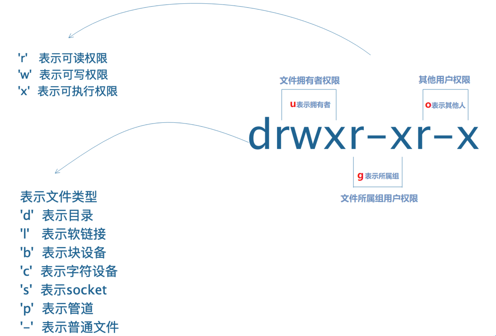
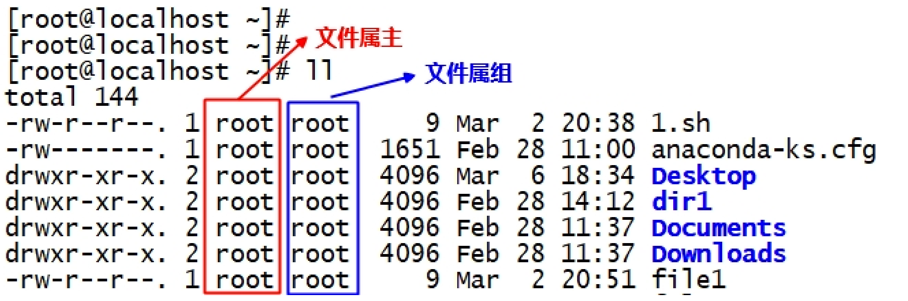

# 命令--7.1.文件权限(普通)

[[toc]]

## 一、权限概述

### ㈠ 什么是权限

**权限：** 在计算机<font color=red>系统中</font>，权限是指某个<font color=red>计算机用户</font>具有<font color=red>使用软件资源的权利</font>。

**思考：计算机资源分为哪两部分？**

- 硬件资源 硬盘、CPU、内存、网卡等<font color=red>物理硬件资源</font>

- 软件资源

  **软件**：操作系统(特殊的软件)、应用程序。只要不启动，这些软件就是一堆静态的<font color=red>文件</font>，并且静静的躺在我们计算机的磁盘中。

  **软件资源**：Linux系统中，一切皆文件！SO，这里的软件资源就是<font color=red>文件资源</font>。

**总结：**

我们今天所讲的权限，指的就是：<font color=red>文件资源</font>所拥有的相关权限，即<font color=red>文件权限</font>


### ㈡ 权限设置目的

文件权限的设置目的：<font color=red>是想让某个用户（Linux操作系统中的用户）有权利操作文件</font>

 

### ㈢ 文件权限的分类

**普通权限**

- 用户正常情况去操作文件所具有的权限

**高级权限**

- 用户对某个文件操作有特殊需求，而普通权限不能满足，需要给文件设置高级权限

**默认权限**

- 用户在系统中创建一个文件，该文件默认都会有一个权限，该权限是默认有的

**注意：**

权限是<font color=red>设置在文件上</font>的，而不是用户；设置权限目的是让相应的人（用户）去操作相应的文件


## 二、普通权限(重点)

### ㈠ 理解普通权限rwx含义

1、读权限—r(<font color=red>r</font>ead)

- 针对<font color=red>目录</font>

  一个目录拥有r权限，说明可以查看该<font color=red>目录里的内容</font>（ls命令列出）

- 针对<font color=red>普通文件</font>

  一个普通文件拥有r权限，说明可以查看该<font color=red>文件的内容</font>(cat/head/tail/less/more等命令查看)

- 读权限**<font color=red>r</font>**（read）用数字表示是<font color=red>**4**</font>


2、写权限—w(<font color=red>w</font>rite)

- 针对<font color=red>目录</font>

  一个目录拥有w权限，说明可以在该目录里<font color=red>**创建、删除、重命名**</font>等操作（mkdir/touch/mv/rm等）

- 针对<font color=red>普通文件</font>

  一个普通文件拥有w权限，说明可以<font color=red>**修改**</font>该<font color=red>文件的**内容**</font>（vi/vim编辑器编辑文件）

- 写权限<font color=red>**w**</font>（write）用数字表示是**<font color=red>2</font>**

 

3、执行权限—x(e<font color=red>x</font>ecute)

- 针对<font color=red>目录</font>

  一个目录拥有x权限，说明可以**<font color=red>进入或切换到</font>**该目录里（cd命令）

- 针对<font color=red>普通文件</font>

  一个普通文件拥有x权限，说明可以**<font color=red>执行</font>**该文件（一般程序文件、脚本文件、命令都需要执行权限）

- 执行权限<font color=red>**x**</font>（execute）用数字表示是<font color=red>**1**</font>


4、没有权限—横杠-

没有任何权限用横杠<font color=red>-</font>表示，数字表示是**0**


### ㈡ 理解UGO的含义

1、UGO指的是什么

UGO，指的是**<font color=red>用户身份</font>**，每个字母代表<font color=red>不同的</font>用户身份。

- U（the user who owns it）

  文件的<font color=red>拥有者</font>(owner)或者<font color=red>创建者</font>

- G（other users in the file’s <font color=red>g</font>roup）

  在文件的所属组（默认是创建文件的用户的主组）里的用户

- O（<font color=red>o</font>ther users not in the file’s group）

  既不是文件的创建者，也不在文件属组里的用户，称为其他人

注意：

除了上面ugo以外，还有一个字母**<font color=red>a</font>**（all users）,表示<font color=red>所有用户</font>，包含ugo


2、如何判断不同身份的用户对文件的权限

```powershell
查看文件详细信息，包含权限信息：
[root@localhost ~]# ls -l
total 144
-rw-r--r--. 1 root root 9 Mar 2 20:38 1.sh
-rw-------. 1 root root 1651 Feb 28 11:00 anaconda-ks.cfg
drwxr-xr-x. 2 root root 4096 Mar 6 18:34 Desktop
drwxr-xr-x. 2 root root 4096 Feb 28 14:12 dir1
```




### ㈢ 修改文件普通权限(chmod)

1、chmod命令用法

```powershell
chmod [选项] 模式 文件名
常见选项：
-R, --recursive 递归更改目录和目录里文件的权限
```

2、举例说明

① 通过字母形式更改文件权限

```powershell
u:表示文件拥有者
g:表示文件属组里的用户
o:表示其他人，即不是文件的创建者，也不在文件属组里
a:表示所有人
```

- 环境准备

```powershell
[root@heima ~]# mkdir /tmp/dir1
[root@heima ~]# touch /tmp/dir1/file{1..5}
[root@heima ~]# touch /tmp/test{1..3}
[root@heima ~]# ll /tmp/ -R
```

- 使用字母形式修改文件权限

```powershell
[root@heima tmp]# pwd
/tmp
[root@heima tmp]# ll test1
-rw-r--r--. 1 root root 0 Mar 6 20:45 test1
[root@heima tmp]# chmod u+x test1
[root@heima tmp]# ll test1
-rwxr--r--. 1 root root 0 Mar 6 20:45 test1
[root@heima tmp]# chmod g+w test1
[root@heima tmp]# ll test1
-rwxrw-r--. 1 root root 0 Mar 6 20:45 test1
[root@heima tmp]# chmod o-r test1
[root@heima tmp]# ll test1
-rwxrw----. 1 root root 0 Mar 6 20:45 test1

[root@heima tmp]# ll test2
-rw-r--r--. 1 root root 0 Mar 6 20:45 test2
[root@heima tmp]# chmod a+x test2
[root@heima tmp]# ll test2
-rwxr-xr-x. 1 root root 0 Mar 6 20:45 test2

[root@heima tmp]# ll test3
-rw-r--r--. 1 root root 0 Mar 6 20:45 test3
[root@heima tmp]# chmod u+x,g+w,o-r test3
[root@heima tmp]# ll test3
-rwxrw----. 1 root root 0 Mar 6 20:45 test3

[root@heima tmp]# chmod u=rw,g=rx,o+r test3
[root@heima tmp]# ll test3
-rw-r-xr--. 1 root root 0 Mar 6 20:45 test3

修改目录的权限：
[root@heima tmp]# ll -d dir1/
drwxr-xr-x. 2 root root 4096 Mar 6 20:45 dir1/
[root@heima tmp]# ll dir1/
total 0
-rw-r--r--. 1 root root 0 Mar 6 20:45 file1
-rw-r--r--. 1 root root 0 Mar 6 20:45 file2
-rw-r--r--. 1 root root 0 Mar 6 20:45 file3
-rw-r--r--. 1 root root 0 Mar 6 20:45 file4
-rw-r--r--. 1 root root 0 Mar 6 20:45 file5

1.只修改目录本身的权限
[root@heima tmp]# chmod g+w dir1/
[root@heima tmp]# ll -d dir1/
drwxrwxr-x. 2 root root 4096 Mar 6 20:45 dir1/
[root@heima tmp]# ll dir1/
total 0
-rw-r--r--. 1 root root 0 Mar 6 20:45 file1
-rw-r--r--. 1 root root 0 Mar 6 20:45 file2
-rw-r--r--. 1 root root 0 Mar 6 20:45 file3
-rw-r--r--. 1 root root 0 Mar 6 20:45 file4
-rw-r--r--. 1 root root 0 Mar 6 20:45 file5
说明：目录下面文件的权限并没有修改

2.修改目录以及目录里所有文件的权限（递归修改），使用-R参数
[root@heima tmp]# chmod -R o+w dir1/
[root@heima tmp]# ll -d dir1/
drwxrwxrwx. 2 root root 4096 Mar 6 20:45 dir1/
[root@heima tmp]# ll dir1/
total 0
-rw-r--rw-. 1 root root 0 Mar 6 20:45 file1
-rw-r--rw-. 1 root root 0 Mar 6 20:45 file2
-rw-r--rw-. 1 root root 0 Mar 6 20:45 file3
-rw-r--rw-. 1 root root 0 Mar 6 20:45 file4
-rw-r--rw-. 1 root root 0 Mar 6 20:45 file5
```

② 通过数字形式更改文件权限

- 学会用数字表示权限

```powershell
字母和数字对应关系：
r——4
w——2
x——1
-——0


rw- r-x r-- 用数字表示就是654
rwx rw- --- 用数字表示就是760
755 用字母表示就是rwx r-x r-x
644 用字母表示就是rw- r-- r--
```

- 使用数字形式修改文件权限

```powershell
# chmod 644 file1 rw-r--r--
# chmod 700 file2
# chmod -R 755 dir1
```


**总结：**

1. 普通权限当中rwx含义

   - 目录：r（ls列出目录内容），w（创建、删除、重命名等操作），x（cd进入目录）

   - 文件：r（cat等相关工具查看文件内容），w（修改文件内容），x（可执行，程序，脚本文件等）

2. 理解用户身份（UGO）

   - U：文件的拥有者（创建）

   - G：文件所属组里成员

   - O：陌生人（其他人）

3. 如何设置文件的权限？——>chmod命令

   - 用字母形式

   ```powershell
   chmod u+x,g=rw,o-x filename
   ```

   - 数字形式

   ```powershell
   r——>4
   w——>2
   x——>1
   -——>0
   rw- r-x r-- = 654
   
   
   chmod 755 filename rwx r-x r-x
   ```

4. 是否可以在目录里创建或删除文件？看当前目录本身是否有w权限！！

5. 对于正常操作目录而言，一般都会具有r和x权限


### 课堂练习

1. 创建5个用户user01~user05和一个admin组

2. 将user01~user03用户加入到admin组里

3. user01用户在其家目录里创建file1~file3三个文件

4. user02用户编辑/home/user01/file1文件的内容：good good study,day day up!

5. user05用户往/home/user01/file1文件里追加内容：I known

6. user04用删除/home/user01家目录的所有文件

```powershell
id user01
useradd user01
useradd user02 
useradd user03 
useradd user04
useradd user05

grep admin /etc/group
groupdel admin
groupadd admin
tail /etc/group


usermod -G admin user01
gpasswd -M user01,user02
gpasswd -a user03
id user02
tail -1 /etc/group

su user01
pwd
touch file{1..3}


chmod o+rx /home/user01
chmod o+w /home/user01/file1
echo "good good study,day day up" > file1
echo "I konwn" > file1


```

## 三、文件的属主和属组

### ㈠ 如何查看文件的属主和属组



### ㈡ 如何修改文件的属主和属组

#### 1、chown命令修改

`chown` 命令既可以修改文件的属主，也可以修改文件的属组。

```powershell
只修改文件的属主
# chown 用户名 文件名

修改文件的属主和属组
# chown 用户名.组名 文件名
# chown 用户名:组名 文件名
# chown 用户名. 文件名 //没有指定组名，默认是用户的主组

只修改文件的属组
# chown .组名 文件名
# chown :组名 文件名

可以加-R选项，表示递归修改
```

#### 2、chgrp命令修改

`chgrp` 命令只能修改文件的属组。

```powershell
# chgrp 组名 文件名
```


## demo案例

一、创建目录在跳板机

```powershell
[root@heima ~]# mkdir /data/code -p
```

二、目录做好权限管控

1、该目录只给开发人员使用

```powershell
[root@heima ~]# ll -d /data/code/
drwxrwx---. 2 root coding 58 8月 1 22:18 /data/code/

chgrp codeing /data/code/
chmod g+w /data/code/
chmod o-rx /data/code/
```

2、开发所有人只能自己管理自己

```powershell
测试结果：
开发部门的人可以删除其他人的文件，不满足需求，怎么办？
普通权限无法满足我们的需求，尝试使用高级权限解决
chmod o+t /data/code
```

