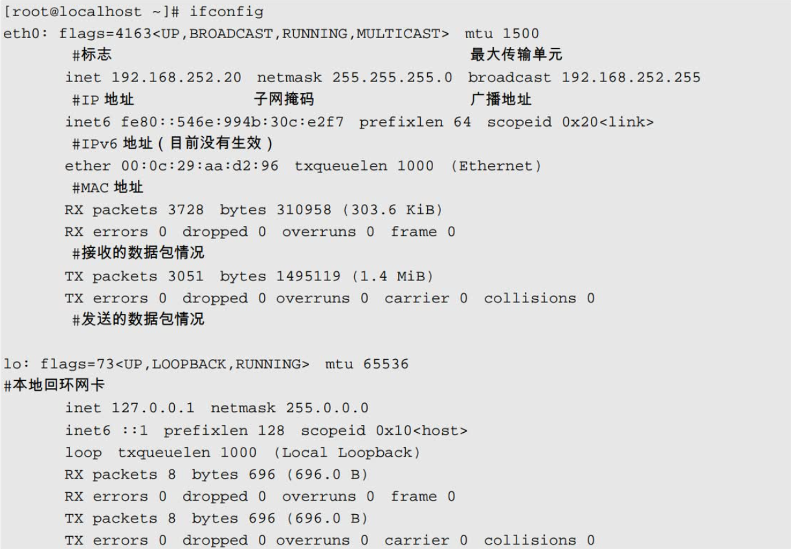

# 命令--8.网络配置

## 主机名

```shell
[root@heima ~]# hostnamectl set-hostname RedHat8.itcast.cn
[root@heima ~]# cat /etc/hostname
RedHat8.itcast.cn
[root@RedHat8 ~]#
说明：
1)通过命令hostnamectl修改会写到/etc/hostname文件,故也可以直接修改该文件
2)退出重新登录立马生效，不需要重启系统
```

## 静态IP配置

### ㈠ 了解Vmware三种网络模式

##### ① 了解虚拟网络设备

> VMnet0：用于虚拟**桥接网络**下的虚拟交换机
>
> VMnet1：用于虚拟**Host-Only**网络下的虚拟交换机
>
> VMnet8：用于虚拟**NAT**网络下的虚拟交换机
>
> VMware Network Adepter VMnet1：Host用于与Host-Only虚拟网络进行通信的虚拟网卡 VMware
>
> Network Adepter VMnet8：Host用于与NAT虚拟网络进行通信的虚拟网卡

##### ② 了解三种网络模式

- 桥接网络

> 桥接网络是指虚拟网卡通过VMnet0虚拟交换机和本地物理网卡进行桥接，那么物理网卡和虚拟网卡就相当于处于同一个网段，虚拟交换机就相当于一台现实网络中的交换机。所以要想虚拟机也可以连接到互联网中，那么两个网卡的IP地址也要设置为同一网段。


- NAT网络

> 在NAT网络中，会用到VMware Network Adepter VMnet8虚拟网卡，主机上的VMware Network Adepter VMnet8虚拟网卡被直接连接到VMnet8虚拟交换机上与虚拟网卡进行通信。
>
> VMware Network Adepter VMnet8虚拟网卡的作用仅限于和VMnet8网段进行通信，它不给VMnet8网段提供路由功能，所以虚拟机虚拟一个NAT服务器，使虚拟网卡可以连 接到Internet。
>
> VMware Network Adepter VMnet8虚拟网卡的IP地址是在安装VMware时由系统指定生成的，我们尽量不要修改这个数值，否则可能会使主机和虚拟机无法通信。


**思考：**

1. 虚拟主机A1是否可以访问物理真机主机B？

2. 虚拟主机A1是否可以访问物理真机主机Ｂ下的NAT模式下的虚拟机？

- 仅主机网络

> 在Host-Only模式下，虚拟网络是一个全封闭的网络，它唯一能够访问的就是物理真机。其实Host-Only网络和NAT网络很相似，不同的地方就是Host-Only网络没有NAT服务，所以虚拟网络不能连接到Internet。主机和虚拟机之间的通信是通过VMware Network Adepter VMnet1虚拟网卡来实现的。


**总结：**

1. VMware workstation带来哪些网络设备

   - 三种网络模式下的虚拟交换机

   - 两张虚拟网卡（vmnet1和vmnet8）——>作用：用于物理主机和虚拟机通讯

2. 三种网络模式
   - 桥接网络
     - 默认情况下可以访问互联网
     - 桥接网络的虚拟机IP地址和物理真机在同一个网段
   - NAT网络
     - 默认情况下可以访问互联网
     - NAT网络的虚拟IP地址和物理真机不在同一个网段
     - 为什么NAT网络可以访问互联网？因为NAT路由转换功能（地址转换技术）
   - 仅主机网络
     - 默认情况下不可以访问互联网
     - 仅主机模式下虚拟机IP地址和物理真机不在同一个网段


### ㈡ 静态IP地址配置

Linux下一切皆文件!必然通过修改配置文件生效！

#### 方法1：直接修改网卡配置文件

配置静态IP地址

```shell
[root@heima ~]# cd /etc/sysconfig/network-scripts/
[root@heima network-scripts]# ls
ifcfg-ens160
[root@heima network-scripts]# cat ifcfg-ens160
TYPE=Ethernet 			以太网
BOOTPROTO=none 			IP获取方式，none和static表示静态，dhcp动态
NAME=ens160 			网卡名称
UUID=63b0b6ee-fbee-4b17-80be-e3b36ff27493 网卡UUID，唯一标识
DEVICE=ens160 			网卡设备名
ONBOOT=yes 				激活网卡
IPADDR=192.168.159.100 	IP地址
PREFIX=24 				子网掩码 或者 NETMASK=255.255.255.0
GATEWAY=192.168.159.2 	网关
DNS1=8.8.8.8 			dns服务器
```

重载网卡配置文件

```shell
[root@heima network-scripts]# nmcli connection reload ens160
# 激活网卡连接
[root@heima network-scripts]# nmcli connection up ens160
```

```shell
# 方式有所改变
systemctl restart network.service
```


复制镜像有可能需要重置UUID（唯一识别符）

```shell
[root@localhost ~]# vi/etc/sysconfig/network-scripts/ifcfg-eth0
#删除MAC地址行

[root@localhost ~]# rm-rf/etc/udev/rules.d/70-persistent-net.rules
#删除MaC地址和UUID绑定文件

[root@localhost ~]# reboot
#重启Linux
```


#### 方法2：使用nmcli工具配置

查看网络连接情况

```powershell
查看所有连接的网络信息
[root@heima ~]# nmcli connection show
NAME UUID TYPE DEVICE
ens160 ea74cf24-c2a2-ecee-3747-a2d76d46f93b ethernet ens160
virbr0 e17e3c81-da25-455a-a8db-755ebdf36601 bridge virbr0

查看已经激活的网络连接信息
[root@heima ~]# nmcli connection show --active
NAME UUID TYPE DEVICE
ens160 ea74cf24-c2a2-ecee-3747-a2d76d46f93b ethernet ens160
virbr0 e17e3c81-da25-455a-a8db-755ebdf36601 bridge virbr0
```

修改当前网卡IP地址

```shell
[root@heima ~]# nmcli connection modify ens160 ipv4.addresses 192.168.159.101/24
ipv4.gateway 192.168.159.2 ipv4.dns 114.114.114.114
```

增加/删除IP地址（子接口）

```shell
[root@heima ~]# nmcli connection modify ens160 +ipv4.addresses 10.1.1.1/24
[root@heima ~]# nmcli connection modify ens160 -ipv4.addresses 10.1.1.1/24
```

增加/删除DNS

```shell
[root@heima ~]# nmcli connection modify ens160 +ipv4.dns 8.8.8.8
[root@heima ~]# nmcli connection modify ens160 -ipv4.dns 8.8.8.8
```

修改网络后需要重载配置文件并激活连接

```shell
[root@heima ~]# nmcli connection reload ens160
[root@heima ~]# nmcli connection up ens160
```


#### 方法3：使用nmtui文本图形工具

```shell
[root@RedHat8 ~]# nmtui

改完后还是需要 使用 nmcli 激活
# nmcli connection up ens160
```

**总结：**

1. 推荐直接修改配置文件方式配置静态IP，一步到位

2. 从红帽8以后大家要熟悉使用nmcli工具管理网络，红帽7中的network.service即将被废弃


## 复制镜像有可能需要重置UUID（唯一识别符）

```shell
[root@localhost ~]# vi /etc/sysconfig/network-scripts/ifcfg-eth0
#删除MAC地址行

[root@localhost ~]# rm-rf/etc/udev/rules.d/70-persistent-net.rules
#删除MaC地址和UUID绑定文件

[root@localhost ~]# reboot
#重启Linux
```


## ifconfig

> 静态ip查询
>
> ifconfig命令最主要的作用就是查看IP地址的信息，直接输入ifconfig命令即可。



```shell
[jysp@jysp ~]$ ifconfig
...省略...
enp125s0f5: flags=4163<UP,BROADCAST,RUNNING,MULTICAST>  mtu 1500
        inet 192.168.1.101  netmask 255.255.255.0  broadcast 192.168.1.255
        inet6 fe80::77b1:8f7c:2a45:346  prefixlen 64  scopeid 0x20<link>
        ether cc:20:8c:73:9d:d8  txqueuelen 1000  (Ethernet)
        RX packets 5764048  bytes 710412064 (677.5 MiB)
        RX errors 0  dropped 0  overruns 0  frame 0
        TX packets 10539417  bytes 4741264284 (4.4 GiB)
        TX errors 0  dropped 0 overruns 0  carrier 0  collisions 0
...省略...
```

## ping

> ping是常用的网络命令，主要通过ICMP协议进行网络探测，测试网络中主机的通信情况。

```shell
ping [选项] IP
选项：
	-b:			后面加入广播地址，用于对整个网段进行探测	
	-c 次数:	   用于指定ping的次数
	-s 字节:	   指定探测包的大小
```

例子：探测网段中的可用主机

> 在ping命令中，可以使用“-b”选项，后面加入广播地址，探测整个网段。我们可以使用这个选
> 项知道整个网络中有多少主机是可以和我们通信的，而不用一个一个IP地址地进行探测。例如：

```shell
[root@localhost ~]# ping -b -c 3 192.168.103.255
WARNING: pinging broadcast address
PING 192.168.103.255 (192.168.103.255) 56(84) bytes of data.
64 bytes from 192.168.103.199: icmp_seq=1 ttl=64 time=1.95 ms
64 bytes from 192.168.103.168: icmp_seq=1 ttl=64 time=1.97 ms (DUP!)
64 bytes from 192.168.103.252: icmp_seq=1 ttl=64 time=2.29 ms (DUP!)
…省略部分内容…

#探测192.168.103.0/24网段中有多少可以通信的主机
```


> Windows的cmd ping排查可用ip的方式之一

```shell
# 查看自己的IP
ipconfig/all
    
# -w 2毫秒延时，-n 数据包大小
for /L %i IN (1,1,254) DO ping -w 2 -n 1 192.168.10.%i

# 查看ping的结果
arp -a
```

## netstat

> netstat是网络状态查看命令，既可以查看到本机开启的端口，也可以查看有哪些客户端连接。
>
> 在CentOS 7.x中netstat命令默认没有安装，如果需要使用，需要安装net-snmp和net-tools软件包。

```shell
[root@localhost ~]# netstat [选项]
选项：
	-a：		列出所有网络状态，包括Socket程序
	-c 秒数： 指定每隔几秒刷新一次网络状态
    -n：		使用IP地址和端口号显示，不使用域名与服务名
    -p：		显示PID和程序名
    -t：		显示使用TCP协议端口的连接状况
    -u：		显示使用UDP协议端口的连接状况
    -l：		仅显示监听状态的连接
    -r：		显示路由表
```

例子1：查看本机开启的端口

这是本机最常用的方式，使用选项“-tuln”。因为使用了“-l”选项，所以只能看到监听状态的连接，而不能看到已经建立连接状态的连接。例如：

```shell
[root@jysp ~]# netstat -tuln
Active Internet connections (only servers)
Proto Recv-Q Send-Q Local Address           Foreign Address         State
tcp        0      0 0.0.0.0:4370            0.0.0.0:*               LISTEN     
tcp        0      0 0.0.0.0:25235           0.0.0.0:*               LISTEN     
tcp        0      0 0.0.0.0:8883            0.0.0.0:*               LISTEN     
tcp        0      0 0.0.0.0:8083            0.0.0.0:*               LISTEN     
tcp        0      0 0.0.0.0:9972            0.0.0.0:*               LISTEN     
tcp        0      0 0.0.0.0:8084            0.0.0.0:*               LISTEN     
tcp        0      0 127.0.0.1:631           0.0.0.0:*               LISTEN     
tcp        0      0 0.0.0.0:8888            0.0.0.0:*               LISTEN     
tcp        0      0 0.0.0.0:15672           0.0.0.0:*               LISTEN     
tcp        0      0 127.0.0.1:8088          0.0.0.0:*               LISTEN     

#协议接收队列发送队列本机的IP地址及端口号远程主机的IP地址及端口号状态

Proto:	网络连接的协议，一般就是TCP协议或者UDP协议。
Recv-Q:	表示接收到的数据，已经在本地的缓冲中，但是还没有被进程取走。
Send-Q:	表示从本机发送，对方还没有收到的数据，依然在本地的缓冲中，一般是不具备ACK标志的数据包。
Local Address		本机的IP地址和端口号。          
Foreign Address		远程主机的IP地址和端口号。
State				状态。常见的状态主要有以下几种。
	- LISTEN：监听状态，只有TCP协议需要监听，而UDP协议不需要监听。
	- ESTABLISHED：已经建立连接的状态。如果使用“-l”选项，则看不到已经建立连接的状态。
	- SYN_SENT：SYN发起包，就是主动发起连接的数据包。
	- SYN_RECV：接收到主动连接的数据包。
	- FIN_WAIT1：正在中断的连接。
	- FIN_WAIT2：已经中断的连接，但是正在等待对方主机进行确认。
	- TIME_WAIT：连接已经中断，但是套接字依然在网络中等待结束。
	- CLOSED：套接字没有被使用。
	
在这些状态中，我们最常用的就是LISTEN和ESTABLISHED状态，一种代表正在监听，另一种代表已经建立连接。
```

例子2：查看本机有哪些程序开启的端口

如果使用“-p”选项，则可以查看到是哪个程序占用了端口，并且可以知道这个程序的PID。例如：

```shell
[root@jysp ~]# netstat -tulnp
Active Internet connections (only servers)
Proto Recv-Q Send-Q Local Address           Foreign Address         State       PID/Program name    
tcp        0      0 0.0.0.0:4370            0.0.0.0:*               LISTEN      15916/ubt_x64a64_al 
tcp        0      0 0.0.0.0:25235           0.0.0.0:*               LISTEN      17209/ubt_x64a64_al 
tcp        0      0 0.0.0.0:8883            0.0.0.0:*               LISTEN      15916/ubt_x64a64_al 
tcp        0      0 0.0.0.0:8083            0.0.0.0:*               LISTEN      15916/ubt_x64a64_al 
tcp        0      0 0.0.0.0:9972            0.0.0.0:*               LISTEN      17209/ubt_x64a64_al 
tcp        0      0 0.0.0.0:8084            0.0.0.0:*               LISTEN      15916/ubt_x64a64_al 
tcp        0      0 127.0.0.1:631           0.0.0.0:*               LISTEN      1682/cupsd          
tcp        0      0 0.0.0.0:8888            0.0.0.0:*               LISTEN      32061/nginx: master 
tcp        0      0 0.0.0.0:15672           0.0.0.0:*               LISTEN      1684/beam.smp       
tcp        0      0 127.0.0.1:8088          0.0.0.0:*               LISTEN      1798/influxd        
tcp        0      0 127.0.0.1:25            0.0.0.0:*               LISTEN      2803/master         
tcp        0      0 0.0.0.0:5370            0.0.0.0:*               LISTEN      15916/ubt_x64a64_al 

#比之前的命令多了一个“-p”选项，结果多了“PID/程序名”，可以知道是哪个程序占用了端口
```

例子3：查看所有连接

使用选项“-an”可以查看所有连接，包括监听状态的连接（LISTEN）、已经建立连接状态的连接（ESTABLISHED）、Socket程序连接等。因为连接较多，所以输出的内容有很多。例如：

```shell
[root@jysp ~]# netstat -an
Active Internet connections (servers and established)
Proto Recv-Q Send-Q Local Address           Foreign Address         State      
tcp        0      0 0.0.0.0:4370            0.0.0.0:*               LISTEN     
tcp        0      0 0.0.0.0:25235           0.0.0.0:*               LISTEN     
tcp        0      0 0.0.0.0:8883            0.0.0.0:*               LISTEN     
tcp        0      0 0.0.0.0:8083            0.0.0.0:*               LISTEN     
tcp        0      0 0.0.0.0:9972            0.0.0.0:*               LISTEN    
…省略部分内容…
Active UNIX domain sockets (servers and established)
Proto RefCnt Flags       Type       State         I-Node   Path
unix  2      [ ACC ]     STREAM     LISTENING     19969    /var/run/docker.sock
unix  2      [ ACC ]     STREAM     LISTENING     36871    /run/systemd/private
unix  2      [ ACC ]     STREAM     LISTENING     41230    /run/user/42/pulse/native
unix  2      [ ACC ]     STREAM     LISTENING     36880    /run/lvm/lvmetad.socket
unix  2      [ ACC ]     STREAM     LISTENING     36886    /run/lvm/lvmpolld.socket
unix  2      [ ACC ]     STREAM     LISTENING     19248    @/tmp/.ICE-unix/4010
unix  2      [ ]         DGRAM                    36893    /run/systemd/shutdownd
unix  2      [ ACC ]     STREAM     LISTENING     27093    @/tmp/.X11-unix/X0
unix  3      [ ]         DGRAM                    13347    /run/systemd/notify
…省略部分内容…
```

从“Active UNIX domain sockets”开始，之后的内容就是Socket程序产生的连接，之前的内容都是网络服务产生的连接。我们可以在“-an”选项的输出中看到各种网络连接状态，而之前的“-tuln”选项则只能看到监听状态。


例子4：查看网关

```shell
[root@jysp ~]# netstat -rn
Kernel IP routing table
Destination     Gateway         Genmask         Flags   MSS Window  irtt Iface
0.0.0.0         192.168.1.1     0.0.0.0         UG        0 0          0 enp125s0f5
172.17.0.0      0.0.0.0         255.255.0.0     U         0 0          0 docker0
172.18.0.0      0.0.0.0         255.255.0.0     U         0 0          0 br-3809f93307e8
172.19.0.0      0.0.0.0         255.255.0.0     U         0 0          0 br-0aa8284bdd5f
172.20.0.0      0.0.0.0         255.255.0.0     U         0 0          0 br-f83f277f7a5c
172.25.0.0      0.0.0.0         255.255.0.0     U         0 0          0 br-61ad061d70be
172.28.0.0      0.0.0.0         255.255.0.0     U         0 0          0 br-6e32681f18b2
192.168.1.0     0.0.0.0         255.255.255.0   U         0 0          0 enp125s0f5
192.168.112.0   0.0.0.0         255.255.240.0   U         0 0          0 br-24a3963f734c
192.168.224.0   0.0.0.0         255.255.240.0   U         0 0          0 br-22ff53af9bc5
```


查看指定端口占用情况

```sehll
netstat -tlnp | grep [端口号|程序]
# or
netstat -anp | grep [端口号|程序]
```

查看所有端口占用情况

```shell
netstat -utlnp
```

查看某个程序进程信息

```shell
ps -ef | grep [程序]
# or
ps -aux | grep [程序]

再根据 PID 查看端口占用
netstat -anp | grep 进程ID


ps -u root 根据用户过滤进程 
ps -aux --sort -pcpu | less 根据 CPU 使用来升序排序 
ps -aux --sort -pmem | less 根据用户过滤进程
ps -aux --sort -pcpu,+pmem | head -n 10 查询全前10个使用cpu和内存最高的应用
```

## nc（了解）

> telnet/nc判断端口是否开启，了解

## lsof

> 查看指定端口使用情况

```shell

lsof -i <条件>:[端口号]
[root@xiaoshaozi ~]# lsof -i :22
COMMAND   PID USER   FD   TYPE  DEVICE SIZE/OFF NODE NAME
sshd     1552 root    3u  IPv4   19568      0t0  TCP *:ssh (LISTEN)
sshd    28832 root    3u  IPv4 2959288      0t0  TCP iZuf616fn1k2l61xnal11vZ:ssh->220.180.63.118:55502 (ESTABLISHED)


列出系统上被进程打开的文件的相关信息
lsof -i -P | grep [程序]
[root@xiaoshaozi ~]# lsof -i -P | grep ssh
sshd       1552     root    3u  IPv4   19568      0t0  TCP *:22 (LISTEN)
sshd      28832     root    3u  IPv4 2959288      0t0  TCP iZuf616fn1k2l61xnal11vZ:22->220.180.63.118:55502 (ESTABLISHED)

```


## write（了解）

```shell
A终端
[root@jysp ~]# write root pts/5
hello 中文

B终端
[root@jysp ~]# 
Message from root@jysp on pts/3 at 10:25 ...
hello \344\270\255\346\226\207
EOF


# ctrl+d 发送
# 不支持中文
```


```shell
[root@jysp ~]# w
 10:22:24 up 6 days,  1:08,  4 users,  load average: 2.84, 3.07, 3.44
USER     TTY      FROM             LOGIN@   IDLE   JCPU   PCPU WHAT
jysp     pts/1    192.168.1.9      09:27   42:48  29:51   0.06s -bash
jysp     pts/2    192.168.1.9      09:27   54:40  17.63s 17.60s top
root     pts/3    192.168.1.103    09:34    0.00s  0.05s  0.01s w
root     pts/4    192.168.1.103    09:34   48:20  16.44s 16.42s top
```

Linux中终端

- 本地字符终端 tty1-6 使用alt + f1-6
- 本地图形终端tty7 ctrl+alt+F7(按住3秒，需要安装启动图形界面)
- 远程终端 pts/0-255 

谁在执行w就是当前终端

## wall（了解）

> write命令用于给指定用户发送信息，而wall命令用于给所有登录用户发送信息，包括你自己。
>
> 执行时，在wall命令后加入需要发送的信息即可，例如：

```shell
[root@localhost ~]# wall "I will be in 5 minutes to restart, please save your data"
```


## mail

> mail是Linux的邮件客户端命令，可以利用这个命令给其他用户发送邮件。mail命令的基本信息如下。

### 例子1：发送邮件

如果我们想要给其他用户发送邮件，则可以执行如下命令：

```shell
[root@localhost ~]# mail user1
Subject: hello		<-邮件标题
Nice to meet you!	<-邮件具体内容
.					<-使用“.”来结束邮件输入

#发送邮件给user1用户
```

我们接收到的邮件都保存在“`/var/spool/mail/用户名`”中，每个用户都有一个以自己的用户名命名的邮箱。

### 例子2：发送文件内容

如果我们想把某个文件的内容发送给指定用户，则可以执行如下命令：

```shell
[root@localhost ~]# mail -s "test mail" root < /root/anaconda-ks.cfg
选项：
-s：指定邮件标题

#把/root/anaconda-ks.cfg文件的内容发送给root用户
```

我们在写脚本时，有时需要脚本自动发送一些信息给指定用户，把要发送的信息预先写到文件中，是一个非常不错的选择。

### 例子3：查看已经接收的邮件

我们可以直接在命令行中执行mail命令，进入mail的交互命令中，可以在这里查看已经接收到的邮件。例如：

```shell
[root@localhost ~]# mail
Heirloom Mail version 12.4 7/29/08.Type ?for help.
"/var/spool/mail/root":1 message 1 new
>N	1 root			Mon Dec	5 22:45	68/1777	"test mail"<-之前收到的邮件
>N	2 root			Mon Dec	5 23:08	18/602	"hello"
#未阅读 编号 发件人	时间	标题
&					<-等待用户输入命令
```

可以看到已经接收到的邮件列表，“N”代表未读邮件，如果是已经阅读过的邮件，则前面是不会有这个“N”的；之后的数字是邮件的编号，我们主要通过这个编号来进行邮件的操作。如果我们想要查看第一封邮件，则只需输入邮件的编号“1”就可以了。

在交互命令中执行“？”，可以查看这个交互界面支持的命令。

解释一下常用的交互命令。

- headers：列出邮件标题列表，直接输入“h”命令即可。

- delete：删除指定邮件。比如想要删除第二封邮件，可以输入“d 2”。

- save：保存邮件。可以把指定邮件保存成文件，如“s 2 /tmp/test.mail”。

- quit：退出，并把已经操作过的邮件进行保存。比如移除已删除邮件、保存已阅读邮件等。

- exit：退出，但是不保存任何操作。
