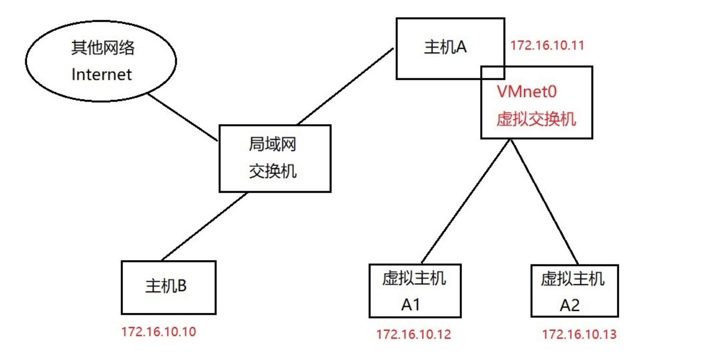
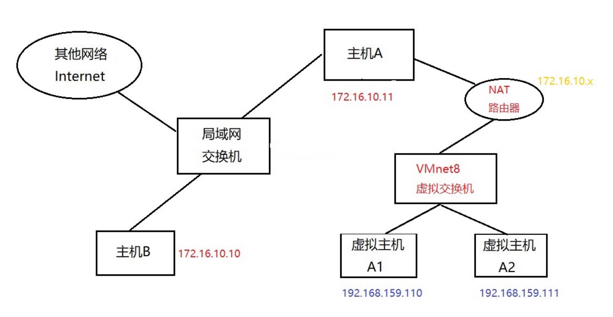
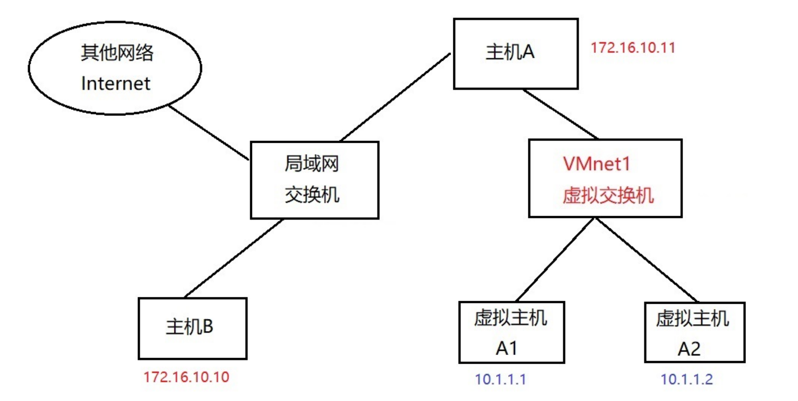

# 命令--8.网络配置

## 主机名

```shell
[root@heima ~]# hostnamectl set-hostname RedHat8.itcast.cn
[root@heima ~]# cat /etc/hostname
RedHat8.itcast.cn
[root@RedHat8 ~]#
说明：
1)通过命令hostnamectl修改会写到/etc/hostname文件,故也可以直接修改该文件
2)退出重新登录立马生效，不需要重启系统
```

## 静态IP配置

### ㈠ 了解Vmware三种网络模式

##### ① 了解虚拟网络设备

> VMnet0：用于虚拟**桥接网络**下的虚拟交换机
>
> VMnet1：用于虚拟**Host-Only**网络下的虚拟交换机
>
> VMnet8：用于虚拟**NAT**网络下的虚拟交换机
>
> VMware Network Adepter VMnet1：Host用于与Host-Only虚拟网络进行通信的虚拟网卡 VMware
>
> Network Adepter VMnet8：Host用于与NAT虚拟网络进行通信的虚拟网卡

##### ② 了解三种网络模式

- 桥接网络

> 桥接网络是指虚拟网卡通过VMnet0虚拟交换机和本地物理网卡进行桥接，那么物理网卡和虚拟网卡就相当于处于同一个网段，虚拟交换机就相当于一台现实网络中的交换机。所以要想虚拟机也可以连接到互联网中，那么两个网卡的IP地址也要设置为同一网段。



- NAT网络

> 在NAT网络中，会用到VMware Network Adepter VMnet8虚拟网卡，主机上的VMware Network Adepter VMnet8虚拟网卡被直接连接到VMnet8虚拟交换机上与虚拟网卡进行通信。
>
> VMware Network Adepter VMnet8虚拟网卡的作用仅限于和VMnet8网段进行通信，它不给VMnet8网段提供路由功能，所以虚拟机虚拟一个NAT服务器，使虚拟网卡可以连 接到Internet。
>
> VMware Network Adepter VMnet8虚拟网卡的IP地址是在安装VMware时由系统指定生成的，我们尽量不要修改这个数值，否则可能会使主机和虚拟机无法通信。



**思考：**

1. 虚拟主机A1是否可以访问物理真机主机B？

2. 虚拟主机A1是否可以访问物理真机主机Ｂ下的NAT模式下的虚拟机？

- 仅主机网络

> 在Host-Only模式下，虚拟网络是一个全封闭的网络，它唯一能够访问的就是物理真机。其实Host-Only网络和NAT网络很相似，不同的地方就是Host-Only网络没有NAT服务，所以虚拟网络不能连接到Internet。主机和虚拟机之间的通信是通过VMware Network Adepter VMnet1虚拟网卡来实现的。



**总结：**

1. VMware workstation带来哪些网络设备

   - 三种网络模式下的虚拟交换机

   - 两张虚拟网卡（vmnet1和vmnet8）——>作用：用于物理主机和虚拟机通讯

2. 三种网络模式
   - 桥接网络
     - 默认情况下可以访问互联网
     - 桥接网络的虚拟机IP地址和物理真机在同一个网段
   - NAT网络
     - 默认情况下可以访问互联网
     - NAT网络的虚拟IP地址和物理真机不在同一个网段
     - 为什么NAT网络可以访问互联网？因为NAT路由转换功能（地址转换技术）
   - 仅主机网络
     - 默认情况下不可以访问互联网
     - 仅主机模式下虚拟机IP地址和物理真机不在同一个网段


### ㈡ 静态IP地址配置

Linux下一切皆文件!必然通过修改配置文件生效！

#### 方法1：直接修改网卡配置文件

配置静态IP地址

```shell
[root@heima ~]# cd /etc/sysconfig/network-scripts/
[root@heima network-scripts]# ls
ifcfg-ens160
[root@heima network-scripts]# cat ifcfg-ens160
TYPE=Ethernet 			以太网
BOOTPROTO=none 			IP获取方式，none和static表示静态，dhcp动态
NAME=ens160 			网卡名称
UUID=63b0b6ee-fbee-4b17-80be-e3b36ff27493 网卡UUID，唯一标识
DEVICE=ens160 			网卡设备名
ONBOOT=yes 				激活网卡
IPADDR=192.168.159.100 	IP地址
PREFIX=24 				子网掩码 或者 NETMASK=255.255.255.0
GATEWAY=192.168.159.2 	网关
DNS1=8.8.8.8 			dns服务器
```

重载网卡配置文件

```shell
[root@heima network-scripts]# nmcli connection reload ens160
# 激活网卡连接
[root@heima network-scripts]# nmcli connection up ens160
```

```shell
# 方式有所改变
systemctl restart network.service
```


#### 方法2：使用nmcli工具配置

查看网络连接情况

```powershell
查看所有连接的网络信息
[root@heima ~]# nmcli connection show
NAME UUID TYPE DEVICE
ens160 ea74cf24-c2a2-ecee-3747-a2d76d46f93b ethernet ens160
virbr0 e17e3c81-da25-455a-a8db-755ebdf36601 bridge virbr0

查看已经激活的网络连接信息
[root@heima ~]# nmcli connection show --active
NAME UUID TYPE DEVICE
ens160 ea74cf24-c2a2-ecee-3747-a2d76d46f93b ethernet ens160
virbr0 e17e3c81-da25-455a-a8db-755ebdf36601 bridge virbr0
```

修改当前网卡IP地址

```shell
[root@heima ~]# nmcli connection modify ens160 ipv4.addresses 192.168.159.101/24
ipv4.gateway 192.168.159.2 ipv4.dns 114.114.114.114
```

增加/删除IP地址（子接口）

```shell
[root@heima ~]# nmcli connection modify ens160 +ipv4.addresses 10.1.1.1/24
[root@heima ~]# nmcli connection modify ens160 -ipv4.addresses 10.1.1.1/24
```

增加/删除DNS

```shell
[root@heima ~]# nmcli connection modify ens160 +ipv4.dns 8.8.8.8
[root@heima ~]# nmcli connection modify ens160 -ipv4.dns 8.8.8.8
```

修改网络后需要重载配置文件并激活连接

```shell
[root@heima ~]# nmcli connection reload ens160
[root@heima ~]# nmcli connection up ens160
```


#### 方法3：使用nmtui文本图形工具

```shell
[root@RedHat8 ~]# nmtui

改完后还是需要 使用 nmcli 激活
# nmcli connection up ens160
```

**总结：**

1. 推荐直接修改配置文件方式配置静态IP，一步到位

2. 从红帽8以后大家要熟悉使用nmcli工具管理网络，红帽7中的network.service即将被废弃