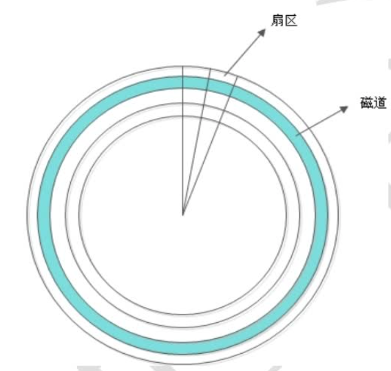
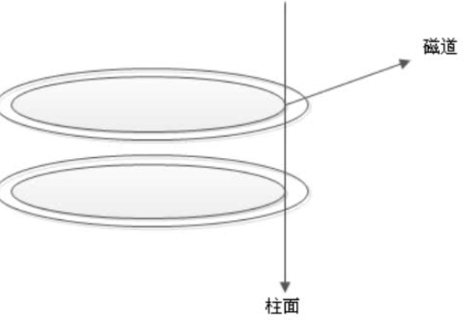
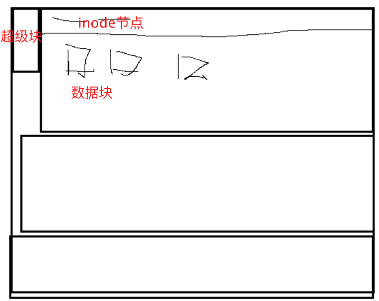
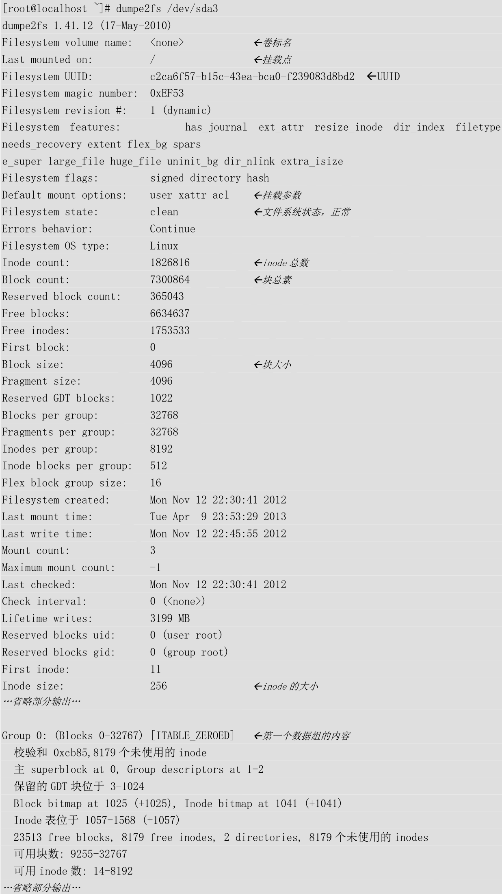

# 命令--9.1.文件系统（查看）

## 硬盘结构

### 1、硬盘的逻辑结构



每个扇区的大小事固定的，为512Byte。扇区也是磁盘的最小存贮单位。
  


硬盘的大小是使用“`磁头数×柱面数×扇区数×每个扇区的大小`”这样的公式来计算的。
其中磁头数（Heads）表示硬盘总共有几个磁头，也可以理解成为硬盘有几个盘面，然后乘以二；柱面数（Cylinders）表示硬盘每一面盘片有几条磁道；扇区数（Sectors）表示每条磁道上有几个扇区；每个扇区的大小一般是512Byte。


### 2、硬盘接口

- IDE硬盘接口（Integrated Drive Electronics，并口，即电子集成驱动器）也称作“ATA硬盘”或“PATA硬盘”，是早期机械硬盘的主要接口，ATA133硬盘的理论速度可以达到133MB/s（此速度为理论平均值），IDE硬盘接口

- SATA接口（Serial ATA，串口）是速度更高的硬盘标准，具备了更高的传输速度，并具备了更强的纠错能力。目前已经是SATA三代，理论传输速度达到600MB/s（此速度为理论平均值）

- SCSI接口（Small Computer System Interface，小型计算机系统接口）广泛应用在服务器上，具有应用范围广、多任务、带宽大、CPU占用率低及支持热插拔等优点，理论传输速度达到320MB/s


## 文件系统

### 1.Linux文件系统的特性：

- super block（超级块）：记录整个文件系统的信息，包括block与inode的总量，已经使用的inode和block的数量，未使用的inode和block的数量，block与inode的大小，文件系统的挂载时间，最近一次的写入时间，最近一次的磁盘检验时间等。

- date block（数据块，也称作block）：用来实际保存数据的（柜子的隔断），block的大小（1KB、2KB或4KB）和数量在格式化后就已经决定，不能改变，除非重新格式化（制作柜子的时候，隔断大小就已经决定，不能更改，除非重新制作柜子）。每个blcok只能保存一个文件的数据，要是文件数据小于一个block块，那么这个block的剩余空间不能被其他文件是要；要是文件数据大于一个block块，则占用多个block块。Windows中磁盘碎片整理工具的原理就是把一个文件占用的多个block块尽量整理到一起，这样可以加快读写速度。

- inode（i节点，柜子门上的标签）：用来记录文件的权限（r、w、x），文件的所有者和属组，文件的大小，文件的状态改变时间（ctime），文件的最近一次读取时间（atime），文件的最近一次修改时间（mtime），文件的数据真正保存的block编号。每个文件需要占用一个inode。

  

### 2.Linux常见文件系统

| 文件系统 | 描述                                                         |
| -------- | ------------------------------------------------------------ |
| ext      | Linux中最早的文件系统，由于在性能和兼容性上具有很多缺陷，现在已经很少使用 |
| ext2     | 是ext文件系统的升级版本，Red Hat Linux 7.2版本以前的系统默认都是ext2文件系统。<br />于1993年发布，支持最大16TB的分区和最大2TB的文件（1TB=1024GB=1024×1024KB） |
| ext3     | 是ext2文件系统的升级版本，最大的区别就是带日志功能，以便在系统突然停止时提高文件系统的可靠性。<br />支持最大16TB的分区和最大2TB的文件 |
| ext4     | 是ext3文件系统的升级版。<br />ext4在性能、伸缩性和可靠性方面进行了大量改进。<br />ext4的变化可以说是翻天覆地的，比如向下兼容ext3、最大1EB文件系统和16TB文件、<br />无限数量子目录、Extents连续数据块概念、多块分配、延迟分配、持久预分配、<br />快速FSCK、日志校验、无日志模式、在线碎片整理、inode增强、默认启用barrier等。<br />它是CentOS6.x的默认文件系统 |
| xfs      | XFS最早针对IRIX操作系统开发，是一个高性能的日志型文件系统，<br />能够在断电以及操作系统崩溃的情况下保证文件系统数据的一致性。<br />它是一个64位的文件系统，后来进行开源并且移植到了Linux操作系统中，<br />目前CentOS 7.x将XFS+LVM作为默认的文件系统。<br />据官方所称，XFS对于大文件的读写性能较好。 |
| swap     | swap是Linux中用于交换分区的文件系统（类似于Windows中的虚拟内存），<br />当内存不够用时，使用交换分区暂时替代内存。<br />一般大小为内存的2倍，但是不要超过2GB。它是Linux的必需分区 |
| NFS      | NFS是网络文件系统（Network File System）的缩写，是用来实现不同主机之间文件共享的一种网络服务，<br />本地主机可以通过挂载的方式使用远程共享的资源 |
| iso9660  | 光盘的标准文件系统。Linux要想使用光盘，必须支持iso9660文件系统 |
| fat      | 就是Windows下的fat16文件系统，在Linux中识别为fat             |
| vfat     | 就是Windows下的fat32文件系统，在Linux中识别为vfat。<br />支持最大32GB的分区和最大4GB的文件 |
| NTFS     | 就是Windows下的NTFS文件系统，不过Linux默认是不能识别NTFS文件系统的，<br />如果需要识别，则需要重新编译内核才能支持。<br />它比fat32文件系统更加安全，速度更快，支持最大2TB的分区和最大64GB的文件 |
| ufs      | Sun公司的操作系统Solaris和SunOS所采用的文件系统              |
| proc     | Linux中基于内存的虚拟文件系统，用来管理内存存储目录/proc     |
| sysfs    | 和proc一样，也是基于内存的虚拟文件系统，用来管理内存存储目录/sysfs |
| tmpfs    | 也是一种基于内存的虚拟文件系统，不过也可以使用swap交换分区   |


## df

> 统计分区空间使用率

```shell
df
常见选项：
	-a	显示特殊文件系统，这些文件系统几乎都是保存在内存中的。如/proc,因为是挂载在内存中，所以占用量都是0
	-h	单位不再只用KB，而是换算成习惯单位
	-T	多出了文件系统类型一列


[jysp@jysp ~]$ df
文件系统                          1K-块      已用       可用 已用% 挂载点
devtmpfs                       66592768         0   66592768    0% /dev
tmpfs                          66610240         0   66610240    0% /dev/shm
tmpfs                          66610240    644352   65965888    1% /run
tmpfs                          66610240         0   66610240    0% /sys/fs/cgroup
/dev/mapper/centos_jysp-root 4919724032 261916384 4657807648    6% /
/dev/sda2                      10475520    163880   10311640    2% /boot
/dev/sda1                       4186108      9264    4176844    1% /boot/efi
/dev/loop0                      7927042   7927042          0  100% /media/CentOS
tmpfs                          13322112         0   13322112    0% /run/user/1000
tmpfs                          13322112       192   13321920    1% /run/user/42

[jysp@jysp ~]$ df -HT
文件系统                     类型      容量  已用  可用 已用% 挂载点
devtmpfs                     devtmpfs   69G     0   69G    0% /dev
tmpfs                        tmpfs      69G     0   69G    0% /dev/shm
tmpfs                        tmpfs      69G  660M   68G    1% /run
tmpfs                        tmpfs      69G     0   69G    0% /sys/fs/cgroup
/dev/mapper/centos_jysp-root xfs       5.1T  269G  4.8T    6% /
/dev/sda2                    xfs        11G  168M   11G    2% /boot
/dev/sda1                    vfat      4.3G  9.5M  4.3G    1% /boot/efi
/dev/loop0                   iso9660   8.2G  8.2G     0  100% /media/CentOS
tmpfs                        tmpfs      14G     0   14G    0% /run/user/1000
tmpfs                        tmpfs      14G  197k   14G    1% /run/user/42

```


## du

> 统计目录大小
>
> ls不统计目录大小

```shell
du [选项] [目录或文件名]
选项
-a	显示每个子文件的磁盘占用量。默认只统计子目录的磁盘占用量
-h	使用习惯单位显示磁盘占用量，如KB，MB或GB等
-s	统计总占用量，而不列出子目录和子文件的占用量
```

<font color=red>du与df的区别：du是用于统计文件大小的，统计的文件大小是准确的；df是用于统计空间大小的，统计的剩余空是准确的</font>

lsof | grep deleted”查看被删除的文件，然后一个进程一个进程的手工kill也是可以的


## lsblk

> 查看磁盘挂载信息

```shell
lsblk [选项]
常用
    -a	查看挂载磁盘信息，磁盘名称、大小、挂载目录等。
    -f	查看挂载磁盘信息，磁盘名称、文件系统类型、UUID、挂载目录等。


[jysp@jysp ~]$ lsblk -a
NAME                 MAJ:MIN RM  SIZE RO TYPE MOUNTPOINT
sdb                    8:16   0  1.1T  0 disk 
└─sdb1                 8:17   0  1.1T  0 part 
  └─centos_jysp-root 253:0    0  4.6T  0 lvm  /
loop0                  7:0    0  7.6G  1 loop /media/CentOS
sda                    8:0    0  3.7T  0 disk 
├─sda2                 8:2    0   10G  0 part /boot
├─sda3                 8:3    0  3.6T  0 part 
│ ├─centos_jysp-swap 253:1    0  128G  0 lvm  [SWAP]
│ └─centos_jysp-root 253:0    0  4.6T  0 lvm  /
└─sda1                 8:1    0    4G  0 part /boot/efi
[jysp@jysp ~]$ lsblk -f
NAME                 FSTYPE      LABEL            UUID                                   MOUNTPOINT
sdb                                                                                      
└─sdb1               LVM2_member                  IkoMl8-Vi3S-h33b-7pEw-e0MO-fuFD-DU9cIZ 
  └─centos_jysp-root xfs                          6ee2908e-9d9f-4c71-8cd0-f2856686eec6   /
loop0                iso9660     CentOS 7 aarch64 2020-11-02-15-19-12-00                 /media/CentOS
sda                                                                                      
├─sda2               xfs                          be595928-239c-47a7-bbfb-b88f24957a2c   /boot
├─sda3               LVM2_member                  tQt729-pDak-oEnj-Rcp2-MI1q-Cgkd-0U2b6Z 
│ ├─centos_jysp-swap swap                         b89d1ec3-3dbb-46b3-b812-1efcd670deb8   [SWAP]
│ └─centos_jysp-root xfs                          6ee2908e-9d9f-4c71-8cd0-f2856686eec6   /
└─sda1               vfat                         5B32-0B1E                              /boot/efi

```


## fsck(用不着)

> 文件系统修复命令

```shell
# 自动修复
fsck –y /dev/sdb1
```


## dumpe2fs(了解)

> 显示磁盘状态

```shell
dumpe2fs /dev/sda3

# 查看超级块组
dumpe2fs -h /dev/sda3
```



## stat(了解)

> 查看文件的详细时间

```shell
stat 文件名


[root@xiaoshaozi ~]# stat zs.sh
  文件："zs.sh"
  大小：42              块：8          IO 块：4096   普通文件
设备：fd01h/64769d      Inode：917523      硬链接：1
权限：(0644/-rw-r--r--)  Uid：(    0/    root)   Gid：(    0/    root)
最近访问：2023-12-21 14:36:51.386064070 +0800
最近更改：2023-12-21 14:36:32.729400361 +0800
最近改动：2023-12-21 14:36:32.730400397 +0800
创建时间：-
```


## file(了解)

> 判断文件类型

file  文件名判断文件类型   

 type  命令名判断命令类型

```shell
[root@xiaoshaozi ~]# type cd
cd 是 shell 内嵌
[root@xiaoshaozi ~]# type mkdir
mkdir 是 /usr/bin/mkdir
[root@xiaoshaozi ~]# type ls
ls 是 `ls --color=auto' 的别名


[root@xiaoshaozi ~]# file zs.sh 
zs.sh: Bourne-Again shell script, ASCII text executable
[root@xiaoshaozi ~]# file docker
docker: directory

```