# 网络服务—NFS

## 1.什么是NFS？

​		NFS是Network File System的缩写，即网络文件系统。一种使用于分散式文件系统的协定，由Sun公司开发，于1984年向外公布。功能是通过网络让不同的机器、不同的操作系统能够彼此分享个别的数据，让应用程序在客户端通过网络访问位于服务器磁盘中的数据，是在类Unix系统间实现磁盘文件共享的一种方法

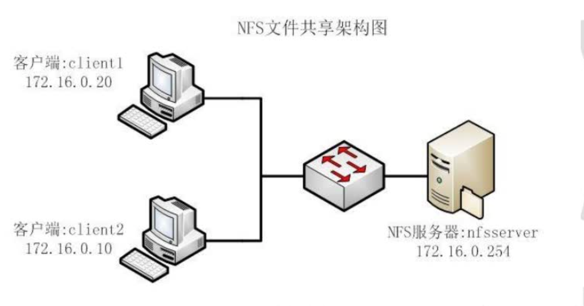

​		它的主要功能是通过网络让不同的机器系统之间可以彼此共享文件和目录。NFS服务器可以允许NFS客户端将远端NFS服务器端的共享目录挂载到本地的NFS客户端中。在本地的NFS客户端的机器看来，NFS服务器端共享的目录就好像自己的磁盘分区和目录一样。一般客户端挂载到本地目录的名字可以随便，但为方便管理，我们要和服务器端一样比较好。

NFS一般用来存储共享视频，图片等静态数据。

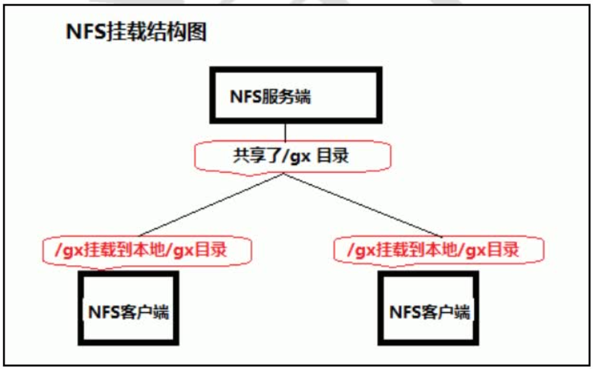

## 2.挂载原理

​		NFS是通过网络来进行服务端和客户端之间的数据传输。两者之间要传输数据就要有想对应的网络端口来进行传输。NFS服务器到底使用什么网络端口来传输数据的，NFS服务器端其实是随机选择端口来进行数据传输。那NFS客户端又是如何知道NFS服务器端到底使用的是哪个端口呢？其实NFS服务器时通过远程过程调用（remote procedure call简称RPC）协议/服务来实现的。也就是说RPC服务会统一管理NFS的端口，客户端和服务端通过RPC来先沟通NFS使用了哪些端口，之后再利用这些端口（小于1024）来进行数据的传输。

​		也就是RPC管理服务端的NFS端口分配，客户端要传数据，那客户端的RPC会先跟服务端的RPC去要服务器的端口，要到端口后再建立连接，然后传输数据。

<font color=red>那RPC和NFS之间又是如何之间相互通讯的？</font>

首先当NFS启动后，就会随机的使用一些端口，然后NFS就会向RPC去注册这些端口。RPC就会记录下这些端口。并且RPC会开启111端口，等待客户端RPC的请求，如果客户端有请求，那服务端的RPC就会将记录的NFS端口信息告知客户端。

<font color=red>RPC和NFS的启动顺序是怎样的？</font>

在启动NFS SERVER之前，首先要启动RPC服务（即portmap服务，下同）否则NFS SERVER就无法向RPC服务区注册，另外，如果RPC服务重新启动，原来已经注册好的NFS端口数据就会全部丢失。因此此时RPC服务管理的NFS程序也要重新启动以重新向RPC注册。特别注意：一般修改NFS配置文档后，是不需要重启NFS的，直接在命令执行/etc/init.d/nfsreload

<font color=red>总结：客户端NFS和服务端NFS通讯过程</font>

1）首先服务器端启动RPC服务，并开启111端口

2）启动NFS服务，并向RPC注册端口信息

3）客户端启动RPC（portmap服务），向服务端的RPC(portmap)服务请求服务端的NFS端口

4）服务端的RPC(portmap)服务反馈NFS端口信息给客户端。

5）客户端通过获取的NFS端口来建立和服务端的NFS连接并进行数据的传输。

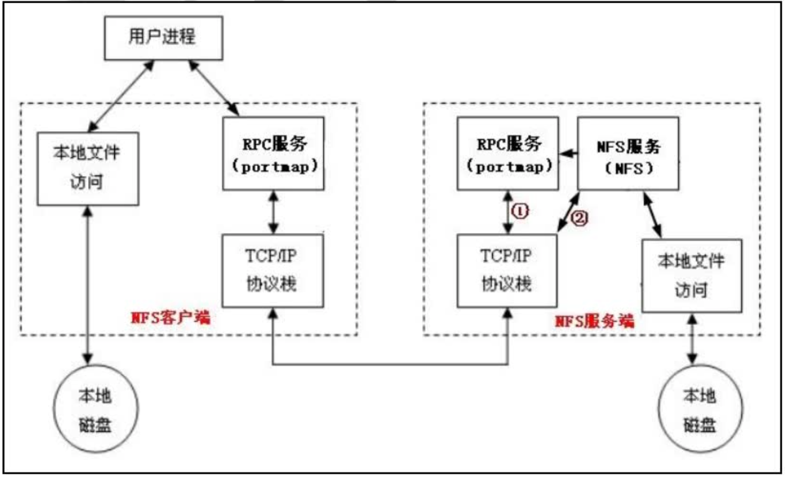

## 3.协议及安装

协议：

​		RPC（Remote Procedure Call Protocol）——远程过程调用协议

软件：

​		`nfs-utils-*`：包括NFS命令与监控程序*
​		`rpcbind-*`：支持安全NFS RPC服务的连接

注：通常情况下，是作为系统的默认包安装的

CentOS6.*之前rpcbind叫portmap

## 4.守护进程

nfs：它是基本的NFS守护进程，主要功能是管理客户端是否能够登录服务器

rpcbind：主要功能是进行端口映射工作。当客户端尝试连接并使用RPC服务器提供的服务（如NFS服务）时，rpcbind会将所管理的与服务对应的端口提供给客户端，从而使客户可以通过该端口向服务器请求服务。

## 5.配置

1、配置文件

> `/etc/exports`这个文件不一定会存在，可能要使用vim手动建立

2、`/etc/exports`文件内容格式：

```powershell
共享目录 客户端1(访问权限,用户映射,其他) 客户端2(访问权限,用户映射,其他)

/it 192.168.2.0/24(rw,sync,no_root_squash)

# 共享目录：
# 客户端地址
		指定ip地址的主机：192.168.0.200
		指定子网中的所有主机：192.168.88.0
		指定域名的主机：www.atguigu.com
		指定域中的所有主机：*.atguigu.com
		所有主机：*
# 访问权限、映射规则
访问权限选项：
		设置输出目录只读：ro
		设置输出目录读写：rw
用户映射选项：
		root_squash：	将root用户的访问映射为匿名（nfsnobody）用户uid和gid；（默认生效）
		no_root_squash：	保留管理员权限，以服务器管理员的权限管理；
		all_squash：		将远程访问的用户及所属组都映射为指定uid、gid的匿名用户；
				anonuid=xxx：将远程访问的所有用户都映射为指定uid的匿名用户；
				anongid=xxx：将远程访问的所有用户组都映射为指定gid匿名组账户；
其它选项：
		sync：将数据同步写入内存缓冲区与磁盘中，效率低，但可以保证数据的一致性（同步）；
		async：将数据先保存在内存缓冲区中，必要时才写入磁盘（异步）；
```

3、刷新配置

```powershell
exportfs -rv　　# 立即生效
```

4、查看

查看配置好的nfs共享目录

`exportfs`

```powershell
[root@jysp jysp]# exportfs
/data           10.139.102.0/24
/data1          10.139.102.0/24
```

`showmount`

```powershell
[root@jysp jysp]# showmount -e localhost
Export list for localhost:
/data1 10.139.102.0/24
/data  10.139.102.0/24
```


## 6.启动与停止

1、启动NFS服务器

为了使NFS服务器能正常工作，需要启动rpcbind和nfs两个服务，并且rpcbind一定要先于nfs启动。

```powershell
# centos7之后
systemctl start rpcbind
systemctl start nfs

# 开机自启动
systemctl enable rpcbind 
systemctl enable nfs

# 查看rpc注册的端口：
rpcinfo -p 127.0.0.1
```

2、停止NFS服务器

要停止NFS运行时，需要先停止nfs服务再停止rpcbind服务，对于系统中有其他服务(如NIS)需要使用时，不需要停止rpcbind服务

```powershell
systemctl stop nfs
systemctl stop rpcbind
```

3、查看RPC服务器开启了哪些端口

```powershell
rpcinfo -p localhost
```

## 7.实验示例

1、将NFS服务器的/home/zhangsan共享给192.168.115.0网段，rw权限

```powershell
# vi /etc/exports
/home/zhangsan 192.168.115.0(rw)
```

2、重启rpcbind和nfs服务

```powershell
service rpcbind restart
service nfs restart
exportfs


[root@jysp jysp]# exportfs
/data           10.139.102.0/24
/data1          10.139.102.0/24
```

3、服务器端查看nfs共享状态

查看自己共享的服务 `showmount`、`exportfs`命令作用相同

```powershell
showmount -e 本机ip
```

4、客户端查看nfs共享状态

```powershell
showmount -e NFS服务器IP
```

5、客户端挂载nfs服务器共享目录

`命令格式：mount NFS服务器IP:共享目录本地挂载点目录`

```powershell
mount 192.168.115.10:/home/zhangsan/ /media/zhangsan/
mount | grep nfs
mount –o vers=3 共享本地#指定挂载使用nfs V3/V4版本（避免同步延迟）
```

验证客户端和nfs服务器端文件是否一致：

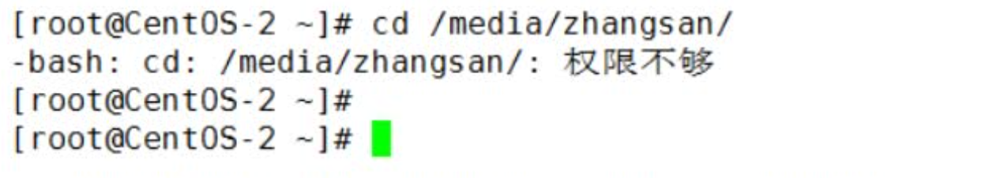

修改服务器端相应权限，不然客户端无法正常访问和使用

6、nfs共享权限和访问控制

​	a.客户端root用户

​		使用客户端的root身份在nfs服务器上创建文件，文件的所有者和所属组是nfsnobody。

​	b.客户端普通用户

​		使用客户端的普通用户身份在nfs服务器上创建文件，所有者和所属组是nobody或普通用户。

​		如果明确设定了普通用户的映射用户身份，那么此时客户端用户的身份转换为指定映射用户；

​		如果NFS server上面有同名用户，那么此时客户端登录账户的身份转换为NFS server上面的同名用户；

7、卸载和自动挂载

​	卸载：

​		1.卸载客户端的挂载目录

​		`umount 挂载点`

​		2.停止服务器端的共享

​		`exportfs –au`

​	自动挂载：/etc/fstab

​		格式：<server>:</remote/export> </local/directory> nfs < options> 0 0

```
#192.168.115.10:/home/zhangsan /media/zhangsan nfs defaults, 0 0
#mount –a
```


## 8.相关命令

### exportfs命令

如果我们在启动了NFS之后又修改了/etc/exports，是不是还要重新启动nfs呢？这个时候我们就可以用exportfs命令来使改动立刻生效，该命令格式如下：

```powershell
格式：exportfs [-aruv]
		-a	全部挂载或卸载 /etc/exports 中的内容
		-r	重新读取 /etc/exports 中的信息，并同步更新 /etc/exports 、/var/lib/nfs/xtab
		-u	卸载单一目录（和-a一起使用为卸载所有/etc/exports文件中的目录）
		-v	在export的时候，将详细的信息输出到屏幕上。

具体例子：
	# exportfs -au 卸载所有共享目录
	# exportfs -ra 重新共享所有目录并输出详细信息
```

### rpcinfo命令

利用rpcinfo -p可以查看出RPC开启的端口所提供的程序有哪些

其中nfs开启的是2049，portmapper(rpcbind)开启的是111，其余则是rpc开启的

## 收集示例1

### **一、服务器A下操作（IP地址：192.168.2.21）**

1、查看NFS安装情况：

```powershell
rpm -qa nfs-utils rpcbind
```

 （没有的话，用`yum install nfs-utils rpcbind -y`安装）

2、启动RPC：

```
systemctl start rpcbind   (service rpcbind start)　
```

开机自启动：

```
systemctl enable rpcbind   (service rpcbind enable)
```

看看有没有注册的端口：

```
rpcinfo -p 127.0.0.1
```

3、启动NFS：

```powershell
systemctl start nfs（十以上版本sudo service nfs-server start）或者（systemctl start nfs-server）
```

再看注册的端口

```powershell
rpcinfo -p 127.0.0.1
```

发现多了很多

4、配置nfs （NFS配置文件/etc/exports）

创建目录**/it**和**/it/a**文件作为共享目录和共享文件

```
mkdir /it
touch /it/a
```

编辑文件(读写，同步，其它服务器挂载后root可操作)

```powershell
vim /etc/exports
/it 192.168.2.0/24(rw,sync,no_root_squash)
```

5、重启NFS

```
systemctl reload nfs或者exportfs -r
```

若出现exportfs: /home requires fsid= for NFS export

解决方法：
```
/home 192.167.253.0/24(fsid=0,rw,sync,no_root_squash) //加入fsid=0参数就可
```

nfs默认用户nfsnobody

```
grep nfsno /etc/passwd
```

没有的话，自己创建

```
groupadd -g -f 65534 nfsnobody
useradd nfsnobody -u 65534 -g nfsnobody -s /sbin/nologin -M
```

**6、授权**

```
chown -R nfsnobody.nfsnobody /it
```

**7、检查自己**

```
showmount -e 192.168.2.21  (exportfs)
```

**8、服务器本地挂载：**

```
mount -t nfs 192.168.2.21:/it /mnt
```

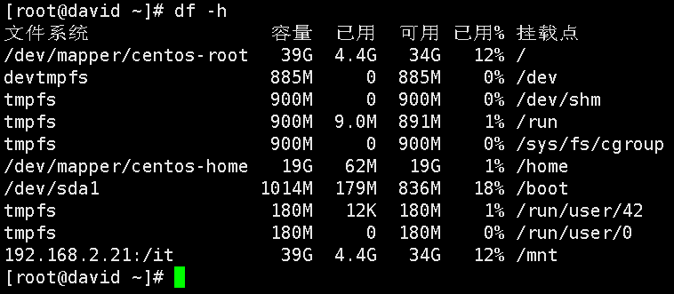

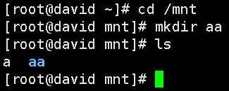

本地测试成功 


### **二、客户端B下操作（IP地址：192.168.2.25）**

**1、查看NFS安装情况：**

```
rpm -qa nfs-utils rpcbind
```

（安装nfs-utils的目的是为了获得showmount命令）
**2、启动RPC：**

```
systemctl start rpcbind
```

开机自启动：

```
systemctl enable rpcbind
```

```
netstat -lntup|grep 111
```

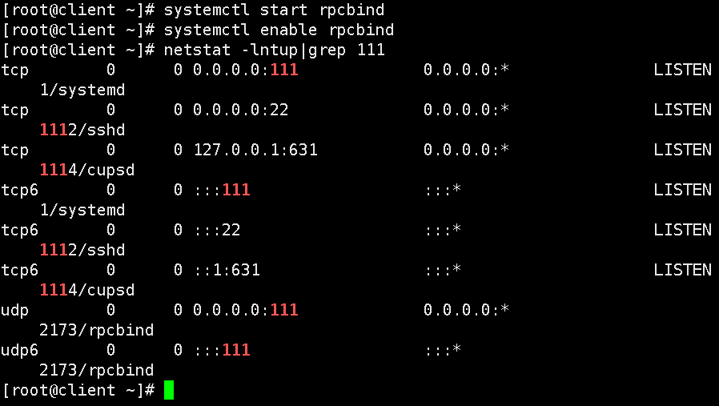

**3、查看NFS服务器提供的共享目录**

```
showmount -e 192.168.2.21
```

{
i、若出现clnt_create: RPC: Program not registered：程序没有注册

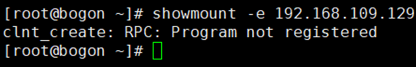

说明：RPC服务器开启了，但NFS没有告诉RPC开启的服务端口
重启nfs（首先检查服务端NFS是否开启）

```
systemctl start nfs（十以上版本sudo service nfs-server start）或者（systemctl start nfs-server）
```

检查：rpcinfo -p 127.0.0.1（出现很多表明可以了）

ii、若出现：
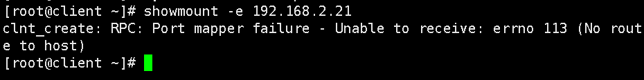

去服务端（192.168.2.21）关闭防火墙

```
systemctl stop firewalld
```

}
**4、挂载测试（将192.168.2.21挂载到192.168.2.25下）**

```
mount -t nfs 192.168.2.21:/it /mnt
```

若出现：
 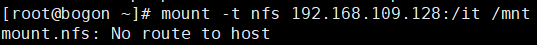
则需要关掉防火墙：service firewalld stop

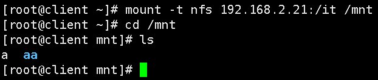

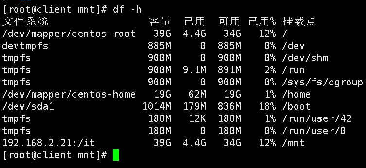

挂载成功。

###  三、**NFS客户端开机自启动挂载**

方法一：/etc/rc.local

```
chmod +x /etc/rc.d/rc.local
```

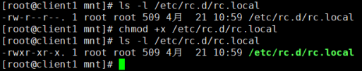

```
vim /etc/rc.local
在底部加上
/bin/mount -t nfs 192.168.109.132:/it /mnt
(将192.168.109.132挂载到192.168.109.131下)　
```

然后reboot重启
查看是否成功
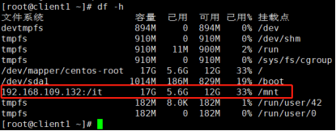
 
方法二：放入vim /etc/fstab（有坑）

```
192.168.109.132:/it  /mnt  nfs defaults   0 0
```

开启延迟满足的服务remote-fs.target(centos7)  netfs(centos6)　

```
systemctl start remote-fs.target
systemctl enable remote-fs.target
systemctl status remote-fs.target
```

### **Debian）统信uos的NFS只是安装包不同**

**服务器安装包：**

```
apt-get install nfs-kernel-server
```

**客户端安装包：**

```
apt install -y nfs-common　
dpkg -l nfs-kernel-server查看包
```


## 收集示例2

### NFS Server

```powershell
NFS Server
1. 安装nfs-server
　　# yum install -y nfs-utils

2. 创建NFS目录
　　# mkdir /nfs

3. 配置NFS目录
 

　　# echo "/nfs    *(rw,sync,no_root_squash)" >> /etc/exports

　　参数说明： 

　　　　rw 读写
　　　　ro 只读
　　　　sync 数据直接写入磁盘
　　　　async 数据先写入内存
　　　　no_root_squash 对root用户不压制，在服务端都映射为服务端的root用户
　　　　root_squash 如果客户端是用户root操作，会被压制成nobody用户
　　　　all_squash 不管客户端的使用nfs的用户是谁，都会压制成nobody用户
　　　　nonuid=uid: 指定uid的值
　　　　anongid=gid:指定gid的值

 

　　# exportfs -rv　　# 立即生效

4. 启动NFS服务
　　# systemctl enable --now nfs-server.service

　　# showmount -e


mkdir /zsdata
chmod o+w /zsdata/

vim /etc/exports


```

### NFS Client

```powershell

NFS Client(方法一)
1. 安装nfs-client
　　# yum install -y nfs-utils

2. 创建挂载目录
　　# mkdir /var/nfs

3. 查看NFS Server目录
　　# showmount -e nfs-server-ip

4. 挂载NFS Server目录
　　# mount -t nfs nfs-server-ip:/nfs /var/nfs

 

NFS Client(方法二)
要实现开机自动挂载，通常将挂载配置信息直接写入到 /etc/fstab文件中。
​autofs自动挂载服务是一种Linux系统守护进程，当检测到用户访问一个尚未挂载的文件系统时，会自动根据配置文件进行挂载（动态挂载）。

 

1. 安装autofs
　　# yum install autofs

2. 创建挂载目录
　　# mkdir /var/nfs

3. 自动挂载NFS配置
　　# echo "/var/nfs    /etc/auto.nfs" >> /etc/auto.master

　　# echo "data -fstype=nfs nfs-server-ip:/nfs" >> /etc/auto.nfs

4. 启动autofs服务
　　# systemctl enable --now autofs.service
```

## 收集示例3

### NFS Server

1、安装nfs服务

```powershell
yum -y install rpcbind nfs-utils
```

2、创建共享目录

在服务器上创建共享目录，并设置权限。

```powershell
mkdir /data/share/
chmod 755 -R /data/share/
```

3、配置NFS

nfs的配置文件是 /etc/exports ，在配置文件中加入一行：

```powershell
/data/share/ 192.168.11.34(rw,no_root_squash,no_all_squash,sync)
```

这行代码的意思是把共享目录/data/share/共享给192.168.11.34这个客户端ip，后面括号里的内容是权限参数，其中：

rw 表示设置目录可读写。

sync 表示数据会同步写入到内存和硬盘中，相反 rsync 表示数据会先暂存于内存中，而非直接写入到硬盘中。

no_root_squash NFS客户端连接服务端时如果使用的是root的话，那么对服务端分享的目录来说，也拥有root权限。

no_all_squash 不论NFS客户端连接服务端时使用什么用户，对服务端分享的目录来说都不会拥有匿名用户权限。

如果有多个共享目录配置，则使用多行，一行一个配置。保存好配置文件后，需要执行以下命令使配置立即生效：

```
exportfs -r
```

4.设置防火墙

如果你的系统没有开启防火墙，那么该步骤可以省略。

NFS的防火墙特别难搞，因为除了固定的port111、2049外，还有其他服务如rpc.mounted等开启的不固定的端口，这样对防火墙来说就比较麻烦了。为了解决这个问题，我们可以设置NFS服务的端口配置文件。

修改/etc/sysconfig/nfs文件，将下列内容的注释去掉，如果没有则添加：

```
RQUOTAD_PORT=1001
LOCKD_TCPPORT=30001
LOCKD_UDPPORT=30002
MOUNTD_PORT=1002
```

保存好后，将端口加入到防火墙允许策略中。执行：

```powershell
firewall-cmd --zone=public --add-port=111/tcp --add-port=111/udp --add-port=2049/tcp --add-port=2049/udp --add-port=1001/tcp --add-port=1001/udp --add-port=1002/tcp --add-port=1002/udp --add-port=30001/tcp --add-port=30002/udp --permanent
firewall-cmd --reload
```

5.启动服务

按顺序启动rpcbind和nfs服务：

```powershell
systemctl start rpcbind
systemctl start nfs
```

加入开机启动：

```powershell
systemctl enable rpcbind 
systemctl enable nfs
```

nfs服务启动后，可以使用命令 rpcinfo -p 查看端口是否生效。

服务器的后，我们可以使用 showmount 命令来查看服务端(本机)是否可连接：

```javascript
[root@localhost ~]# showmount -e localhost
Export list for localhost:
/data/share 192.168.11.34
```

出现上面结果表明NFS服务端配置正常。


### NFS Client

**1.安装rpcbind服务** 

客户端只需要安装rpcbind服务即可，无需安装nfs或开启nfs服务。

```javascript
yum -y install rpcbind
```

**2.挂载远程nfs文件系统** 

查看服务端已共享的目录:

```javascript
[root@localhost ~]# showmount -e 192.168.11.31
Export list for 192.168.11.31:
/data/share 192.168.11.34
```

建立挂载目录，执行挂载命令：

```javascript
mkdir -p /mnt/share
mount -t nfs 192.168.11.34:/data/share /mnt/share/ -o nolock,nfsvers=3,vers=3
```

如果不加 -o nolock,nfsvers=3 则在挂载目录下的文件属主和组都是nobody，如果指定nfsvers=3则显示root。

如果要解除挂载，可执行命令：

```javascript
umount /mnt/share
```

**3.开机自动挂载** 

如果按本文上面的部分配置好，NFS即部署好了，但是如果你重启客户端系统，发现不能随机器一起挂载，需要再次手动操作挂载，这样操作比较麻烦，因此我们需要设置开机自动挂载。我们不要把挂载项写到/etc/fstab文件中，因为开机时先挂载本机磁盘再启动网络，而NFS是需要网络启动后才能挂载的，所以我们把挂载命令写入到/etc/rc.d/rc.local文件中即可。

```javascript
[root@localhost ~]# vim /etc/rc.d/rc.local
#在文件最后添加一行：
mount -t nfs 192.168.11.34:/data/share /mnt/share/ -o nolock,nfsvers=3,vers=3
```

保存并重启机器看看。

**测试验证** 

查看挂载结果，在客户端输入 df -h

```javascript
文件系统    容量 已用 可用 已用% 挂载点
/dev/mapper/centos-root   18G 5.0G 13G 29% /
devtmpfs      904M  0 904M 0% /dev
tmpfs       916M  0 916M 0% /dev/shm
tmpfs       916M 9.3M 906M 2% /run
tmpfs       916M  0 916M 0% /sys/fs/cgroup
/dev/sda1      497M 164M 334M 33% /boot
tmpfs       184M  0 184M 0% /run/user/0
192.168.11.31:/data/share  18G 1.7G 16G 10% /mnt/share
```

看到最后一行了没，说明已经挂载成功了。接下来就可以在客户端上进入目录/mnt/share下，新建/删除文件，然后在服务端的目录/data/share查看是不是有效果了，同样反过来在服务端操作在客户端对应的目录下看效果。

**总结**

以上就是这篇文章的全部内容了，希望本文的内容对大家的学习或者工作具有一定的参考学习价值，如果有疑问大家可以留言交流，谢谢大家对ZaLou.Cn的支持。

