# 系统管理--1.启动引导与修复

## 1、运行级别

Linux默认有7个运行级别

| 运行级别 | 含义                                                      |
| -------- | --------------------------------------------------------- |
| 0        | 关机                                                      |
| 1        | 单用户模式，可以想象为windows的安全模式，主要用于系统修复 |
| 2        | 不完全的命令行模式，不含NFS服务                           |
| 3        | 完全的命令行模式，就是标准字符界面                        |
| 4        | 系统保留                                                  |
| 5        | 图形模式                                                  |
| 6        | 重启动                                                    |

在Linux系统中可以使用runlevel命令来查看系统的运行级别，命令如下：

```shell
[root@localhost ~]# runlevel
N 3
#N代表进入这个级别前，上一个是哪个级别。3代表当前级别
```

在这个命令的结果中，“`N 3`”中的N代表进入这个级别前，上一个级别是什么，3代表当前级别。
“`N`”就是`None`的意思，也就是说系统是开机直接进入的`3`运行级别，没有上一个运行级别。
那如果是从图形界面切换到字符界面的话，再查看运行级别，就应该是这样的：

```shell
[root@localhost ~]# runlevel
5 3
#代表是由5级别进入的3级别
```

那么可以手工改变当前的运行级别吗？当然可以了，只要使用init命令（注意着不是`init`进程）即可，命令如下：

```shell
[root@localhost ~]# init 5
#进入图形界面，当然要已经安装了图形界面才可以

[root@localhost ~]# init 0
#关机

[root@localhost ~]# init 6
#重启动
```

不过要注意使用init命令关机和重启动，并不是太安全，容易造成数据丢失。所以推荐大家还是使用shutdown命令进行关机和重启吧！

## 2、系统默认运行级别

知道了运行级别的作用，我们回到系统启动过程中来。
`/etc/init/rcS.conf`配置文件调用`/etc/inittab`配置文件的目的就是为了确定系统的默认运行级别，
也就是系统一开机后会进入那个运行级别。

## 3、启动rc文件

`/etc/rc.d/rc.local`文件

这个配置文件会在用户登陆之前读取，这个文件中写入什么命令，在每次系统启动时都会执行一次。也就是说，我如果有任何需要在系统启动就运行的工作，只需要写入`/etc/rc.d/rc.local`这个配置文件即可。这个文件内容如下：

```shell
vim /etc/rc.local
#!/bin/bash
# THIS FILE IS ADDED FOR COMPATIBILITY PURPOSES
#
# It is highly advisable to create own systemd services or udev rules
# to run scripts during boot instead of using this file.
#
# In contrast to previous versions due to parallel execution during boot
# this script will NOT be run after all other services.
#
# Please note that you must run 'chmod +x /etc/rc.d/rc.local' to ensure
# that this script will be executed during boot.


# 默认会touch这个文件，每次系统启动时touch这个文件，这个文件的修改时间就是系统的启动时间了。
touch /var/lock/subsys/local


#如果写入RPM包安装的apache的启动命令，apache服务就会开机时自动启动了。
/etc/rc.d/init.d/httpd start
```


## 启动引导程序（Boot Loader）

早期的Lilo引导程序已经不是很常见了，grub相比来讲有很多优势，主要有：

- 支持更多的文件系统；
- grub的主程序可以直接在文件系统中查找内核文件；
- 在系统启动时，可以利用grub的交互界面编辑和修改启动选项；
- 可以动态的修改grub的配置文件，这样在修改配置文件之后不需要重新安装grub，而只需要重新启动就可以生效了。


### CentOS6

1/boot/grub目录

编译后加载的内核，要看源码`/usr/src/kernels`下


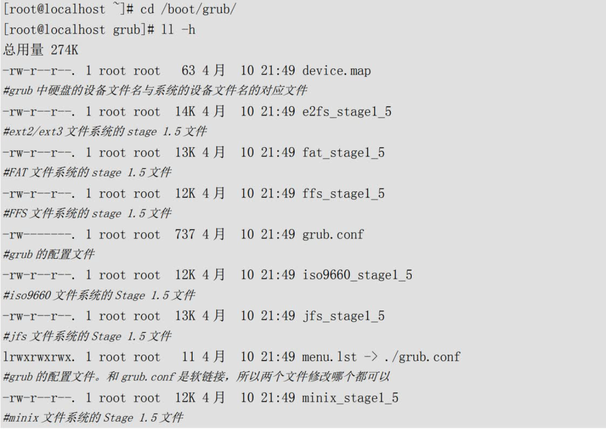

其实这个目录中主要就是grub的配置文件和各种文件系统的stage1.5文件。不过grub的配置文件有两个/boot/grub/grub.conf和/boot/grub/menu.lst，这两个配置文件是软链接，所以修改哪一个都可以，我个人更习惯为grub.conf这个文件。


2 Grub的配置文件

1）、在grub中分区的表示方法

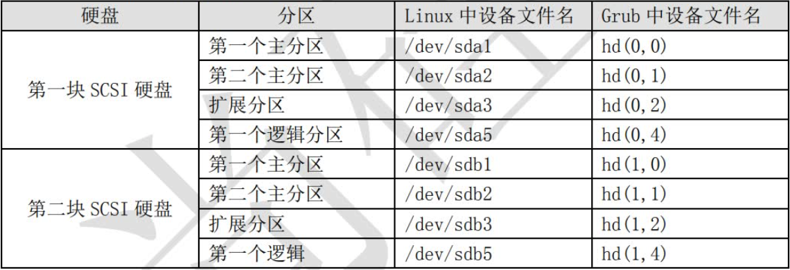

2）、grub的配置文件

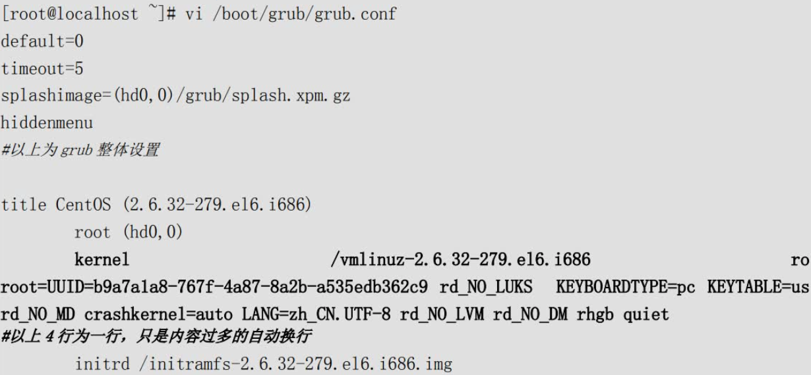

default=0

默认启动第一个系统。也就是如果在等待时间结束后，用户没有选择进入哪一个系统，那么系统会默认进入第一个系统。如果有多系统并存，那么每个系统都会有自己的title字段，如果想要默认进入第二个系统，这里就可以设为default=1。

timeout=5

等待时间，默认是5秒。也就是进入系统时，如果5秒内用户没有按下任意键，那么系统会进入default字段定义的系统。当然可以手工修改这个等待时间，如果timeout=0则不会等待直接进入系统，timeout=-1则是一直等待用户输入，而不会自动进入系统。

splashimage=(hd0,0)/grub/splash.xpm.gz

这里是指定grub启动时的背景图像文件的保存位置的。记得CentOS 6.x启动时后台的蓝色图像吧，就是这个文件的作用哦。不过这个文件具体在哪里啊？已经说过了hd（0,0）代表第一个硬盘的第一个分区，而超哥的系统安装时/boot分区就是第一个分区，所以这个背景图像的实际位置就是/boot/grub/splash.xpm.gz。

hiddenmenu

隐藏菜单。启动时默认只能看到读秒，而不能看到菜单，如果想要看到菜单需要按任意键。如果注释了这句话，那么启动时就能直接看到菜单了。


以上就是grub的整体设置，下面我们介绍CentOS系统的启动设置：

title CentOS (2.6.32-279.el6.i686)

title就是标题的意思，也就是说在title后面写入的是什么，那么系统启动时在grub的启动菜单中看到的就是什么。

root (hd0,0)

是指启动程序的保存分区。这里要注意啊，这个root并不是管理员哦。在我的系统中，/boot分区是独立划分的，而且设备文件名为/dev/sda1，所以在grub中，就被描述为hd(0,0)。

/vmlinuz-2.6.32-279.el6.i686：指定了内核文件的位置，这里的/是指/boot分区。

ro：启动时以只读方式挂载根文件系统，这是为了不让启动过程影响磁盘内的文件系统。

root=UUID=b9a7a1a8-767f-4a87-8a2b-a535edb362c9：指定根文件系统的所在位置。这里和以前的Linux版本不太一样了，不再是通过分区的设备文件名或卷标号来指定，而是通过分区的UUID来进行指定。那么如何查询分区的UUID号呢？方法有很多种，最简单的办法就是查询/etc/fstab文件，命令如下：

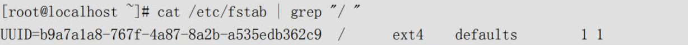

3 grub加密

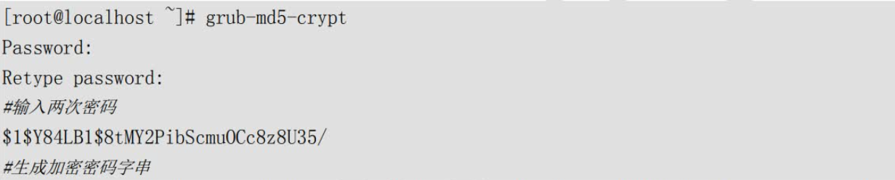

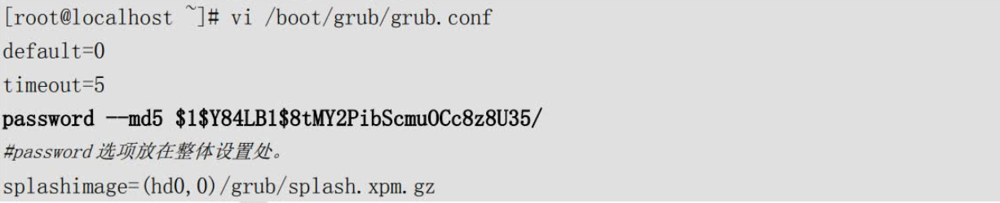

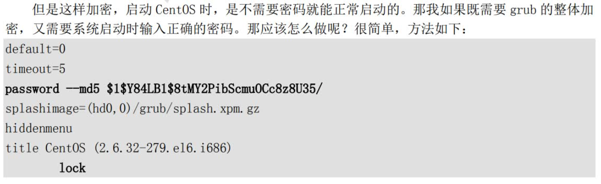


### CentOS7

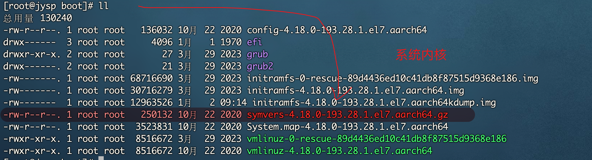


## 系统修复模式

### 单用户模式

我们先来看看单用户模式是怎么使用的吧。Linux的单用户模式有些类似Windows的安全模式，只启动最少的程序用于系统修复。在单用户模式（运行级别为1）中，Linux引导进入根shell，网络被禁用，只有少数进程运行。单用户模式可以用来修改文件系统损坏、还原配置文件、移动用户数据等。

1)、如何进入单用户模式

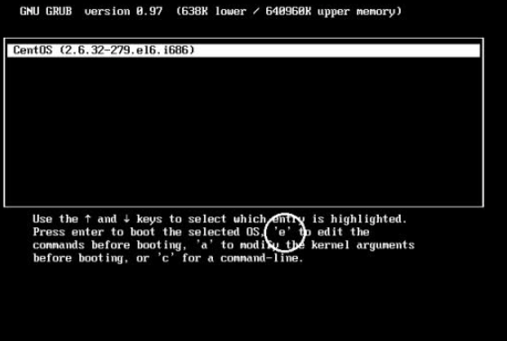

2)、单用户模式常见的错误修复

我们已经进入单用户模式了，那么我们在单用户模式中主要可以修复哪些系统错误呢？我们举几个例子吧。

遗忘root密码

修改系统默认运行级别

### 光盘修复模式

1）、如何进入光盘修复模式

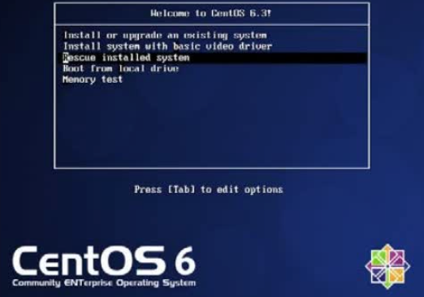

2)、光盘修复模式常见的错误修复

重要系统文件丢失，导致系统无法启动

如果系统中的重要系统文件丢失，当然会导致系统无法正常启动。这时也可以利用光盘修复模式修复。我们假设把/etc/inittab文件丢失了，我们通过系统启动过程知道这个文件是定义系统默认运行级别的，如果丢失了这个文件，系统当然不能正常启动，这时就需要进入光盘修复模式中了。然后需要利用chroot命令。

```shell
[root@localhost ~]#chroot 目录名
```

chroot命令的作用是“change root directory”改变系统根目录的意思。也就是可以把根目录暂时移动到某个目录当中。我们是通过光盘启动的光盘修复模式，所以我们现在所在的根目录不是真正的系统根目录，而是光盘的模拟根目录。系统根目录被当成外来设备放在了`/mnt/sysimage/`目录中。这时就需要chroot命令把我们现在的所在目录移动成真正的系统根目录。命令如下：

```shell
bash-4.1# chroot /mnt/sysimage
```

这条命令执行之后，当前的根目录就已经是真正的系统根目录了。如果系统有任何错误都可以直接修复。比如`/etc/inittab`文件丢失了。这时如果我们曾经备份过系统重要文件，只需要把备份文件重新复制到`/etc/`目录下即可。如果没有备份的文件，就需要从rpm包中提取inittab文件，然后复制了。具体命令如下：

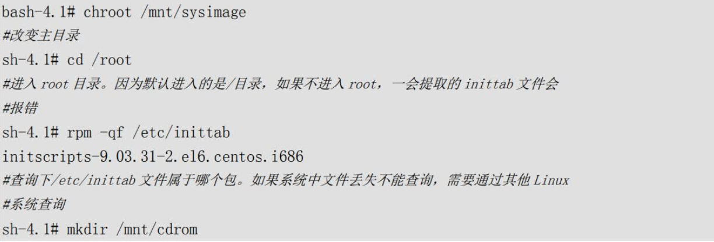

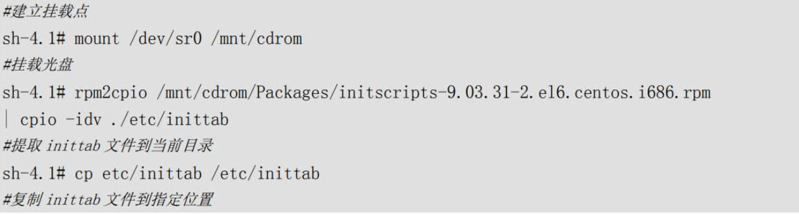

注意此命令执行时不能将文件直接恢复至/etc目录，只能提取到当前目录下，且恢复的文件名称所在路径要写完整的绝对路径。提取文件成功后，将其复制到根分区所在的/mnt/sysimage目录下相应位置即可。