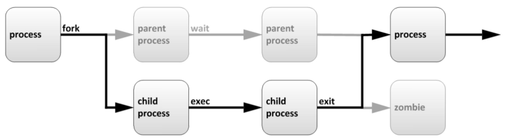
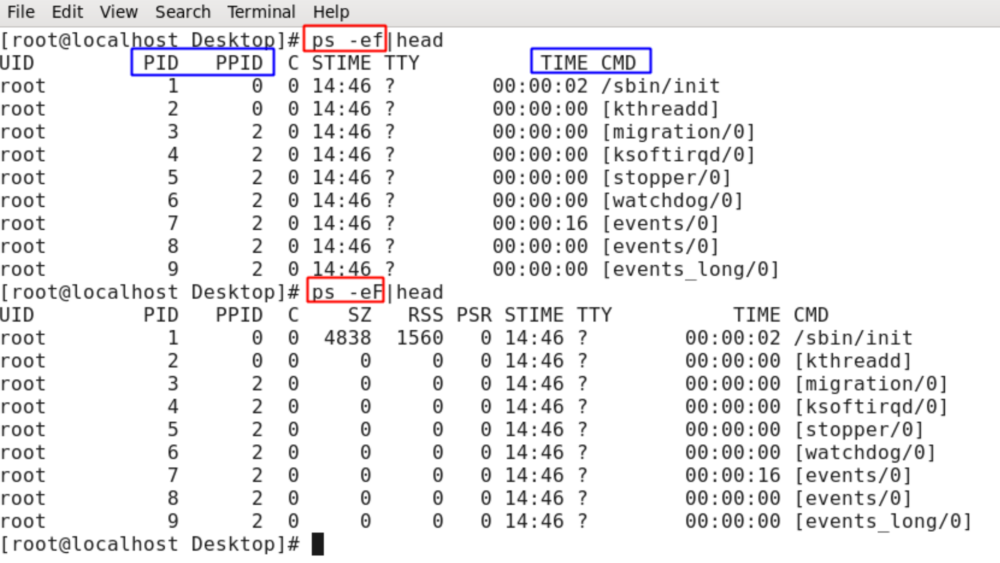
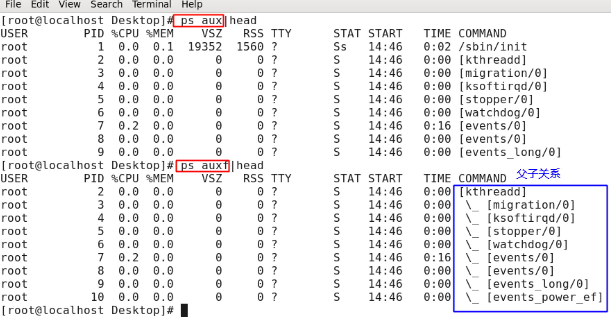
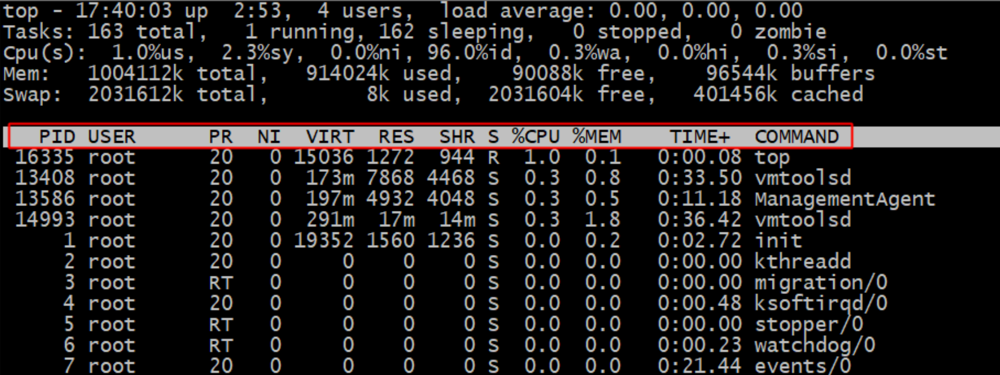

# 系统管理--3.1.系统管理

## 进程生命周期

**父进程**,复制自己的地址空间（fork）创建一个新的（子）进程结构。每个新进程分配一个唯一的进程 ID （PID），满足跟踪安全性之需。PID 和 父进程 ID (PPID）是子进程环境的元素，任何进程都可以创建子进程，所有进程都是第一个系统进程的后代：Centos5/6: ==init== RedHat7/8: ==systemd==

**子进程**继承父进程的安全性身份、过去和当前的文件描述符、端口和资源特权、环境变量，以及程序代码。随后，子进程exec 自己的程序代码。通常，父进程在子进程运行期间处于睡眠（sleeping）状态。当子进程完成时发出（exit）信号请求，在退出时， 子进程会关闭或丢弃了其资源环境，剩余的部分称之为僵停（僵尸Zombie）。父进程在子进程退出时收到信号而被唤醒，清理剩余的结构，然后继续执行其自己的程序代码




**㈠ 进程的优先级控制**

**① 调整正在运行进程的优先级(renice)**

1）使用top按"r"来调整

```
改变NICE--->PR
优先级的范围：
-20——19 数字越低，优先级越高，系统会按照更多的cpu时间给该进程
```

2）命令行使用renice调整

```
sleep命令没有实际意义，延迟(睡觉)5000秒
[root@localhost ~]# sleep 5000 &
[1] 2544
sleep程序已经运行，通过renice命令调整优先级
[root@localhost ~]# renice -20 2544
2544: old priority 0, new priority -20
```

② 程序运行时指定优先级(nice)

```
启动进程时，通常会继承父进程的 nice级别，默认为0。
# nice -n -5 sleep 6000 &
# ps axo command,pid,nice |grep sleep
```


## ps

常见组合

```shell
ps -ef
ps -eF
ps -ely
ps aux
ps auxf

a 显示当前终端下的所有进程，包括其他用户的进程
u 显示进程拥有者、状态、资源占用等的详细信息（注意有“-”和无“-”的区别）
x 显示没有控制终端的进程。通常与a这个参数一起使用，可列出较完整信息
o 自定义打印内容
-e 显示所有进程。
-f 完整输出显示进程之间的父子关系
-l 较长、较详细的将该进程的信息列出
```





```shell

USER: 	运行进程的用户
PID: 	进程ID
%CPU: 	CPU占用率
%MEM: 	内存占用率
VSZ: 	占用虚拟内存
RSS: 	占用实际内存,驻留内存
TTY: 	进程运行的终端
STAT: 	进程状态,man ps获取帮助(/STATE)
    R 	运行
    S 	可中断睡眠 Sleep
    D 	不可中断睡眠
    T 	停止的进程
    Z 	僵尸进程
    Ss 	s进程的领导者，父进程
    S< 	<优先级较高的进程
    SN 	N优先级较低的进程
    R+ 	+表示是前台的进程组
    Sl 	以线程的方式运行
START 	进程的启动时间
TIME 	进程占用CPU的总时间
COMMAND 进程文件，进程名

其他命令查看进行信息
pidof 	查看指定进程的PID
pstree 	查看进程树
```


ps命令是用来静态显示系统中进程的命令。
不过这个命令有些特殊，它的部分命令的选项不能加入“-”，比如命令“psaux”，其中“aux”是选项，但是这个选项不能加入“-”。
这是因为ps命令的部分选项需要遵守BSD操作系统的格式。
所以ps命令的常用选项的组合是固定的。

```shell
[root@localhost ~]# ps aux
#查看系统中所有进程，使用BSD操作系统格式

[root@localhost ~]# ps -le
#查看系统中所有进程，使用Linux标准命令格式。
选项：
    a:	显示一个终端的所有进程，除了会话引线
    u:	显示进程的归属用户及内存的使用情况
    x:	显示没有控制终端的进程
    -l	长格式显示。显示更加详细的信息
    -e	显示所有进程，和-A作用一致
```

```shell
[root@jysp grub2]# vim /etc/default/grub
[root@jysp grub2]# ps aux
USER       PID %CPU %MEM    VSZ   RSS TTY      STAT START   TIME COMMAND
root         2  0.0  0.0      0     0 ?        S    1月02   0:00 [kthreadd]
root         3  0.0  0.0      0     0 ?        I<   1月02   0:00 [rcu_gp]
```

解释下这个命令的输出：

- USER：该进程是由哪个用户产生的；
- PID：进程的ID号；
- %CPU：该进程占用CPU资源的百分比，占用越高，进程越耗费资源；
- %MEM：该进程占用物理内存的百分比，占用越高，进程越耗费资源；
- VSZ：该进程占用虚拟内存的大小，单位KB；
- RSS：该进程占用实际物理内存的大小，单位KB；
- TTY：该进程是在哪个终端中运行的。其中tty1-tty7代表本地控制台终端（可以通过alt+F1-F7键切换不同的终端），tty1-tty6是本地的字符界面终端，tty7是图形终端。pts/0-255代表虚拟终端，一般是远程连接的终端，第一个远程连接占用的是pts/0终端，第二个远程连接占用pts/1，依次增长。

- STAT：进程状态。常见的状态有：
  - D：不可被唤醒的睡眠状态，通常用于I/O情况
  - R：该进程正在运行
  - S：该进程在睡眠状态，可被唤醒
  - T：停止状态，可能是在后台暂停或进程在除错状态
  - W：内存交互状态（从2.6内核开始无效）
  - X：死掉的进程（应该不会出现）
  - Z：僵尸进程。进程已经终止，但是部分程序还在内存当中。
  - <：高优先级（以下状态在BSD格式当中出现）
  - N：低优先级L：被锁入内存
  - s：包含子进程
  - l：多线程（小写L）
  - +：位于后台

- START：该进程的启动时间
- TIME：该进程占用CPU的运算时间，注意不是系统时间
- COMMAND：产生此进程的命令名


```shell
[root@jysp grub2]# ps -le
F S   UID   PID  PPID  C PRI  NI ADDR SZ WCHAN  TTY          TIME CMD
4 S     0     1     0  0  80   0 -  2461 ep_pol ?        00:01:15 systemd
1 S     0     2     0  0  80   0 -     0 kthrea ?        00:00:00 kthreadd
```

- F：进程标志，说明进程的权限，常见的标志有：
  - 1：进程可以复制，但是不能执行
  - 4：进程使用超级用户权限
- S：进程状态。具体的状态和“ps aux”命令中STAT状态一致
- UID：进程是哪个UID用户调用运行的
- PID：进程的ID号
- PPID：父进程的ID号
- C：该进程的CPU使用率，单位是百分比
- PRI：进程的优先级，数值越小该进程优先级越高，越快被CPU执行
- NI：进程的优先级，也是数值越小越早被执行
- ADDR：该进程在内存的哪个位置
- SZ：该进程占用多大内存
- WCHAN：该进程是否运行。“-”代表正在运行
- TTY：该进程由哪个终端产生
- TIME：该进程占用CPU的运算时间，注意不是系统时间
- CMD：产生此进程的命令名

## top

```shell
[root@localhost ~]# top [选项]
选项：
```


我们看看top命令的执行结果：

```shell
top - 19:26:48 up 3 days,  5:51,  2 users,  load average: 0.32, 0.13, 0.12
Tasks:  97 total,   1 running,  96 sleeping,   0 stopped,   0 zombie
%Cpu(s):  1.9 us,  2.0 sy,  0.0 ni, 96.1 id,  0.0 wa,  0.0 hi,  0.0 si,  0.0 st
KiB Mem :  1776404 total,   557000 free,   340088 used,   879316 buff/cache
KiB Swap:        0 total,        0 free,        0 used.  1251988 avail Mem 

  PID USER      PR  NI    VIRT    RES    SHR S  %CPU %MEM     TIME+ COMMAND                           
 1210 root      10 -10  227028  33768  10748 S   3.3  1.9  79:34.76 AliYunDunMonito                   
24408 root      20   0  157728   6372   4620 S   0.3  0.4   1:05.81 sshd                              
```

top命令的输出内容是动态的，默认每3秒刷新一次。

命令的输出主要分为两大部分：
第一部分是前五行，显示的是整个系统的资源使用状况，我们就是通过这些输出判断服务器的健康状态；
第二部分从第六行开始，显示的是系统中进程的信息。

- 我们先来说明第一部分的作用：

  - 第一行信息为任务队列信息

    | 内容                           | 说明                                                         |
    | ------------------------------ | ------------------------------------------------------------ |
    | 19:26:48                       | 系统当前时间                                                 |
    | up 3 days,  5:51               | 系统的运行时间                                               |
    | 2 users                        | 当前登录了两个用户                                           |
    | load average: 0.32, 0.13, 0.12 | 系统在之前1分钟，5分钟，15分钟的平均负载。<br />如果CPU是单核，则这个数超过1，就是高负载。<br />如果CPU是四核，则这个数超过4，就是高负载。<br />（这个平均负载完全是个人经验来进行判断的，一般认为不应该超过服务器CPU的核数。） |

    ```shell
    物理CPU(N路)：主板上CPU插槽的个数
    CPU核数：一块CPU上面能处理数据的芯片组的数量
    逻辑CPU：一般情况，一颗cpu可以有多核，加上intel的超线程技术(HT), 可以在逻辑上再分一倍数量的cpu core出来；
    逻辑CPU数量=物理cpu数量 x cpu核数。如果支持HT,还要更多。
    
    查看物理CPU的个数
    # cat /proc/cpuinfo |grep "physical id"|sort |uniq|wc -l
    查看逻辑CPU的个数
    # cat /proc/cpuinfo |grep "processor"|wc -l
    查看CPU是几核
    # cat /proc/cpuinfo |grep "cores"|uniq
    ```

    

  - 第二行为进程信息

    | 内容             | 说明                                      |
    | ---------------- | ----------------------------------------- |
    | Tasks:  97 total | 系统中的进程总数                          |
    | 1 running        | 正在运行的进程数                          |
    | 96 sleeping      | 睡眠的进程                                |
    | 0 stopped        | 正在停止的进程                            |
    | 0 zombie         | 僵尸进程。如果不是0，需要手工检查僵尸进程 |

  - 第三行为CPU信息

    | 内容             | 说明                                                         |
    | ---------------- | ------------------------------------------------------------ |
    | %Cpu(s):  1.9 us | 用户模式占用的CPU百分比                                      |
    | 2.0 sy           | 系统模式占用的CPU百分比                                      |
    | 0.0 ni           | 改变过优先级的用户进程占用的CPU百分比                        |
    | 96.1 id          | 空闲CPU的CPU百分比                                           |
    | 0.0 wa           | 等待输入/输出的进程的占用CPU百分比                           |
    | 0.0 hi           | 硬中断请求服务占用的CPU百分比                                |
    | 0.0 si           | 软中断请求服务占用的CPU百分比                                |
    | 0.0 st           | st（Steal time）虚拟时间百分比。<br />就是当有虚拟机时，虚拟CPU等待实际CPU的时间百分比。 |

    ```shell
    us 		用户进程占用CPU的比率
    sy 		内核、内核进程占用CPU的比率；
    ni 		如果一些用户进程修改过优先级，这里显示这些进程占用CPU时间的比率；
    id 		CPU空闲比率，如果系统缓慢而这个值很高，说明系统慢的原因不是CPU负载高；
    wa 		CPU等待执行I/O操作的时间比率，该指标可以用来排查磁盘I/O的问题，通常结合wa和id判断
    hi 		CPU处理硬件中断所占时间的比率；
    si 		CPU处理软件中断所占时间的比率；
    st 		其他任务所占CPU时间的比率；
    
    说明：
    1. 用户进程占比高，wa低，说明系统缓慢的原因在于进程占用大量CPU，通常还会伴有教低的id，说明CPU空闲时间很少；
    2. wa低，id高，可以排除CPU资源瓶颈的可能。
    3. wa高，说明I/O占用了大量的CPU时间，需要检查交换空间的使用；如果内存充足，但wa很高，说明需要检查哪个进程占用
    了大量的I/O资源。
    ```

    

  - 第四行为物理内存信息，

    | 内容                     | 说明                                                         |
    | ------------------------ | ------------------------------------------------------------ |
    | KiB Mem :  1776404 total | 物理内存的总量，单位KB                                       |
    | 557000 free              | 已经使用的物理内存数量                                       |
    | 340088 used              | 空闲的物理内存数量，我们使用的是虚拟机，<br />总共只分配了628MB内存，所以只有53MB的空闲内存了 |
    | 879316 buff/cache        | 作为缓冲的内存数量                                           |

  - 第五行为交换分区（swap）信息

    | 内容                     | 说明                         |
    | ------------------------ | ---------------------------- |
    | KiB Swap:        0 total | 交换分区（虚拟内存）的总大小 |
    | 0k used                  | 已经使用的交互分区的大小     |
    | 0 free                   | 空闲交换分区的大小           |
    | 1251988 avail Mem        | 作为缓存的交互分区的大小     |

- 再来看top命令的第二部分输出，主要是系统进程信息。

  

  - PID：进程ID
  - USER：该进程所属的用户
  - PR：优先级，数值越小优先级越高
  - NI：优先级，数值越小优先级越高
  - VIRT：该进程使用的虚拟内存的大小，单位KB
  - RES：该进程使用的物理内存的大小，单位KB
  - SHR：共享内存大小，单位KB
  - S：进程状态
  - %CPU：该进程占用CPU的百分比
  - %MEM：该进程占用内存的百分比
  - TIME+：该进程总共占用的CPU时间
  - COMMAND：进程的命令名


比如我如果只想让top命令查看某一个进程，这时就可以使用“-p选项”：

```shell
[root@localhost ~]# top -p 15273
#只查看PID为15273的apache进程
```

**top**命令常用按键命令

```shell
h|? 帮助
M 按内存的使用排序
P 按CPU使用排序
T 按该进程使用的CPU时间累积排序
k 给某个PID一个信号（signal），默认值是信号15
1 显示所有CPU的负载
s 改变两次刷新之间的时间。默认是5秒
q 退出程序
N 以PID的大小排序
R 对排序进行反转
f 自定义显示字段
r 重新安排一个进程的优先级别
```

**top命令常用的选项**

```shell
-d 后面可以接秒数，指定每两次屏幕信息刷新之间的时间间隔；
-p 指定某个进程来进行监控；
-u 指定进程的拥有者
-b -n 以批处理方式执行top命令。通常使用数据流重定向，将处理结果输出为文件；
[root@MissHou ~]# top
[root@MissHou ~]# top -d 1
[root@MissHou ~]# top -d 1 -p 10126 查看指定进程的动态信
息
[root@MissHou ~]# top -d 1 -u apache 查看指定用户的进程
[root@MissHou ~]# top -d 1 -b -n 2 > top.txt 将2次top信息写入到文件
```

## pstree

```shell
pstree [选项]
    -p 显示进程的PID
    -u 显示进程的所属用户
```

## 其他命令

```shell
kill [信号] 进程PID
killall
pkill
给进程号为15621的进程发送默认信号(-15可以省略)
kill -15 15621
给stu1用户的所有进程发送9号信号（结束stu1的所有进程），根据用户结束进程
pkill -9 -u stu1
给进程名为vsftpd的进程发送9号信号(根据进程名来结束进程)
pkill -9 vsftpd
killall -15 vsftpd
```


## 进程的管理

系统中可以识别的信号较多，我们可以使用命令“`kill -l`”或“`man 7 signal`”来查询，命令如下：

```shell
[root@xiaoshaozi ~]# kill -l
 1) SIGHUP       2) SIGINT       3) SIGQUIT      4) SIGILL       5) SIGTRAP
 6) SIGABRT      7) SIGBUS       8) SIGFPE       9) SIGKILL     10) SIGUSR1
11) SIGSEGV     12) SIGUSR2     13) SIGPIPE     14) SIGALRM     15) SIGTERM
16) SIGSTKFLT   17) SIGCHLD     18) SIGCONT     19) SIGSTOP     20) SIGTSTP
21) SIGTTIN     22) SIGTTOU     23) SIGURG      24) SIGXCPU     25) SIGXFSZ
26) SIGVTALRM   27) SIGPROF     28) SIGWINCH    29) SIGIO       30) SIGPWR
31) SIGSYS      34) SIGRTMIN    35) SIGRTMIN+1  36) SIGRTMIN+2  37) SIGRTMIN+3
38) SIGRTMIN+4  39) SIGRTMIN+5  40) SIGRTMIN+6  41) SIGRTMIN+7  42) SIGRTMIN+8
43) SIGRTMIN+9  44) SIGRTMIN+10 45) SIGRTMIN+11 46) SIGRTMIN+12 47) SIGRTMIN+13
48) SIGRTMIN+14 49) SIGRTMIN+15 50) SIGRTMAX-14 51) SIGRTMAX-13 52) SIGRTMAX-12
53) SIGRTMAX-11 54) SIGRTMAX-10 55) SIGRTMAX-9  56) SIGRTMAX-8  57) SIGRTMAX-7
58) SIGRTMAX-6  59) SIGRTMAX-5  60) SIGRTMAX-4  61) SIGRTMAX-3  62) SIGRTMAX-2
63) SIGRTMAX-1  64) SIGRTMAX  
```

这里我们介绍一下主要的信号，

| 信号代号 | 信号名称 | 说明                                                         |
| -------- | -------- | ------------------------------------------------------------ |
| 1        | SIGHUP   | 该信号让进程立即关闭，然后重新读取配置文件之后重启。         |
| 2        | SIGINT   | 程序终止信号，用于终止前台进程。相当于输出`ctrl+c`快捷键。   |
| 8        | SIGFPE   | 在发生致命的算术运算错误时发出.<br />不仅包括浮点运算错误,还包括溢出及除数为0等其它所有的算术的错误。 |
| 9        | SIGKILL  | 用来立即结束程序的运行.本信号不能被阻塞、处理和忽略。<br />一般用于强制终止进程。 |
| 14       | SIGALRM  | 时钟定时信号,计算的是实际的时间或时钟时间.alarm函数使用该信号。 |
| 15       | SIGTERM  | 正常结束进程的信号，kill命令的默认信号。<br />有时如果进程已经发生问题，这个信号是无法正常终止进程的，我们才会尝试SIGKILL信号，也就是信号9。 |
| 18       | SIGCONT  | 该信号可以让暂停的进程恢复执行，本信号不能被阻断。           |
| 19       | SIGSTOP  | 该信号可以暂停前台进程，相当于输入`ctrl+z`快捷键。本信号不能被阻断。 |


| 信号编号 | 信号名  | 解释说明                                               |
| -------- | ------- | ------------------------------------------------------ |
| 1        | SIGHUP  | 默认终止控制终端进程(可用来重新加载配置文件，平滑重启) |
| 2        | SIGINT  | 键盘中断(ctrl+c)                                       |
| 3        | SIGQUIT | 键盘退出(ctrl+\)，一般指程序异常产生core文件           |
| 9        | SIGKILL | 强制终止                                               |
| 15       | SIGTERM | 正常结束，默认信号                                     |
| 18       | SIGCONT | 继续                                                   |
| 19       | SIGSTOP | 停止                                                   |
| 20       | SIGTSTP | 暂停(ctrl+z)                                           |
|          |         |                                                        |


## kill

```shell
[root@localhost ~]# kill [信号] PID
```

```shell
例2：使用“-1”信号，让进程重启
[root@localhost ~]# kill -1 2246
#使用“-1（数字一）”信号，让httpd的主进程重启动。
```

```shell
例3：使用“-19”信号，让进程暂停。
[root@localhost ~]# vi test.sh
#使用vi命令编辑一个文件，不要退出

[root@localhost ~]# ps aux | grep "vi" | grep -v "grep"
root	2313	0.0	0.2	7116	1544	pts/1	S+	19:20	0:00 vi test.sh
#换一个不同的终端，查看下这个进程的状态。进程状态是S（休眠）和+（位于后台），
#因为是在另外一个终端运行的命令

[root@localhost ~]# kill -19 2313
#使用-19信号，让PID是2313的进程暂停。相当于在vi界面按“ctrl+z”快捷键。

[root@localhost ~]# ps aux | grep "vi" | grep -v "grep"
root	2313	0.0	0.2	7116	1580 pts/1	T	19:20	0:00 vi test.sh
#注意2313进程的状态，变成了T（暂停）状态。这时我切换回vi的终端，发现vi命令已
#经暂停，又回到了命令提示符。
#不过2313进程就会卡在后台，如果想要恢复可以使用“kill -9 2313”强制终止进程，也
#可以利用15.2小节将要学习的工作管理来进行恢复。
```

## killall

```shell
[root@localhost ~]#killall [选项][信号] 进程名
选项：
    -i：	交互式，询问是否要杀死某个进程
    -I：	忽略进程名的大小写
```

```shell
交互式杀死sshd进程
[root@localhost ~]# ps aux | grep "sshd" | grep -v "grep"
root	1733	0.0	0.1	8508	1008 ?	Ss	19:47	0:00 /usr/sbin/sshd
root	1735	0.1	0.5	11452	3296 ?	Ss	19:47	0:00 sshd: root@pts/0
root	1758	0.1	0.5	11452	3296 ?	Ss	19:47	0:00 sshd: root@pts/1
#查询系统有3个sshd进程。1733是sshd服务的进程，1735和1758是我的两个远程连接
#的进程

[root@localhost ~]# killall -i sshd
#交互式杀死sshd进程
杀死sshd(1733) ? (y/N) n
# 这个进程是sshd的服务进程，如果杀死，所有的sshd连接都不能登录。
杀死sshd(1735) ? (y/N) n
# 这是我当前登录终端，不能杀死我自己吧！
杀死sshd(1758) ? (y/N) y
# 把另外一个sshd登录终端踢出。
```

## pkill

`pkill`命令和`killall`命令非常类似，也是按照进程名来杀死进程。

```shell
[root@localhost ~]#pkill [选项][信号] 进程名
选项：
	-t终端号：按照终端号踢出用户
	
[root@localhost ~]# pkill -9 -t pts/1
#强制杀死从pts/1虚拟终端登录的进程
```

## 工作管理

后台管理有几个事项需要大家注意：

- 前台是指当前可以操控和执行命令的这个操作环境，

  后台是指工作可以自行运行，但是不能直接用ctrl+c来终止它，只能使用fg/bg来调用工作；

- 当前的登录终端，只能管理当前终端的工作，而不能管理其他登录终端的工作。

  如tty1登录的终端是不能管理tty2终端中的工作的；

- 放入后台的命令必须可以持续运行一段时间，这样我们才能扑捉和操作这个工作。
  如果把ls命令放入后台执行，它很快就会执行完成，我们很难操作它。

- 放入后台执行的命令不能和前台用户有交互或需要前台输入，否则放入后台只能暂停，而不能执行。
  比如vi命令放入后台只能暂停，而不能执行，因为vi需要前台输入信息。
  top命令也不能放入后台执行，而只能放入后台暂停，因为top命令需要和前台有交互。


如何把命令放入后台

1)、第一种方法是“`命令 &`”，把命令放入后台执行

第一种把命令放入后台的方法是在命令后面加入“空格&”，这种方法放入后台的命令，在后台是执行状态。
但是注意，放入后台执行的命令不能与前台有交互，否则这个命令是不能在后台执行的。

```shell
[root@localhost ~]# find / -name install.log &
[1] 1920
# [工作号] 进程号
# find命令放入后台执行，每个后台命令会分配一个工作号，命令既然可以执行，就会有进程产生，所以也会有进程号。
```

这样的话，虽然find命令在执行，但是当前终端我还是可以进行其他命令操作的。如果在终端上出现：

```shell
[1]+	Done	find / -name install.log
```

证明后台这个任务已经完成了，当然命令如果有执行结果的话，也会显示到操作终端上。
`[1]`是这个命令的工作号，`+`号代表这个任务是最近一个被放入后台的工作。

2)、第二种方法是在命令执行过程中按ctrl+z快捷键，命令在后台是暂停状态

使用这种方法放入后台的命令，就算是不和前台有交互，能在后台执行的命令，也是暂停状态，ctrl+z快捷键就是暂停的快捷键。

```shell
例1：
[root@localhost ~]# top
#在top命令执行的过程中，按下ctrl+z快捷键
[1]+	Stopped	top
#提示命令被放入后台，工作号是1，状态是暂停。而且虽然top命令没有结束，也能取得
#控制台权限。

例2：
[root@localhost ~]# tar -zcf etc.tar.gz /etc
#压缩一下/etc/目录
tar:从成员名中删除开头的“/”
tar:从硬连接目标中删除开头的“/”
^Z		<--执行的过程中，按下ctrl+z快捷键
[2]+	Stopped		tar -zcf etc.tar.gz /etc
#命令被放入后台，工作号是2，状态是暂停。
```

## 后台命令管理

1)、查看后台的工作

```shell
[root@localhost ~]# jobs [-l]
选项：
	-l：显示工作的PID
```

2）、将后台暂停的工作恢复到前台执行

```shell
[root@localhost ~]# fg %工作号
参数：
	%工作号：%号可以省略，但是注意工作号和PID的区别
```

3）、把后台暂停的工作恢复到后台执行

```shell
[root@localhost ~]# bg %工作号
```

4）、后台命令脱离登录终端运行

nohup命令的作用就是让后台工作在离开操作终端时，也能够正确的在后台执行。

```shell
[root@localhost ~]# nohup [命令] &

例如：
[root@localhost ~]# nohup find / -print > /root/file.log &
[3] 2349 	<--用find命令，打印/下所有文件。放入后台执行
[root@localhost ~]# nohup: 忽略输入并把输出追加到"nohup.out"
#有提示信息
```

## 系统资源查看

### `vmstat`命令监控系统资源

```shell
[root@localhost ~]#vmstat [刷新延时 刷新次数]

例如：
[root@xiaoshaozi ~]# vmstat 1 3
#使用vmstat检测，每1秒刷新一次，共刷新3次
procs -----------memory---------- ---swap-- -----io---- -system-- ------cpu-----
 r  b   swpd   free   buff  cache   si   so    bi    bo   in   cs us sy id wa st
 2  0      0 551100 219936 665036    0    0     1     4   39   64  1  0 99  0  0
 0  0      0 550548 219936 665044    0    0     0    40 3378 5995  3  3 94  0  0
 0  0      0 550996 219936 665048    0    0     0     0 3141 5986  1  1 99  0  0
解释下这个命令的输出：
procs：进程信息字段：
    r：等待运行的进程数，数量越大，系统越繁忙。
    b：不可被唤醒的进程数量，数量越大，系统月繁忙。
memory：内存信息字段：
    swpd：虚拟内存的使用情况，单位KB
    free：空闲的内存容量，单位KB
    buff：缓冲的内存容量，单位KB
    cache：缓存的内存容量，单位KB
    
swap：交换分区的信息字段：
    si：从磁盘中交换到内存中数据的数量，单位KB。
    so：从内存中交换到磁盘中数据的数量，单位KB。此两个数越大，证明数据需要经常在磁盘和内存之间交换，系统性能越差。
io：磁盘读写信息字段：
    bi：从块设备读入数据的总量，单位是块。
    bo：写到块设备的数据的总量，单位是块。此两个数越大，代表系统的I/O越繁忙。
system：系统信息字段：
    in：每秒被中断的进程次数。
    cs：每秒钟进行的事件切换次数。此两个数越大，代表系统与接口设备的通信非常繁忙。
CPU：CPU信息字段：
    us：非内核进程消耗CPU运算时间的百分比。
    sy：内核进程消耗CPU运算时间的百分比。
    id：空闲CPU的百分比。
    wa：等待I/O所消耗的CPU百分比。
    st：被虚拟机所盗用的CPU占比。
```

### dmesg显示开机时内核检测信息

```shell
例如：
[root@xiaoshaozi ~]# mesg | grep CPU
# 查看CPU信息
[root@xiaoshaozi ~]# dmesg | grep eth0
# 查询第一块网卡信息
```

### free命令查看内存使用状态

```shell
[root@localhost ~]# free [-b|-k|-m|-g]
选项：
    -b：以字节为单位显示
    -k：以KB为单位显示，默认就是以KB为单位显示
    -m：以MB为单位显示
    -g：以GB为单位显示

[root@xiaoshaozi ~]#  free
              total        used        free      shared  buff/cache   available
Mem:         625344      219704      405640         0      56852      85276
-/+ buffers/cache:		  77576		 547768
Swap:        524280           0      524280

第一行：
	total	是总内存数，
	used	是已经使用的内存数，
	free	是空闲的内存数，
	shared	是多个进程共享的内存总数，
	buffers	是缓冲内存数，
	cached	是缓存内存数。默认单位是KB。
	
第二行：
	-/buffers/cache 的内存数，相当于第一行的used-buffers-cached。
	+/buffers/cache 的内存数，相当于第一行的free+buffers+cached。

第三行：
	total	是swap的总数；
	used	是已经使用的swap数，
	free	是空闲的swap数。默认单位是KB。
	

```


### 查看CPU信息

CPU的主要信息保存在/proc/cpuinfo这个文件当中，我们只要查看这个文件，就可以知道cpu的相关信息。

```shell
[root@xiaoshaozi ~]#  cat /proc/cpuinfo
processor       : 0
#逻辑CPU编号
vendor_id       : GenuineIntel
#CPU制造厂商
cpu family      : 6
#产品的系列代号
model           : 85
#CPU系列代号
model name      : Intel(R) Xeon(R) Platinum 8269CY CPU @ 2.50GHz
#CPU系列的名字，编号，主频
stepping        : 7
#更新版本
microcode       : 0x1
cpu MHz         : 2499.998
#实际主频
cache size      : 36608 KB
#二级缓存


```

### 查看本机登陆用户信息

w、who命令

```shell
[root@xiaoshaozi ~]# w
 09:59:28 up 3 days, 20:24,  2 users,  load average: 0.44, 0.22, 0.16
USER     TTY      FROM             LOGIN@   IDLE   JCPU   PCPU WHAT
root     pts/0    220.180.63.118   08:39    8.00s  0.00s  0.00s -bash
root     pts/1    220.180.63.118   08:39    1:19m  3.57s  3.57s top

[root@xiaoshaozi ~]# who
root     pts/0        2024-01-09 08:39 (220.180.63.118)
root     pts/1        2024-01-09 08:39 (220.180.63.118)

```

```
第一行其实和top命令的第一行非常类似，主要显示了系统当前时间，开机多久（up），有多少用户登陆（users），1分钟、5分钟、15分钟前的平均负载（load average）。
第二行是项目的说明，第三行开始每行代表一个用户。这些项目是：
USER：登陆的用户名；
TTY：登陆终端；
FROM：从哪个IP地址登陆；
LOGIN@：登陆时间；
IDLE：用户闲置时间；
JCPU：指的是和该终端连接的所有进程占用的CPU运算时间。这个时间里并不包括过去的后台作业时间，但却包括当前正在运行的后台作业所占用的时间；
PCPU：是指当前进程所占用的CPU运算时间；
WHAT：当前正在运行的命令。
```

### uptime命令

uptime命令的作用就是显示系统的启动时间和平均负载，也就是top命令的第一行。

其实w命令也能看到这一行的数据，具体原意使用哪个命令看个人习惯。

```shell
[root@xiaoshaozi ~]# uptime
 10:09:07 up 3 days, 20:34,  2 users,  load average: 0.08, 0.06, 0.11

```

### 查看系统与内核相关信息

我们使用uname命令查看内核的相关信息

```shell
[root@localhost ~]# uname [选项]
选项：
    -a：查看系统所有相关信息；
    -r：查看内核版本；
    -s：查看内核名称。
    -m：查看CPU架构
```

如果我们想要判断当前系统的位数，可以通过file命令来判断系统文件（主要是系统命令）的位数来推断系统的位数。

```shell
[root@xiaoshaozi ~]#  file /bin/ls
/bin/ls: ELF 64-bit LSB executable, x86-64, version 1 (SYSV), dynamically linked (uses shared libs), for GNU/Linux 2.6.32, BuildID[sha1]=ceaf496f3aec08afced234f4f36330d3d13a657b, stripped
```

如果我们想要查询当前Linux系统的发行版本，可以使用“lsb_release -a”命令查看，

```shell
[root@xiaoshaozi ~]# lsb_release -a
LSB Version:    :core-4.1-amd64:core-4.1-noarch
Distributor ID: CentOS
Description:    CentOS Linux release 7.6.1810 (Core) 
Release:        7.6.1810
Codename:       Core
```