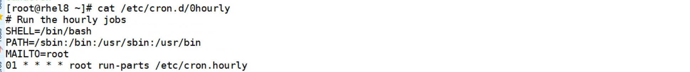
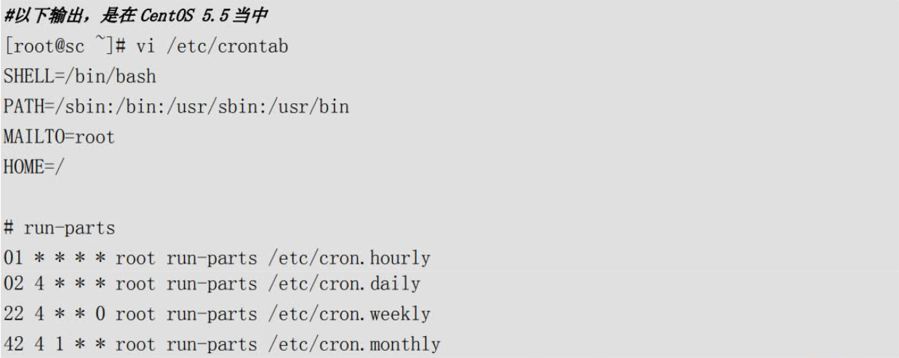
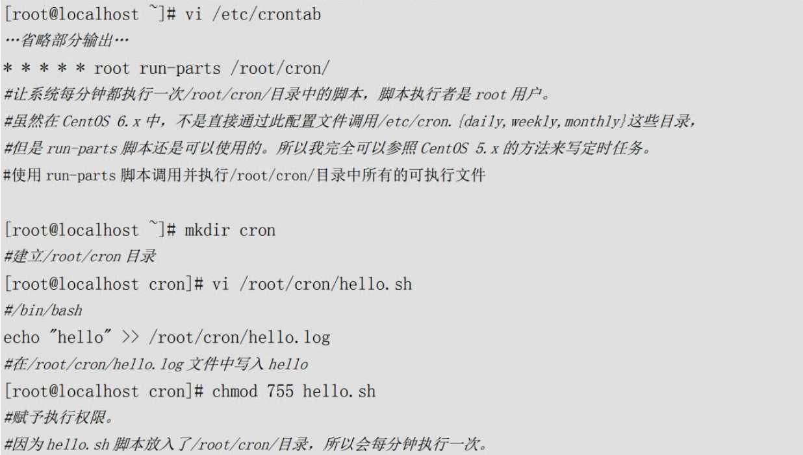
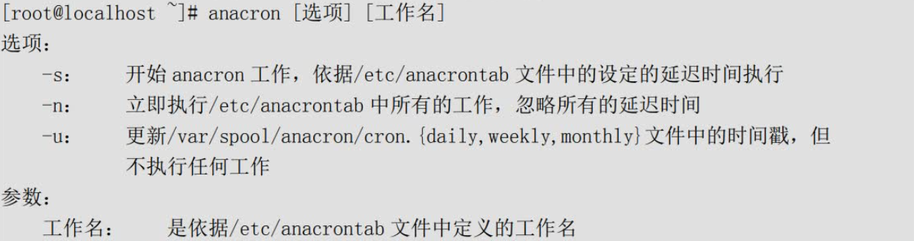
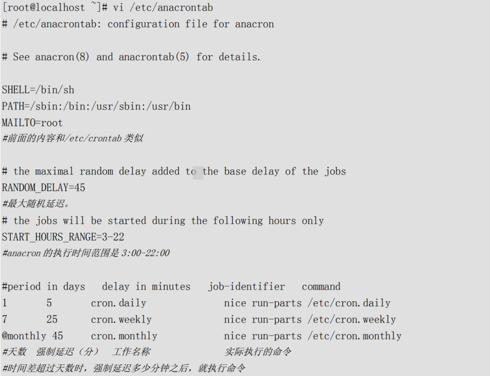
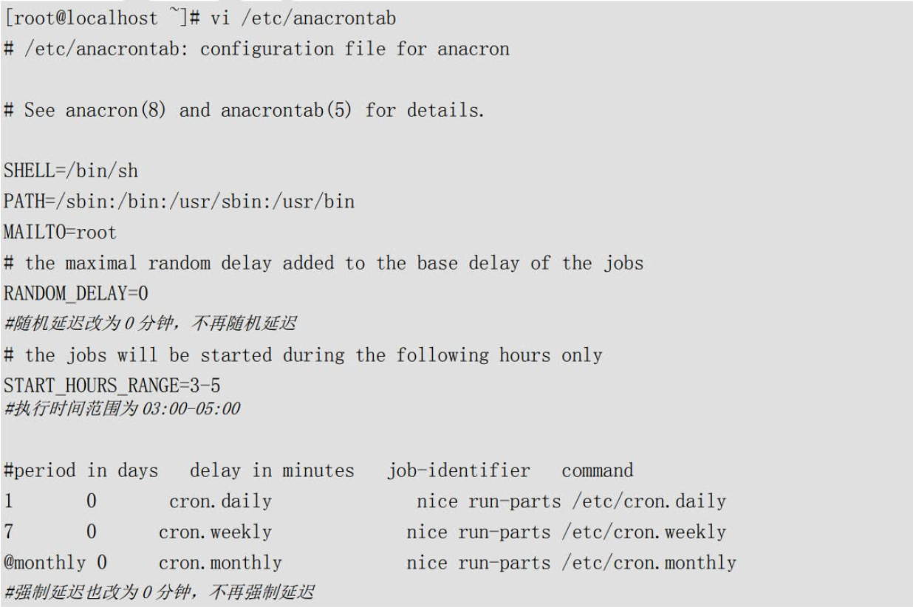

# 系统管理--3.2.系统管理-定时任务

## at一次性执行定时任务

### 1)、at服务管理与访问控制

at命令要想正确执行，需要atd服务的支持。atd服务是独立的服务，所以启动的命令是：

```shell
[root@localhost ~]# service atd start
正在启动 atd：						[确定]
```

如果想要让atd服务开机时自动启动，可以使用如下命令：

```shell
[root@localhost ~]# chkconfig atd on
```

atd服务启动之后，at命令才可以正常使用，不过我们还要学习下at命令的访问控制。
这里的访问控制指的是允许哪些用户使用at命令设定定时任务，或者不允许哪些用户使用at命令。
大家可以想象成为设定黑名单或设定白名单，这样更容易理解。
at的访问控制是依靠`/etc/at.allow`文件（白名单）和`/etc/at.deny`文件（黑名单）这两个文件来实现的，具体规则如下：

- 如果系统中有`/etc/at.allow`文件，那么只有写入`/etc/at.allow`文件（白名单）中的用户可以使用at命令，其他用户不能使用at命令（`/etc/at.deny`文件会被忽略，也就是说同一个用户既写入`/etc/at.allow`文件，也写入`/etc/at.deny`文件，那么这个用户是可以使用at命令的，因为`/etc/at.allow`文件优先级更高。）
- 如果系统中没有`/etc/at.allow`文件，只有`/etc/at.deny`文件，那么写入`/etc/at.deny`文件（黑名单）中的用户不能使用at命令，其他用户可以使用at命令。不过这个文件对root用户不生效。
- 如果系统中这两个文件都不存在，那么只有root用户可以使用at命令。

系统中默认时只有/etc/at.deny文件，而且这个文件是空的，这样的话系统中所有的用户都可以使用at命令。
不过如果我们打算控制用户的at命令权限，把用户写入/etc/at.deny文件即可

`/etc/at.allow`文件的权限更高，如果`/etc/at.allow`文件存在，则`/etc/at.deny`文件失效。
`/etc/at.allow`管理行为更加严格，因为只有写入这个文件的用户才能使用at命令，如果需要禁用at命令的用户较多，则可以把少数用户写入这个文件。`/etc/at.deny`文件的管理较为松散，如果允许使用at命令的用户较多，则可以把禁用的用户写入这个文件。不过这两个文件都不能对root用户生效。

### 2）、at命令

```shell
[root@localhost ~]# at [选项] 时间
选项：
	-m：			当at工作完成后，无论是否命令有输出，都用email通知执行at命令的用户
	-c 工作号：	  显示该at工作的实际内容
	
时间：
	at支持的时间格式如下：
	HH:MM										在指定的“小时:分钟”执行命令，例如：02:30	
	HH:MM YYYY-MM-DD							在指定的“小时:分钟年月日”执行，例如02:30 2018-07-25
	HH:MM[am|pm] [month] [date]					在指定的“小时:分钟[上午下午][月][日]”执行，例如02:30 July 25
	HH:MM[am|pm] + [minutes|hours|days|weeks]	在指定的时间“再加多久执行”，例如now + 5 minutes，05am +2 hours
```

at命令只要指定正确的时间，就可以输入需要在指定时间执行的命令了，这个命令可以是系统命令，也可以是shell脚本。

```shell
例子1：
[root@localhost ~]# cat /root/hello.sh
#!/bin/bash
echo "hello world!!"


[root@localhost ~]# at now +2 minutes
at> /root/hello.sh >> /root/hello.log
#执行hello.sh脚本，并把输出写入/root/hello.log文件
at> <EOT>		<-使用ctrl+d保存at任务
job 8 at 2018-07-2520:54	<-这是第8个at任务，会在2018年7月25日20:54分执行


[root@localhost ~]# at -c 8
#查询第8个at任务的内容
…省略部分内容…			<-主要是定义系统的环境变量
/root/hello.sh >> /root/hello.log
#可以看到at执行的任务


例子2：
[root@localhost ~]# at 02:00 2018-07-26
at> /bin/sync
at> /sbin/shutdown -h now
at> <EOT>
job 9 at 2018-07-26 02:00

#在指定的时间关机。在一个at任务中，是可以执行多个系统命令的
```

### 3）、其他at管理命令

at还有查询和删除命令

```shell
[root@localhost ~]# atq
#查询当前服务器上的at工作

例如：
[root@localhost ~]# atq
9	2018-07-26  02:00 a root
#说明root用户有一个at任务在2018年7月26日的02:00执行，工作号是9

[root@localhost ~]#atrm [工作号]
#删除指定的at任务


例如：
[root@localhost ~]# atrm 9
[root@localhost ~]# atq
#删除9号at任务，再查询就没有at任务存在了
```

## crontab循环执行定时任务

了解系统计划任务相关文件

```powershell
/etc/cron.d/
/etc/cron.d/0hourly 	系统每小时第一分钟需要执行的任务
/etc/cron.deny 			用户拒绝列表（在该文件中的用户不能使用cron服务）
/etc/crontab 			该文件的作用相当于/etc/cron.d/下面的某一个文件，可以定义系统计划任务

/etc/cron.monthly/ 		存放系统每个月需要执行的脚本
/etc/cron.weekly/ 		存放系统每周需要执行的脚本
/etc/cron.daily/ 		存放系统每天需要执行的脚本
/etc/cron.hourly/ 		存放系统每小时需要执行的脚本
/var/spool/cron 		这个目录用来存放各个用户自己设定的定时任务，普通用户没有权限直接访问
```




计划任务的周期编写

```shell
[root@rhel8 ~]# cat /etc/crontab
SHELL=/bin/bash
默认的shell，告诉系统使用哪个shell
PATH=/sbin:/bin:/usr/sbin:/usr/bin
定义命令的路径
MAILTO=root
结果以邮件的形式发送给root（不管是正确还是错误结果），如果MAILTO=""代表不会发邮件给任何人。
# For details see man 4 crontabs

# Example of job definition:
# .---------------- minute (0 - 59)
# | .------------- hour (0 - 23)
# | | .---------- day of month (1 - 31)
# | | | .------- month (1 - 12) OR jan,feb,mar,apr ...
# | | | | .---- day of week (0 - 6) (Sunday=0 or 7) OR sun,mon,tue,wed,thu,fri,sat
# | | | | |
# * * * * * user-name command to be executed
前5个字段分别表示：
	分钟：0-59
	小时：0-23
	日期：1-31
	月份：1-12
	星期：0-7（0表示周日或者7表示周日）

* 	每个单位的第一个
,	不连续时间
-	代办连续时间范围
*/n	每隔n个单位执行一次


5 * * * *		每小时的第五分钟
05 * * * *		每小时的第五分钟
20 08 * * *		每天8点20分
45 22 * * *		每天22点45分
00 06 * 12 *	12月每天的6点

03 01 * * 7		每周日的1点03分
0 17 * * 1		每周1的17点0分


还可以用一些特殊符号：
, 		表示分割，间隔
- 		表示一个段
/n 		表示每个n的单位执行一次

*/5 * * * *		每隔5分钟执行一次
0 5 1,15 * *	每月1号和15号的凌晨5点0分
03 03,06 1-15 * *	每隔月的 1号到15号的 3点03分和6点03分 执行任务

礼拜1和礼拜3每隔2个小时去执行一个任务
00 */2 * * 1,3

每个月的1号-15号，和25号的早上8:00到晚上6:00每隔2小时执行一个任务
00 08-18/2 1-15,25 * *

以下4行是rhel5里的配置；rhel6看不到，但是也生效
红帽5在/etc/crontab文件下有，之后的都没有但生效
01 * * * * 		root run-parts /etc/cron.hourly/	每小时的第1分钟root执行目录里的脚本
02 04 * * * 	root run-parts /etc/cron.daily/		每天的4点2分
22 04 * * 7 	root run-parts /etc/cron.weekly/	每周日4点22分
42 04 1 * * 	root run-parts /etc/cron.monthly/	每月1号4点42分

注意：
run-parts：
crond用这个工具来执行某个目录下所有的可执行脚本，定时任务中的每小时/每天/每周/每月任务就是通过这个工具来触发的.
```


### 1）、crond服务管理与访问控制

crontab命令是需要crond服务支持的，crond服务同样是独立的服务

crontab命令和at命令类似，也是通过`/etc/cron.allow`和`/etc/cron.deny`文件来限制某些用户是否可以使用`crontab`命令的。
而且原则也非常相似：

- 当系统中有`/etc/cron.allow`文件时，只有写入此文件的用户可以使用`crontab`命令，没有写入的用户不能使用`crontab`命令。
  同样如果有此文件，`/etc/cron.deny`文件会被忽略，`/etc/cron.allow`文件的优先级更高。
- 当系统中只有`/etc/cron.deny`文件时，则写入此文件的用户不能使用`crontab`命令，没有写入文件的用户可以使用`crontab`命令。

这个规则基本和at的规则一直，同样`/etc/cron.allow`文件的优先级比`/etc/cron.deny`文件的优先级高，Linux中默认只有`/etc/cron.deny`文件。

### 2）、用户的crontab设置

每个用户都可以实现自己的crontab定时任务，只要是使用这个用户身份执行“`crontab -e`”命令即可，当然这个用户不能加入`/etc/cron.deny`文件中。

```shell
[root@localhost ~]# crontab [选项]
选项：
    -e：编辑crontab定时任务
    -l：查询crontab任务
    -r：删除当前用户所有的crontab任务，如果有多个任务，只想删除一个，可以所以用“crontab -e”
    -u 用户名：修改或删除其他用户的crontab任务。只有root可用
    
    
[root@localhost ~]#crontab -e
#进入crontab编辑界面。会打开vim编辑你的工作。
```


```shell
例子1：让系统每隔5分钟，就向/tmp/test文件中写入一行“11”，验证一下系统定时任务是否会执行
[root@localhost ~]# crontab -e
*/5 * * * * /bin/echo "11" >> /tmp/test


例子2：在系统在每周二的凌晨5点05分重启一次
[root@localhost ~]# crontab -e
5 5 * * 2 /sbin/shutdown -r now


例子3：在每月的1号，10号，15号的凌晨3点30分都定时执行日志备份脚本autobak.sh
[root@localhost ~]# crontab -e
30 3 1,10,15 * * /root/sh/autobak.sh
[root@localhost ~]# crontab -l
#查看root用户的crontab任务
[root@localhost ~]# crontab -r
#删除root用户所有的定时任务，如果只想删除某一个定时任务
#可以“crontab -e”进入编辑模式手工删除
```

### 3）、crontab的注意事项

在书写crontab定时任务时，需要注意几个注意事项，这里我们再强调下：

- 六个选项都不能为空，必须填写。如果不确定使用“`*`”代表任意时间；
- crontab定时任务，最小有效时间是分钟，最大时间范围是月。像2018年某时执行，3点30分30秒这样的时间都不能识别；
- 在定义时间时，日期和星期最好不要在一条定时任务中出现，因为它们都是以天作为单位，非常容易让管理员混乱；
- 在定时任务中，不管是直接写命令，还是在脚本中写命令，最好都是用绝对路径。有时相对路径的命令会报错。

## 系统的crontab设置

“crontab -e”是每个用户执行的命令，也就是说不同的用户身份可以执行自己的定时任务。

可是有些定时任务需要系统执行，这时我们就需要编辑/etc/crontab这个配置文件了。

当然，并不是说写入/etc/crontab配置文件中的定时任务执行时，不需要用户身份，而是“crontab -e”命令定义定时任务时，默认用户身份是当前登录用户。

而修改/etc/crontab配置文件时，定时任务的执行着身份是可以手工指定的。

这样定时任务的执行会更加灵活，修改起来也更加方便。

```shell
SHELL=/bin/bash
PATH=/sbin:/bin:/usr/sbin:/usr/bin
MAILTO=root

# For details see man 4 crontabs

# Example of job definition:
# .---------------- minute (0 - 59)
# |  .------------- hour (0 - 23)
# |  |  .---------- day of month (1 - 31)
# |  |  |  .------- month (1 - 12) OR jan,feb,mar,apr ...
# |  |  |  |  .---- day of week (0 - 6) (Sunday=0 or 7) OR sun,mon,tue,wed,thu,fri,sat
# |  |  |  |  |
# *  *  *  *  * user-name  command to be executed
# 分 时 日 月  周 执行者身份  命令
```

在CentOS 6.x中，`/etc/crontab`这个文件也发生了变化，在CentOS 5.x中这个文件的内容大概是这个样子：



在CentOS5.x版本中，/etc/crontab文件会使用run-parts脚本执行/etc/cron.{daily,weekly,monthly}目录中的所有文件。这个run-parts其实是一个shell脚本，保存在/usr/bin/run-parts，它的作用就是把其后面跟随的目录中的所有可执行文件依次执行。也就是说，如果我们想让某个脚本在每天都执行一次，可以不用手工去写定时任务，而只需要给这个脚本赋予执行权限，并把它放入/etc/cron.daily/目录中。这样这个脚本就会在每天的凌晨4点02分执行了。

可是在CentOS 6.x版本中，/etc/crontab文件中不再有相关的段落，那么是否run-ptars这种定时任务执行方法不可用了呢？我们看到/etc/crontab中有一句提示，让我们“man 4 crontabs”来查看帮助，那么我们就看看这个帮助吧！在这个帮助中，明确写明了“在旧版本的crontab配置文件中，是通过run-parts脚本来调用cron.{daily,weekly,monthly}目录，定时执行这些目录中的脚本。在当前系统中，为了避免cron和anacron之间产生冲突，只要anacron已经安装，就使用anacron来执行这些目录中的脚本。具体可以查看anacron（8）的帮助。”。对于anacron的用法，我们下一个小节来介绍。


其实对我们用户来讲，我们并不需要知道这个定时任务到底是由哪个程序调用的。我们需要知道的事情是如何使用系统的crontab设置。这个新老版本的CentOS没有区别，配置方法都有两种：

- 第一种方法就是我刚刚说过的，把你需要定时执行的工作写成脚本程序，并赋予执行权限，然后直接把这个脚本复制到/etc/cron.{daily,weekly,monthly}目录中的任意一个。比如我需要让某个脚本每周执行，那么就把这个脚本复制到/etc/cron.weekly/目中中。这样这个脚本就会每周执行一次，具体的执行时间要参考anacron的配置。

- 第二种方法就是修改/etc/crontab这个配置文件，自己加入自己的定时任务，不过需要注意指定脚本的执行者身份。例如：



只要保存/etc/crontab文件，这个定时任务就可以执行了，当然要确定crond服务是运行的。

这两种方法都是可以使用的，具体看个人的习惯吧！不过要想修改/etc/crontab文件，当然我要是root用户才可以，普通不能修改，只能使用用户身份的crontab命令。

## anacron

anacron是用来干什么的呢？我们的Linux服务器如果不是24小时开机的，那么刚好在关机的时间段之内有系统定时任务（cron）需要执行，那么这些定时任务是不会执行的。也就是说，假设我们需要在凌晨5点05分执行系统的日志备份，但是我们的Linux服务器不是24小时开机的，在晚上需要关机，白天上班之后才会再次开机。这个定时任务的执行时间我们的服务器刚好没有开机，那么这个任务就不会执行了。anacron就是用来解决这个问题的。

anacron会使用一天，七天，一个月作为检测周期，用来判断是否有定时任务在关机之后没有执行，如果有这样的任务，anacron会在特定的时间重新执行这些定时任务。那么anacron是如何判断这些定时任务已经超过了执行时间呢？在系统的/var/spool/anacron/目录中存在cron.{daily,weekly,monthly}文件，这些文件中都保存着anacron上次执行时的时间。anacron会去读取这些文件中的时间，然后和当前时间做比较，若果两个时间的差值超过了anacron的指定时间差值（一般是1天，7天和一个月），就说明有定时任务漏掉了没有被执行，这时anacron会介入而执行这个漏掉的定时任务，从而保证在关机时没有被执行的定时任务不会被漏掉。

在CentOS 6.x中，我们使用cronie-anacron取代了vixie-cron软件包。而且在原先的CentOS版本中/etc/cron.{daily,weekly,monthly}这些目录中的定时任务会同时被cron和anacron调用，这样非常容易出现重复执行同一个定时任务的错误。在现在的CentOS6.x中 ，/etc/cron.{daily,weekly,monthly}目录中的定时任务程序只会被anacron调用，从而保证这些定时任务只会在每天、每周或每月被定时执行一次，而不会重复执行。这也是我们在上一个小节中介绍的CentOS 6.x的变化之一。

在CentOS 6.x中anacron还有一个变化，anacron不再是单独的服务，而变成了系统命令。也就是说我们不再可以使用“service anacron restart”命令来管理anacron服务了。而是需要使用anacron命令来管理anacron工作，具体命令如下：



在我们当前的Linux中，其实不需要执行任何anacron命令，只需要配置好/etc/anacrontab文件，系统就会依赖这个文件中的设定来通过anacron执行定时任务。那么关键就是/etc/anacrontab文件的内容了，这个文件如下：



这个文件中“RANDOM_DELAY”定义的是最大随机延迟，也就是说cron.daily任务如果超过1天没有执行，并不会马上执行，而是先延迟强制延迟时间之后，再延迟随机延迟时间之后再执行命令。“START_HOURS_RANGE”定义anacron的执行时间范围，anacron只会在这个时间范围之内执行。

我们用cron.daily工作来说明下/etc/anacrontab的执行过程：

- 首先读取/var/spool/anacron/cron.daily中的上一次anacron执行的时间；
- 和当前时间比较，如果两个时间的差值超过1天，就执行cron.daily工作；
- 执行这个工作只能在03:00-22:00之间；

- 执行工作时强制延迟时间为5分钟，再随机延迟0-45分钟时间；
- 使用nice命令指定默认优先级，使用run-parts脚本执行/etc/cron.daily目录中的所有可执行文件。

大家发现了吧，/etc/cron.{daily,weekly,monthly}中的脚本，在当前的Linux中是被anacron调用的，不再依靠cron服务。不过anacron不用设置多余的配置，我们只需要把需要定时执行的脚本放入/etc/cron.{daily,weekly,monthly}目录当中，就会每天、每周或每月执行，而且也不再需要启动anacron服务了。我们如果做修改的话，只用修改/etc/anacrontab配置文件即可。比如我更加习惯让定时任务在凌晨03:00-05:00执行，就可以如下修改：



这样我们所有放入/etc/cron.{daily,weekly,monthly}目录中的脚本都会在指定时间运行了，而且也不怕服务器万一关机的情况了。