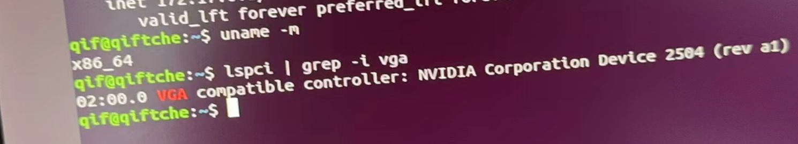
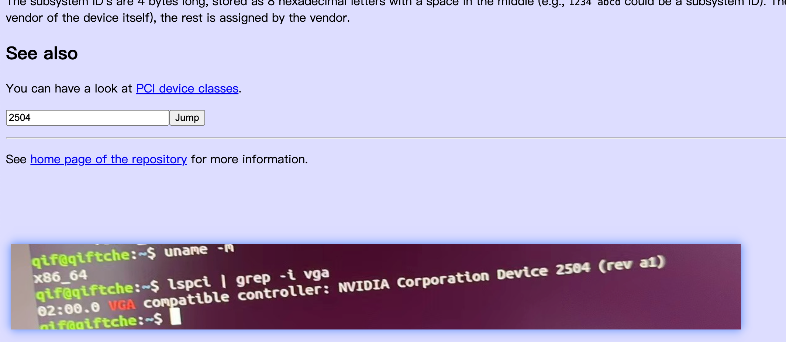
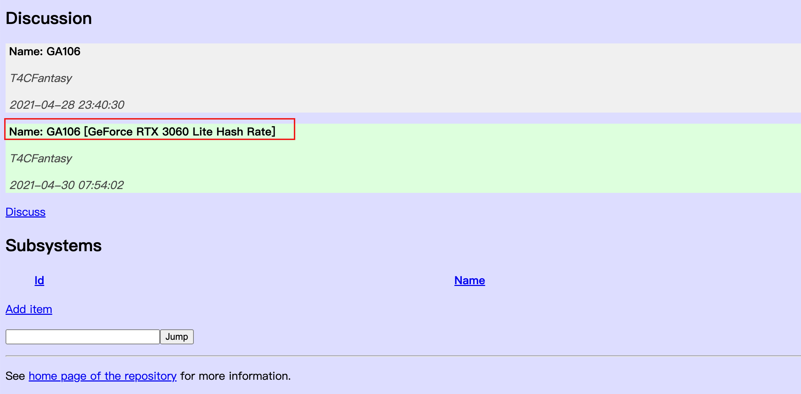
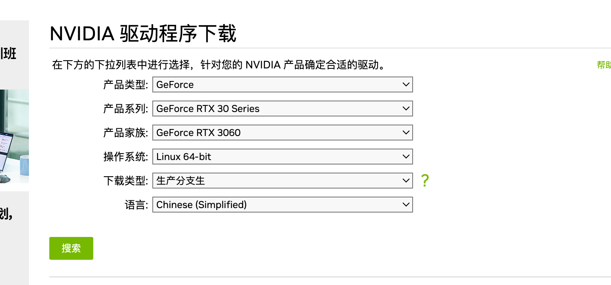
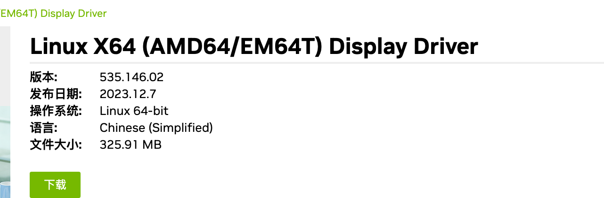
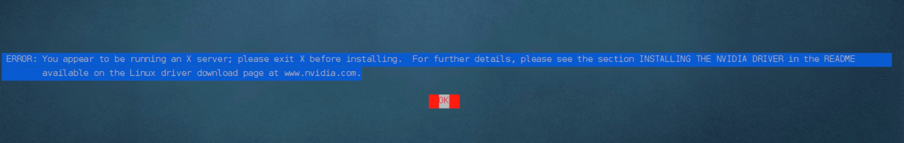
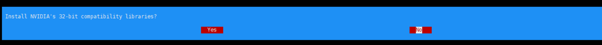
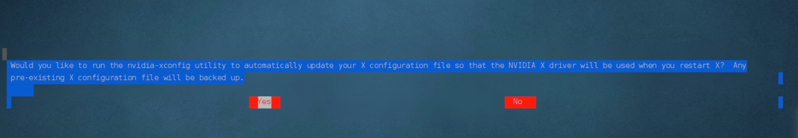
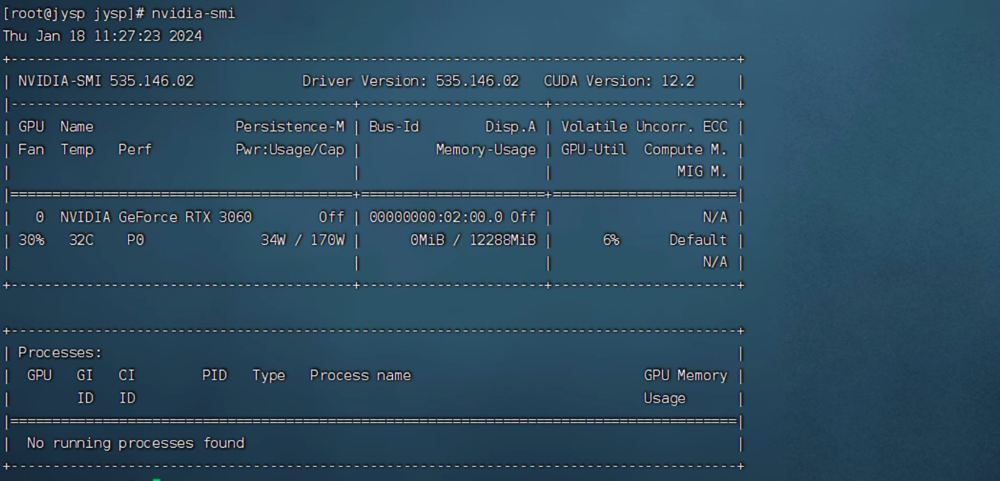
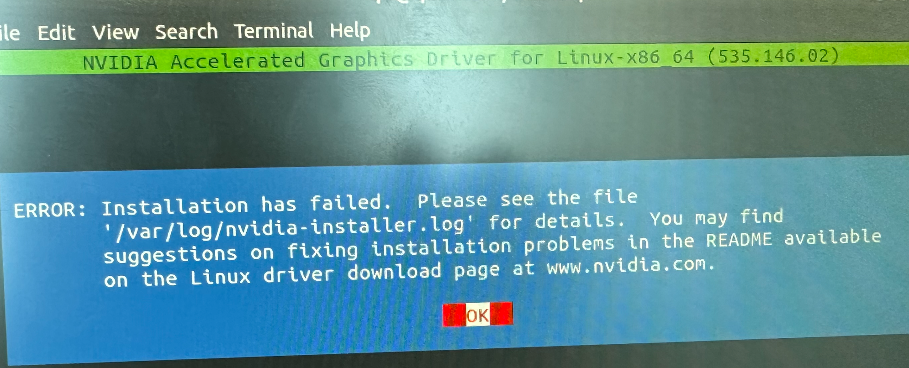

# CentOS7.9显卡驱动安装

查看系统版本

```
cat /etc/redhat-release
```

查看系统架构

```
arch
```

查看显卡型号

```
 lspci | grep -i nvidia
```



查询显卡具体型号信息

https://admin.pci-ids.ucw.cz/mods/PC/10de?action=help?help=pci





驱动下载地址

https://www.nvidia.cn/Download/index.aspx?lang=cn





下载后的文件为.run文件


## 安装

```
yum install gcc gcc-c++ tar make
yum install kernel-devel-$(uname -r) kernel-headers-$(uname -r)
```

禁用nouveau

查询Nouneau模块是否运行，如果运行则需要禁用

```
lsmod | grep nouveau

如果有输出则表示运行，如果没有输出则表示禁用成功。
```

```shell
#新建一个配置文件
sudo vim /etc/modprobe.d/blacklist-nouveau.conf
#写入以下内容
blacklist nouveau
options nouveau modeset=0


#备份当前的镜像
sudo mv /boot/initramfs-$(uname -r).img /boot/initramfs-$(uname -r).img.bak
#建立新的镜像
sudo dracut /boot/initramfs-$(uname -r).img $(uname -r)
#重启
sudo reboot
#最后输入上面的命令验证
lsmod | grep nouveau
```

**安装驱动后缀分为.run和.rpm**

### rpm包

使用rpm命令安装 rpm 包。

```
rpm -i nvidia-diag-driver-local-repo-XXX.rpm

yum install cuda-drivers

reboot
```

运行nvidia-smi能输出正确信息代表驱动安装成功。


### run包

上传下载好的驱动程序NVIDIA-Linux-xxxx.run到GPU节点（将文件上传至服务器）

```
sudo chmod a+x NVIDIA-Linux-x86_64-460.106.00.run

sudo ./NVIDIA-Linux-xxxx.run

注：如果使用GUI安装包，可能会出现如下错误
You appear to be running an X server; please exit X before installing.
关闭X server的方法如下：
https://blog.csdn.net/qq_36287702/article/details/122443262
```

如果执行过程中出现下图情况，执行

```
./NVIDIA-Linux-xxxx.run -no-x-check -no-nouveau-check -no-opengl-files
```



在安装过程中可能会显示一个问题：



选择NO继续

后面的直接yes直到安装完成



安装只后输入nvidai-smi，显示如下，则安装成功。




## 卸载重装

sudo /usr/bin/nvidia-uninstall

```
yum install gcc gcc-c++ tar make

yum install kernel-devel-$(uname -r) kernel-headers-$(uname -r)
```


卸载

```
sudo /usr/bin/nvidia-uninstall

出现xconfig选择yes
```

查询Nouneau模块是否运行，如果运行则需要禁用

```
lsmod | grep nouveau

如果有输出则表示运行，如果没有输出则表示禁用成功。
```

禁用则在以下文件内写入以下内容：

```
vim /usr/lib/modprobe.d/blacklist-nouveau.conf

# 加入的内容：
blacklist nouveau
options nouveau modeset=0
```

执行以下命令使内核生效，并重启服务器

```
dracut -f

systemctl set-default multi-user.target

reboot
```

再次查看Nouneau模块是否运行，如果没有输出则禁用成功。

```
lsmod | grep nouveau
```


上传下载好的驱动程序NVIDIA-Linux-xxxx.run到GPU节点（将文件上传至服务器）

```
sudo chmod a+x NVIDIA-Linux-x86_64-460.106.00.run

sudo ./NVIDIA-Linux-xxxx.run
```

如果出现以下问题，请重启计算机




如果执行过程中出现下图情况，执行

```
./NVIDIA-Linux-xxxx.run -no-x-check -no-nouveau-check -no-opengl-files
```


在安装过程中可能会显示一个问题：


选择NO继续

后面的直接yes直到安装完成


安装只后输入nvidai-smi，显示如下，则安装成功。


## 安装CUDA（未亲测）

1.CUDA驱动下载 https://developer.nvidia.com/cuda-75-downloads-archive 。

2.选择操作系统和安装包。以 CentOS 7.9 64 位为例，可按如下方式进行选择：

 下载rpm安装包


3.在 CUDA 安装包所在目录下运行如下命令：

sudo rpm -i cuda-repo-rhel7-9-2-local-9.2.148-1.x86_64.rpm
sudo yum clean all
sudo yum install cuda
 4.在/usr/local/cuda/samples/1_Utilities/deviceQuery目录下，执行make命令，可以编译出deviceQuery程序。

5.执行deviceQuery正常显示设备信息，此刻认为CUDA安装正确。

 =================更新===============

如果使用rpm文件报错，则考虑使用run文件进行安装。

下载地址：

CUDA Toolkit Archive | NVIDIA Developer

我安装是是10.1版本，可以离线安装。10.2的版本可以选择在线下载和离线下载。


下载run文件进行安装

sh cuda_*.run
建议最好不要使用GUI图形化界面操作，容易报错。


## 参考

http://t.csdnimg.cn/z72O4

http://t.csdnimg.cn/mhpQX

http://t.csdnimg.cn/2mcgC

http://t.csdnimg.cn/WZRw3

http://t.csdnimg.cn/sDfky

http://t.csdnimg.cn/KwqBk

查看支持cuda的GPU列表

https://developer.nvidia.com/cuda-gpus

系统是否是受支持的Linux版本

https://docs.nvidia.com/cuda/cuda-installation-guide-linux/index.html