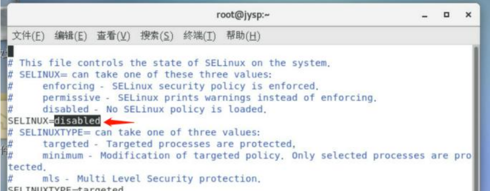
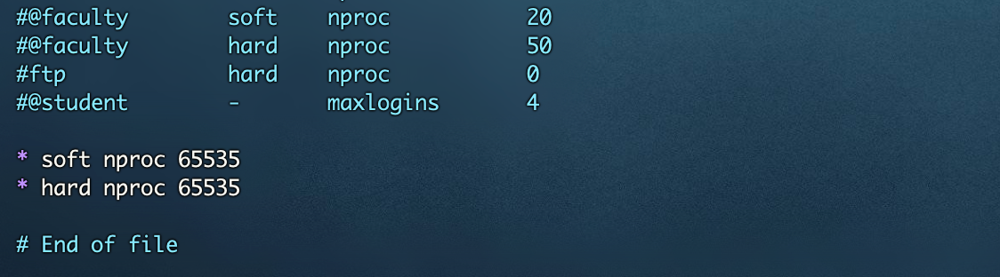
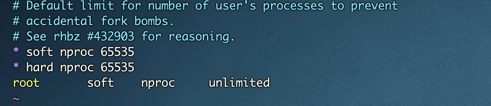
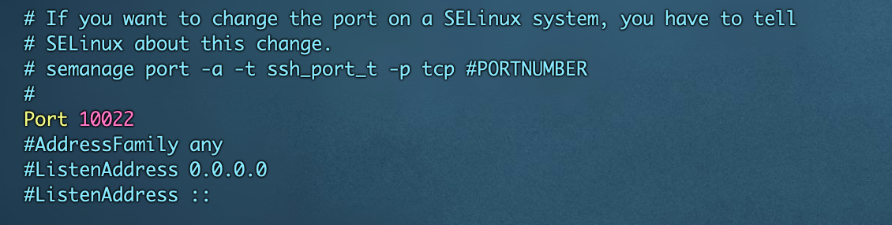
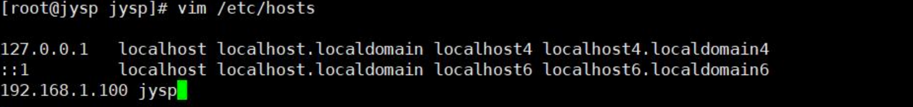
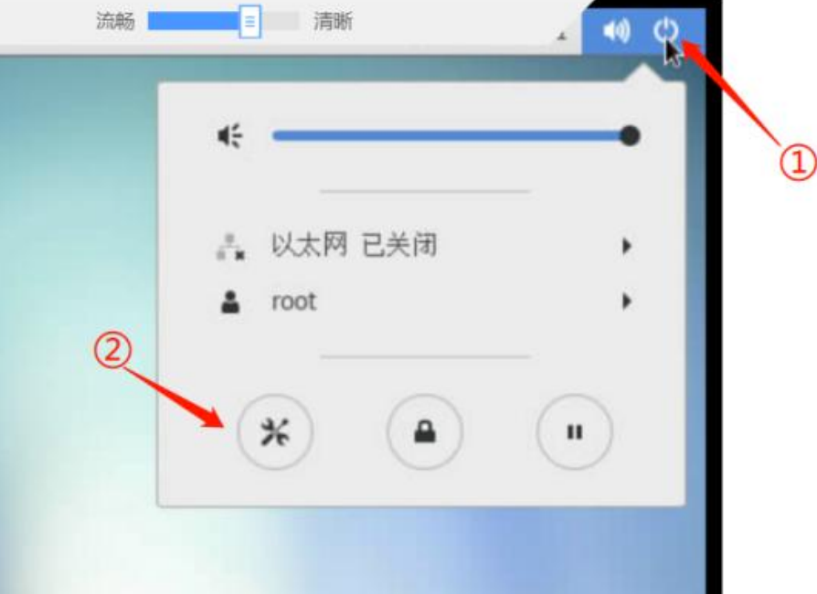
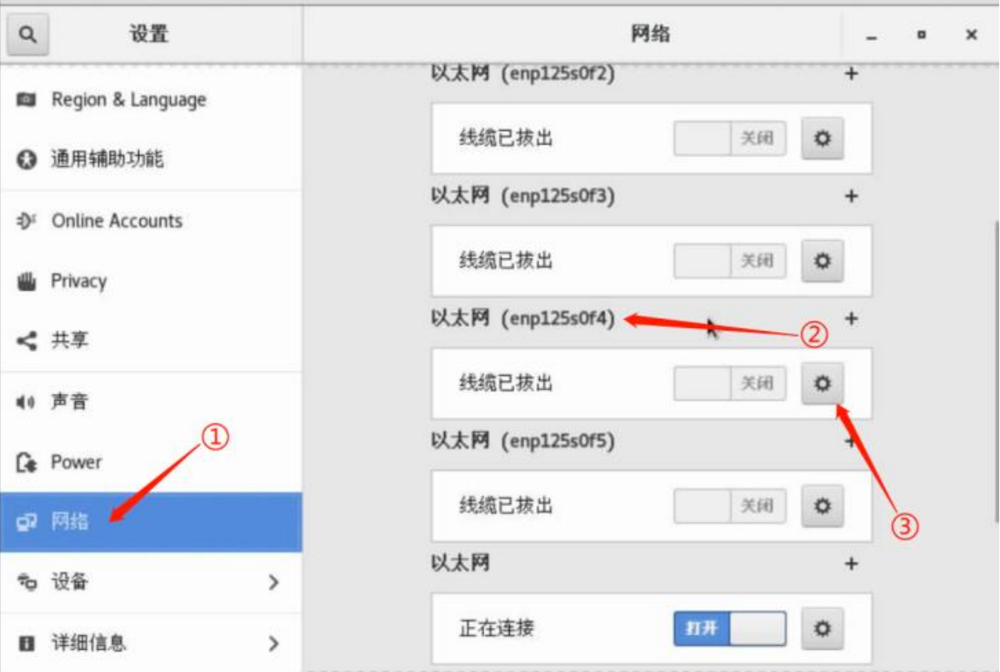
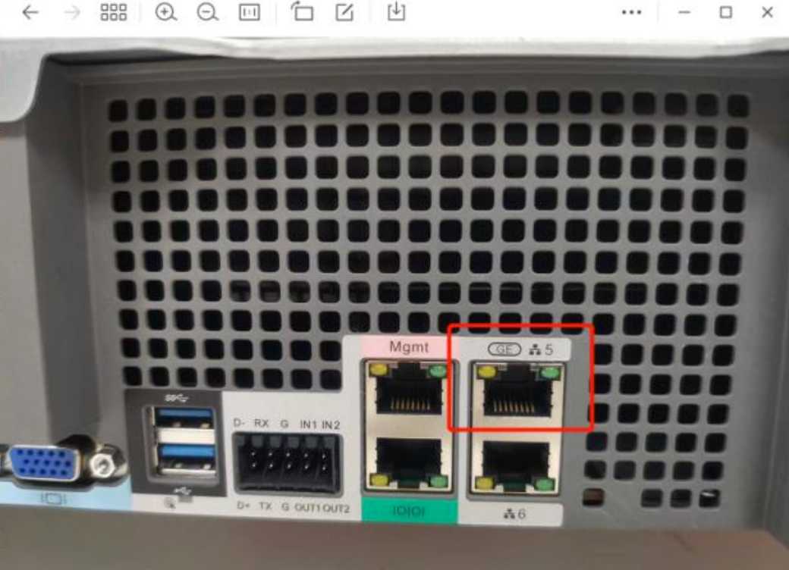
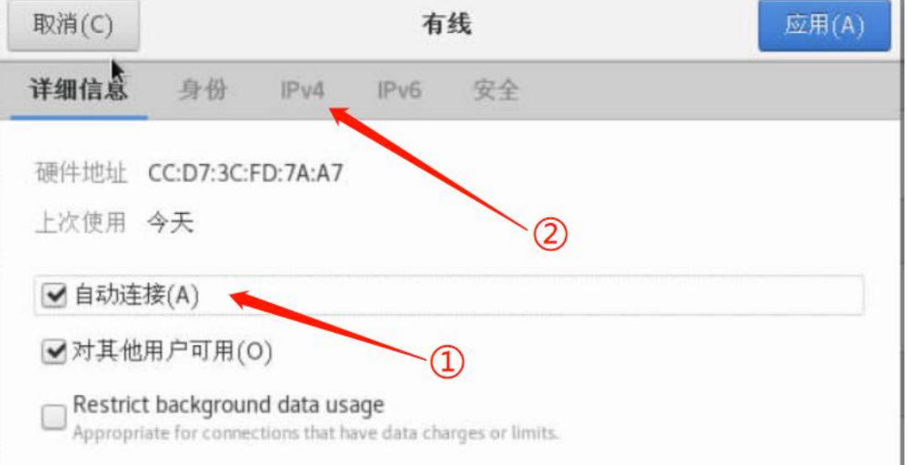
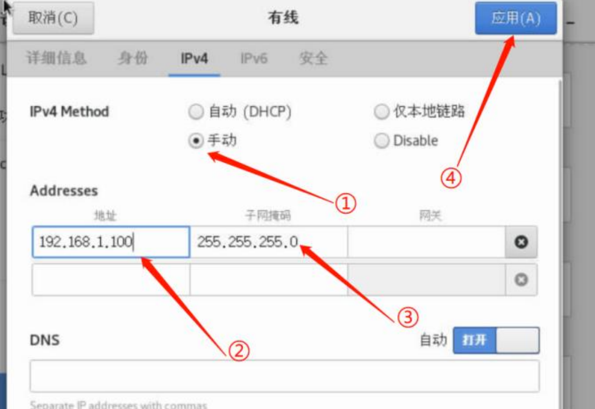

 

## 防火墙与 selinux 关闭

使用 root 用户进行登入

```
systemctl stop firewalld.service
systemctl disable firewalld.service
```

关闭 selinux，修改 selinux 配置文件：/etc/selinux/config。修改文件中的“SELINUX”值为：disabled



## 修改系统的 open files 与 nproc

建议将系统的 open files 与 nproc 两个参数修改为：65535

先修改 open files 的，打开文件：`/etc/security/limits.conf `，在文件中添加：

```
* soft nproc 65535
* hard nproc 65535
```



再修改系统 nproc 的参数，修改文件：`/etc/security/limits.d/20-nproc.conf`。在文件中修改添加：

```
* soft nproc 65535
* hard nproc 65535
```



## 修改 sshd 监听端口

以 root 用户权限修改配置文件：`/etc/ssh/sshd_config`。

将 Port 前的注释“#”去掉，修改 22 为 10022。



修改保存后，重启 sshd.service 服务：

```
systemctl restart sshd.service
```

## 主机名设置

已 root 权限(切换 root 用命令：su -)打开系统的/etc/hostname 文件，并修改该文件，且该文件中只保留一行“xiaoshaozi”

```
systemctl restart systemd-hostnamed.service 
```

## 修改 hosts 文件

以 root 用户权限，在/etc/hosts 文件中添加本地地址的 DNS 解析，

解决后面RabbitMQ 的访问速率缓慢，RabbitMQ 通过主机名解析进行访问。

因此需将主机名解析加到服务器的本地解析文件中，由于已经确定了主机名是：jysp，

网络地址：192.168.1.100，因此只需添加：



```
# 重启网卡 刷新生效
/etc/init.d/network restart

systemctl restart network.service

# 解析域名ip地址
ping www.baidu.com -c 1 | sed '1{s/[^(]*(//;s/).*//;q}'
```


## rpm证书

```
rpm --import /etc/pki/rpm-gpg/RPM-GPG-KEY-CentOS-7
```

## 本地yum源

将CentOS-7-aarch64-Everything-2009.iso镜像文件上传到服务器

```
[root@jysp jysp]# mkdir /media/CentOS/

[root@jysp jysp]# mount -o loop /home/jysp/CentOS-7-x86_64-Everything-2009.iso /media/CentOS/
mount: /dev/loop0 写保护，将以只读方式挂载
```

在/etc/yum.repos.d/目录下新建目录bak，然后将yum.repo.d目录下的所有文件都移动到bak目录下

```powershell
mkdir /etc/yum.repos.d/bak
mv /etc/yum.repos.d/* /etc/yum.repos.d/bak


vim CentOS-Media.repo
# 容器名称
[c7-media]
# 容器说明
name=CentOS-$releasever - Media
# mirrorlist 镜像站点
# yum源服务器的地址,镜像挂载地址
baseurl=file:///media/CentOS/
# 如果为1则表示RPM的数字证书生效
gpgcheck=1
# 此容器是否生效
enabled=1
# 数字证书的公钥文件保存位置
gpgkey=file:///etc/pki/rpm-gpg/RPM-GPG-KEY-CentOS-7


清空yum缓存
[root@RedHat8 yum.repos.d]# yum clean all
创建yum缓存
[root@RedHat8 yum.repos.d]# yum makecache
查看仓库
[root@RedHat8 yum.repos.d]# yum repolist
查看yum列表
[root@RedHat8 yum.repos.d]# yum list
```


## 网络设置









