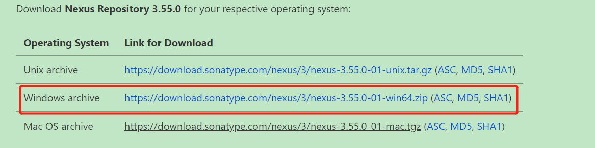
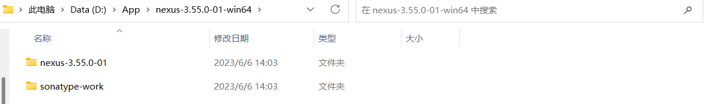
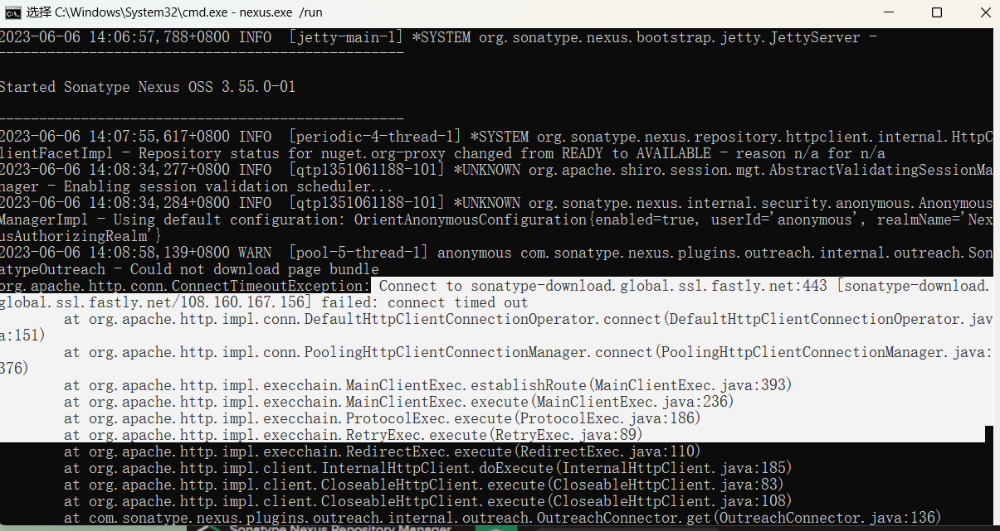
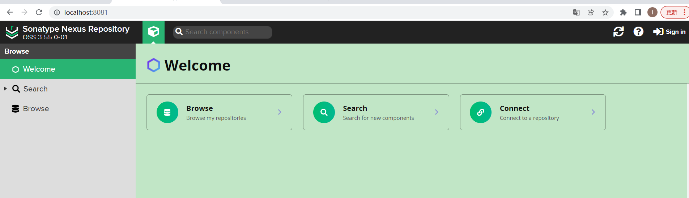
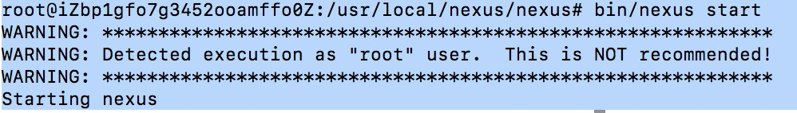

# 安装nexus

## 简介

**maven仓库管理软件：**

Apache基金会的archiva：[Archiva – The Build Artifact Repository Manager](http://archiva.apache.org/)

JFrog的Artifactory：[Artifactory - Universal Artifact Repository Manager - JFrog](https://jfrog.com/artifactory/)

Sonatype的[Nexus](https://so.csdn.net/so/search?q=Nexus&spm=1001.2101.3001.7020)：[My Sonatype | Customer Platform](https://my.sonatype.com/)

推荐使用第三种，本文将在windows环境下介绍这三种。

注意：nexus是java开发，所以需要j保证电脑安装了java环境。

**下载地址：**[Download](https://help.sonatype.com/repomanager3/product-information/download)

## window安装



**解压**后文件夹后进入bin目录



**直接cmd运行：**

```
D:\App\nexus-3.55.0-01-win64\nexus-3.55.0-01\bin>nexus.exe /run
```

运行之后出现如下异常、但是不影响：



**浏览器打开如下：**

http://localhost:8081/



右上角登录：

用户名：admin（默认）

密码：第一次启动时生成，(在/sonatype-work/nexus3/admin.password 文件中) 

登录之后可以进行一些修改密码等指引操作。

## Linux安装

### 安装过程

```shell
cd /usr/local && mkdir nexus && cd nexus

wget http://sonatype-download.global.ssl.fastly.net/nexus/3/nexus-3.6.0-02-unix.tar.gz

tar -zxvf nexus-3.6.0-02-unix.tar.gz  //解压
mv nexus-3.6.0-02  nexus              //重命名

#如果Linux硬件配置比较低的话，建议修改为合适的大小，否则会出现运行崩溃的现象
vim nexus/bin/nexus.vmoptions //虚拟机选项配置文件


```

### 启动nexus

启动 Nexus（默认端口是8081），Nexus 常用的一些命令包括：/usr/local/nexus/nexus/bin/nexus {start|stop|run|run-redirect|status|restart|force-reload}，下面我们启动Nexus：`启动命令：bin/nexus start`



说明已经安装启动成功，上面报错意思是nexus建议不要用root用户来启动nexus，但并不影响启动,如果要去除这个可以百度。

### 其它说明

   1）Nexus默认的端口是8081，可以在etc/nexus-default.properties配置中修改。

   2）Nexus默认的用户名密码是admin/admin123

   3）当遇到奇怪问题时，重启nexus，启动时间会比较慢 要1分钟左右后才能访问。

   4）Nexus的工作目录是sonatype-work（路径一般在nexus同级目录下）