# nexus--2.介绍

> 本文参考：https://rivers-all.com/archives/2341.html

## maven仓库

maven仓库既可以从中央仓库拉取依赖，也可以将本地依赖直接发到nexus中，那么就少不了maven中的仓库

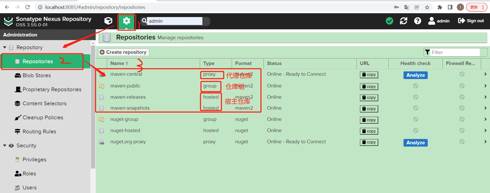

#### 代理仓库

代理仓库主要是让用户通过代理仓库访问外部第三方仓库，如maven中央仓库、阿里的maven仓库。代理仓库会从被代理的仓库（**maven中央仓库**、**阿里的maven仓库**）中下载依赖，缓存在代理仓库中以便让maven用户使用。

创建代理仓库过程：

**选择 Create repository**

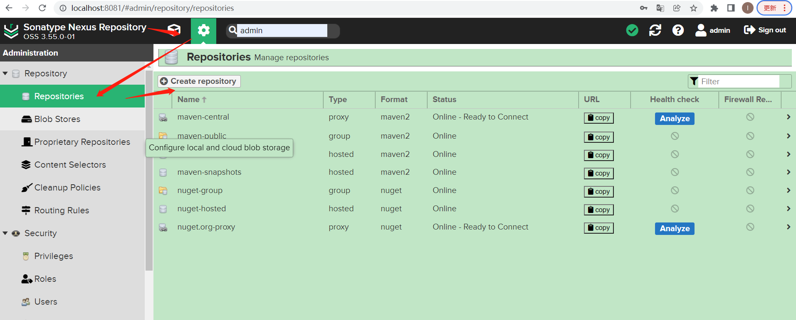

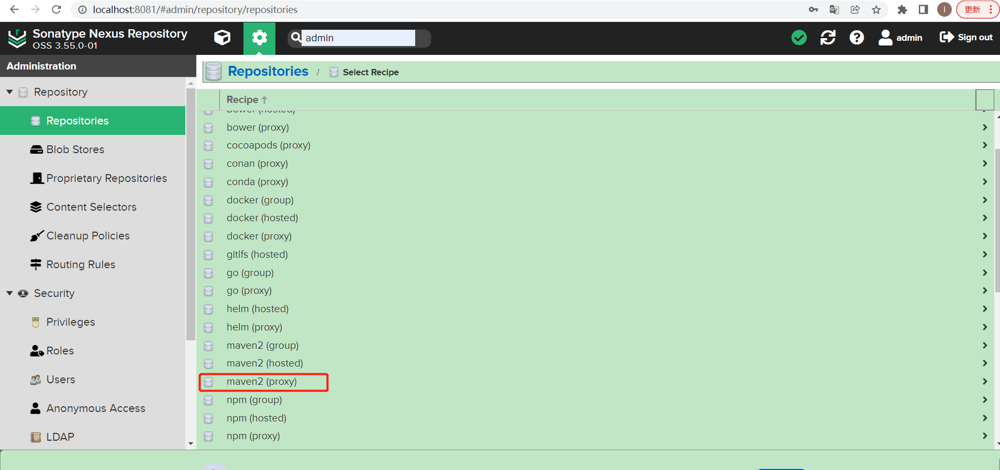

**输入远程仓库信息：**

> 第一个红框：仓库名称
>
> 第二个红框：Release（表示从仓库中下载稳定的构建）
>
> 第三个红框：仓库地址

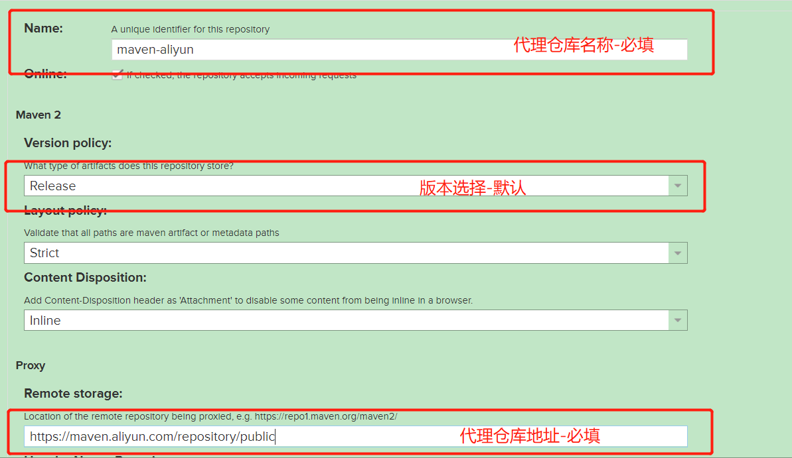

 **然后点击创建**，完成后如下：

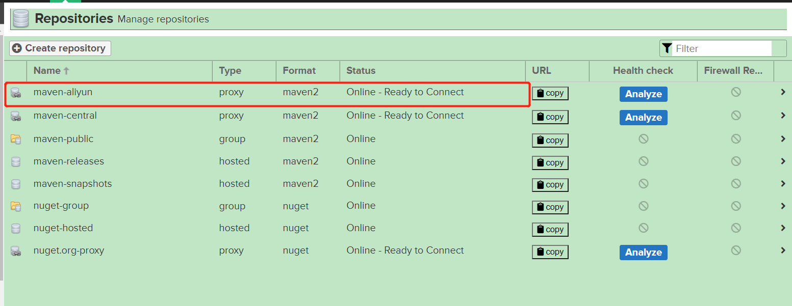

#### 宿主仓库

宿主仓库主要是供给自己使用：

​    1、将私有的一些构建通过网页的方式上传到宿主仓库中供大家使用。

​    2、将自己开发好的一些构建发布到nexus的宿主仓库中供大家使用

#### 仓库组

仓库组既然是“组”的概念，说明它里面可以包含多个仓库。

因为maven用户可以从代理仓库和宿主仓库中下载构建至本地仓库，为了方便从代理仓库和宿主仓库下载构建，maven提供了仓库组。

仓库组可以包含多个宿主仓库和代理仓库，maven用户访问一个仓库组就可以访问该仓库下的所有仓库。

仓库组中的多个仓库是有顺序的，当maven用户从仓库组中下载构建时，会按顺序在仓库组中查找组件，查到了就返回给本地仓库，所以一般将速度快的放前面。

仓库组内部实际是没有内容的，只是起到一个请求转发的作用，将maven用户的下载请求转发给其它仓库处理。

nexus默认有仓库组maven-public

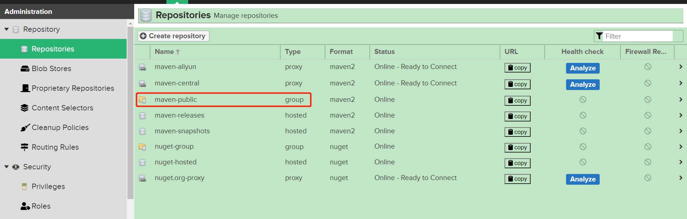

 打开如下：

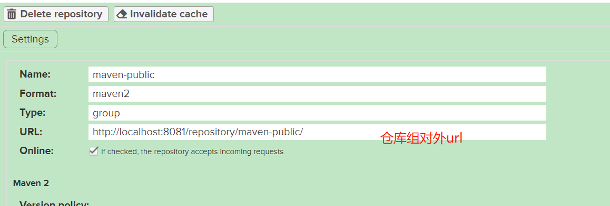

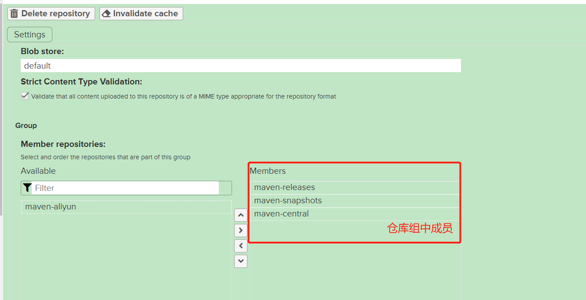

**仓库组对外url：**本地maven可以通过这个url从仓库组中下载构件至本地仓库

**仓库组中成员：**maven-releases（宿主的releases仓库版本）maven-snapshots（宿主快照版本的仓库）maven-central（maven社区的中央仓库的代理）

刚刚新增的maven-aliyun在左边，需要将它迁移到右边来，并且放在第三个位置，因为上述说过仓库组的查找是有顺序的，需要将速度快的放在前面，这个新增的仓库速度比maven-central速度要快。

如下：

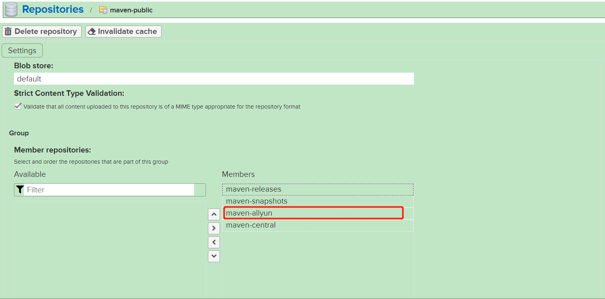

## 本地Maven下载构建

先搭建一个新项目。

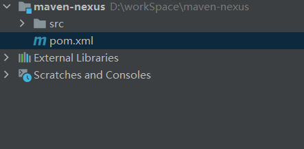

找到仓库组提供的url：

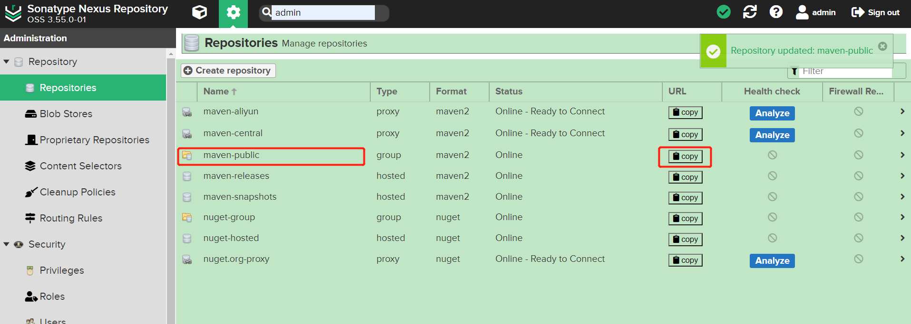

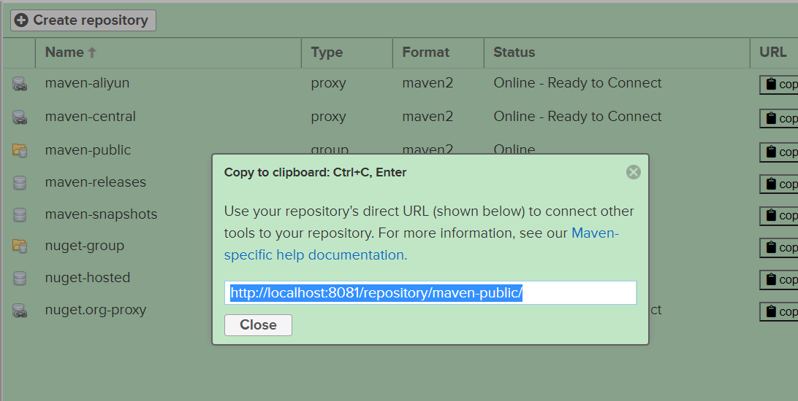

### pom.xml方式

在新建项目的pom文件中加入如下内容：

```xml
<repositories>
    <repository>
        <id>maven-nexus</id>
        <url>http://localhost:8081/repository/maven-public/</url>
        <releases>
            <enabled>true</enabled>
        </releases>
        <snapshots>
            <enabled>false</enabled>
        </snapshots>
    </repository>
</repositories>

<!--该配置是为了防止pom中的jar包从私服下载之后，但是执行mvn中从插件还是从中央仓库中下载-->
<pluginRepositories>
    <pluginRepository>
        <id>maven-nexus</id>
        <url>http://localhost:8081/repository/maven-public/</url>
    </pluginRepository>
</pluginRepositories>
```

因为nexus需要有用户名和密码才能访问，所以需要在setting.xml文件中配置账号密码：

	<server>
	  <id>maven-nexus</id>
	  <username>admin</username>
	  <password>1e1e7335-e723-441b-9876-a986b53e4130</password>
	</server>

**注意：**setting.xml中的id需要和pom.xml文件中配置的id一致.username和password是自己在nexus中配置的。

完整配置文件：

```xml
<?xml version="1.0" encoding="UTF-8"?>
 
<project xmlns="http://maven.apache.org/POM/4.0.0" xmlns:xsi="http://www.w3.org/2001/XMLSchema-instance"
  xsi:schemaLocation="http://maven.apache.org/POM/4.0.0 http://maven.apache.org/xsd/maven-4.0.0.xsd">
  <modelVersion>4.0.0</modelVersion>
 
  <groupId>com.nexus</groupId>
  <artifactId>nexus-maven</artifactId>
  <version>1.0-SNAPSHOT</version>
 
  <name>nexus-maven Maven Webapp</name>
 
 
  <dependencies>
    <dependency>
      <groupId>com.alibaba</groupId>
      <artifactId>fastjson</artifactId>
      <version>1.2.62</version>
    </dependency>
  </dependencies>
 
  <repositories>
    <repository>
      <id>maven-nexus</id>
      <url>http://localhost:8081/repository/maven-public/</url>
      <releases>
        <enabled>true</enabled>
      </releases>
      <snapshots>
        <enabled>false</enabled>
      </snapshots>
    </repository>
  </repositories>
 
  <!--该配置是为了防止pom中的jar包从私服下载之后，但是执行mvn中从插件还是从中央仓库中下载-->
  <pluginRepositories>
    <pluginRepository>
      <id>maven-nexus</id>
      <url>http://localhost:8081/repository/maven-public/</url>
    </pluginRepository>
  </pluginRepositories>
 
 
</project>
```

**注意事项：**

​    1、 自己在pom文件中配置了私服并且也在idea的maven中配置了settings.xml文件，但是jar包还是从阿里云下载。

原因：自己电脑上有好几个setting.xml文件，默认会找到settings.xml文件，自己当初指定的的xml文件名称并不是settings.xml文件名，

解决方案：将其它的xml文件删掉或改名，并将自己指定的xml文件改名为settings.xml文件。

​    2、jar包从私服下载之后，但是执行mvn中从插件还是从中央仓库中下载

原因：所有的pom文件都继承了super pom：

解决方案：在自己的pom文件中添加如下

```xml
<pluginRepositories>
    <pluginRepository>
        <id>central</id>
        <url>http://host:port/content/groups/public(这里换成自己的私有maven仓库地址)</url>
    </pluginRepository>
```

执行mvn compile

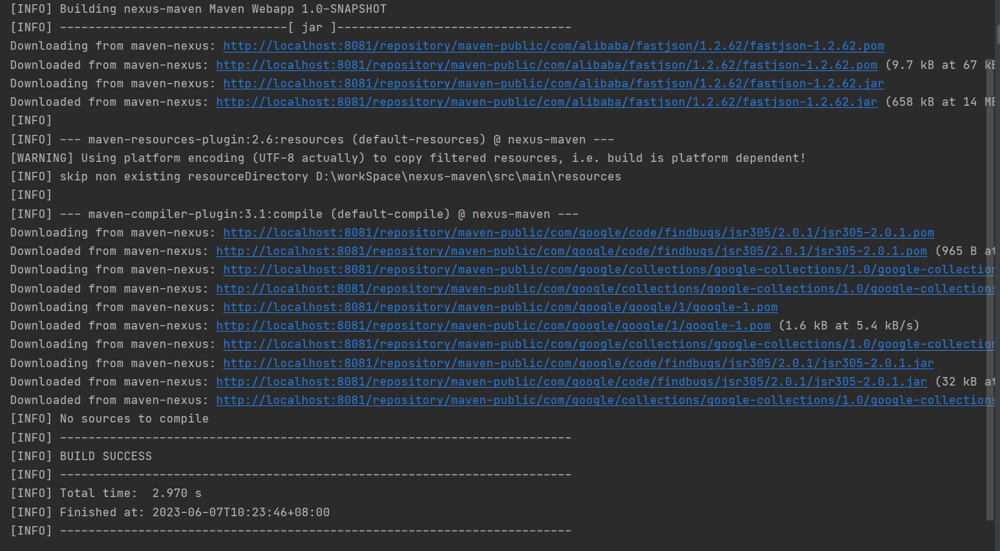

从结果看出：我们的依赖已经从我们私服maven-nexus中下载了。

### 镜像方式

镜像方式就不需要在pom文件中写多余的配置，主要是配置setting.xml文件

镜像配置：

```xml
<mirror>
  <id>maven-nexus</id>
  <mirrorOf>*</mirrorOf>
  <name>nexus镜像</name>
  <url>http://localhost:8081/repository/maven-public/</url>
</mirror>
```

server配置 

```xml
<server>
    <id>maven-nexus</id>
    <username>admin</username>
    <password>1e1e7335-e723-441b-9876-a986b53e4130</password>
</server>
```

注意：server的id和镜像的id配置一样。

然后pom文件删除之前的配置：

```xml
<?xml version="1.0" encoding="UTF-8"?>
  
<project xmlns="http://maven.apache.org/POM/4.0.0" xmlns:xsi="http://www.w3.org/2001/XMLSchema-instance"
  xsi:schemaLocation="http://maven.apache.org/POM/4.0.0 http://maven.apache.org/xsd/maven-4.0.0.xsd">
  <modelVersion>4.0.0</modelVersion>
  
  <groupId>com.nexus</groupId>
  <artifactId>nexus-maven</artifactId>
  <version>1.0-SNAPSHOT</version>
  
  <name>nexus-maven Maven Webapp</name>
  
  
  <dependencies>
    <dependency>
      <groupId>com.alibaba</groupId>
      <artifactId>fastjson</artifactId>
      <version>1.2.62</version>
    </dependency>
  </dependencies>
  
</project>
```

之前下载的本地仓库文件删掉，然后compile

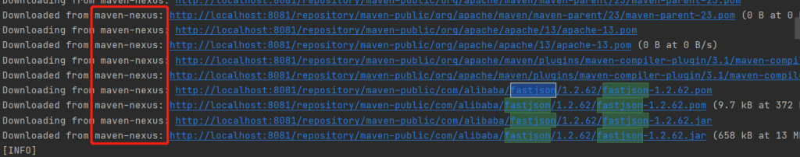

发现也是从我们配置的镜像去下载。

## 本地依赖发布到私服

### maven部署到nexus私服

一般创建maven项目时，会有pom文件，而Pom文件会有个version元素，这个是依赖的版本号。就拿我们刚刚创建的项目来讲

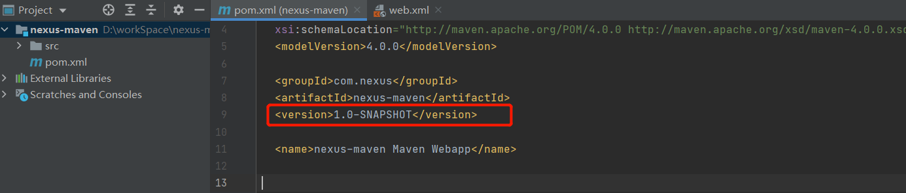

有一个**1.0-SNAPSHOT，**这个以**-SNAPSHOT**结尾的表示快照版本，叫做SNAPSHOT版本，快照版本一般不稳定，最后经过测试之后会发布一个稳定的版本，是不带SNAPSHOT后缀的。这个叫做release版本。

而nexus私服中存储用户的构建用的是宿主仓库，之前说过nexus私服提供了2个默认的宿主仓库分别用来存放SNAPSHOT版本和release版本。如下：

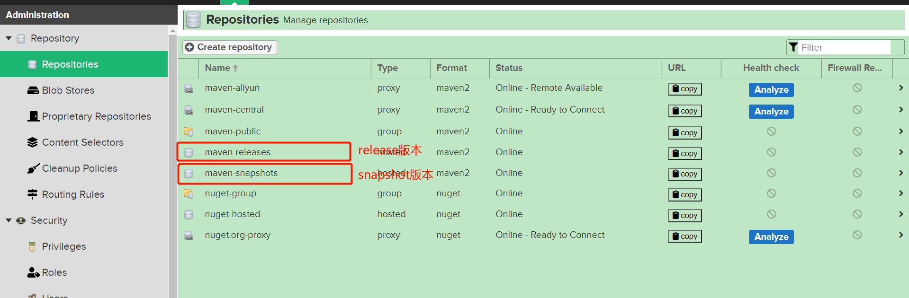

### 快照版本

**第一步：**在pom文件中添加如下：

```xml
<distributionManagement>
  <repository>
    <id>release-nexus</id>
    <url>http://localhost:8081/repository/maven-releases//</url>
    <name>nexus私服中宿主仓库->存放/下载稳定版本的构件</name>
  </repository>
  <snapshotRepository>
    <id>snapshot-nexus</id>
    <url>http://localhost:8081/repository/maven-snapshots/</url>
    <name>nexus私服中宿主仓库->存放/下载快照版本的构件</name>
  </snapshotRepository>
</distributionManagement>
```

**第二步：**settings.xml文件添加如下：

```xml
<server>
  <id>release-nexus</id>
  <username>admin</username>
  <password>1e1e7335-e723-441b-9876-a986b53e4130</password>
</server>
 
<server>
  <id>snapshot-nexus</id>
  <username>admin</username>
  <password>1e1e7335-e723-441b-9876-a986b53e4130</password>
</server>
```

**第三步：**执行 mvn deploy

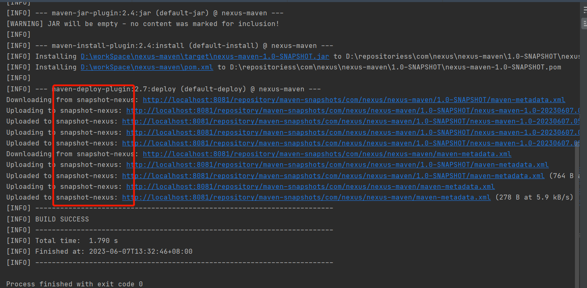

可以看到都上传到nexus的快照仓库中去了。

访问快照仓库的地址：http://localhost:8081/repository/maven-snapshots/

如下： 

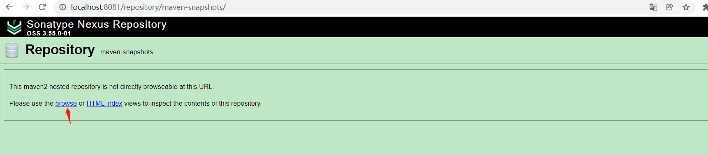

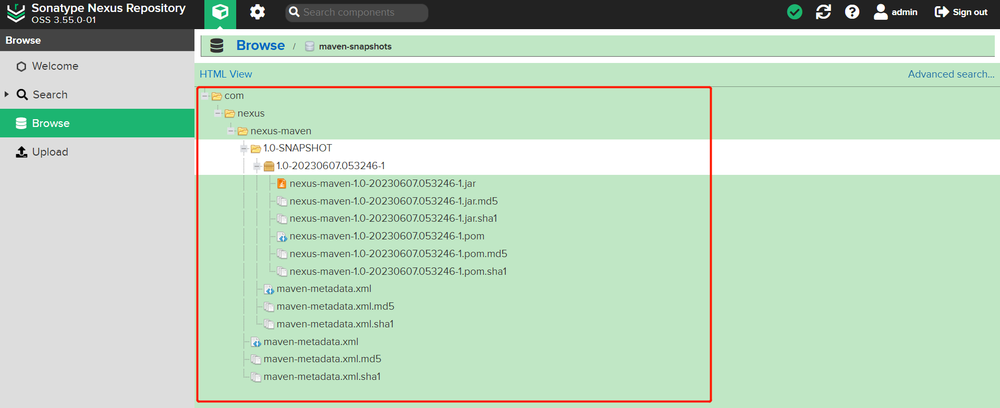

如果需要坐标地址：直接点击pom去获取

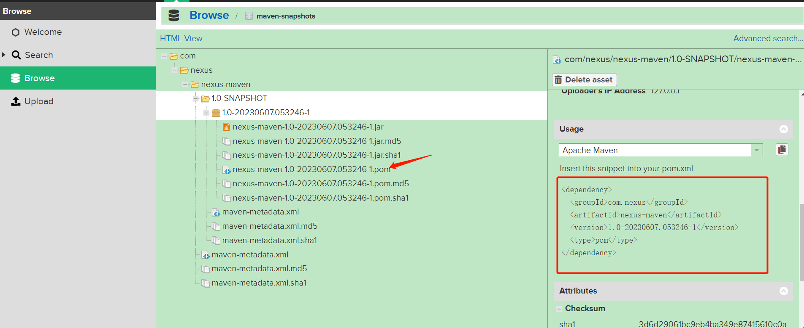

### release版本

修改pom.xml的版本号，将-SNAPSHOT去掉。如图

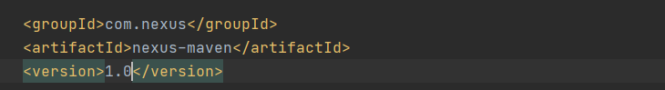

其它步骤和快照版本一样，只不过地址是：http://localhost:8081/repository/maven-releases/

 最后看结果

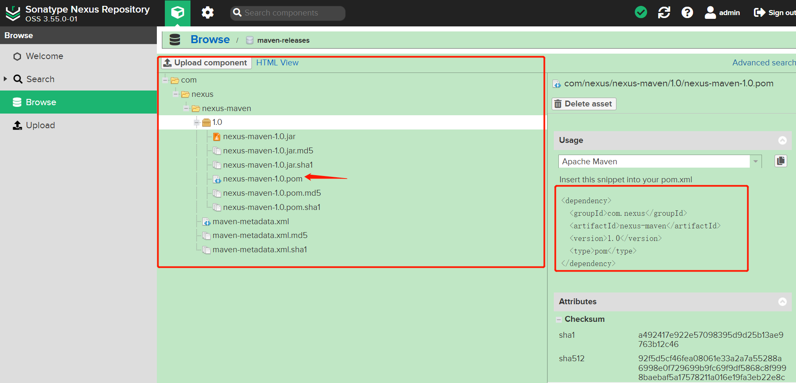

一样是成功了，上传到我们的release库中。

## 手动部署依赖到私服

 手动部署只支持release版本  

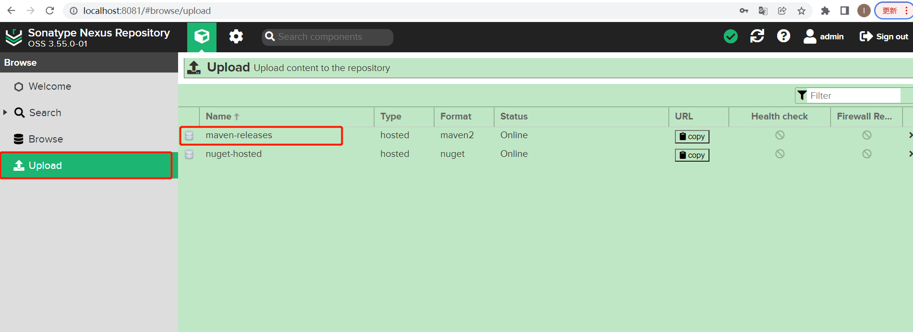

点击第一行：

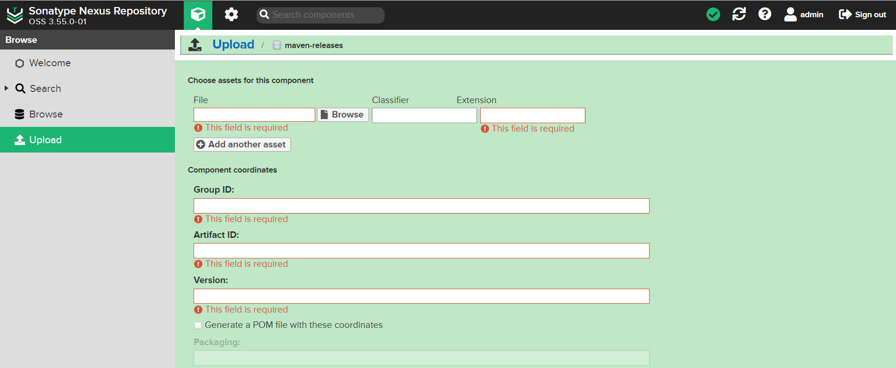

 填写对应信息：

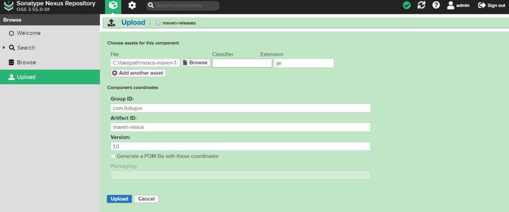

访问地址查看：http://localhost:8081/#browse/browse:maven-releases

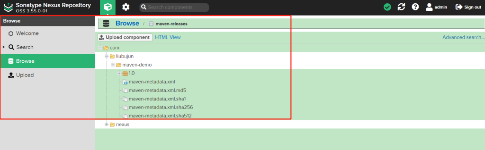

