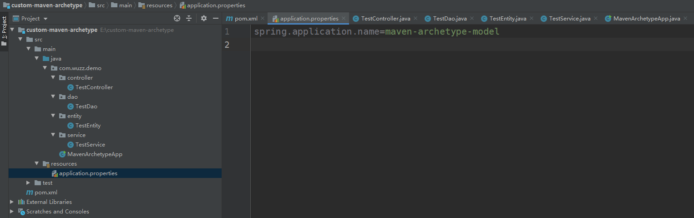
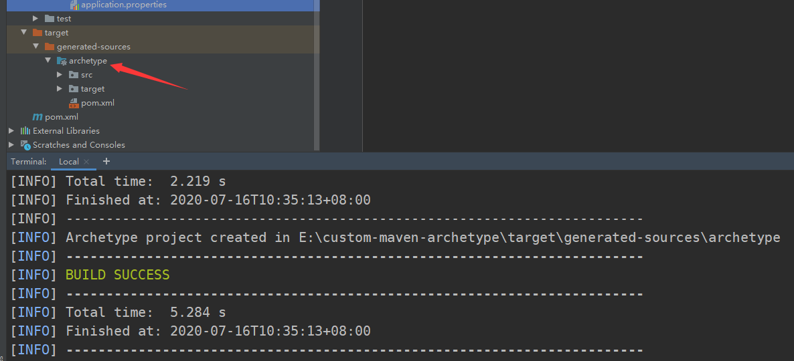
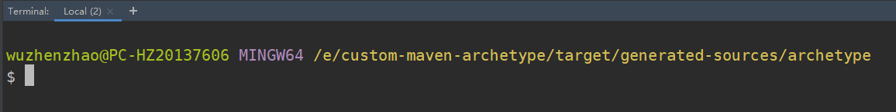
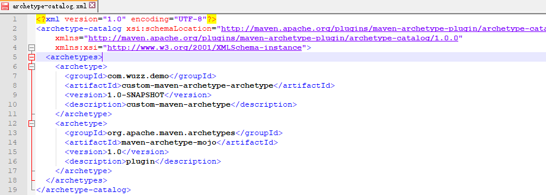
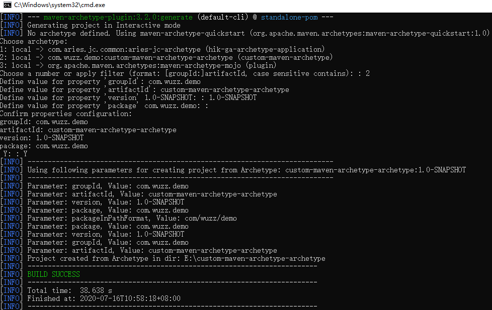
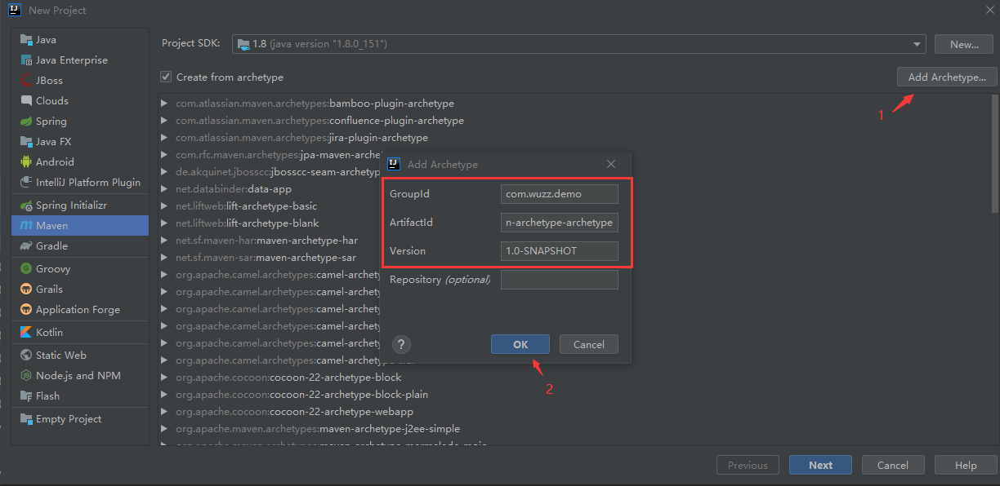
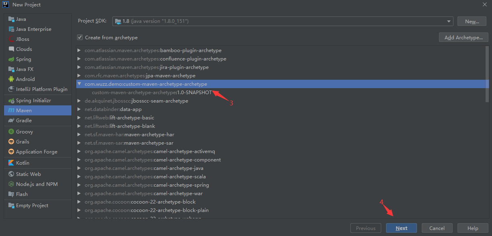

# 自定义archetype-01

　　Archetype 是一个 Maven 项目模板工具包。原型被定义为原始模式或模型，从中创建所有其他相同类型的东西。这些名称适合我们尝试提供一个系统，该系统提供生成Maven项目的一致方法。Archetype 将帮助作者为用户创建 Maven 项目模板，并为用户提供生成这些项目模板的参数化版本的方法。

　　技术成熟的公司基本都有自己的一套 Archetype ，接下来我们就来实践一下，怎么定义出自己的 Archetype 。

1.创建一个maven工程为 archetype 的模板生成作准备。结构如下：

2. 到项目根目录下执行(pom.xml同级目录) ，执行 mvn archetype:create-from-project ，执行成功后会在项目target下生成这些文件:

3.先进入到  target/generated-sources/archetype/ 目录里面。如下图：

4.然后执行  mvn  install .执行成功后，执行   mvn archetype:crawl  命令，在本地仓库的根目录生成`archetype-catalog.xml`骨架配置文件:

　　由于每个人的 maven 仓库不一样，所以这里打出来的文件里可能又多个，也有可能只有一个。不过只要保证 自己的哪个骨架模板在里面就行。

5.使用archetype模板

　　1.执行`mvn archetype:generate -DarchetypeCatalog=local`从本地archeType模板中创建项目。然后会让你选择模板序号和`groupId、artifactId、version`和`package`信息：

　　然后打开对应的工程可以发现结构、内容都是跟之前生成这个 archetype 的工程是一摸一样的。

　　2.使用IDEA来帮我们用图形界面使用archeType模板创建项目

 

　　注意：在properites下加一行：archetypeCatalog = internal，其中internal用来指定archetype-catalog.xml文件从哪里获取,为可选值为：remote，internal ，local等，默认remote远程下载，非常慢，我们这里模板在本地，所以修改成本地。

　　这样就完成了 maven archetype 的制作了。

  

本文转自 [https://www.cnblogs.com/wuzhenzhao/p/13307436.html](https://www.cnblogs.com/wuzhenzhao/p/13307436.html)，如有侵权，请联系删除。