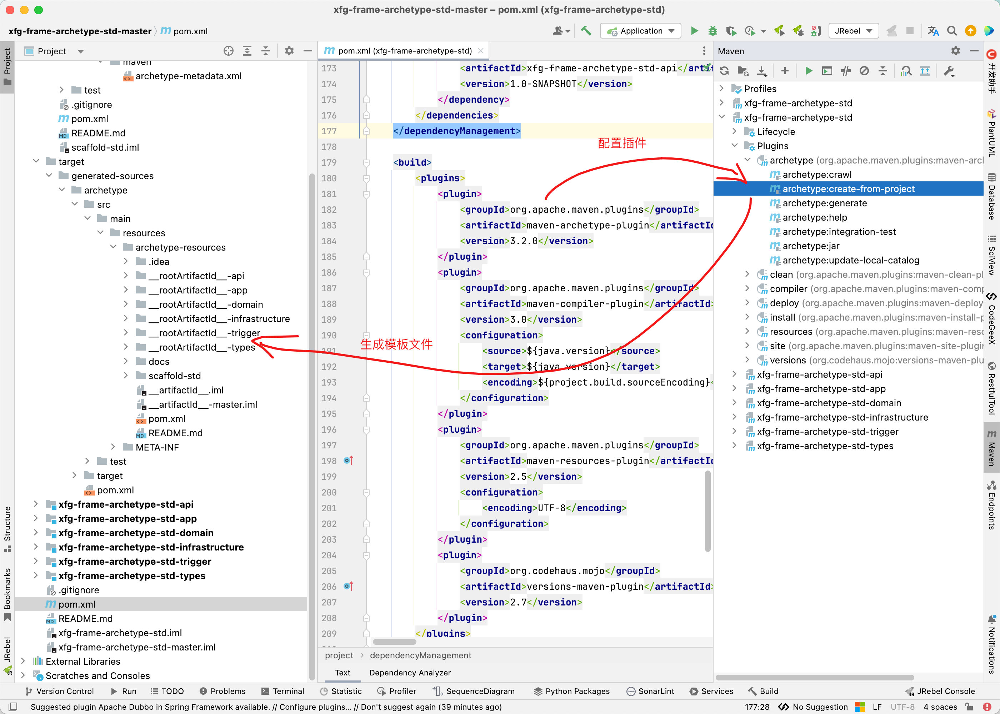
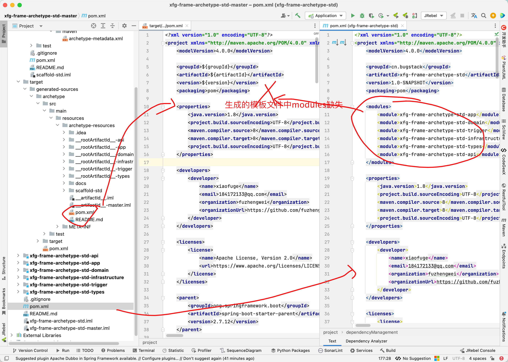

# 自定义archetype-02-插件

## 配置插件生成模板文件

```xml
<plugin>
    <groupId>org.apache.maven.plugins</groupId>
    <artifactId>maven-archetype-plugin</artifactId>
    <version>3.2.0</version>
</plugin>
```




## 修改父pom

首先，找到根目录的`pom`文件，会发现缺少module信息，这个必须加上。



```xml
<modules>
    <module>${rootArtifactId}-api</module>
    <module>${rootArtifactId}-app</module>
    <module>${rootArtifactId}-domain</module>
    <module>${rootArtifactId}-trigger</module>
    <module>${rootArtifactId}-infrastructure</module>
    <module>${rootArtifactId}-types</module>
</modules>
```

父pom依赖引用的每个module也要修改，groupId 和 artifactId 按照我给出的方式来改

```
 <dependencyManagement>
  <dependencies>
   <dependency>
    <groupId>${groupId}</groupId>
    <artifactId>${rootArtifactId}-client</artifactId>
    <version>${project.version}</version>
   </dependency>
   ... ...
  </dependencies>
 </dependencyManagement>
```

去除插件

```xml
<plugin>
    <groupId>org.apache.maven.plugins</groupId>
    <artifactId>maven-archetype-plugin</artifactId>
    <version>3.2.0</version>
</plugin>
```

## 修改module

然后module中的互相引用 groupId 和 artifactId 按照父 pom 的方式对应修改。

```xml
<build>
    <finalName>xfg-frame-archetype-std-api</finalName>
    <plugins>
```

改为

```xml
<build>
    <finalName>${rootArtifactId}-api</finalName>
    <plugins>
```

## archetype-metadata 修改

找到`META-INF/maven/archetype-metadata.xml`文件，修改modules相关的部分，重点注意看 id 、dir、name 的修改方式

`__gitignore__`文件修改

修改完成之后，进入 `target/generated-sources/archetype`目录，执行命令：`mvn install`顺便执行下`mvn deploy`上传到nexus。

