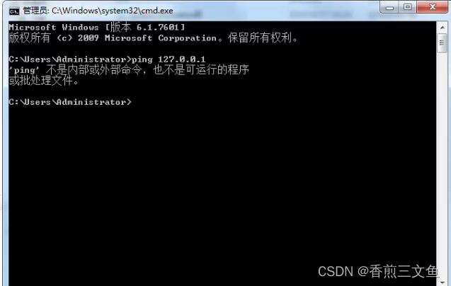
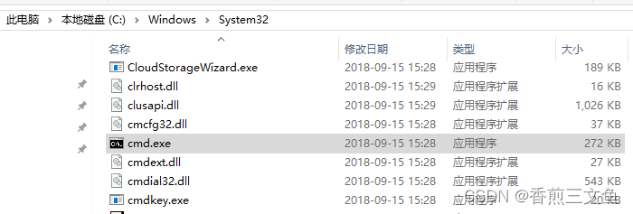
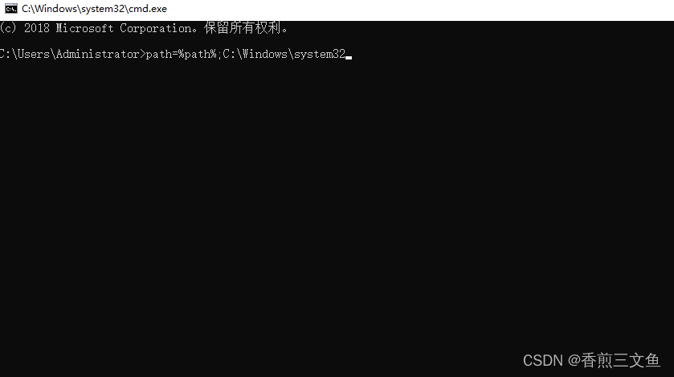

# CMD--不是内部或外部命令

>  执行cmd命令提示不是内部或外部命令

有时我们在执行[cmd](https://so.csdn.net/so/search?q=cmd&spm=1001.2101.3001.7020)命令会提示不是内部或外部命令，也不是可运行的程序

注册文件时一闪而过可以在bat文件中添加一行代码 pause，用于输出错误信息

## 解决方案

## 第一种方法

找到C:\Windows\System32路径下的cmd。可直接使用这个cmd执行命令

## 第二种方法

使用“WIN+R”快捷键调出运行框，输入cmd， 在DOS界面，输入 path=%path%;C:\Windows\system32 然后回车，注释：前面是保留原来的意思，然后添加上system32目录。
然后就可以了

https://blog.csdn.net/qq_39569480/article/details/125044697