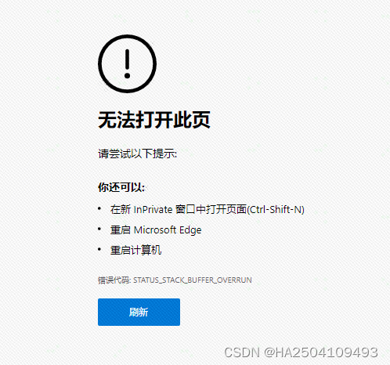

# 浏览器--内存溢出

https://blog.csdn.net/HA2504109493/article/details/130597104

[Edge浏览器](https://so.csdn.net/so/search?q=Edge浏览器&spm=1001.2101.3001.7020)报错：STATUS STACK BUFFER OVERRUN

通过一些方式可以解决，亲测有效。

1. 单击开始菜单选择“设置”，进入到设置后选择“更新和安全”；
2. 打开系统后选择“windows安全中心”，并在右侧选择“打开windows安全中心”；
3. 点击左侧应用和浏览器控制；并在右侧选择“Exploit protection设置”；
4. 进入后，在程序设置下面添加程序进行自定义；
5. 按程序名称添加（edge浏览器就输入msedge.exe 谷歌浏览器就输入chrome.exe 其他操作一样）；
6. 找到硬件强制保护 勾上--替代系统设置 打开 仅审核 ；
7. 请开始使用Edge浏览器

