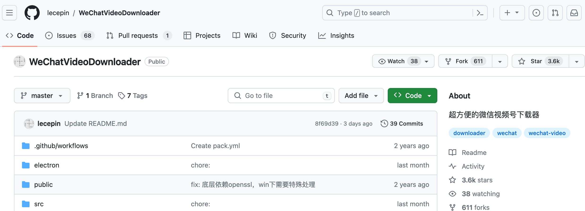
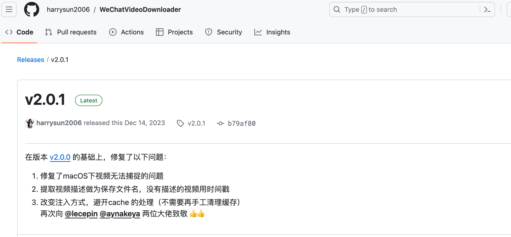
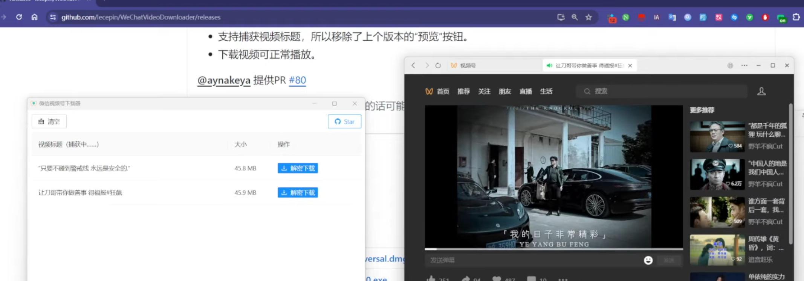
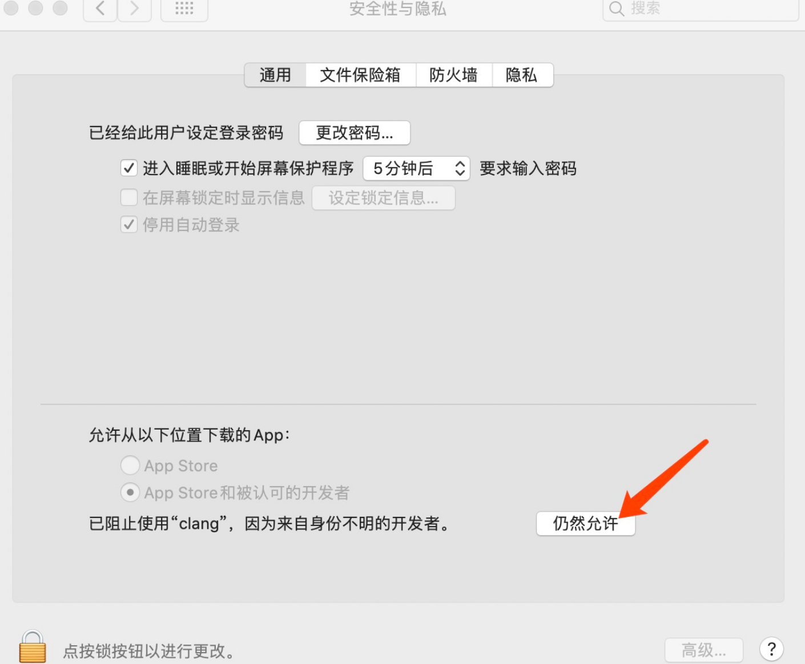
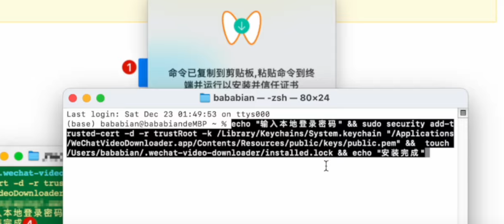
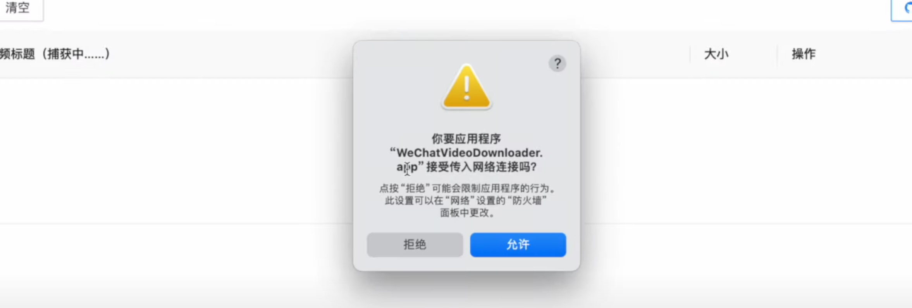
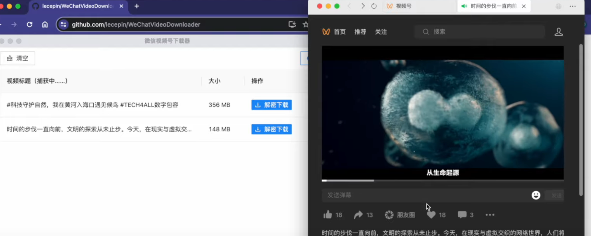

# 下载微信视频号视频--0

https://github.com/lecepin/WeChatVideoDownloader

> Mac版本的v2.0版本没办法检测出视频，网友发布的v2.0.1版本可以使用，但有些许瑕疵

https://github.com/harrysun2006/WeChatVideoDownloader/releases/tag/v2.0.1

## window版本

下载 v2.0的即可

## Mac演示

