# nvm--安装

## Mac安装NVM

`NVM（Node Version Manager）`是一个用于在基于Linux系统上安装和管理`Node.js`的shell脚本。macOS用户可以使用`homebrew`来安装

> 前提条件 在macOS上使用安装`homebrew`

```
/bin/bash -c "$(curl -fsSL https:/raw.githubusercontent.com/Homebrew/install/HEAD/install.sh)"
```

[具体可参考官网](https://link.juejin.cn/?target=https%3A%2F%2Fbrew.sh%2F "https://brew.sh/")

### 第一步:删除现有Node版本

如果你的系统已经安装了node，请先卸载它。我的系统已经通过Homebrew安装了node。所以先把它卸载了。如果还没有安装就跳过。

```bash
brew uninstall --ignore-dependencies node 
brew uninstall --force node 
```

> 方式二：自己卸载自己

查看nodejs版本：

```bash
node -v
```

nodejs npm卸载：

```bash
sudo npm uninstall npm -g
sudo rm -rf /usr/local/lib/node /usr/local/lib/node_modules /var/db/receipts/org.nodejs.*
sudo rm -rf /usr/local/include/node /Users/$USER/.npm
sudo rm /usr/local/bin/node
sudo rm /usr/local/share/man/man1/node.1
sudo rm /usr/local/lib/dtrace/node.d
```

验证是否删除成功：  
执行下面命令，查找不到，证明删除成功。

```bash
node -v
// -bash: /usr/local/bin/node: No such file or directory
npm -v
// -bash: /usr/local/bin/npm: No such file or directory
```


### 第二步:在Mac上安装NVM

现在，你的系统已经准备好了，可以进行安装。更新Homebrew软件包列表并安装NVM。

```bash
brew update 
brew install nvm
```

接下来，在home目录中为NVM创建一个文件夹。

```bash
mkdir ~/.nvm 
```

现在，配置所需的环境变量。在你的home中编辑以下配置文件

```bash
vim ~/.bash_profile 
```

然后，在 `~/.bash_profile`（或`~/.zshrc`，用于macOS Catalina或更高版本）中添加以下几行

```bash
export NVM_DIR=~/.nvm
source $(brew --prefix nvm)/nvm.sh
```

按ESC + `:wq` 保存并关闭你的文件。 接下来，将该变量加载到当前的shell环境中。在下一次登录，它将自动加载。

```
source ~/.bash_profile
```

NVM已经安装在你的macOS系统上。 下一步，在nvm的帮助下安装你需要的Node.js版本即可。

### 第三步 : 用NVM安装Node.js

首先，看看有哪些Node版本可以安装。要查看可用的版本，请输入。

```bash
nvm ls-remote 
```

现在，你可以安装上述输出中列出的任何版本。你也可以使用别名，如node代表最新版本，lts代表最新的LTS版本，等等。

```bash
nvm install node     ## 安装最后一个长期支持版本
nvm install 10
```

安装后，你可以用以下方法来验证所安装的node.js是否安装成功。

```bash
nvm ls 
```

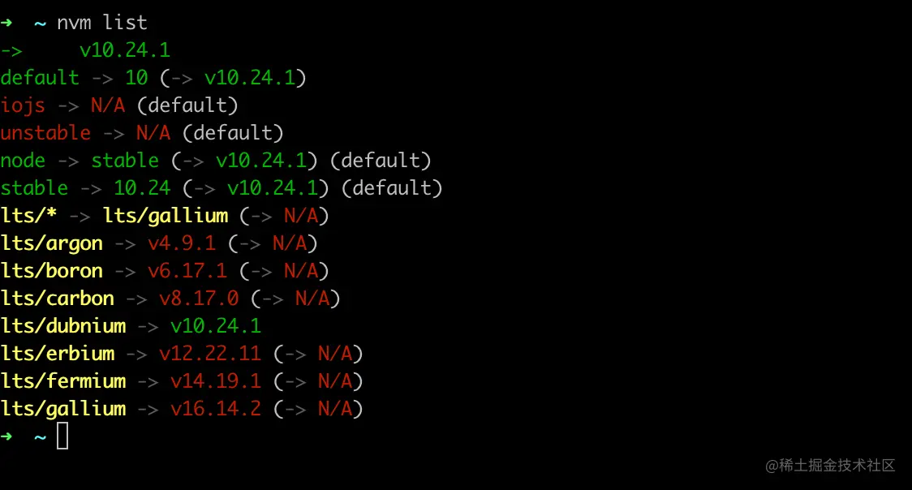

## Windows安装nvm

[参考文章](https://www.freecodecamp.org/news/nvm-for-windows-how-to-download-and-install-node-version-manager-in-windows-10/)

Windows 没有“NVM”，因为 NVM 仅在 Linux 和 Mac 上受支持。

Windows 计算机上使用的是`nvm-windows`。 nvm-windows 与 NVM 类似，但又不完全相同。

**注意**：如果您已经安装了 Node.js，则需要将其卸载，这样在使用不同版本的 Node 并从 NPM 注册表安装包时才不会导致错误。

之后重新启动 PC，打开命令提示符或 PowerShell，然后运行`node -v`以确认 Node 已卸载。

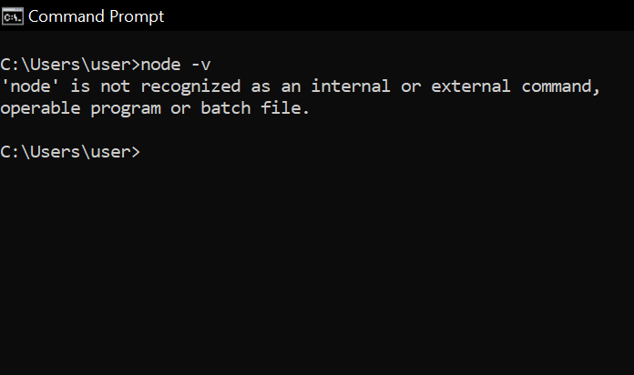

另外，如果安装了yarn，请将其卸载并在安装NVM后重新安装。`npm install -g yarn`

您不希望在安装和使用 NPM 注册表中的包时出现奇怪的错误。

### 请按照以下步骤下载 nvm-windows

**第 1 步**：前往[nvm-windows 存储库](https://github.com/coreybutler/nvm-windows#installation--upgrades)并单击立即下载！

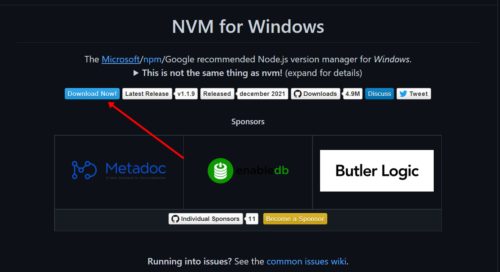

您将被带到包含不同版本的 nvm-windows 的页面。

**步骤2**：点击最新版本进行下载。目前是2022年4月28日版本。

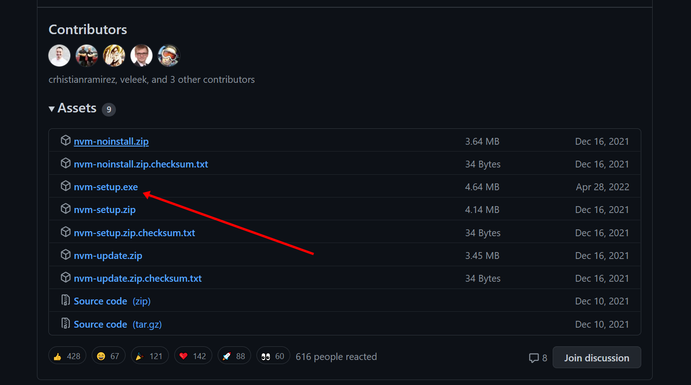

**步骤 3**：在计算机上找到安装程序并将其打开。按照安装向导进行安装。

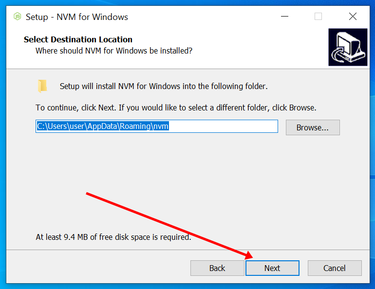

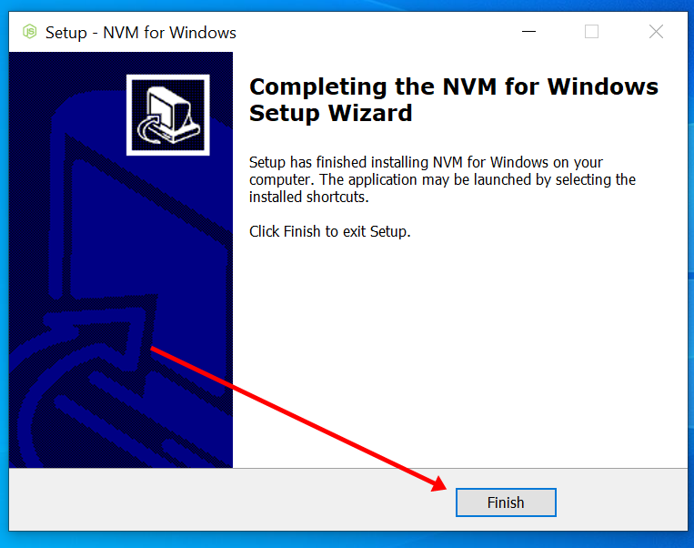


**步骤 4**：打开 PowerShell 或命令提示符并运行`nvm -v`以确认安装。

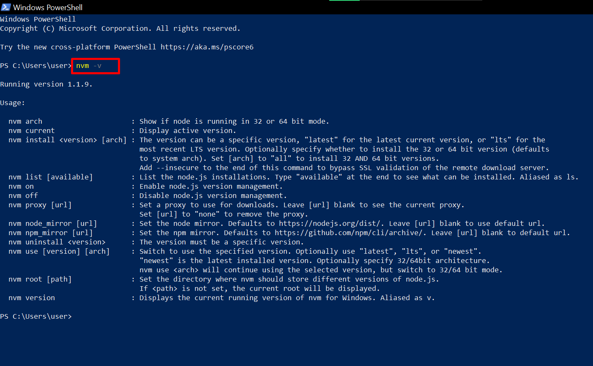

如果您收到与上面相同的消息，则 nvm-windows 已成功安装。恭喜！


环境变量检查

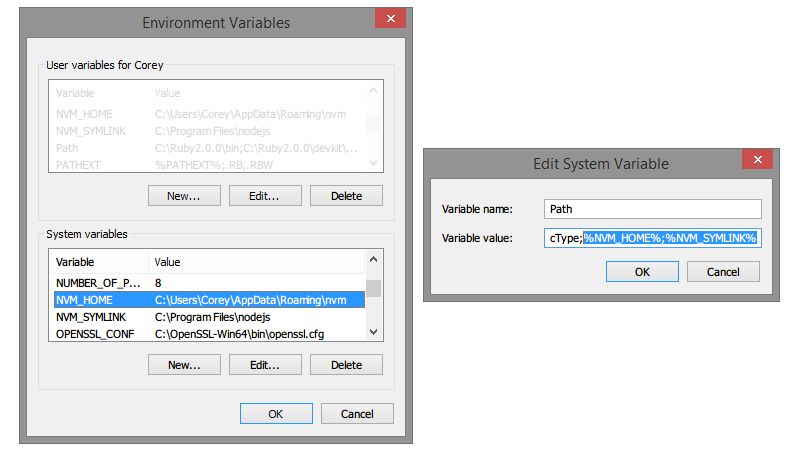

## nvm的基本使用

### mac中使用命令

https://gist.github.com/chranderson/b0a02781c232f170db634b40c97ff455

```js
// check version
node -v || node --version

// list locally installed versions of node
nvm ls

// list remove available versions of node
nvm ls-remote

// install specific version of node
nvm install 18.16.1

// set default version of node
nvm alias default 18.16.1

// switch version of node
nvm use 20.5.1

// install latest LTS version of node (Long Term Support)
nvm install --lts

// install latest stable version of node
nvm install stable
```


### windows中使用命令

```js
// check version
node -v || node --version

// list locally installed versions of node
nvm list
// list remove available versions of node
nvm list available

// set default version of node
nvm alias default 18.16.1

// switch version of node
nvm use 20.5.1
nvm use lts
nvm use latest

// install specific version of node
nvm install 18.16.1
// install latest LTS version of node (Long Term Support)
nvm install lts
// install latest stable version of node
nvm install stable
```


要使用 NVM，您需要以管理员身份打开 PowerShell 或命令提示符。您还可以使用 Git bash。

要以管理员身份打开 PowerShell，请右键单击“开始”并选择“PowerShell（管理员）”。

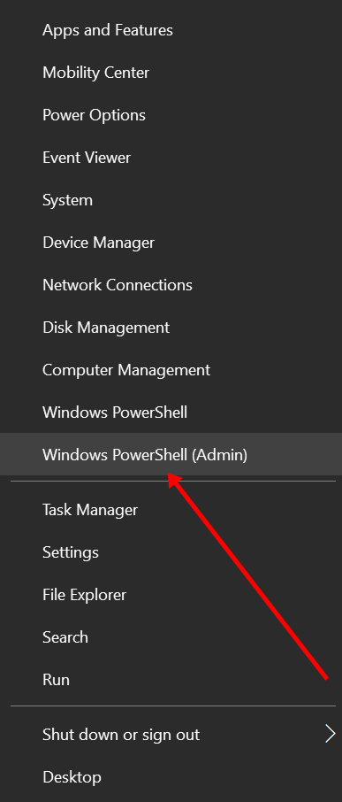

要以管理员身份打开命令提示符，请搜索“cmd”并选择右侧的“以管理员身份打开”。

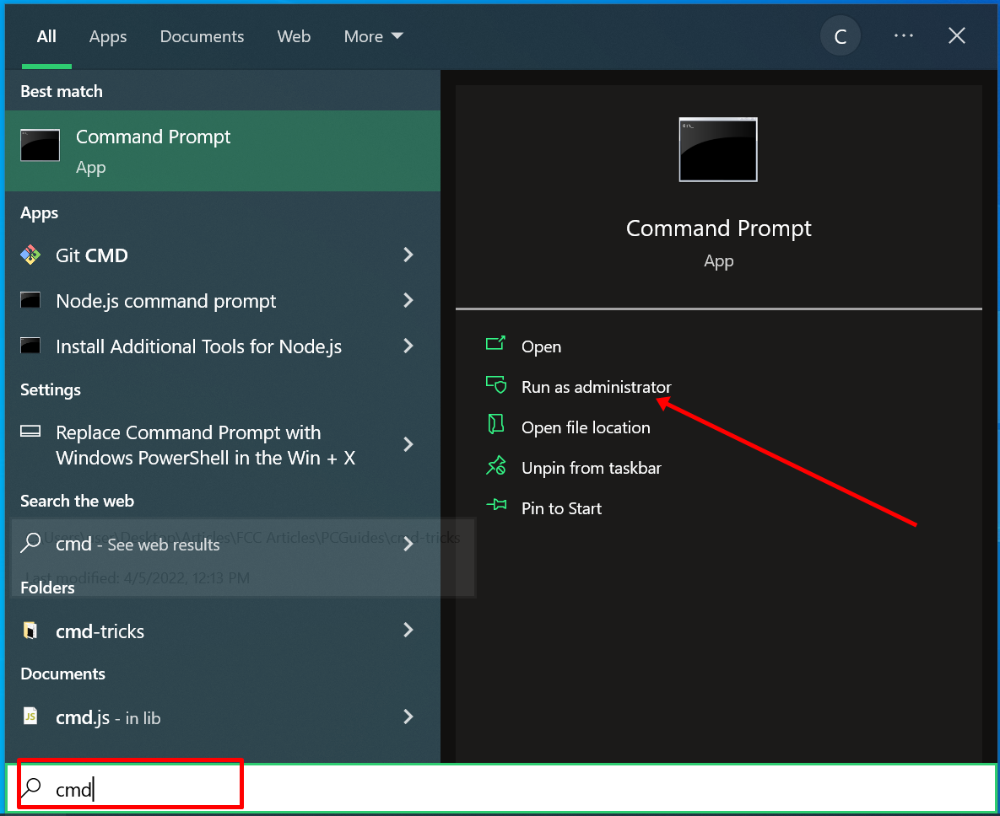

要安装最新版本的 Node，请运行`nvm install latest`.

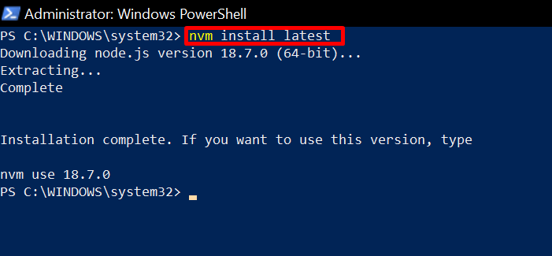

安装 Node 的长期支持 (LTS) 版本总是更好，因为它的错误较少。


要安装 Node 的 LTS 版本，请运行`nvm install lts`.

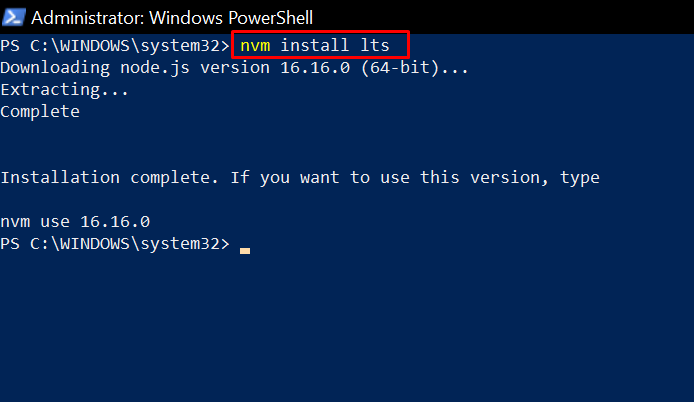

要安装特定版本的 Node，您需要`nvm list available`先运行，以便可以看到可用的 Node 版本。

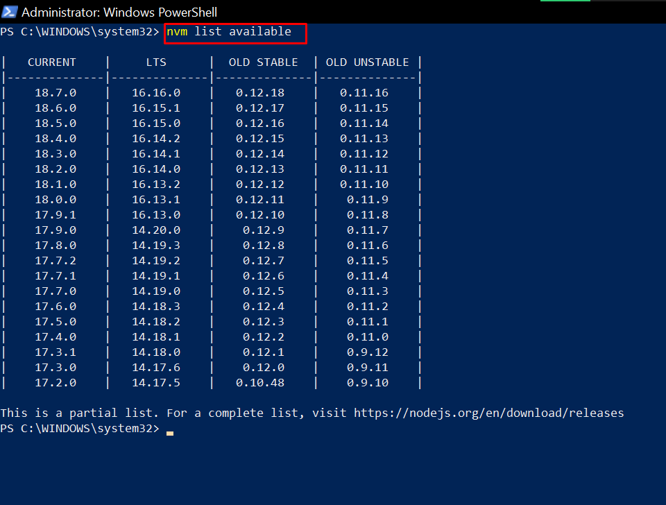

要安装该特定版本，请运行`nvm install node-version-number`.例如，`nvm install 14.20.0`。

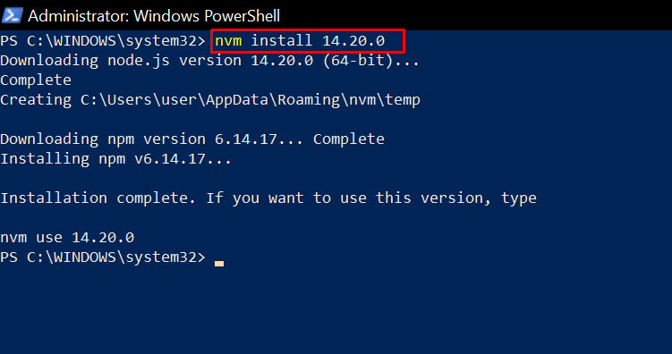

**注意**：一旦安装了 Node 版本，就会为您安装相应版本的 NPM。所以不需要单独安装NPM。

如果您要使用的 NPM 版本不可用，请运行`npm install @npm version-number -g`安装它。

现在，要查看 Windows 计算机上安装的 Node 版本列表，请运行`nvm list`。

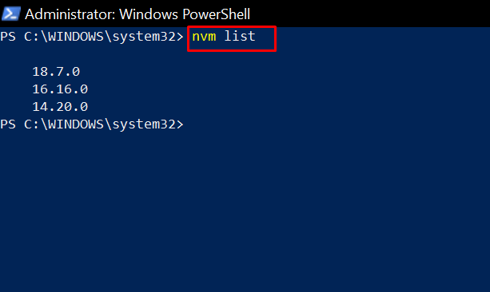

要使用特定版本的 Node，请运行：

- `nvm use latest`使用最新版本
- `nvm use lts`使用长期支持版本
- `nvm use version-number`使用您已安装的任何其他版本

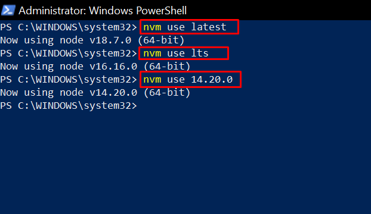


### 配置文件

在项目根目录下维护`.nvmrc`文件，使用`nvm use`

> *.nvmrc*

```shell
v12.22.12
```

