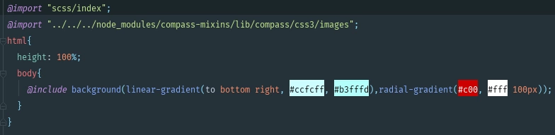

# 配置--sass混合器

https://blog.csdn.net/qq_36711388/article/details/109184469

```js
npm install normallize.css --save
npm install node-sass sass-loader --save-dev
npm install compass-mixins --save-dev
```




```js
exports.cssLoaders = function (options) {
   
  ...
  return {
   
    ...
    // 将sass和scss修改为如下
    sass: generateLoaders('sass', {
    indentedSyntax: true, includePaths: [path.resolve(__dirname, '../node_modules/compass-mixins/lib')] }),
    scss: generateLoaders('sass', {
    includePaths: [path.resolve(__dirname, '../node_modules/compass-mixins/lib')] }),
    ...
  }
}
```

