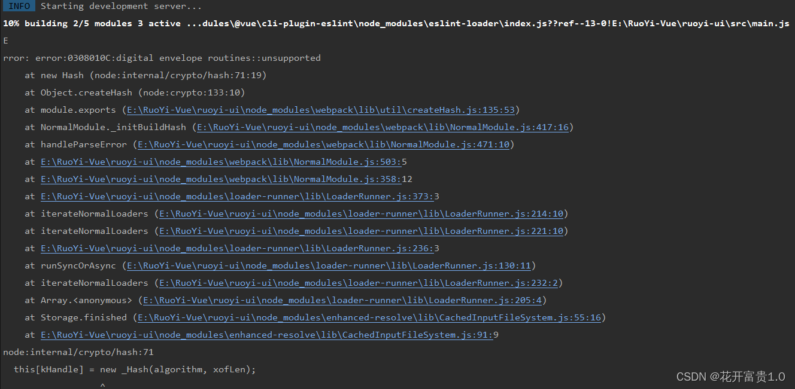

# 问题集--无法run build

> 问题

 **报错：`Error: error:0308010C:digital envelope routines::unsupported`**

> 原因

**因为 `node.js V17`版本中最近发布的`OpenSSL3.0`, 而`OpenSSL3.0`对允许算法和密钥大小增加了严格的限制**

> 报错详细信息：




**解决方案:** 

> 方案1：打开IDEA 终端，直接输入

Linux & Mac OS：

```js
export NODE_OPTIONS=--openssl-legacy-provider
```

Windows：

```js
set NODE_OPTIONS=--openssl-legacy-provider
```

> **方案2：打开IDEA 终端，直接输入（问题解决）**

```js
$env:NODE_OPTIONS="--openssl-legacy-provider"
```

> 方案3：卸载Node.js17+版本，安装Node.js17-版本


