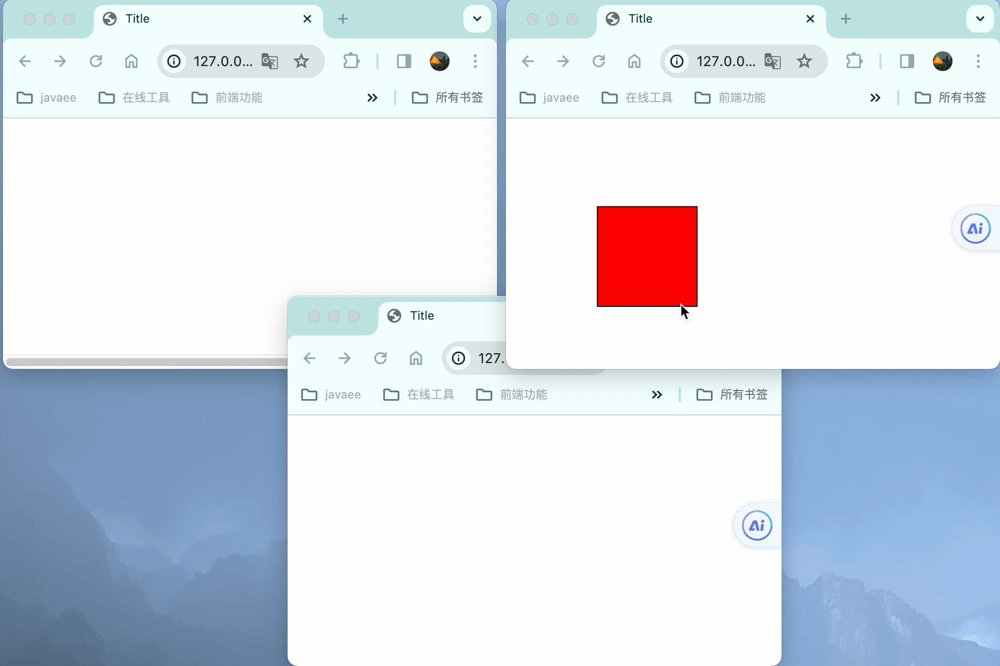
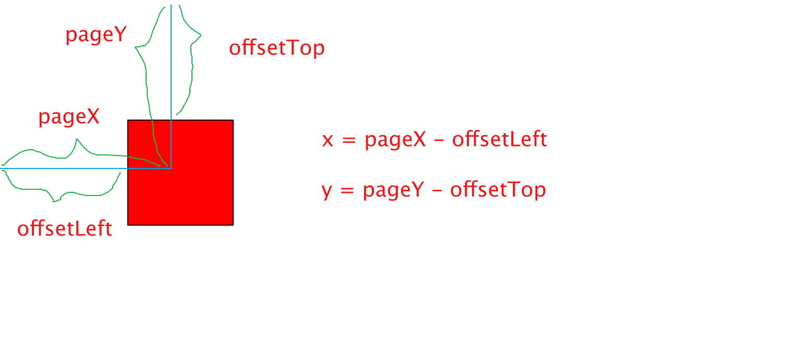
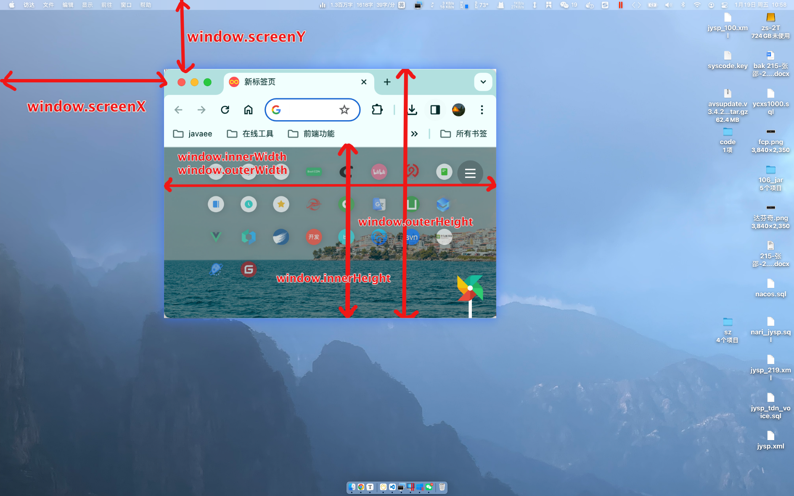
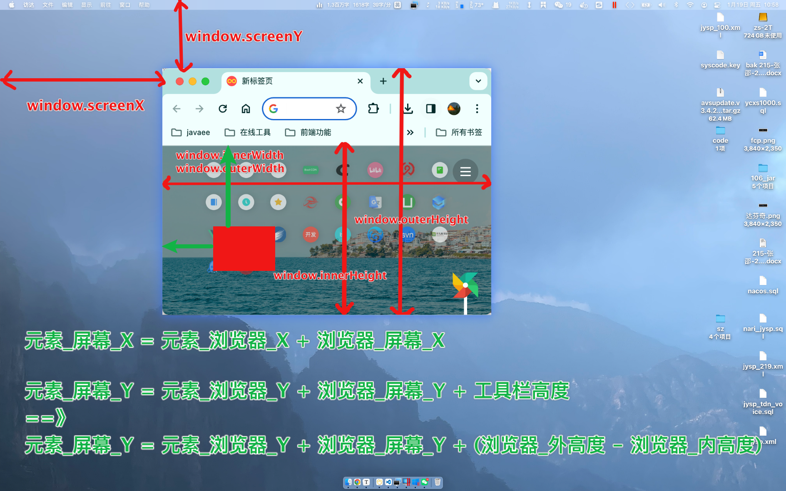

# html--0.魔术卡片



## 核心原理：屏幕坐标和窗口通信



## 元素移动

### 元素在浏览器中坐标

元素左上角在浏览器中的坐标

`offsetLeft` `offsetTop`

```js
const card = document.querySelector('.card');
card.offsetLeft;
card.offsetTop;
```

### 鼠标在浏览器中坐标

获取被点击元素，鼠标距离浏览器窗口的坐标

`pageX` `pageY`

```js
const card = document.querySelector('.card');
card.onmousedown = (e) => {
    //鼠标点击位置：浏览器窗口坐标
    e.pageX
    e.pageY
}
```

### 计算鼠标在元素中坐标

鼠标在元素中坐标 = 浏览器坐标 - 元素坐标

```js
const card = document.querySelector('.card');
card.onmousedown = (e) => {
    //浏览器窗口中的坐标
    let x = e.pageX - card.offsetLeft;
    let y = e.pageY - card.offsetTop;
}
```

### 元素移动-->计算元素在浏览器中坐标

> 元素移动时
>
> 改变元素的绝对定位：left、top属性
>
> 核心原理：元素坐标 = 鼠标浏览器坐标 - 鼠标元素中坐标
>
> 具体步骤：
>
> （1）鼠标按下时：
> 		计算出：鼠标在元素中的坐标
>
> （2）鼠标移动时：
>
> ​		元素坐标 = 鼠标浏览器坐标 - 鼠标在元素中坐标
>
> （3）鼠标抬起
>
> ​		取消：按下、移动 的事件

```js
card.onmousedown = (e) => {
    //浏览器窗口中的坐标
    let x = e.pageX - card.offsetLeft;
    let y = e.pageY - card.offsetTop;

    window.onmousemove = (e) => {
        const cx = e.pageX - x;
        const cy = e.pageY - y;
        card.style.left = cx + 'px';
        card.style.top = cy + 'px';
    };

    window.onmouseup = () => {
        window.onmousemove = null;
        window.onmouseup = null;
    };
}
```

## 浏览器在屏幕中坐标



> 获取浏览器窗口在屏幕中的坐标

```js
// api一
window.screenX
window.screenY

// api二
window.screenLeft
window.screenTop
```

> 窗口可视区域大小

```js
var windowInnerWidth = window.innerWidth;
var windowInnerHeight = window.innerHeight;
console.log("浏览器窗口内部宽度" + windowInnerWidth);
console.log("浏览器窗口内部高度" + windowInnerHeight);

var windowWidth = window.outerWidth;
var windowHeight = window.outerHeight;
console.log("浏览器窗口宽度：" + windowWidth);
console.log("浏览器窗口高度：" + windowHeight);
```


### 元素浏览器坐标<==>元素屏幕坐标



> 元素浏览器坐标==>元素屏幕坐标
>
> `元素_屏幕_X = 元素_浏览器_X + 浏览器_屏幕_X`
>
> `元素_屏幕_Y = 元素_浏览器_Y + 浏览器_屏幕_Y + 工具栏高度`
> 推导出==》
> `元素_屏幕_Y = 元素_浏览器_Y + 浏览器_屏幕_Y + (浏览器_外高度 - 浏览器_内高度)`

```js
function getScreenPoint(clientX, clientY) {
    //元素_屏幕_X = 元素_浏览器_X + 浏览器_屏幕_X
    const screenX = clientX + window.screenX;
    //元素_屏幕_Y = 元素_浏览器_Y + 浏览器_屏幕_Y + (浏览器_外高度 - 浏览器_内高度)
    const screenY = clientY + window.screenY + (window.outerHeight - window.innerHeight);
    return [screenX, screenY];
}
```

> 元素浏览器坐标<==元素屏幕坐标
>
> 同理换算可得
>
> `元素_浏览器_X = 元素_屏幕_X - 浏览器_屏幕_X`
>
> `元素_浏览器_Y = 元素_屏幕_Y - 浏览器_屏幕_Y - (浏览器_外高度 - 浏览器_内高度)`

```js
function getClientPoint(screenX, screenY) {
    //元素_浏览器_X = 元素_屏幕_X - 浏览器_屏幕_X
    const clientX = screenX - window.screenX;
    //元素_浏览器_Y = 元素_屏幕_Y - 浏览器_屏幕_Y - (浏览器_外高度 - 浏览器_内高度)
    const clientY = screenY - window.screenY - (window.outerHeight - window.innerHeight);
    return [clientX, clientY];
}
```


## 窗口通信

```js
//订阅|创建
const channel = new BroadcastChannel('card');

//发送
channel.postMessage(getScreenPoint(cx, cy));
//接收
channel.onmessage = (e) => {
    const [cx, cy] = getClientPoint(...e.data);
    card.style.left = cx + 'px';
    card.style.top = cy + 'px';
}
```

## 代码实现

```html
<!DOCTYPE html>
<html lang="en">
<head>
    <meta charset="UTF-8">
    <title>Title</title>

    <link rel="stylesheet" href="./style.css">
    <style>
        .card {
            background-color: red;
            width: 100px;
            height: 100px;
            border: 1px solid #000000;
            display: flex;
            position: absolute;
            left: 0px;
            top: 0px;
        }
    </style>
</head>
<body>

<!--卡片-->
<div class="card"></div>

<!--实现-->
<script src="./index.js"></script>
</body>
</html>
```

```js
const card = document.querySelector('.card');

card.onmousedown = (e) => {
    //浏览器窗口中的坐标
    let x = e.pageX - card.offsetLeft;
    let y = e.pageY - card.offsetTop;

    window.onmousemove = (e) => {
        const cx = e.pageX - x;
        const cy = e.pageY - y;
        card.style.left = cx + 'px';
        card.style.top = cy + 'px';

        channel.postMessage(getScreenPoint(cx, cy));
    };

    window.onmouseup = () => {
        window.onmousemove = null;
        window.onmouseup = null;
    };
}

function init() {
    if (location.search.includes('hidden')) {
        card.style.left = '-1000px';
    }
}

init();

function getClientPoint(screenX, screenY) {
    const clientX = screenX - window.screenX;
    const clientY = screenY - window.screenY - (window.outerHeight - window.innerHeight);
    return [clientX, clientY];
}

function getScreenPoint(clientX, clientY) {
    const screenX = clientX + window.screenX;
    const screenY = clientY + window.screenY +  (window.outerHeight - window.innerHeight);
    return [screenX, screenY];
}

const channel = new BroadcastChannel('card');


channel.onmessage = (e) => {
    const [cx, cy] = getClientPoint(...e.data);
    card.style.left = cx + 'px';
    card.style.top = cy + 'px';
}

```

