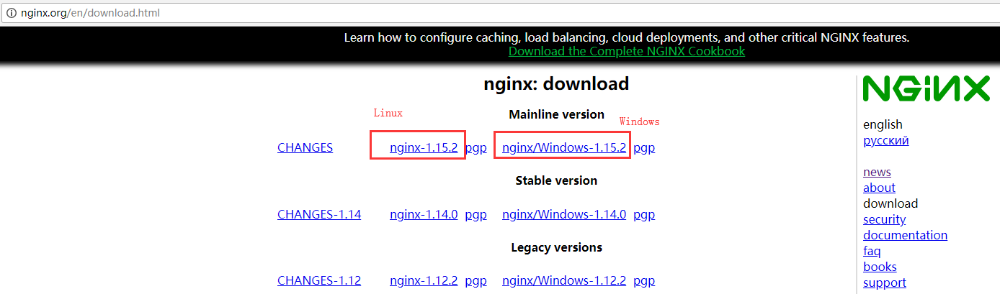
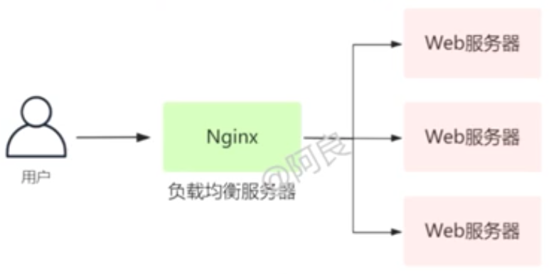
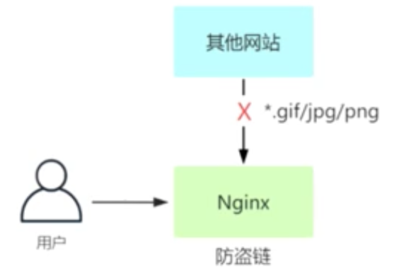
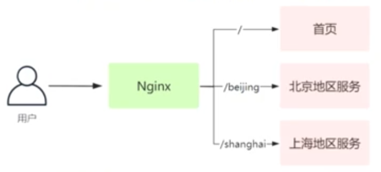
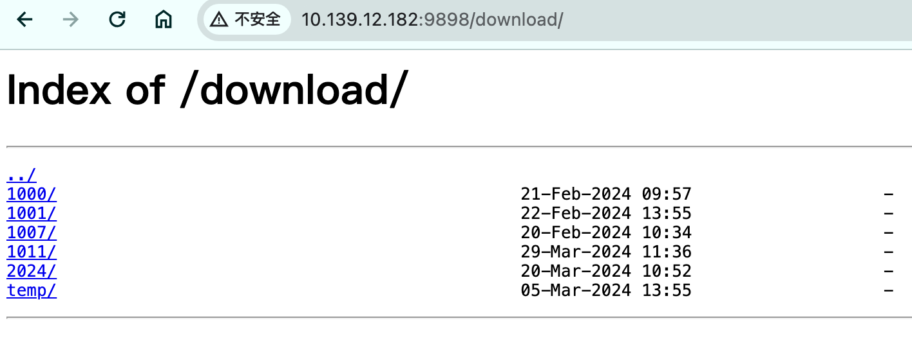
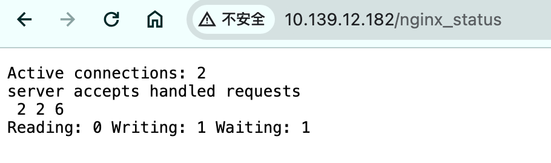
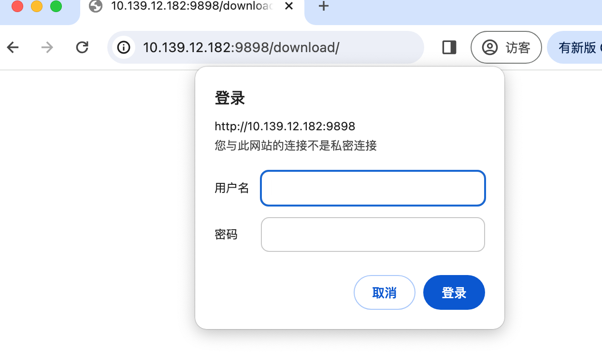

# 常用配置

https://www.digitalocean.com/community/tools/nginx?global.app.lang=zhCN

Nginx，一个高性能的 HTTP 和 反向代理 web 服务器，同时也提供了IMAP/POP3/SMTP 等服务。 

相对于 Apache 服务器，Nginx 更轻量、更适于高并发场景，单机就能够支持高达 5w 个并发连接数，常用于作为接入层网关，用于负载均衡，分摊用户的请求。 


## 下载安装

先下载直接去官网[nginx.org](https://www.cnblogs.com/taiyonghai/p/nginx.org)



## 一、Web服务器


```nginx
server {
    listen	80;
    server_name	_;
    location / {
        root	/data/wwwroot;
        index	index.html index.htm;
    }
}

server {
    listen	443	ssl;
    server_name	_;
    ssl_certificate	/path/to/certificate.crt;
    ssl_certificate_key	/path/to/private-key.key;
    location / {
        root	/data/wwwroot;
        index	index.html index.htm;
    }
}
```

## 二、反向代理


```nginx
server{
	listen	80;
    server_name	_;
    location / {
        proxy_pass http://192.168.1.100;
        proxy_set_header Host $host;
        # 域名和访问IP传递
        proxy_set_header X-Real-IP $remote_addr;
    }
}
```

```nginx
server {
    listen     		443 ssl;
    server_name  	localhost;
    ssl_dhparam          /etc/nginx/ssl/dhparam.pem;
    ssl_certificate      /etc/nginx/ssl/server.crt;
    ssl_certificate_key  /etc/nginx/ssl/server.key;
    ssl_session_cache 	shared:SSL:1m;
    ssl_session_timeout  4h;
    ssl_session_tickets on;
    ssl_protocols TLSv1.2;
    ssl_prefer_server_ciphers  on;
    client_max_body_size 0;	
	# 前端页面
    location / {
        autoindex off;
        proxy_set_header REMOTE-HOST $remote_addr;
        proxy_set_header X-Real-IP $remote_addr;
        proxy_set_header X-Forwarded-Proto $scheme;
        proxy_set_header Host $http_host;
        proxy_set_header X-Forwarded-For $proxy_add_x_forwarded_for;
        proxy_pass http://127.0.0.1:18002/;
    }
}
```

## 三、负载均衡



```nginx
upstream webservers {
    ip_hash;
    server 192.168.1.100:8080;
 	server 192.168.1.101:8080;   
}

server {
    listen 80;
    server_name _;
    location / {
        proxy_pass http://webservers;
        proxy_set_header Host $host;
        proxy_set_header X-Real-IP $remote_addr;
    }
}
```

### 轮询(默认)

每个请求按时间顺序逐一分配到不同的后端服务器，如果后端服务器down掉，能自动剔除。

```
upstream backserver { 
server 192.168.0.14; 
server 192.168.0.15; 
}
```

### 指定权重

指定轮询几率，weight和访问比率成正比，用于后端服务器性能不均的情况。

```text
upstream backserver { 
server 192.168.0.14 weight=8; 
server 192.168.0.15 weight=10; 
} 
```

### IP绑定 ip_hash

每个请求按访问ip的hash结果分配，这样每个访客固定访问一个后端服务器，可以解决session的问题。

```text
upstream backserver { 
ip_hash; 
server 192.168.0.14:88; 
server 192.168.0.15:80; 
}
```

### fair（第三方）

按后端服务器的响应时间来分配请求，响应时间短的优先分配。

```text
upstream backserver { 
server server1; 
server server2; 
fair; 
} 
```

### url_hash（第三方）

按访问url的hash结果来分配请求，使每个url定向到同一个后端服务器，后端服务器为缓存时比较有效。

```text
upstream backserver { 
server squid1:3128; 
server squid2:3128; 
hash $request_uri; 
hash_method crc32; 
} 
```

## 四、URL重定向


```nginx
# 域名重定向
server {
    listen	80;
    server_name	old.example.org;
    location / {
        rewrite ^/(.*)$ https://new.example.org/$1;
    }
}

# 路径重定向
server {
    listen	80;
    server_name	old.example.org;
    location / {
        rewrite ^/old-path/(.*)$ /new-path/$1;
    }
}
```


## 五、防盗链



```nginx
server {
    listen	80;
    server_name	_;
    location ~* \.(gif|jpg|png)$ {
        # 允许这个域名的访问，其他域名访问禁止
        valid_referers none blocked *.example.org;
        if ($invalid_referer) {
            return 403;
        }
    }
}
```


## 六、手机端重定向PC端


```nginx
server {
    listen	80;
    server_name	_;
    location / {
        if($http_user_agent ~* '(android|iphone|ipad)'){
            rewrite ^/(.*)$ https://m.example.org/$1;
        }
    }
}
```

## 七、基于请求路径转发不同服务



```nginx 
server {
    listen	80;
    server_name	_;
    location / {
        proxy_pass http://192.168.1.100;
        proxy_set_header Host $host;
        proxy_set_header X-Real-IP $remote_addr;
    }
    location /beijing/ {
        proxy_pass http://192.168.1.101;
        proxy_set_header Host $host;
        proxy_set_header X-Real-IP $remote_addr;
    }
    location /shanghai/ {
        proxy_pass http://192.168.1.102;
        proxy_set_header Host $host;
        proxy_set_header X-Real-IP $remote_addr;
    }
}
```

## 四、URL重定向


```nginx
# 域名重定向
server {
    listen	80;
    server_name	old.example.org;
    location / {
        rewrite ^/(.*)$ https://new.example.org/$1;
    }
}

# 路径重定向
server {
    listen	80;
    server_name	old.example.org;
    location / {
        rewrite ^/old-path/(.*)$ /new-path/$1;
    }
}
```


## 五、防盗链


```nginx
server {
    listen	80;
    server_name	_;
    location ~* \.(gif|jpg|png)$ {
        # 允许这个域名的访问，其他域名访问禁止
        valid_referers none blocked *.example.org;
        if ($invalid_referer) {
            return 403;
        }
    }
}
```


## 六、手机端重定向PC端


```nginx
server {
    listen	80;
    server_name	_;
    location / {
        if($http_user_agent ~* '(android|iphone|ipad)'){
            rewrite ^/(.*)$ https://m.example.org/$1;
        }
    }
}
```

## 七、基于请求路径转发不同服务


```nginx 
server {
    listen	80;
    server_name	_;
    location / {
        proxy_pass http://192.168.1.100;
        proxy_set_header Host $host;
        proxy_set_header X-Real-IP $remote_addr;
    }
    location /beijing/ {
        proxy_pass http://192.168.1.101;
        proxy_set_header Host $host;
        proxy_set_header X-Real-IP $remote_addr;
    }
    location /shanghai/ {
        proxy_pass http://192.168.1.102;
        proxy_set_header Host $host;
        proxy_set_header X-Real-IP $remote_addr;
    }
}
```

## 八、目录索引

- Nginx默认是不允许列出整个目录浏览下载

- 配置目录索引的命令

  - 语法格式：autoindex on | off ; on开启 off关闭

  - 默认配置：autoindex off; 如果默认开启的话所有的文件都会以列表形式累出来，这些文件是不能给用户看到的

  - 配置区域：http（对所有站点生效）、server（对单个站点生效）、location（对单个页面生效，最常用）

- autoindex常用参数

  - autoindex_exact_size off; 修改为on表示显示出文件的确切大小，单位是bytes，修改为off表示显示出文件的大概大小，单位是kb或者mb或者gb

  - autoindex_localtime on; 修改为on表示显示的时间为服务器中文件的时间，修改为off表示显示文件时间为GMT时间

  - charset utf-8,gbk; 默认中文目录乱码，添加上解决乱码，一般只配置一个utf-8即可，如果配置了utf8不行，那么久加上gbk

- 案例：实现目录索引
- 需求：1.当访问know.com时打开首页，2.访问know.com/download则打开目录索引列表
- 注意：对单个页面实现目录索引，则在location /xxx{}中进行配置，想要实现首页目录索引，则在location /中配置

```nginx
[root@localhost conf.d]# vim know.conf
server {
    listen 80;
    server_name know.com;

    location / {
        root    /web/know;
        index   index.html;
    }

    location /download {
        root /web/know;
        # 开启目录文件列表
        autoindex on;
        # 显示出文件的确切大小，单位是bytes
        autoindex_exact_size on;
        # 显示的文件时间为文件的服务器时间        
        autoindex_localtime on;
        # 指定字符集编码
        charset utf-8,gbk;
    }
}
```



## 九、Nginx状态监控（了解）

- ngx_http_stub_status_module用于展示nginx连接状态信息，需要–with-http_stub_module模块支持
- 配置状态监控命令
  - 语法格式：stub_status; 老版本的nginx需要在后面加个on
  - 默认配置：-
  - 配置文件：server（对单个站点生效）、location（对单个页面生效，最常用）
- 配置nginx status

```nginx
[root@localhost conf.d]# vim know.conf
server {
    listen 80;
    server_name know.com;

    location / {
        root    /web/know;
        index   index.html;
    }

    location /nginx_status {			//这里必须是nginx_status
            stub_status;
        access_log off;		//这一项必须加上，表示不把此页面的访问写入到日志中
    }
}
```



- 注意：
  - 如果使用restart重置服务，会清空所有的连接数
  - reload重载不会清空之前的连接数
  - 通过状态监控，可以验证长连接和短连接的区别
  - 设置短连接只需要修改/etc/nginx/nginx.conf文件中keepalive_timeout 0;即可

## 十、Nginx访问控制

### Nginx基于ip的访问控制

- 基于ip的访问控制 http_access_module
- 配置命令
- 允许配置语法
  - 语法格式：`allow *address|CIDR|unix:|all*;`
  - 默认配置：-
  - 配置区域：http（对所有站点生效）、server（对单个站点生效）、location（对单个页面生效，最常用）、limit_except（特殊位置）
- 拒绝配置语法
  - 语法格式：`deny *address|CIDR|unix:|all*;`
  - 默认配置：-
  - 配置区域：`http、server、location、limit_except`
- 访问控制规则查看流程：从上往下、依次匹配，满足就不再继续，和网络中的acl规则一致
- 企业中访问控制思路
  - 先写允许的就默认拒绝所有
  - 先写拒绝的就默认允许所有
- 常见配置
  - 允许一个：`allow 192.168.81.210`
  - 允许一个网段：`allow 192.168.81.0/24`
  - 允许多个网段就多写几个allow
  - 允许所有`allow all`
  - 拒绝一个：`deny 192.168.81.210`
  - 拒绝一个网段：`deny 192.168.81.0/24`
  - 拒绝多个网段就多写几个deny
  - 拒绝所有`deny all`
- 案例1：只允许`192.168.81.1`访问nginx_status，其他都拒绝

```nginx
[root@localhost conf.d]# vim know.conf
location /nginx_status {
    stub_status;
    access_log off;
    allow 192.168.81.1;
    deny all;
}
```

- 案例2，拒绝192.168.81.1访问nginx_status，其他都允许

```nginx
[root@localhost conf.d]# vim know.conf
location /nginx_status {
    stub_status;
    access_log off;
    deny 192.168.81.1;
    allow all;
}
```

### Nginx基于用户认证访问控制

- 基于用户登录认证：http_auth_basic_module

- 认证配置命令

  - 语法格式：auth_basic *string* |off; string表示描述信息，off表示关闭
  - 默认配置：auth_basic off;
  - 配置区域：http（对所有站点生效）、server（对单个站点生效）、location（对单个页面生效，最常用）、limit_except（特殊位置）

- 用户密码配置文件

  - 语法格式：auth_basic_user_file *filepath*；
  - 默认配置：-
  - 配置区域：配置区域：http（对所有站点生效）、server（对单个站点生效）、location（对单个页面生效，最常用）、limit_except（特殊位置）

- 实例

  ```nginx
  生成用户密码文件
  [root@localhost ~]# htpasswd -b -c /etc/nginx/.auth_passwd.conf admin 123456
  Adding password for user admin	
  //首次创建使用-c创建出文件，第二次添加用户时不能使用-c，会把原来内容覆盖，-b表示命令行中一并输入用户名和密码而不是根据提示输入密码，可以看见明文，不需要交互，-D 删除指定的用户，建议多创建一些账号密码给不同人使用，某人离职后使用-D给他删掉
  [root@localhost ~]# htpasswd -b /etc/nginx/.auth_passwd.conf jiangxl 123456
  Adding password for user jiangxl
  
  删除用户
  [root@localhost ~]# htpasswd -D /etc/nginx/.auth_passwd.conf wuzh
  Deleting password for user wuzh
  [root@localhost ~]# cat /etc/nginx/.auth_passwd.conf 
  admin:$apr1$ZanWwGuM$HSZAnt6DfJ0QQ3QK8xFp3.
  jiangxl:$apr1$57gO0dsC$oNVF71wAfQN2qgTck8iI//
  
  [root@localhost conf.d]# vim know.conf
  server {
      listen 80;
      server_name know.com;
  
      location / {
          root    /web/know;
          index   index.html;
      }
  
      location /download {
          alias /web/know;
          autoindex on;
          charset utf-8,gbk;
          autoindex_exact_size on;
          autoindex_localtime on;
          auth_basic "Please enter the user name password!!!";
          auth_basic_user_file /etc/nginx/.auth_passwd.conf;
      }
  }
  
  [root@localhost ~]# nginx -t
  nginx: the configuration file /etc/nginx/nginx.conf syntax is ok
  nginx: configuration file /etc/nginx/nginx.conf test is successful
  [root@localhost ~]# systemctl reload nginx
  
  谷歌看不到我么配置的提示内容，可以使用火狐
  ```


> 需要安装 http 才有 htpasswd 命令
>
> ```shell
> # centos
> yum install -y httpd
> # ubuntu
> apt-get install -y apache2-utils
> ```



## 十一、Nginx访问限制

- 经常会遇到这种情况，服务器流量异常，负载过大等等，对于大流量恶意的攻击访问，会带来带宽的浪费，服务器压力，影响业务，往往开考虑对同一个IP的连接数，并发数进行限制
- ngx_http_limit_conn_module模块可以根据定义key来限制每个键值的连接数，如同一个IP来源的连接数

### 连接数限制

- HTTP请求建立在一次TCP连接基础上，一次TCP连接至少产生一次HTTP请求
- 用到的变量
  - $binary_remote_addr 变量的长度是固定的4字节，表示客户端的地址存储字节，一个IP就是4字节，完全没有必要用7-15字节的，除非IPv6
  - $remote_addr 变量的长度是7-15字节
- 一个IP地址=32bit=4字节，假如我们配置的策略大小是10M那么可以容纳的IP数为10M=10X024X024
- limit_conn_module连接频率限制
- NGINX连接限制预语法
  - 定义连接数限制zone
    - 语法格式：limit_conn_zone *key* zone=*name*:*size*;
    - 默认配置：-
    - 配置区域：http（对所有站点生效）
  - 调用连接数限制zone
    - 语法格式：limit_conn *name number*;
    - 默认配置：-
    - 配置区域：http（对所有站点生效）、server（对单个站点生效）、location（对单个页面生效，最常用）
- 实例

```nginx
首先定义一个zone限制，可以定义多个，对不同站点做不同的限制，配置在http模块中，按着正规配置就配置在nginx.conf中的http中，也可以配置到单个server配置中的最上方
[root@localhost conf.d]# vim /etc/nginx/nginx.conf
http {
 	.....
 	.....
    limit_conn_zone $binary_remote_addr zone=know_conn:10m;
    include /etc/nginx/conf.d/*.conf;
}

限制同一个IP来源的数量
[root@localhost conf.d]# vim know.conf
limit_conn_zone $binary_remote_addr zone=know_conn:10m;
server {
        listen 80;
        server_name know.com;

        location / {
                root    /web/know;
                index   index.html;
                limit_conn know_conn 1;
        }
}        

[root@localhost ~]# nginx -t
nginx: the configuration file /etc/nginx/nginx.conf syntax is ok
nginx: configuration file /etc/nginx/nginx.conf test is successful

[root@localhost ~]# systemctl reload nginx

解释：
	limit_conn_zone $binary_remote_addr zone=know_conn:10m;		//定义一个限制，将用户的IP保存到变量$binary_remote_addr中，定义限制的名称是know_conn大小为10m
	limit_conn know_conn 1;		//调用刚刚定义的限制zone，1表示同一时刻只允许一个客户端ip连接
```

压力测试

```
[root@localhost ~]# ab -n 30000 -c 200 http://know.com/index.html
```

- 博客详细介绍https://www.cnblogs.com/jingmin/p/9100747.html

- 重要参数解释

| 参数                 | 含义                      |
| -------------------- | ------------------------- |
| Server Software      | 服务器软件名称及版本信息) |
| Server Hostname      | 服务器主机名              |
| Server Port          | 服务器端口                |
| Document Path        | 供测试的URL路径           |
| Document Length      | 供测试的URL返回的文档大小 |
| Concurrency Level    | 并发数                    |
| Time taken for tests | 压力测试消耗的总时间      |
| Complete requests    | 压力测试的的总次数        |
| Failed requests      | 失败的请求数              |
| Total transferred    | 传输的总数据量            |
| HTML transferred     | HTML文档的总数据量        |
| Requests per second  | 平均每秒的请求数          |


### 请求数限制

- limit_req_module请求频率限制
- 请求数限制语法
  - 定义请求数限制语法
    - 语法格式：limit_req_zone *key* zone=*name:size* rate=*rate*;
    - 默认配置：-
    - 配置区域：http（对所有站点生效）
  - 调用请求数限制语法
    - 语法格式：limit_req zone number [burst=number] [nodelay];
    - 默认配置：-
    - 配置区域：http（对所有站点生效）、server（对单个站点生效）、location（对单个页面生效，最常用）
- 请求数配置实例

```
[root@localhost conf.d]# vim know.conf
limit_req_zone $binary_remote_addr zone=know_req:10m rate=1r/s;
server {
        listen 80;
        server_name know.com;

        location / {
                root    /web/know;
                index   index.html;
                limit_req zone=know_req burst=3 nodelay;
        }
}        

解释：
	limit_req_zone $binary_remote_addr zone=know_req:10m rate=1r/s;		//定义一个req请求限制，把ip保存在变量中，zone名称是know_req大小10m，频率为1r/s表示1秒只能请求1个，多了就会报错，实际工作中肯定不会是1，可以根据自身应用的情况来进行调优，800-900适中
	limit_req zone=know_req burst=3 nodelay;   //调用know_req，设置最大吞吐量为3，也就是最小是1，最多请求在给3个，当超过了3个就会报错
	
[root@localhost ~]# nginx -t
nginx: the configuration file /etc/nginx/nginx.conf syntax is ok
nginx: configuration file /etc/nginx/nginx.conf test is successful
[root@localhost ~]# systemctl reload nginx

使用压力测试来验证即可
[root@localhost ~]# ab -n 20 -c 10 http://know.com/index.html
```

## Nginx Location

- 使用Nginx Location可以控制访问网站的路径
- 语法格式
  - `location [=||*|^~] uri { … }`

### Location语法优先级排序

| 匹配符 | 匹配规则                     | 优先级 |
| ------ | ---------------------------- | ------ |
| =      | 精确匹配                     | 1      |
| ^~     | 以某个字符串开头             | 2      |
| ~      | 区分大小写的正则匹配         | 3      |
| ~*     | 不区分大小写的正则匹配       | 4      |
| !~     | 区分大小写的不匹配正则       | 5      |
| !~*    | 不区分大小写的不匹配正则     | 6      |
| /      | 通用匹配，任何请求都会匹配到 | 7      |

### 配置location优先级

```nginx
[root@localhost conf.d]# vim testserver.conf
server {
    listen 80;
    server_name jiangxl.com;
    location / {
        default_type text/html;			网站类型，必须是文本文档或者html
            return 200 "location / jiang";	如果访问代码是200则显示location / jiang
    }

    #location =/ {
    #       default_type text/html;
    #       return 200 "location =/ xiao";
    #}

    location ~ / {
        default_type text/html;
        return 200 "location ~/ long";
    }
}
```

### location应用场景

```nginx
通用匹配，任何请求都会匹配到
location / {
}

严格区分大小写，匹配以php结尾的都在这个location
location ~ \.php$ {
    fastcgi_pass http://127.0.0.1:9000;
}

严格区分大小写，匹配jsp结尾的都在这个location
location ~ \.jsp$ {
    proxy_pass http://127.0.0.1:8080;
}

不区分大小写匹配，只要访问.jpg,gif,png,js,css都都这条location
location ~* .*\.(jpg|gif|png|js|css) {
    rewrite (.*) http://cdn.oldboyedu.com$request_url;
}

不区分大小写匹配
location ~* .*\.(sql|bak|tgz|tar.gz|git)$ {
    default_type text/html;
    return 403 "启用访问控制成功"
}

区分大小写拒绝访问网页中的avi文件
location ~ .*\.avi$ {
    deny all;
    #return 403 "拒绝成功";
}

不区分大小写拒绝访问网页中关于音视频的文件
location ~* .*\.(avi|mp3|mp4|pbb)$ {		//前面匹配任意一个字符到多个字符结尾包含.avi或者.mp3或者.mp4或者.pbb的文件
        deny all;
    #return 403 "拒绝成功"
}

不区分大小写拒绝网页中的任意图片格式
location ~* .*\.(jpg|gif|png|jpeg)$ {
    deny all;
}

拒绝访问sql、bak、tgz、tar.gz、.git文件
location ~* .*\.(sql|bak|tgz|tar.gz|git)$ {
    return 403 "启用访问控制成功";
}
```

## Nginx日志

- Nginx有非常灵活的日志记录模式。每个级别的配置可以有各自独立的访问日志，也就是说每个站点都可以有自己独立的访问日志，日志格式可以通过log_format命令定义格式

### log_format配置

- log_format指令

  - 配置语法对error.log、access.log都生效
  - 语法格式：log_format *name* [escape=default|json string…;
  - 默认配置：log_format combined “…”;
  - 配置区域：http(对所有站点生效)

- 默认的Nginx定义日志语法

  ```
  默认配置
  log_format  main  '$remote_addr - $remote_user [$time_local] "$request" '
                    '$status $body_bytes_sent "$http_referer" '
                    '"$http_user_agent" "$http_x_forwarded_for"';
  
  192.168.81.1 - - [07/Apr/2020:18:26:12 +0800] "GET /linux-data/linux-txt.html HTTP/1.1" 200 2875 "http://know.com/" "Mozilla/5.0 (Windows NT 10.0; Win64; x64) AppleWebKit/537.36 (KHTML, like Gecko) Chrome/75.0.3770.80 Safari/537.36" "-"
  
  如果做了代理或者负载可以用如下配置
  log_format main '$remote_addr $remote_user [$time_local] “$request” '
  				'$status $body_bytes_sent “$http_referer” '
  				'$http_user_agent $http_x_forwarded_for $request_time 			$upstream_response_time $upstream_addr $upstream_status';
  				
  log_format用来定义，main是定义的日志名称
  可以定义多个log_format，用不同的名字区分最后调用即可
  ```

- Nginx日志格式允许保安的变量

  | 变量名                  | 日志内容                                                     | 作用                                           |
  | ----------------------- | ------------------------------------------------------------ | ---------------------------------------------- |
  | $remote_addr            | 192.168.81.1                                                 | 记录客户端IP地址                               |
  | $remote_user            | -                                                            | 记录客户端用户名一般为空                       |
  | $time_local             | [07/Apr/2020:18:26:12 +0800]                                 | 记录通用的本地时间                             |
  | $time_iso8601           | [2020-04-07T18:31:29+08:00]                                  | 记录ISO8601标准格式下的本地时间                |
  | $request                | "GET /linux-data/linux-txt.html HTTP/1.1                     | 记录请求的方法以及请求的http协议以及请求的文件 |
  | $status                 | 200                                                          | 记录请求状态码                                 |
  | $body_bytes_sent        | 2875                                                         | 发送给客户端的资源字节数                       |
  | $bytes_sent             | 180                                                          | 发送给客户端的总字节数                         |
  | $msec                   | 1586256157.677                                               | 日志写入时间，单位为秒，精度是毫秒             |
  | $http_referer           | “http://know.com/”                                           | 记录从哪个页面连接访问过来的                   |
  | $http_host              | know.com                                                     | 请求地址，即浏览器中输入的访问地址             |
  | $http_user_agent        | “Mozilla/5.0 (Windows NT 10.0; Win64; x64) AppleWebKit/537.36 (KHTML, like Gecko) Chrome/75.0.3770.80 Safari/537.36” | 记录客户端浏览器相关信息                       |
  | $http_x_forwarded_for   | -                                                            | 记录客户端IP地址                               |
  | $request_length         | -                                                            | 请求的长度（包括请求行，请求头和请求正文）     |
  | $request_time           | 0.000                                                        | 请求花费的时间，单位为秒，精度毫秒             |
  | $ssl_protocol           | TLSv1                                                        | SSL协议版本                                    |
  | $ssl_cipher             | RC4-SHA                                                      | 交换数据中的算法                               |
  | $upstream_addr          | 192.168.81.210                                               | 后台upstream的地址，即真正提供服务的主机地址   |
  | $upstream_response_time | -                                                            | 请求过程中upstream后台服务器的响应时间         |
  | $upstream_status        | 200                                                          | 后台服务器响应的状态码                         |

- 注意：如果nginx位于负载均衡器，nginx反向代理后，web服务器无法直接获取客户端的真实ip地址

- $remote_addr获取的是反向代理的ip地址，反向代理服务器在转发请求的http头信息中

- 增加x-forwarded-for信息，用来记录客户端ip地址和客户端请求的服务器地址，即使客户端设置了代理服务器，同样能看到客户端的源地址，代理服务器和web服务器都需要配置for_forwarded_for

### access_log配置

- access_log指令
  - 语法格式：access_log *path* [format [buffer=size] [gzip[=level]] [flush=time] [if=condition] ];
  - access_log off;
  - 默认配置：access_log logs/access.log *combined*;
  - 配置区域：配置区域：http（对所有站点生效）、server（对单个站点生效）、location（对单个页面生效，最常用）、limit_except（特殊位置）

### 日志配置实例

需求：对所有站点设置单独的访问日志和错误日志，并定义不同的日志格式

##### 定义不同的日志格式

```
修改主配置文件nginx.conf，把其中的access_log、error_log注释掉，并增加多个log_format
即使注释掉，新的站点如果不定义access_log/error_log依然会存放到默认的路径下
[root@localhost conf.d]# vim ../nginx.conf 
#error_log  /var/log/nginx/error.log warn;
http {
.....
    log_format  know_log  '$remote_addr - $remote_user [$time_local] $http_host   "$request" $request_time '
                      '$status $body_bytes_sent "$http_referer" '
                      '"$http_user_agent" "$http_x_forwarded_for"';


    log_format  shangmei_log  '$remote_addr - $http_host $remote_user [$time_local]  "$request" $request_time '
                      '$status $body_bytes_sent "$http_referer" '
                      '"$http_user_agent" "$http_x_forwarded_for"';

    #access_log  /var/log/nginx/access.log  main;
....
}
```

##### 编辑know.com配置文件

```
修改站点know.com的配置文件，增加access_log、error_log
[root@localhost conf.d]# vim know.conf
server {
        listen 80;
        server_name know.com;
        access_log  /nginx_log/know_access.log know_log;   调用刚刚在主配置文件中增加的know_log
        error_log /nginx_log/know_error.log warn;
        ...
}
```

##### 编辑shangmei.com配置文件

```
修改站点shangmei.com的配置文件
[root@localhost conf.d]# vim shangmei.conf
server {
        listen 80;
        server_name shangmei.com;
        access_log /nginx_log/shangmei_access.log shangmei_log;
        error_log /nginx_log/shangmei_error.log warn;
        ...
}
```

##### 新建nginx日志目录并重载

```
[root@localhost conf.d]# mkdir /nginx_log

[root@localhost conf.d]# nginx -t
nginx: the configuration file /etc/nginx/nginx.conf syntax is ok
nginx: configuration file /etc/nginx/nginx.conf test is successful
[root@localhost conf.d]# systemctl reload nginx

[root@localhost conf.d]# ls /nginx_log/
know_access.log  know_error.log  shangmei_access.log  shangmei_error.log
```

##### 验证

```
验证，发现对应的日志文件都有输出内容，并且access日志中格式也有所不同，know.com中url在第四列，shangmei.com中的url在第二列

know.com站点
[root@localhost conf.d]# tail -f /nginx_log/know_access.log 
192.168.81.1 - - [07/Apr/2020:20:39:30 +0800] know.com   "GET /cisco+H3C%20data/%E7%BD%91%E7%BB%9C%E6%8A%80%E6%9C%AF%E4%B8%8E%E5%BA%94%E7%94%A8.html HTTP/1.1" 0.000 304 0 "http://know.com/cisco+H3C%20data/cisco-text.html" "Mozilla/5.0 (Windows NT 10.0; Win64; x64) AppleWebKit/537.36 (KHTML, like Gecko) Chrome/75.0.3770.80 Safari/537.36" "-"
[root@localhost conf.d]# tail -f /nginx_log/know_error.log 
2020/04/07 20:42:30 [error] 34599#34599: *667924 open() "/web/know/cisco+H3C data/Linux笔记大全.html" failed (2: No such file or directory), client: 192.168.81.1, server: know.com, request: "GET /cisco+H3C%20data/Linux%E7%AC%94%E8%AE%B0%E5%A4%A7%E5%85%A8.html HTTP/1.1", host: "know.com", referrer: "http://know.com/cisco+H3C%20data/%E7%BD%91%E7%BB%9C%E6%8A%80%E6%9C%AF%E4%B8%8E%E5%BA%94%E7%94%A8.html"

shangmei.com站点
[root@localhost conf.d]# tail -f /nginx_log/shangmei_access.log
192.168.81.1 - shangmei.com admin [07/Apr/2020:21:06:47 +0800]  "GET /download/ HTTP/1.1" 0.000 200 164 "-" "Mozilla/5.0 (Windows NT 10.0; Win64; x64) AppleWebKit/537.36 (KHTML, like Gecko) Chrome/75.0.3770.80 Safari/537.36" "-"
[root@localhost conf.d]# tail -f /nginx_log/shangmei_error.log 
2020/04/07 20:40:16 [error] 34599#34599: *667922 open() "/web/chapter/channel.js" failed (2: No such file or directory), client: 192.168.81.1, server: shangmei.com, request: "GET /channel.js HTTP/1.1", host: "shangmei.com", referrer: "http://shangmei.com/"
```

#### 【扩展】编译安装实现不同日志存放

##### server与主配置文件分离

- 编译安装的nginx如果想把serve分出来可以这样配置

```
[root@localhost ~]# mkdir /application/nginx/conf/conf.d
[root@localhost ~]# cd /application/nginx/conf
[root@localhost conf]# vim nginx.conf
http {
	...
	include       /application/nginx/conf/conf.d/*.conf;
	...
}
[root@localhost conf]# touch conf.d/{know.conf,shangmei.conf,liurenxing.conf}

```

##### 构造server站点和日志

```
编译安装的可能在主配置文件定义的log_format不会生效，这个不知道为啥可能跟源码包有关
解决办法是在conf.d某个文件中定义好即可，这里在know.conf中定义

know.com
[root@localhost conf]# vim conf.d/know.conf
log_format  acclog  '$remote_addr - $remote_user [$time_local] "$request" '
                      '$status $body_bytes_sent "$http_referer" '
                      '"$http_user_agent" "$http_x_forwarded_for"';

server {
        listen 80;
        server_name know.com;
        access_log  /nginx_log/know_access.log acclog;
        error_log /nginx_log/know_error.log warn;
        location / {
                root    /web/know;
                index   index.html;
        }
}

shangmei.com
[root@localhost conf]# vim conf.d/shangmei.conf
server {
        listen 80;
        server_name shangmei.com;
        access_log /nginx_log/shangmei_access.log acclog;
        error_log /nginx_log/shangmei_error.log warn;
        location / {
                root /web/shangmei;
                index index.html;
        }
}

[root@localhost conf]# vim conf.d/liurenxing.conf
server {
        listen 80;
        server_name lrx.com;
        access_log /nginx_log/lrx_access.log acclog;
        error_log /nginx_log/lrx_error.log warn;

        location / {
                root /web/liurenxing;
                index index.htm;
        }
}
```

## Nginx虚拟主机

- 环境：在一台服务器上实现多个站点
- 实现虚拟主机的方式
  - 基于ip 不同IP实现
  - 基于端口 相同IP不同端口
  - 基于域名 相同ip相同端口不同域名
- 需求：公司有三个站点需要发布分别采用是那种不同虚拟主机来实现，并且每个站点使用不同的日志存放，know.com、shangmei.com用各自定义的log_format，lrx.com用默认的main。

## 版本暴露问题

```
http {

	# 解决版本号暴露问题
	server_tokens off;
}
```

## ws代理


```nginx
server {
    listen 		82;
    server_name localhost;

    location ^~ /zkhy/100/ {
        autoindex off;
        proxy_pass http://192.168.2.100:82/;
        proxy_http_version 1.1;
        proxy_set_header Upgrade $http_upgrade;
        proxy_set_header Connection "Upgrade";
        proxy_set_header X-real-ip $remote_addr;
        proxy_set_header X-Forwarded-For $remote_addr;
        proxy_connect_timeout 86400s;
        proxy_read_timeout 86400s;
        proxy_send_timeout 86400s;
    }
}
```

```nginx
server {
    listen     		443 ssl;
    server_name  	localhost;
    ssl_dhparam          /etc/nginx/ssl/dhparam.pem;
    ssl_certificate      /etc/nginx/ssl/server.crt;
    ssl_certificate_key  /etc/nginx/ssl/server.key;
    ssl_session_cache 	shared:SSL:1m;
    ssl_session_timeout  4h;
    ssl_session_tickets on;
    ssl_protocols TLSv1.2;
    ssl_prefer_server_ciphers  on;
    client_max_body_size 0;
    location ^~ /webSocket/ {
        autoindex off;
        proxy_pass http://127.0.0.1:18002/webSocket/;
        proxy_http_version 1.1;
        proxy_set_header Upgrade $http_upgrade;
        proxy_set_header Connection "Upgrade";
        proxy_set_header X-real-ip $remote_addr;
        proxy_set_header X-Forwarded-For $remote_addr;
        proxy_connect_timeout 86400s;
        proxy_read_timeout 86400s;
        proxy_send_timeout 86400s;
    }
}
```


