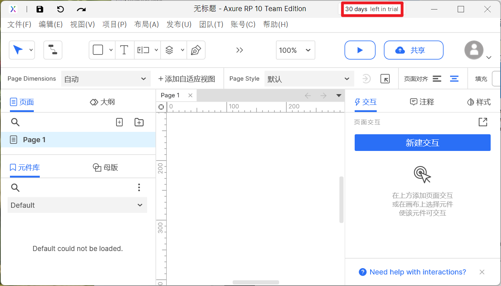
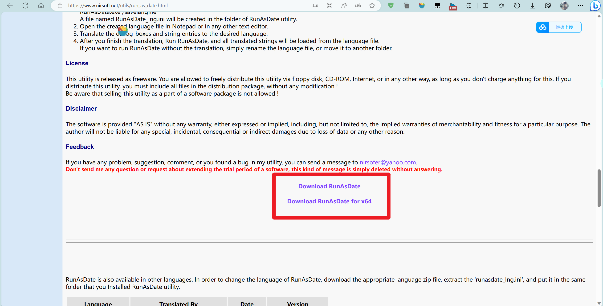
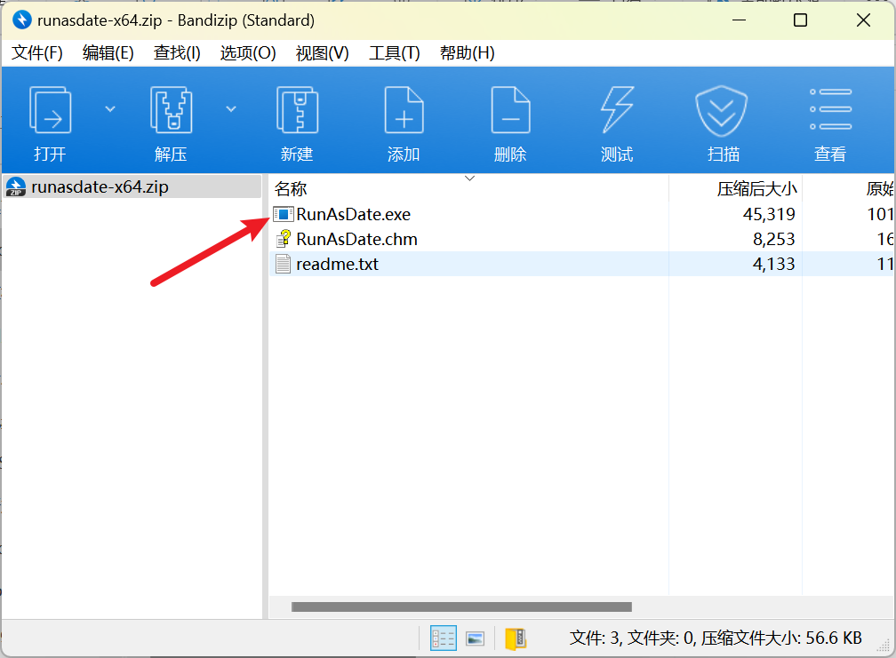
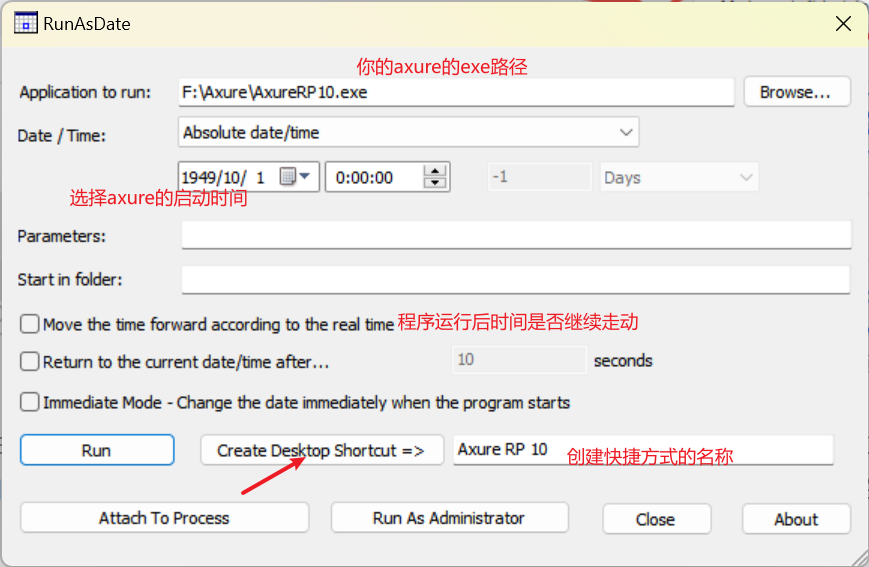
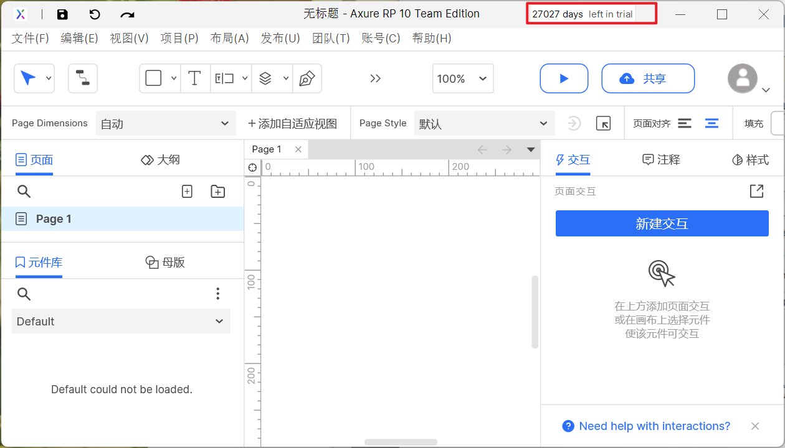

# Axure安装和续期使用

首先去官网下载最新的axure，你没听错，就是最新的。

下载网址：[Axure RP - UX Prototypes, Specifications, and Diagrams in One Tool](https://www.axure.com/)

下载完后解压安装到本地，并注册属于你自己的账户，开始试用。可惜的是只有30天的试用日期。

本次永久使用axure的方法就是修改axure的启动时间，以达到永久试用的效果。

接下来介绍一款软件：**RunAsDate**

官网：[RunAsDate - Run a program with the specified date/time (nirsoft.net)](https://www.nirsoft.net/utils/run_as_date.html)

选择适合你电脑的版本进行下载：  

打开你下载的压缩包，双击`RunAsDate.exe`：  

按图示设置相关参数（可自定义），然后点击新建快捷方式，我的命名跟原来的快捷方式命名一致：  

这下当你打开新的快捷方式（并且和原来的一模一样，可以选择删掉旧的），神奇的事情发生了，咱们还有两万多天的试用期：

也就是说，永久使用axure成功了！

ps：以上方法仅供个人测试，还请低调试用，商业使用还请寻找官方渠道获得授权。若试用不成功请自行解决或购买授权，本人不会提供任何技术解答。

 

  

本文转自 [https://blog.csdn.net/m0\_63230155/article/details/132581240](https://blog.csdn.net/m0_63230155/article/details/132581240)，如有侵权，请联系删除。