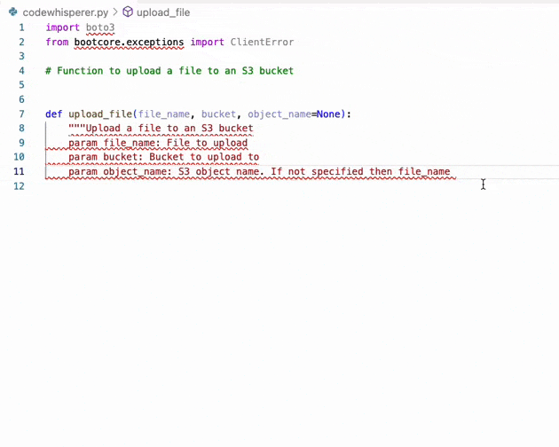
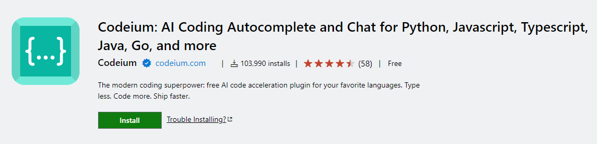
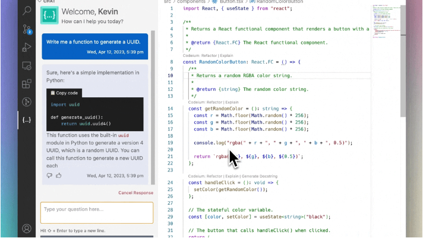
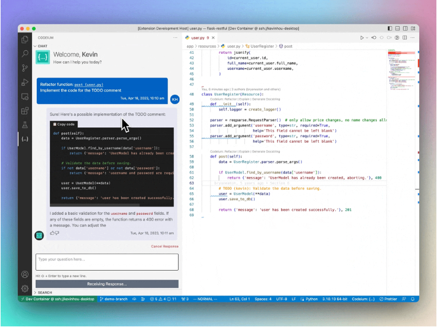
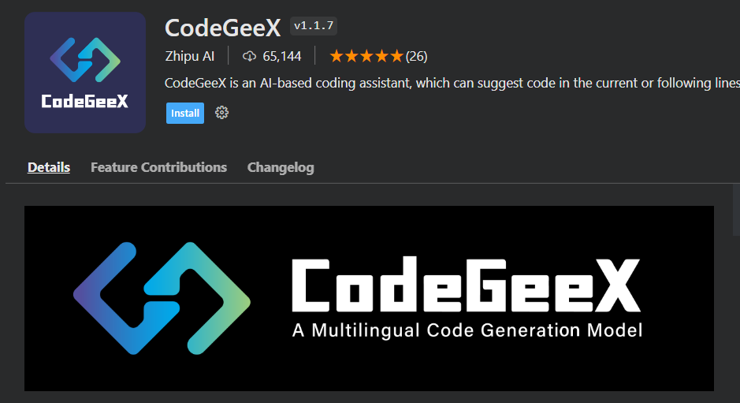
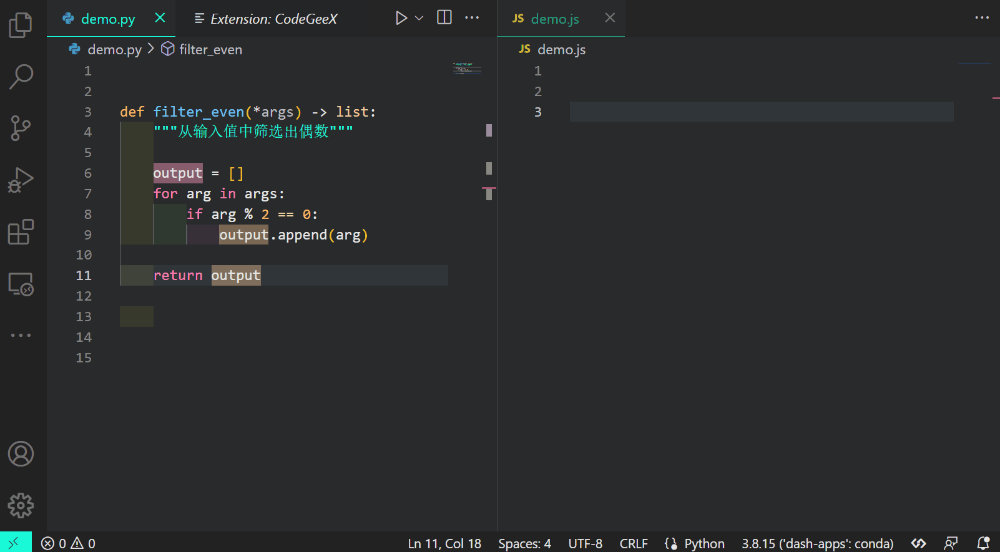

`Github Copilot`，作为`Github`研发的一款先进的编程辅助插件，它可以在我们日常编写代码的过程中，根据代码的上下文内容、注释等信息自动推断生成高质量的代码，很大程度上提升我们的代码编写效率。

　　而自从去年8月`Github Copilot`公测结束开始收费后，很多同类型且面向个人免费的智能辅助插件就如雨后春笋般纷纷冒了出来，今天的文章中我就将为大家介绍其中比较主流的3款插件，从而丰富大家的可选择空间：

1 Amazon CodeWhisperer
----------------------

　　`Amazon CodeWhisperer`是由亚马逊研发的一款免费的AI代码生成工具，面向个人用户提供无限制的代码智能生成服务：

　　在`vscode`中我们可以通过安装插件`AWS Toolkit`，来使用集成在其内部的`CodeWhisperer`功能：

2 Codeium
---------

　　`Codeium`是由初创公司研发的一款对标`Github Copilot`的代码智能生成插件，支持主流的各种编程语言，同样面向个人用户免费使用：

　　我从其推出至今就一直在使用，使用体验非常接近`Github Copilot`，生成的代码质量很不错，并且还带有类似`Cursor`的代码对话解释功能，可以就你关心的代码片段进行提问和智能重构，功能相当丰富：

3 CodeGeeX
----------

　　`CodeGeeX`跟前面两款插件相比要冷门一些，不过特别地是其是开源的，项目地址：`https://github.com/THUDM/CodeGeeX`：

　　除了常规的根据上下文和提示生成代码的功能以外，`CodeGeeX`还特别地具有代码跨语言翻译功能，譬如下面的例子：

  

本文转自 [https://www.cnblogs.com/feffery/p/17428388.html](https://www.cnblogs.com/feffery/p/17428388.html)，如有侵权，请联系删除。